# CH - Adolescent Health { #ch-ado-aggrgate-design }

## 1. Datasets

### 1.1. Configuration Summary

The aggregate CH - Adolescent Health (AH) module includes:

1. A **monthly dataset** with key data elements for adolescent health
2. A **yearly dataset** for the follow up of key annual information on adolescent health
3. **Core indicators** for both datasets
4. A predefined **“CH - Adolescent Health” dashboard**

It is recommended that the datasets get assigned to Organisation Units **at the lowest level** of the health system feasible for reporting data, such as Villages or any appropriate community demarcation according to the local context.

## 1.2. Data Elements

The table below summarizes the data elements present in the AH module. The “Data elements groups” and “Datasets” columns will provide extra information on where the same DEs can be found in the other CHIS modules. This should facilitate the mapping of the package among all its modules and navigate the datasets while avoiding the collection and data entry of the same DEs in multiple locations.

All the DEs in the AH module are used in the build up of indicators.

| Name                                                                   | Description                                                                                                              | Datasets                                                                                                                                                                                    | DE groups                                                                                                                       |
|------------------------------------------------------------------------|--------------------------------------------------------------------------------------------------------------------------|---------------------------------------------------------------------------------------------------------------------------------------------------------------------------------------------|---------------------------------------------------------------------------------------------------------------------------------|
| CH027a - Adolescents seeking FP services                               | Adolescents and young people seeking family planning services from CHW                                                   | CH - Adolescent Health (Monthly), CH - HIV (Monthly), CH - Sexual and Reproductive Health (Monthly)                                                                                         | CH - HIV, CH - Adolescent Health, CH - Sexual and Reproductive Health                                                           |
| CH027b - Adolescents seeking FP methods tested for HIV                 | Adolescents and young people seeking family planning services who were tested for HIV by CHW                             | CH - Adolescent Health (Monthly), CH - HIV (Monthly), CH - Sexual and Reproductive Health (Monthly)                                                                                         | CH - HIV, CH - Adolescent Health, CH - Sexual and Reproductive Health                                                           |
| CH041a - People assessed for MNS disorders/ MH conditions              | People assessed for MNS disorders/ MH conditions                                                                         | CH - Adolescent Health (Monthly), CH - HIV (Monthly), CH - Maternal Health (Monthly), CH - Mental health (Monthly), CH - Neglected tropical diseases (Monthly), CH - Tuberculosis (Monthly) | CH - Neglected tropical diseases, CH - HIV, CH - Maternal Health, CH - Adolescent Health, CH - Mental health, TB - Tuberculosis |
| CH041b - People with possible MNS symptoms                             | People with possible MNS symptoms                                                                                        | CH - Adolescent Health (Monthly), CH - HIV (Monthly), CH - Maternal Health (Monthly), CH - Mental health (Monthly), CH - Neglected tropical diseases (Monthly), CH - Tuberculosis (Monthly) | CH - Neglected tropical diseases, CH - HIV, CH - Maternal Health, CH - Adolescent Health, CH - Mental health, TB - Tuberculosis |
| CH041c - People assessed for MNS disorders/ MH conditions              | People assessed for MNS disorders/mental health conditions by type                                                       | CH - Adolescent Health (Monthly), CH - HIV (Monthly), CH - Maternal Health (Monthly), CH - Mental health (Monthly), CH - Neglected tropical diseases (Monthly), CH - Tuberculosis (Monthly) | CH - Neglected tropical diseases, CH - HIV, CH - Maternal Health, CH - Adolescent Health, CH - Mental health, TB - Tuberculosis |
| CH041d - People with possible MNS symptoms                             | People with possible symptoms of MNS conditions                                                                          | CH - Adolescent Health (Monthly), CH - HIV (Monthly), CH - Maternal Health (Monthly), CH - Mental health (Monthly), CH - Neglected tropical diseases (Monthly), CH - Tuberculosis (Monthly) | CH - Neglected tropical diseases, CH - HIV, CH - Maternal Health, CH - Adolescent Health, CH - Mental health, TB - Tuberculosis |
| CH041e - Women assessed for MNS disorders/ MH conditions               | Women and adolescent girls assessed for MNS disorders / MH conditions                                                    | CH - Adolescent Health (Monthly), CH - HIV (Monthly), CH - Maternal Health (Monthly), CH - Mental health (Monthly), CH - Neglected tropical diseases (Monthly), CH - Tuberculosis (Monthly) | CH - Neglected tropical diseases, CH - HIV, CH - Maternal Health, CH - Adolescent Health, CH - Mental health, TB - Tuberculosis |
| CH041f - Women with possible MNS symptoms                              | Women and adolescent girls with possible MNS symptoms                                                                    | CH - Adolescent Health (Monthly), CH - HIV (Monthly), CH - Maternal Health (Monthly), CH - Mental health (Monthly), CH - Neglected tropical diseases (Monthly), CH - Tuberculosis (Monthly) | CH - Neglected tropical diseases, CH - HIV, CH - Maternal Health, CH - Adolescent Health, CH - Mental health, TB - Tuberculosis |
| CH042a - People with MNS disorders referred                            | People with MNS disorders referred                                                                                       | CH - Adolescent Health (Monthly), CH - HIV (Monthly), CH - Maternal Health (Monthly), CH - Mental health (Monthly), CH - Neglected tropical diseases (Monthly), CH - Tuberculosis (Monthly) | CH - Neglected tropical diseases, CH - HIV, CH - Maternal Health, CH - Adolescent Health, CH - Mental health, TB - Tuberculosis |
| CH042b - People with MNS disorders referred by type                    | People with MNS disorders referred by type                                                                               | CH - Adolescent Health (Monthly), CH - HIV (Monthly), CH - Maternal Health (Monthly), CH - Mental health (Monthly), CH - Neglected tropical diseases (Monthly), CH - Tuberculosis (Monthly) | CH - Neglected tropical diseases, CH - HIV, CH - Maternal Health, CH - Adolescent Health, CH - Mental health, TB - Tuberculosis |
| CH042c - Women with MNS disorders referred                             | Women and adolescent girls with MNS disorders/mental health conditions referred                                          | CH - Adolescent Health (Monthly), CH - HIV (Monthly), CH - Maternal Health (Monthly), CH - Mental health (Monthly), CH - Neglected tropical diseases (Monthly), CH - Tuberculosis (Monthly) | CH - Neglected tropical diseases, CH - HIV, CH - Maternal Health, CH - Adolescent Health, CH - Mental health, TB - Tuberculosis |
| CH060a - People receiving deworming preventive chemotherapy            | People receiving a dose of preventive chemotherapy for deworming                                                         | CH - Adolescent Health (Monthly), CH - Child Health (Monthly), CH - Nutrition (Monthly)                                                                                                     | CH - Adolescent Health, CH - Nutrition, CH - Child Health                                                                       |
| CH060b - People targeted for deworming preventive chemotherapy         | People targeted for preventive chemotherapy for deworming                                                                | CH - Adolescent Health (Monthly), CH - Child Health (Monthly), CH - Nutrition (Monthly)                                                                                                     | CH - Adolescent Health, CH - Nutrition, CH - Child Health                                                                       |
| CH060c - People receiving deworming preventive chemotherapy            | People receiving a dose of preventive chemotherapy for deworming by drug                                                 | CH - Adolescent Health (Monthly), CH - Child Health (Monthly), CH - Nutrition (Monthly)                                                                                                     | CH - Adolescent Health, CH - Nutrition, CH - Child Health                                                                       |
| CH092a - People with suicidal ideation or plan                         | People with suicidal ideation or plan                                                                                    | CH - Adolescent Health (Monthly), CH - Mental health (Monthly)                                                                                                                              | CH - Mental health, CH - Adolescent Health                                                                                      |
| CH092b - People assessed for suicidal ideation or plan                 | People assessed for suicidal ideation or plan                                                                            | CH - Adolescent Health (Monthly), CH - Mental health (Monthly)                                                                                                                              | CH - Mental health, CH - Adolescent Health                                                                                      |
| CH093a - People who reported attempting suicide                        | People who reported attempting suicide                                                                                   | CH - Adolescent Health (Monthly), CH - Mental health (Monthly)                                                                                                                              | CH - Mental health, CH - Adolescent Health                                                                                      |
| CH093b - People assessed for attempting suicide                        | People assessed for attempting suicide                                                                                   | CH - Adolescent Health (Monthly), CH - Mental health (Monthly)                                                                                                                              | CH - Mental health, CH - Adolescent Health                                                                                      |
| CH028a - HIV positive tests returned                                   | HIV tests conducted in which a new HIV-positive result or diagnosis was returned                                         | CH - Adolescent Health (Yearly), CH - Child Health (Yearly), CH - HIV (Yearly), CH - ICCM (Monthly), CH - Maternal Health (Yearly), CH - Sexual and Reproductive Health (Yearly)            | CH - HIV, CH - Maternal Health, CH - ICCM, CH - Adolescent Health, CH - Sexual and Reproductive Health, CH - Child Health       |
| CH028b - HIV tests returned                                            | HIV tests returned                                                                                                       | CH - Adolescent Health (Yearly), CH - Child Health (Yearly), CH - HIV (Yearly), CH - ICCM (Monthly), CH - Maternal Health (Yearly), CH - Sexual and Reproductive Health (Yearly)            | CH - HIV, CH - Maternal Health, CH - ICCM, CH - Adolescent Health, CH - Sexual and Reproductive Health, CH - Child Health       |
| CH028c - HIV positive tests returned to key population                 | HIV tests conducted amongst key population in which a new HIV-positive result or diagnosis was returned                  | CH - Adolescent Health (Yearly), CH - Child Health (Yearly), CH - HIV (Yearly), CH - ICCM (Monthly), CH - Maternal Health (Yearly), CH - Sexual and Reproductive Health (Yearly)            | CH - HIV, CH - Maternal Health, CH - ICCM, CH - Adolescent Health, CH - Sexual and Reproductive Health, CH - Child Health       |
| CH028d - HIV tests returned to key population                          | HIV tests performed amongst key population where results were returned                                                   | CH - Adolescent Health (Yearly), CH - Child Health (Yearly), CH - HIV (Yearly), CH - ICCM (Monthly), CH - Maternal Health (Yearly), CH - Sexual and Reproductive Health (Yearly)            | CH - HIV, CH - Maternal Health, CH - ICCM, CH - Adolescent Health, CH - Sexual and Reproductive Health, CH - Child Health       |
| CH028e - HIV positive tests returned to TB patients                    | HIV tests conducted amongst TB in which a new HIV-positive result or diagnosis was returned                              | CH - Adolescent Health (Yearly), CH - Child Health (Yearly), CH - HIV (Yearly), CH - ICCM (Monthly), CH - Maternal Health (Yearly), CH - Sexual and Reproductive Health (Yearly)            | CH - HIV, CH - Maternal Health, CH - ICCM, CH - Adolescent Health, CH - Sexual and Reproductive Health, CH - Child Health       |
| CH028f - HIV tests returned to TB patients                             | HIV tests performed amongst TB where results were returned                                                               | CH - Adolescent Health (Yearly), CH - Child Health (Yearly), CH - HIV (Yearly), CH - ICCM (Monthly), CH - Maternal Health (Yearly), CH - Sexual and Reproductive Health (Yearly)            | CH - HIV, CH - Maternal Health, CH - ICCM, CH - Adolescent Health, CH - Sexual and Reproductive Health, CH - Child Health       |
| CH043a - People with MNS disorders receiving services                  | People with MNS disorders/mental health conditions receiving services                                                    | CH - Adolescent Health (Yearly), CH - HIV (Yearly), CH - Maternal Health (Yearly), CH - Mental health (Yearly), CH - Neglected tropical diseases (Yearly), CH - Tuberculosis (Yearly)       | CH - Neglected tropical diseases, CH - HIV, CH - Maternal Health, CH - Adolescent Health, CH - Mental health, TB - Tuberculosis |
| CH043b - People assessed for MNS disorders                             | People assessed for MNS disorders/mental health conditions                                                               | CH - Adolescent Health (Yearly), CH - HIV (Yearly), CH - Maternal Health (Yearly), CH - Mental health (Yearly), CH - Neglected tropical diseases (Yearly), CH - Tuberculosis (Yearly)       | CH - Neglected tropical diseases, CH - HIV, CH - Maternal Health, CH - Adolescent Health, CH - Mental health, TB - Tuberculosis |
| CH043c - People with MNS disorders receiving services - MH awareness   | People with MNS disorders/mental health conditions receiving services - mental health awareness                          | CH - Adolescent Health (Yearly), CH - HIV (Yearly), CH - Maternal Health (Yearly), CH - Mental health (Yearly), CH - Neglected tropical diseases (Yearly), CH - Tuberculosis (Yearly)       | CH - Neglected tropical diseases, CH - HIV, CH - Maternal Health, CH - Adolescent Health, CH - Mental health, TB - Tuberculosis |
| CH043d - People with MNS disorders receiving services - MH HP          | People with MNS disorders/mental health conditions receiving services - mental health promotion and prevention           | CH - Adolescent Health (Yearly), CH - HIV (Yearly), CH - Maternal Health (Yearly), CH - Mental health (Yearly), CH - Neglected tropical diseases (Yearly), CH - Tuberculosis (Yearly)       | CH - Neglected tropical diseases, CH - HIV, CH - Maternal Health, CH - Adolescent Health, CH - Mental health, TB - Tuberculosis |
| CH043e - People with MNS disorders receiving services - MH support     | People with MNS disorders/mental health conditions receiving services - support for people with mental health conditions | CH - Adolescent Health (Yearly), CH - HIV (Yearly), CH - Maternal Health (Yearly), CH - Mental health (Yearly), CH - Neglected tropical diseases (Yearly), CH - Tuberculosis (Yearly)       | CH - Neglected tropical diseases, CH - HIV, CH - Maternal Health, CH - Adolescent Health, CH - Mental health, TB - Tuberculosis |
| CH043f - People with MNS disorders receiving services - recovery/rehab | People with MNS disorders/mental health conditions receiving services - recovery and rehabilitation                      | CH - Adolescent Health (Yearly), CH - HIV (Yearly), CH - Maternal Health (Yearly), CH - Mental health (Yearly), CH - Neglected tropical diseases (Yearly), CH - Tuberculosis (Yearly)       | CH - Neglected tropical diseases, CH - HIV, CH - Maternal Health, CH - Adolescent Health, CH - Mental health, TB - Tuberculosis |
| CH043g - Women with MNS disorders receiving services                   | Women and adolescent girls with MNS disorders/mental health conditions receiving services                                | CH - Adolescent Health (Yearly), CH - HIV (Yearly), CH - Maternal Health (Yearly), CH - Mental health (Yearly), CH - Neglected tropical diseases (Yearly), CH - Tuberculosis (Yearly)       | CH - Neglected tropical diseases, CH - HIV, CH - Maternal Health, CH - Adolescent Health, CH - Mental health, TB - Tuberculosis |
| CH043h - Women assessed for MNS disorders                              | Women and adolescent girls assessed for MNS disorders/mental health conditions                                           | CH - Adolescent Health (Yearly), CH - HIV (Yearly), CH - Maternal Health (Yearly), CH - Mental health (Yearly), CH - Neglected tropical diseases (Yearly), CH - Tuberculosis (Yearly)       | CH - Neglected tropical diseases, CH - HIV, CH - Maternal Health, CH - Adolescent Health, CH - Mental health, TB - Tuberculosis |
| CH069a - Children (5-19 y) overweight and obese                        | Children and adolescents aged 5-19 years who are overweight                                                              | CH - Adolescent Health (Yearly), CH - Child Health (Yearly), CH - Noncommunicable diseases (Yearly), CH - Nutrition (Yearly)                                                                | CH - Adolescent Health, CH - Noncommunicable diseases, CH - Nutrition, CH - Child Health                                        |
| CH069b - Children (5-19 y) weighted                                    | Children and adolescents aged 5-19 years who were measured                                                               | CH - Adolescent Health (Yearly), CH - Child Health (Yearly), CH - Noncommunicable diseases (Yearly), CH - Nutrition (Yearly)                                                                | CH - Adolescent Health, CH - Noncommunicable diseases, CH - Nutrition, CH - Child Health                                        |
| CH082 - Young adolescent deaths (10-14 years old)                      | Young adolescent deaths (10-14 years old)                                                                                | CH - Adolescent Health (Yearly), CH - Civil registration and vital statistics (Yearly)                                                                                                      | CH - Civil registration and vital statistics, CH - Adolescent Health                                                            |
| CH083 - Older adolescent deaths (15-19 years)                          | Older adolescent deaths (15-19 years)                                                                                    | CH - Adolescent Health (Yearly), CH - Civil registration and vital statistics (Yearly)                                                                                                      | CH - Civil registration and vital statistics, CH - Adolescent Health                                                            |
| CH084a - Women receiving anaemia-preventing iron supplements           | Adolescent girls and menstruating women who received anaemia-preventing iron supplements                                 | CH - Adolescent Health (Yearly), CH - Nutrition (Yearly)                                                                                                                                    | CH - Nutrition, CH - Adolescent Health                                                                                          |
| CH084b - Consultations with adolescent girls and menstruating women    | Number of menstruating women and young adolescent girls who have received a consultation                                 | CH - Adolescent Health (Yearly), CH - Nutrition (Yearly)                                                                                                                                    | CH - Nutrition, CH - Adolescent Health                                                                                          |
| CH085a - Women underweight                                             | Non-pregnant women and adolescent girls with low BMI                                                                     | CH - Adolescent Health (Yearly), CH - Nutrition (Yearly)                                                                                                                                    | CH - Nutrition, CH - Adolescent Health                                                                                          |
| CH085b - Consultations with non-pregnant women                         | Consultations non-pregnant women and adolescent girls                                                                    | CH - Adolescent Health (Yearly), CH - Nutrition (Yearly)                                                                                                                                    | CH - Nutrition, CH - Adolescent Health                                                                                          |
| CH086 - Adolescents with insufficient physical activity                | Adolescents with insufficient physical activity                                                                          | CH - Adolescent Health (Yearly), CH - Noncommunicable diseases (Yearly)                                                                                                                     | CH - Noncommunicable diseases, CH - Adolescent Health                                                                           |
| CH087a - Adolescent current tobacco users - smoked                     | Adolescent current tobacco users - smoked                                                                                | CH - Adolescent Health (Yearly), CH - Noncommunicable diseases (Yearly)                                                                                                                     | CH - Noncommunicable diseases, CH - Adolescent Health                                                                           |
| CH087b - Adolescent current tobacco users - smokeless                  | Adolescent current tobacco users - smokeless                                                                             | CH - Adolescent Health (Yearly), CH - Noncommunicable diseases (Yearly)                                                                                                                     | CH - Noncommunicable diseases, CH - Adolescent Health                                                                           |
| CH087c - Adolescent current tobacco users - daily users                | Adolescent current tobacco users - daily users                                                                           | CH - Adolescent Health (Yearly), CH - Noncommunicable diseases (Yearly)                                                                                                                     | CH - Noncommunicable diseases, CH - Adolescent Health                                                                           |
| CH087d - Adolescent current tobacco users - non-daily users            | Adolescent current tobacco users - non-daily users                                                                       | CH - Adolescent Health (Yearly), CH - Noncommunicable diseases (Yearly)                                                                                                                     | CH - Noncommunicable diseases, CH - Adolescent Health                                                                           |
| CH088a - People reporting using alcohol                                | People reporting using alcohol                                                                                           | CH - Adolescent Health (Yearly), CH - Mental health (Yearly)                                                                                                                                | CH - Mental health, CH - Adolescent Health                                                                                      |
| CH088b - People assessed for alcohol use                               | People assessed for alcohol use                                                                                          | CH - Adolescent Health (Yearly), CH - Mental health (Yearly)                                                                                                                                | CH - Mental health, CH - Adolescent Health                                                                                      |
| CH088c - Women reporting using alcohol                                 | Women and adolescent girls reported using alcohol                                                                        | CH - Adolescent Health (Yearly), CH - Mental health (Yearly)                                                                                                                                | CH - Mental health, CH - Adolescent Health                                                                                      |
| CH088d - Women assessed for alcohol use                                | Women and adolescent girls assessed for alcohol use                                                                      | CH - Adolescent Health (Yearly), CH - Mental health (Yearly)                                                                                                                                | CH - Mental health, CH - Adolescent Health                                                                                      |
| CH089a - People with heavy episodic drinking                           | People with heavy episodic drinking                                                                                      | CH - Adolescent Health (Yearly), CH - Mental health (Yearly), CH - Noncommunicable diseases (Yearly)                                                                                        | CH - Adolescent Health, CH - Noncommunicable diseases, CH - Mental health                                                       |
| CH089b - People assessed for heavy episodic drinking                   | People assessed for heavy episodic drinking                                                                              | CH - Adolescent Health (Yearly), CH - Mental health (Yearly), CH - Noncommunicable diseases (Yearly)                                                                                        | CH - Adolescent Health, CH - Noncommunicable diseases, CH - Mental health                                                       |
| CH089c - Women with heavy episodic drinking                            | Women and adolescent girls with heavy episodic drinking                                                                  | CH - Adolescent Health (Yearly), CH - Mental health (Yearly), CH - Noncommunicable diseases (Yearly)                                                                                        | CH - Adolescent Health, CH - Noncommunicable diseases, CH - Mental health                                                       |
| CH089d - Women assessed for heavy episodic drinking                    | Women and adolescent girls assessed for heavy episodic drinking                                                          | CH - Adolescent Health (Yearly), CH - Mental health (Yearly), CH - Noncommunicable diseases (Yearly)                                                                                        | CH - Adolescent Health, CH - Noncommunicable diseases, CH - Mental health                                                       |
| CH090a - People reporting use of any psychoactive drugs                | People reporting use of any psychoactive drugs                                                                           | CH - Adolescent Health (Yearly), CH - Mental health (Yearly)                                                                                                                                | CH - Mental health, CH - Adolescent Health                                                                                      |
| CH090b - People assessed for use of any psychoactive drugs             | People assessed for use of any psychoactive drugs                                                                        | CH - Adolescent Health (Yearly), CH - Mental health (Yearly)                                                                                                                                | CH - Mental health, CH - Adolescent Health                                                                                      |
| CH090c - People reporting the use of psychoactive drugs                | People who report use of any psychoactive drugs by type                                                                  | CH - Adolescent Health (Yearly), CH - Mental health (Yearly)                                                                                                                                | CH - Mental health, CH - Adolescent Health                                                                                      |
| CH090d - Women reporting use of any psychoactive drugs                 | Women and adolescent girls who use of any psychoactive drugs                                                             | CH - Adolescent Health (Yearly), CH - Mental health (Yearly)                                                                                                                                | CH - Mental health, CH - Adolescent Health                                                                                      |
| CH090e - Women assessed for use of any psychoactive drugs              | Women and adolescent girls assessed for use of any psychoactive drugs                                                    | CH - Adolescent Health (Yearly), CH - Mental health (Yearly)                                                                                                                                | CH - Mental health, CH - Adolescent Health                                                                                      |
| CH091a - People reporting use of injection drugs                       | People reporting use of injection drugs                                                                                  | CH - Adolescent Health (Yearly), CH - Mental health (Yearly)                                                                                                                                | CH - Mental health, CH - Adolescent Health                                                                                      |
| CH091b - People assessed for injection drug use                        | People assessed for injection drug use                                                                                   | CH - Adolescent Health (Yearly), CH - Mental health (Yearly)                                                                                                                                | CH - Mental health, CH - Adolescent Health                                                                                      |
| CH091c - Women reporting use of injection drugs                        | Women and adolescent girls injecting drug use                                                                            | CH - Adolescent Health (Yearly), CH - Mental health (Yearly)                                                                                                                                | CH - Mental health, CH - Adolescent Health                                                                                      |
| CH091d - Women assessed for injection drug use                         | Women and adolescent girls assessed for injecting drug use                                                               | CH - Adolescent Health (Yearly), CH - Mental health (Yearly)                                                                                                                                | CH - Mental health, CH - Adolescent Health                                                                                      |
| CH094a - Leisure screen time during the week                           | Amount of time usually spent on a typical weekday dedicated to screen time for leisure activities                        | CH - Adolescent Health (Yearly), CH - Mental health (Yearly)                                                                                                                                | CH - Mental health, CH - Adolescent Health                                                                                      |
| CH094b - Leisure screen time during the weekend                        | Amount of time usually spent on a typical weekend day dedicated to screen time for leisure activities                    | CH - Adolescent Health (Yearly), CH - Mental health (Yearly)                                                                                                                                | CH - Mental health, CH - Adolescent Health                                                                                      |
| CH094c - People assessed on leisure screen time                        | People assessed on screen time for leisure activities                                                                    | CH - Adolescent Health (Yearly), CH - Mental health (Yearly)                                                                                                                                | CH - Mental health, CH - Adolescent Health                                                                                      |
## 2. Datasets Details

### 2.1. Monthly Adolescent Health Dataset

In both the monthly and the yearly datasets the category combinations for the age groups have age groups that go beyond the [WHO definition of adolescents](https://www.who.int/southeastasia/health-topics/adolescent-health) “WHO defines 'Adolescents' as individuals in the 10-19 years age group and 'Youth' as the 15-24 year age group. While 'Young People' covers the age range 10-24 years” , and the definition of adolescent reported in the [CHIS guidelines](https://www.healthdatacollaborative.org/fileadmin/uploads/hdc/Documents/Working_Groups/Community_Data/210128_UNICEF_NY_Community_Health_Workers_Guidance_EN.pdf) “Adolescents are defined as persons aged 10–19 years. Young adolescent refers to 10–14-year-olds, while older adolescent refers to 15–19-year-olds”.This has been done to avoid creating ad hoc age groups for each and every dataset. The age groups above the definition of Adolescent/Youth have been greyed-out and therefore blocked for data entry. Countries should nonetheless edit and apply the age categories that better reflect the local context and guidelines.

#### 2.1.1. Family Planning

The section is set to collect the total number of adolescents and young people seeking family planning methods by age groups (10-14y, 15-19y).

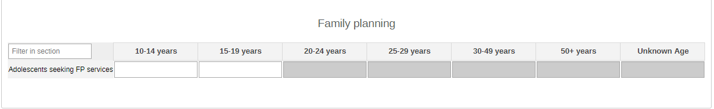

#### 2.1.2. Family Planning & HIV Testing

The section is set to collect the total number of adolescents tested for HIV (by age groups - 10-14y, 15-19y-) and the results of the test (positive, negative, indeterminate).

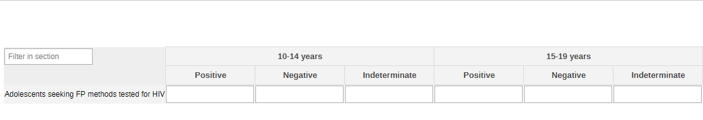

#### 2.1.3. Deworming

The first part of the section is set to give an overview of the target population for the activity (by age groups -10-14y, 15-19y and unknown age - and by sex - male, female, other, unknown sex -) and the number of reached people (same disaggregation). The second part of the section divides the reached people by type of preventive chemotherapy (Albendazole and Mebendazole). The used drugs can be adapted locally based on availability and national guidelines.

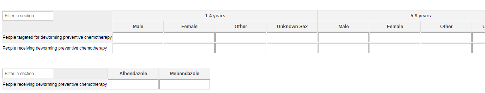

#### 2.1.4. Mental Health Disorders and Conditions - All

The section focuses on all adolescents by age groups (10-14y and 15-19y) and sex (male, female, other, unknown sex).

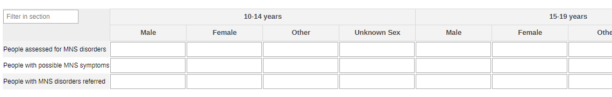

#### 2.1.5. Mental Health Disorders and Conditions - By Type

The table separates the total number of assessments, the number of people with potential MH conditions, and the number of referrals of the first by type of mental health disorder/conditions (Depression, psychoses, child and adolescent mental and behavioural conditions, dementia, substance use, suicide/self harm).

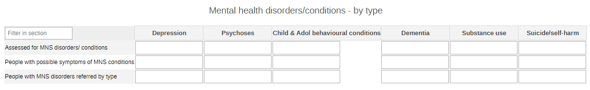

#### 2.1.6. Mental Health Disorders and Conditions - Pregnant and Postpartum

The table collects data on the MH assessments carried among pregnant and postpartum women.

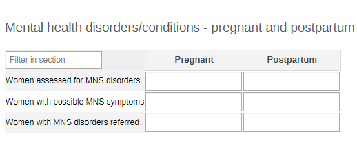

#### 2.1.7. Suicide Attempts

The section provides an overview on the beneficiaries at risk of suicide and of suicide preventive and reactive assessments by age groups (10-14y and 15-19y) and sex (male, female, other, unknown sex).

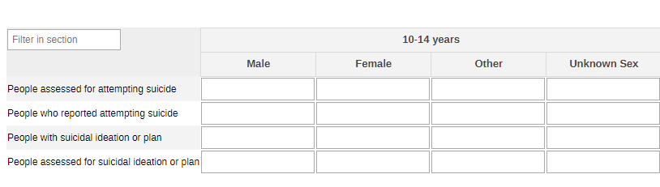

### 2.2. Yearly Adolescent Health Dataset

#### 2.2.1. HIV Tests - All

The section reports core information on HIV-related activities.
The table gives an overview of the number of performed tests and positive results among all people tested and this disaggregated by age groups (10-14y, 15-19y, unknown age) and sex (male, female, other, unknonw sex).

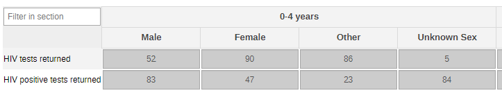

#### 2.2.2. HIV Tests - TB Cases

The table gives the information among TB-confirmed and -presumptive patients.

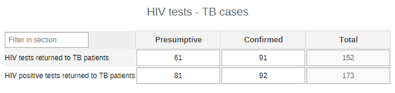

#### 2.2.3. HIV Tests - Key Population

The table captures data for the key population groups at risk (MSM, SW, Prisoners, IDU, TG, Other). The categories should be adapted locally to better mirror the contexts and the activities.

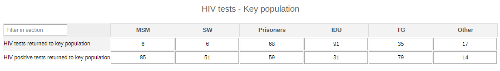

#### 2.2.4. Death

The section provides a very simple overview of the number of deaths by sex ( male, female, other, unknonw sex) among adolescents.

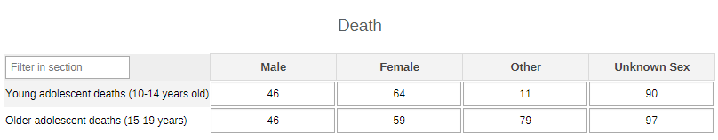

#### 2.2.5. Iron Supplement

The section provides a simple overview of the iron supplement for adolescent girls activities conducted in the community by age group (10-14y and 15-19y).

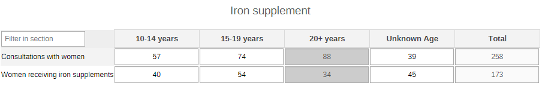

#### 2.2.6. Body Weight and BMI

The section collects data on the two ends of the spectrum among measured adolescents: those with high BMI and those with low BMI by age group (10-14y, 15-17y, 18-19y, unknown age).

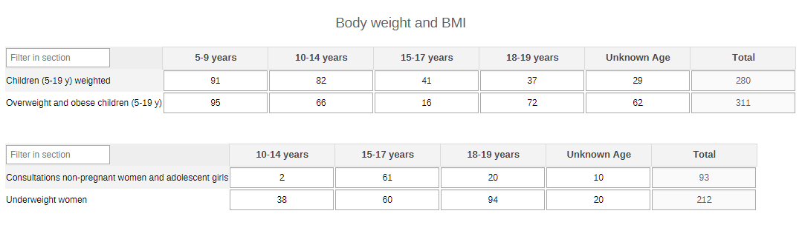

#### 2.2.7. Physical Activity and Screen Time

The section provides information on the time spent during the week and weekend in front of the screen and the level of physical activity of the screened adolescents by age (10-14y and 15-19y, unknown age) and by sex (male, female, other, unknown sex).

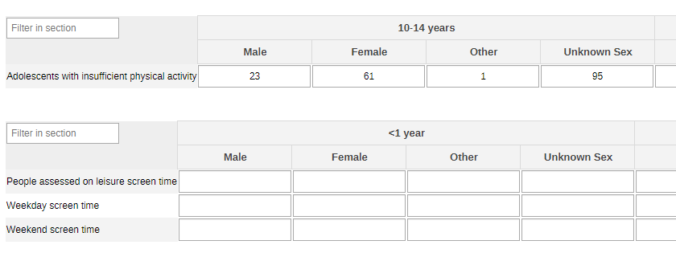 

#### 2.2.8. Tobacco Use

This section shows the patterns of tobacco use among the targeted adolescent population in the community by age (10-14y and 15-19y, unknown age) and by sex (male, female, other, unknown sex).

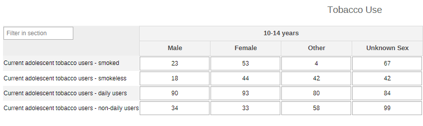

#### 2.2.9. Alcohol Use - All

The section provides specific information on the use of alcohol among adolescents by age (10-14y and 15-19y, unknown age) and by sex (male, female, other, unknown sex).

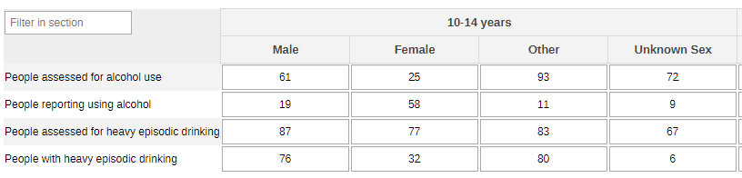

#### 2.2.10. Alcohol Use - All

The table further categorises the information on alcohol use among adolescent girls by pregnancy status (pregnant or postpartum).

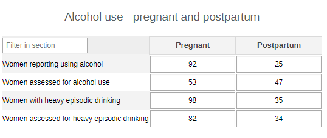

#### 2.2.11. Drug Use- All

The table collects the information for all adolescent drug users by age groups (10-14y and 15-19y) and sex (male, female, other, unknown sex)

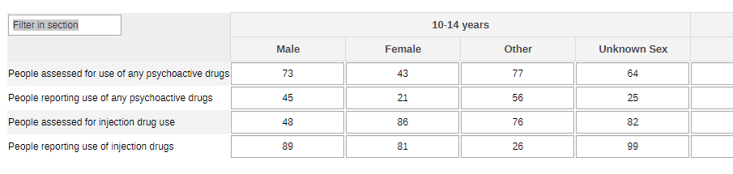

#### 2.2.12. Drug Use- By Type

The table disaggregates the users by type of the abused substance (Cannabis, opioids, cocaine, amphetamine-type stimulants).

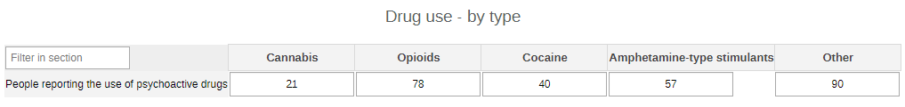

#### 2.2.13. Drug Use- By Type

The table further categorises the data on adolescent drug users by pregnant or postpartum.

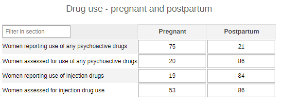

#### 2.2.14. Mental Health Disorders and Conditions - All

The table collects the information on all the adolescents assessed for their MH status by age groups (10-14y and 15-19y) and sex (male, female, other, unknown sex).

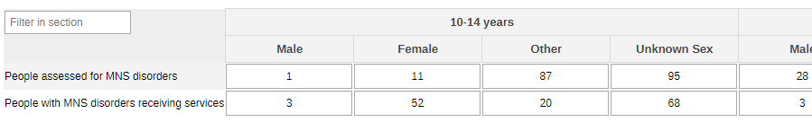

#### 2.2.15. Mental Health Disorders and Conditions - Pregnant and Postpartum

The table collects the relevant data for the MH evaluations among pregnant and postpartum adolescent girls.

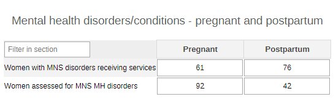

#### 2.2.16. Mental Health Disorders and Conditions - Awareness and Support

The section collects the totals on people with MNS disorders and which of services and/supports they have received in the community.

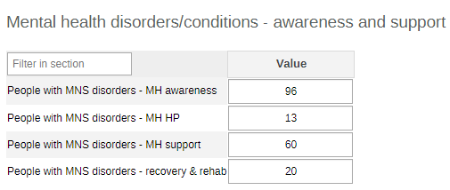

## 3. Validation Rules

The following validation rules have been set up for the Adolescent health datasets:

| name                                                                                                      | instruction                                                                                                                       | operator              | leftSide description                               | rightSide description                             |
|-----------------------------------------------------------------------------------------------------------|-----------------------------------------------------------------------------------------------------------------------------------|-----------------------|----------------------------------------------------|---------------------------------------------------|
| CH - AG and menstruating women who received Vs Consultations with AG and menstruating women               | AG and menstruating women who received should be less than or equal to Consultations with AG and menstruating women               | less_than_or_equal_to | AG and menstruating women who received             | Consultations with AG and menstruating women      |
| CH - AGW assessed for heavy episodic drinking Vs People assessed for heavy episodic drinking              | AGW assessed for heavy episodic drinking should be less than or equal to People assessed for heavy episodic drinking              | less_than_or_equal_to | AGW assessed for heavy episodic drinking           | People assessed for heavy episodic drinking       |
| CH - AGW assessed for injecting drug use Vs People assessed for injecting drug use                        | AGW assessed for injecting drug use should be less than or equal to People assessed for injecting drug use                        | less_than_or_equal_to | AGW assessed for injecting drug use                | People assessed for injecting drug use            |
| CH - AGW assessed for MNS disorders Vs AGW with a possible MNS symptoms                                   | AGW assessed for MNS disorders should be less than or equal to AGW with a possible MNS symptoms                                   | less_than_or_equal_to | AGW assessed for MNS disorders                     | AGW with a possible MNS symptoms                  |
| CH - AGW assessed for use of any psychoactive drugs Vs People assessed for use of any psychoactive drugs  | AGW assessed for use of any psychoactive drugs should be less than or equal to People assessed for use of any psychoactive drugs  | less_than_or_equal_to | AGW assessed for use of any psychoactive drugs     | People assessed for use of any psychoactive drugs |
| CH - AGW who use of any psychoactive drugs Vs People who report use of any psychoactive drugs             | AGW who use of any psychoactive drugs should be less than or equal to People who report use of any psychoactive drugs             | less_than_or_equal_to | AGW who use of any psychoactive drugs              | People who report use of any psychoactive drugs   |
| CH - AGW with heavy episodic drinking Vs People with heavy episodic drinking                              | AGW with heavy episodic drinking should be less than or equal to People with heavy episodic drinking                              | less_than_or_equal_to | AGW with heavy episodic drinking                   | People with heavy episodic drinking               |
| CH - AGW with MNS disorders/receiving Vs AGW assessed for MNS MH disorders                                | AGW with MNS disorders/receiving should be less than or equal to AGW assessed for MNS MH disorders                                | less_than_or_equal_to | AGW with MNS disorders/receiving                   | AGW assessed for MNS MH disorders                 |
| CH - AGW with MNS disorders/receiving Vs People with MNS disorders/receiving                              | AGW with MNS disorders/receiving should be less than or equal to People with MNS disorders/receiving                              | less_than_or_equal_to | AGW with MNS disorders/receiving                   | People with MNS disorders/receiving               |
| CH - Assessed for MNS disorders conditions by type Vs People with a possible MNS symptoms by type         | Assessed for MNS disorders conditions by type should be less than or equal to People with a possible MNS symptoms by type         | less_than_or_equal_to | Assessed for MNS disorders conditions by type      | People with a possible MNS symptoms by type       |
| CH - AYP seeking FP services tested for HIV by CHW Vs AYP seeking family planning services from CHW       | AYP seeking FP services tested for HIV by CHW should be less than or equal to AYP seeking family planning services from CHW       | less_than_or_equal_to | AYP seeking FP services tested for HIV by CHW      | AYP seeking family planning services from CHW     |
| CH - Children and adolescents 5-19 years overweight Vs Children and adolescents 5-19 years measured       | Children and adolescents 5-19 years overweight should be less than or equal to Children and adolescents 5-19 years measured       | less_than_or_equal_to | Children and adolescents 5-19 years overweight     | Children and adolescents 5-19 years measured      |
| CH - HIV tests performed amongst KP & results returned Vs HIV tests performed where results were returned | HIV tests performed amongst KP & results returned should be less than or equal to HIV tests performed where results were returned | less_than_or_equal_to | HIV tests performed amongst KP & results returned  | HIV tests performed where results were returned   |
| CH - HIV tests performed amongst TB & results returned Vs HIV tests performed where results were returned | HIV tests performed amongst TB & results returned should be less than or equal to HIV tests performed where results were returned | less_than_or_equal_to | HIV tests performed amongst TB & results returned  | HIV tests performed where results were returned   |
| CH - MNS disorders receiving - recovery & rehab Vs People with MNS disorders/receiving                    | MNS disorders receiving - recovery & rehab should be less than or equal to People with MNS disorders/receiving                    | less_than_or_equal_to | MNS disorders receiving - recovery & rehab         | People with MNS disorders/receiving               |
| CH - MNS disorders receiving - support for MH Vs People with MNS disorders/receiving                      | MNS disorders receiving - support for MH should be less than or equal to People with MNS disorders/receiving                      | less_than_or_equal_to | MNS disorders receiving - support for MH           | People with MNS disorders/receiving               |
| CH - New HIV-positive result or diagnosis was returned Vs HIV tests performed where results were returned | New HIV-positive result or diagnosis was returned should be less than or equal to HIV tests performed where results were returned | less_than_or_equal_to | New HIV-positive result or diagnosis was returned  | HIV tests performed where results were returned   |
| CH - New HIV-positive result returned for KP Vs HIV tests performed amongst KP & results returned         | New HIV-positive result returned for KP should be less than or equal to HIV tests performed amongst KP & results returned         | less_than_or_equal_to | New HIV-positive result returned for KP            | HIV tests performed amongst KP & results returned |
| CH - New HIV-positive result returned for KP Vs New HIV-positive result or diagnosis was returned         | New HIV-positive result returned for KP should be less than or equal to New HIV-positive result or diagnosis was returned         | less_than_or_equal_to | New HIV-positive result returned for KP            | New HIV-positive result or diagnosis was returned |
| CH - New HIV-positive result returned for TB Vs HIV tests performed amongst TB & results returned         | New HIV-positive result returned for TB should be less than or equal to HIV tests performed amongst TB & results returned         | less_than_or_equal_to | New HIV-positive result returned for TB            | HIV tests performed amongst TB & results returned |
| CH - New HIV-positive result returned for TB Vs New HIV-positive result or diagnosis was returned         | New HIV-positive result returned for TB should be less than or equal to New HIV-positive result or diagnosis was returned         | less_than_or_equal_to | New HIV-positive result returned for TB            | New HIV-positive result or diagnosis was returned |
| CH - Non-pregnant AGW with low BMI Vs Consultations non-pregnant AGW                                      | Non-pregnant AGW with low BMI should be less than or equal to Consultations non-pregnant AGW                                      | less_than_or_equal_to | Non-pregnant AGW with low BMI                      | Consultations non-pregnant AGW                    |
| CH - People assessed for MNS disorders conditions Vs Assessed for MNS disorders conditions by type        | People assessed for MNS disorders conditions should be less than or equal to Assessed for MNS disorders conditions by type        | less_than_or_equal_to | People assessed for MNS disorders conditions       | Assessed for MNS disorders conditions by type     |
| CH - People assessed for MNS disorders conditions Vs People with a possible MNS symptoms                  | People assessed for MNS disorders conditions should be less than or equal to People with a possible MNS symptoms                  | less_than_or_equal_to | People assessed for MNS disorders conditions       | People with a possible MNS symptoms               |
| CH - People reported using alcohol Vs Number people assessed for alcohol use                              | People reported using alcohol should be less than or equal to Number people assessed for alcohol use                              | less_than_or_equal_to | People reported using alcohol                      | Number people assessed for alcohol use            |
| CH - People who reported attempting suicide Vs People assessed for attempting suicide                     | People who reported attempting suicide should be less than or equal to People assessed for attempting suicide                     | less_than_or_equal_to | People who reported attempting suicide             | People assessed for attempting suicide            |
| CH - People who report injecting drug use Vs People assessed for injecting drug use                       | People who report injecting drug use should be less than or equal to People assessed for injecting drug use                       | less_than_or_equal_to | People who report injecting drug use               | People assessed for injecting drug use            |
| CH - People who report use of any psychoactive drugs Vs People assessed for use of any psychoactive drugs | People who report use of any psychoactive drugs should be less than or equal to People assessed for use of any psychoactive drugs | less_than_or_equal_to | People who report use of any psychoactive drugs    | People assessed for use of any psychoactive drugs |
| CH - People with a possible MNS symptoms by type Vs People with a possible MNS symptoms                   | People with a possible MNS symptoms by type should be less than or equal to People with a possible MNS symptoms                   | less_than_or_equal_to | People with a possible MNS symptoms by type        | People with a possible MNS symptoms               |
| CH - People with heavy episodic drinking Vs People assessed for heavy episodic drinking                   | People with heavy episodic drinking should be less than or equal to People assessed for heavy episodic drinking                   | less_than_or_equal_to | People with heavy episodic drinking                | People assessed for heavy episodic drinking       |
| CH - People with MNS disorders - MH promotion and prev Vs People with MNS disorders/receiving             | People with MNS disorders - MH promotion and prev should be less than or equal to People with MNS disorders/receiving             | less_than_or_equal_to | People with MNS disorders - MH promotion and prev  | People with MNS disorders/receiving               |
| CH - People with MNS disorders receiving - MH awareness Vs People with MNS disorders/receiving            | People with MNS disorders receiving - MH awareness should be less than or equal to People with MNS disorders/receiving            | less_than_or_equal_to | People with MNS disorders receiving - MH awareness | People with MNS disorders/receiving               |
| CH - People with MNS disorders/receiving Vs People assessed for MNS disorders                             | People with MNS disorders/receiving should be less than or equal to People assessed for MNS disorders                             | less_than_or_equal_to | People with MNS disorders/receiving                | People assessed for MNS disorders                 |
| CH - People with MNS disorders referred Vs People assessed for MNS disorders conditions                   | People with MNS disorders referred should be less than or equal to People assessed for MNS disorders conditions                   | less_than_or_equal_to | People with MNS disorders referred                 | People assessed for MNS disorders conditions      |
| CH - People with suicidal ideation or plan Vs People assessed for suicidal ideation or plan               | People with suicidal ideation or plan should be less than or equal to People assessed for suicidal ideation or plan               | less_than_or_equal_to | People with suicidal ideation or plan              | People assessed for suicidal ideation or plan     |
| CH - Receiving a dose of PC for deworming by drug Vs Receiving a dose of PC for deworming                 | Receiving a dose of PC for deworming by drug should be less than or equal to Receiving a dose of PC for deworming                 | less_than_or_equal_to | Receiving a dose of PC for deworming by drug       | Receiving a dose of PC for deworming              |
| CH - Receiving a dose of PC for deworming Vs People targeted for PC for deworming                         | Receiving a dose of PC for deworming should be less than or equal to People targeted for PC for deworming                         | less_than_or_equal_to | Receiving a dose of PC for deworming               | People targeted for PC for deworming              |
| CH - Reported use of any psychoactive drugs type Vs People who report use of any psychoactive drugs       | Reported use of any psychoactive drugs type should be less than or equal to People who report use of any psychoactive drugs       | less_than_or_equal_to | Reported use of any psychoactive drugs type        | People who report use of any psychoactive drugs   |
| CH - Women and adolescent girls injecting drug use Vs People who report injecting drug use                | Women and adolescent girls injecting drug use should be less than or equal to People who report injecting drug use                | less_than_or_equal_to | Women and adolescent girls injecting drug use      | People who report injecting drug use              |

## 4. Analytics and Indicators

Just as for the DEs, in the table below the column “Indicator Groups” provides information about whether the indicator is found in groups other than the AH indicator group.

| Name                                                               | Description                                                                                                           | Numerator                                         | Denominator                                       | Indicator Groups                                                                                                                |
|--------------------------------------------------------------------|-----------------------------------------------------------------------------------------------------------------------|---------------------------------------------------|---------------------------------------------------|---------------------------------------------------------------------------------------------------------------------------------|
| CH027 - Adolescents seeking FP methods                             | Number of adolescents and young people seeking contraception/family planning who received an HIV test                 | AYP seeking FP services                           | 1                                                 | CH - HIV, CH - Adolescent Health, CH - Sexual and Reproductive Health                                                           |
| CH027 - Adolescents seeking FP methods tested for HIV (%)          | Proportion of adolescents and young people seeking contraception/family planning who received an HIV test             | AYP seeking FP services tested for HIV by CHW     | AYP seeking family planning services from CHW     | CH - HIV, CH - Adolescent Health, CH - Sexual and Reproductive Health                                                           |
| CH028a - HIV tests with returned results                           | Number of HIV tests conducted and results returned                                                                    | HIV tests performed where results were returned   | 1                                                 | CH - HIV, CH - Child Health, CH - Maternal Health, CH - Adolescent Health, CH - ICCM, CH - Sexual and Reproductive Health       |
| CH028b - HIV +ve tests returned to people (%)                      | Proportion of HIV tests performed that were positive and results returned to people                                   | New HIV-positive result or diagnosis was returned | HIV tests performed where results were returned   | CH - HIV, CH - Child Health, CH - Maternal Health, CH - Adolescent Health, CH - ICCM, CH - Sexual and Reproductive Health       |
| CH041m - Women assessed for MNS disorders                          | Number of Women assessed for mental, neurological and substance use (MNS) disorders                                   | Women assessed for MNS disorders conditions       | 1                                                 | CH - HIV, CH - Tuberculosis, CH - Neglected tropical diseases, CH - Maternal Health, CH - Adolescent Health, CH - Mental health |
| CH041 - People assessed for MNS disorders                          | Number of people assessed for mental, neurological and substance use (MNS) disorders                                  | People assessed for MNS disorders conditions      | 1                                                 | CH - HIV, CH - Tuberculosis, CH - Neglected tropical diseases, CH - Maternal Health, CH - Adolescent Health                     |
| CH041 - People assessed for MNS disorders (%)                      | Proportion of people assessed for mental, neurological and substance use (MNS) disorders                              | People assessed for MNS disorders conditions      | People with a possible MNS symptoms               | CH - HIV, CH - Tuberculosis, CH - Neglected tropical diseases, CH - Maternal Health, CH - Adolescent Health, CH - Mental health |
| CH042b - Women referred for MNS disorders (%)                      | Proportion of Women with mental, neurologic and substance use (MNS) referred                                          | People with MNS disorders referred                | Women assessed for MNS disorders conditions       | CH - HIV, CH - Tuberculosis, CH - Neglected tropical diseases, CH - Maternal Health, CH - Adolescent Health, CH - Mental health |
| CH042 - People referred for MNS disorders (%)                      | Proportion of people with mental, neurologic and substance use (MNS) referred                                         | People with MNS disorders referred                | People assessed for MNS disorders conditions      | CH - HIV, CH - Tuberculosis, CH - Neglected tropical diseases, CH - Maternal Health, CH - Adolescent Health, CH - Mental health |
| CH043 - People with MNS disorders receiving services (%)           | Proportion of people with mental, neurologic and substance use (MNS) disorders receiving services                     | People with MNS disorders/receiving               | People assessed for MNS disorders conditions      | CH - HIV, CH - Tuberculosis, CH - Neglected tropical diseases, CH - Maternal Health, CH - Adolescent Health, CH - Mental health |
| CH060 - People receiving deworming preventive chemotherapy (%)     | Proportion of people receiving preventive chemotherapy for deworming                                                  | Receiving a dose of PC for deworming              | People targeted for PC for deworming              | CH - Nutrition, CH - Child Health, CH - Adolescent Health                                                                       |
| CH069 - Overweight and obese children (5-19 y) (%)                 | Proportion of overweight and obesity in school-age children and adolescents 5-19 years                                | Children and adolescents 5-19 years overweight    | Children and adolescents 5-19 years measured      | CH - Nutrition, CH - Child Health, CH - Adolescent Health, CH - Noncommunicable diseases                                        |
| CH082 - Young adolescent deaths (10-14 years old)                  | Number of new young adolescent deaths (10-14 years old)                                                               | New young adolescent aged 10-14 years deaths      | 1                                                 | CH - Adolescent Health, CH - Civil registration and vital statistics                                                            |
| CH083 - Older adolescent deaths (15-19 years)                      | Number of new older adolescent deaths (15-19 years)                                                                   | New older adolescent aged 15-19 years deaths      | 1                                                 | CH - Adolescent Health, CH - Civil registration and vital statistics                                                            |
| CH084 - Women receiving anaemia-preventing iron supplements (%)    | Proportion of adolescent girls and women of reproductive age given iron-containing supplements for anaemia prevention | AG and menstruating women who received            | Consultations with AG and menstruating women      | CH - Nutrition, CH - Adolescent Health                                                                                          |
| CH085 - Underweight women (%)                                      | Proportion of Women and adolescent girls who are underweight                                                          | Non-pregnant AGW with low BMI                     | Consultations non-pregnant AGW                    | CH - Nutrition, CH - Adolescent Health                                                                                          |
| CH086 - Adolescents with insufficient physical activity (%)        | Proportion of adolescents with insufficient physical activity                                                         | Adolescents insufficient physical activity        | Adolescents in the catchment area                 | CH - Adolescent Health, CH - Noncommunicable diseases                                                                           |
| CH087 - Adolescents currently using tobacco (%)                    | Proportion of adolescents currently using tobacco                                                                     | Adolescents currently using tobacco               | Adolescents in the catchment area                 | CH - Adolescent Health, CH - Noncommunicable diseases                                                                           |
| CH088 - Alcohol consumers (%)                                      | Proportion of people reporting consuming alcohol                                                                      | People reported using alcohol                     | Number people assessed for alcohol use            | CH - Adolescent Health, CH - Mental health                                                                                      |
| CH089 - People with heavy episodic drinking (%)                    | Proportion of people with heavy episodic drinking                                                                     | People with heavy episodic drinking               | People assessed for heavy episodic drinking       | CH - Adolescent Health, CH - Mental health, CH - Noncommunicable diseases                                                       |
| CH090 - People using psychoactive drugs (%)                        | Proportion of people who reporting psychoactive drugs                                                                 | People who report use of any psychoactive drugs   | People assessed for use of any psychoactive drugs | CH - Adolescent Health, CH - Mental health                                                                                      |
| CH091 - People injecting psychoactive drugs (%)                    | Proportion of people who report injecting psychoactive drugs                                                          | People who report injecting drug use              | People assessed for injecting drug use            | CH - Adolescent Health, CH - Mental health                                                                                      |
| CH092 - People with suicidal plan                                  | Number of people with suicidal ideation or plan                                                                       | People with suicidal ideation or plan             | 1                                                 | CH - Adolescent Health, CH - Mental health                                                                                      |
| CH093 - People with suicide attempts                               | Number of People who reported attempting suicide                                                                      | People who reported attempting suicide            | 1                                                 | CH - Adolescent Health, CH - Mental health                                                                                      |
| CH094a - Average time of screen time as leisure activity (week)    | Average time on weekdays dedicated to screen time for leisure activities                                              | Weekday screen time for leisure activities        | 1                                                 | CH - Adolescent Health, CH - Mental health                                                                                      |
| CH094b - Average time of screen time as leisure activity (weekend) | Average time on weekend days dedicated to screen time for leisure activities                                          | Weekend screen time for leisure activities        | 1                                                 | CH - Adolescent Health, CH - Mental health                                                                                      |

## 5. Dashboards

The module includes a predefined dashboard called “CH - Adolescent Health”.
The dashboard is divided in two based on the periodicity of the datasets.

The first part is for monthly indicators. The predefined items on the dashboard include data on FP, deworming, drug use, and suicide, but the content should be adapted based in the local activities.

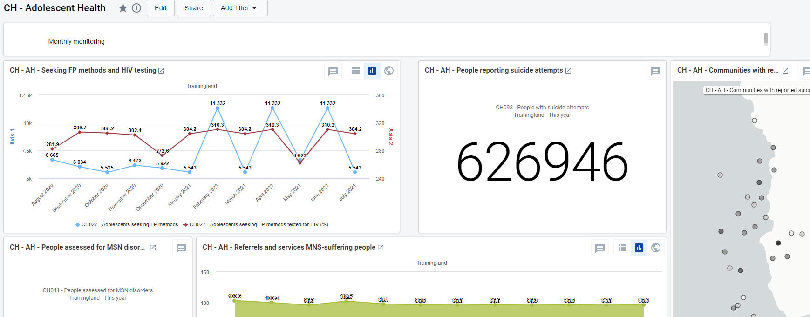

The second part of the dashboard is dedicated to the annual dataset (Annual Household Assessment Indicators). The predefined analyse and visualize the main areas of the dataset, though the dashboard should be modified to better mirror the local activities.

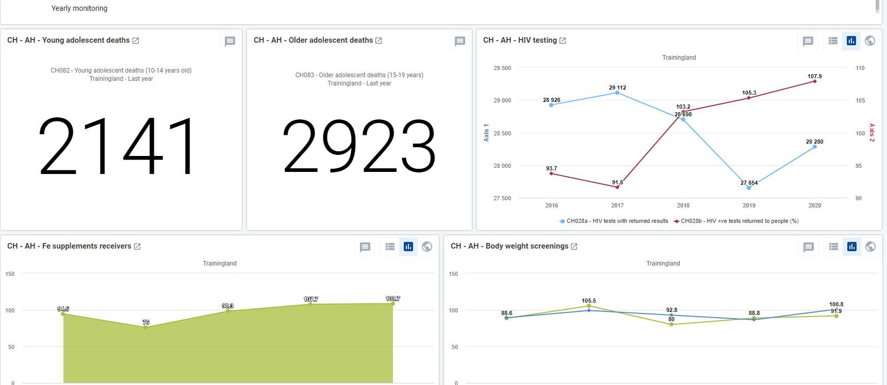
