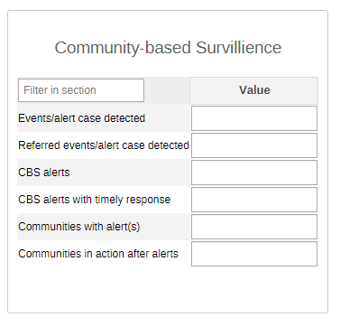
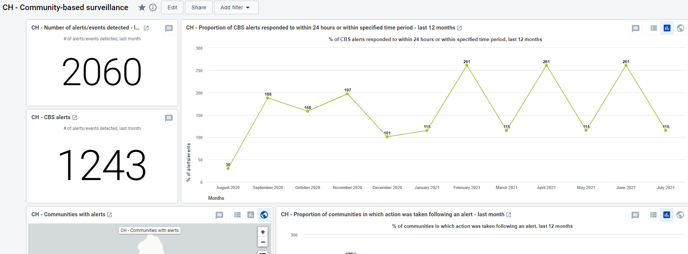

# CH - Community-based surveillance (CBS) { #ch-cbs-aggregate-design }

## 1. Datasets

### 1.1. Configuration Summary

The aggregate CH - Community-based surveillance module includes:

1. A **monthly dataset** with key data elements for CBS
2. **Core indicators** for the dataset
3. A predefined **“CH - Community-based surveillance” dashboard**

It is recommended that the datasets get assigned to Organisation Units **at the lowest level** of the health system feasible for reporting data, such as Villages or any appropriate community demarcation according to the local context.

## 1.2. Data Elements

The table below summarizes the data elements present in the CBS module. The “Data elements groups” and “Datasets” columns will provide extra information on where the same DEs can be found in the other CHIS modules. This should facilitate the mapping of the package among all its modules and navigate the datasets while avoiding the collection and data entry of the same DEs in multiple locations. In this case, the CBS DEs are not shared with any other module.

All the DEs in the CBS module are used in the build up of indicators.

| Name                                         | Description                                                                                   | Disaggregation | Data Sets                                   | Data Element Groups               |   |
|----------------------------------------------|-----------------------------------------------------------------------------------------------|----------------|---------------------------------------------|-----------------------------------|---|
| CH173a - Events/alert case detected          | Events/alert case detected                                                                    | default        | CH - Community-based surveillance (Monthly) | CH - Community-based surveillance |   |
| CH173b - Events/alert case detected referred | Events/alert case detected referred                                                           | default        | CH - Community-based surveillance (Monthly) | CH - Community-based surveillance |   |
| CH174a - CBS alerts with timely response     | CBS alerts responded to within 24 hours or within specified time period from the CBS protocol | default        | CH - Community-based surveillance (Monthly) | CH - Community-based surveillance |   |
| CH174b - CBS alerts                          | CBS alerts                                                                                    | default        | CH - Community-based surveillance (Monthly) | CH - Community-based surveillance |   |
| CH175a - Communities in action after alerts  | Communities in which action was taken following an alert (per month)                          | default        | CH - Community-based surveillance (Monthly) | CH - Community-based surveillance |   |
| CH175b - Communities with alert(s)           | Communities in which there was at least an alert (per month)                                  | default        | CH - Community-based surveillance (Monthly) | CH - Community-based surveillance |   |

## 2. Datasets Details

### 2.1. CBS Dataset

The section is set to collect the information necessary to monitor the knowledge and reactivity of the community for alerts and events.

## 3. Validation Rules

The following validation rules have been set up for the CBS datasets:

|                                              Name                                              |                                                       Instruction                                                      |        Operator       |                     Left side                    |               Right side              |
|:----------------------------------------------------------------------------------------------:|:----------------------------------------------------------------------------------------------------------------------:|:---------------------:|:------------------------------------------------:|:-------------------------------------:|
| CH - CBS alerts responded to timely Vs CBS alerts                                              | CBS alerts responded to timely should be less than or equal to CBS alerts                                              | less_than_or_equal_to | CBS alerts responded to timely                   | CBS alerts                            |
| CH - Communities with action was taken after an alert Vs Communities with 1+ alert (per month) | Communities with action was taken after an alert should be less than or equal to Communities with 1+ alert (per month) | less_than_or_equal_to | Communities with action was taken after an alert | Communities with 1+ alert (per month) |
| CH - Events/alert case detected referred Vs Events/alert case detected                         | Events/alert case detected referred should be less than or equal to Events/alert case detected                         | less_than_or_equal_to | Events/alert case detected referred              | Events/alert case detected            |

## 4. Analytics and Indicators

Just as for the DEs, in the table below the column “Indicator Groups” provides information about whether the indicator is found in groups other than the CBS indicator group.

|                      Name                      |               Numerator description              |        Denominator description        |          Indicator groups         |   |
|:----------------------------------------------:|:------------------------------------------------:|:-------------------------------------:|:---------------------------------:|---|
| CH173 - Events/alert case detected             | Events/alert case detected                       | 1                                     | CH - Community-based surveillance |   |
| CH174b - CBS alerts                            | alerts                                           | 1                                     | CH - Community-based surveillance |   |
| CH175b - Communities with alerts               | Communities with alerts                          | 1                                     | CH - Community-based surveillance |   |
| CH175 - Communities in action after alerts (%) | Communities with action was taken after an alert | Communities with 1+ alert (per month) | CH - Community-based surveillance |   |

## 5. Dashboards

The module includes a predefined dashboard called “CH - Community-based surveillance”.

The predefined items analyse and visualize the main areas of the dataset, though the dashboard should be modified to better mirror the local activities.

