# CH - Child Health { #ch-cdh-aggregate-design }

## 1.Datasets

### 1.1. Configuration Summary

The aggregate CH - Child Health (ChH) module includes:

1. A **monthly dataset** with key data elements for child health
2. A **yearly dataset** for the follow up of key annual information on child health
3. **Core indicators** for both datasets
4. A predefined **“CH - Child Health” dashboard**

It is recommended that the datasets get assigned to Organisation Units **at the lowest level** of the health system feasible for reporting data, such as Villages or any appropriate community demarcation according to the local context.

## 1.2. Data Elements

The table below summarizes the data elements present in the ChH module. The “Data elements groups” and “Datasets” columns will provide extra information on where the same DEs can be found in the other CHIS modules. This should facilitate the mapping of the package among all its modules and navigate the datasets while avoiding the collection and data entry of the same DEs in multiple locations.

All the DEs in the ChH module are used in the build up of indicators.

| Name                                                                                    | Description                                                                                                                    | Disaggregation                          | Data Sets                                                                                                                                                                        | Data Element Groups                                                                                                       |
|-----------------------------------------------------------------------------------------|--------------------------------------------------------------------------------------------------------------------------------|-----------------------------------------|----------------------------------------------------------------------------------------------------------------------------------------------------------------------------------|---------------------------------------------------------------------------------------------------------------------------|
| CH028a - HIV positive tests returned                                                    | HIV tests conducted in which a new HIV-positive result or diagnosis was returned                                               | Age (0-50+years)/Sex (Other/Unk)        | CH - Maternal Health (Yearly); CH - Adolescent Health (Yearly); CH - Sexual and Reproductive Health (Yearly); CH - HIV (Yearly); CH - ICCM (Monthly); CH - Child Health (Yearly) | CH - Sexual and Reproductive Health; CH - ICCM; CH - Child Health; CH - Maternal Health; CH - Adolescent Health; CH - HIV |
| CH028b - HIV tests returned                                                             | HIV tests returned                                                                                                             | Age (0-50+years)/Sex (Other/Unk)        | CH - HIV (Yearly); CH - Adolescent Health (Yearly); CH - ICCM (Monthly); CH - Sexual and Reproductive Health (Yearly); CH - Maternal Health (Yearly); CH - Child Health (Yearly) | CH - Sexual and Reproductive Health; CH - ICCM; CH - Child Health; CH - Maternal Health; CH - Adolescent Health; CH - HIV |
| CH028c - HIV positive tests returned to key population                                  | HIV tests conducted amongst key population in which a new HIV-positive result or diagnosis was returned                        | Key Population                          | CH - ICCM (Monthly); CH - Adolescent Health (Yearly); CH - Child Health (Yearly); CH - HIV (Yearly); CH - Maternal Health (Yearly); CH - Sexual and Reproductive Health (Yearly) | CH - Sexual and Reproductive Health; CH - ICCM; CH - Child Health; CH - Maternal Health; CH - Adolescent Health; CH - HIV |
| CH028d - HIV tests returned to key population                                           | HIV tests performed amongst key population where results were returned                                                         | Key Population                          | CH - Child Health (Yearly); CH - Adolescent Health (Yearly); CH - HIV (Yearly); CH - Maternal Health (Yearly); CH - Sexual and Reproductive Health (Yearly); CH - ICCM (Monthly) | CH - Sexual and Reproductive Health; CH - ICCM; CH - Child Health; CH - Maternal Health; CH - Adolescent Health; CH - HIV |
| CH028e - HIV positive tests returned to TB patients                                     | HIV tests conducted amongst TB in which a new HIV-positive result or diagnosis was returned                                    | Type of TB Case                         | CH - HIV (Yearly); CH - Maternal Health (Yearly); CH - Child Health (Yearly); CH - ICCM (Monthly); CH - Sexual and Reproductive Health (Yearly); CH - Adolescent Health (Yearly) | CH - Sexual and Reproductive Health; CH - ICCM; CH - Child Health; CH - Maternal Health; CH - Adolescent Health; CH - HIV |
| CH028f - HIV tests returned to TB patients                                              | HIV tests performed amongst TB where results were returned                                                                     | Type of TB Case                         | CH - ICCM (Monthly); CH - Sexual and Reproductive Health (Yearly); CH - Adolescent Health (Yearly); CH - Maternal Health (Yearly); CH - Child Health (Yearly); CH - HIV (Yearly) | CH - Sexual and Reproductive Health; CH - ICCM; CH - Child Health; CH - Maternal Health; CH - Adolescent Health; CH - HIV |
| CH055 - Infant deaths (0-11 m)                                                          | Infant deaths (0-11 m)                                                                                                         | Sex (Other/Unk)                         | CH - Child Health (Yearly); CH - Civil registration and vital statistics (Yearly)                                                                                                | CH - Child Health; CH - Civil registration and vital statistics                                                           |
| CH056 - Child deaths (1-4 years)                                                        | Child deaths (1-4 years)                                                                                                       | Sex (Other/Unk)                         | CH - Child Health (Yearly); CH - Civil registration and vital statistics (Yearly)                                                                                                | CH - Child Health; CH - Civil registration and vital statistics                                                           |
| CH057 - Child deaths (5-9 years)                                                        | Child deaths (5-9 years)                                                                                                       | Sex (Other/Unk)                         | CH - Civil registration and vital statistics (Yearly); CH - Child Health (Yearly)                                                                                                | CH - Child Health; CH - Civil registration and vital statistics                                                           |
| CH058a - Consultations for children (0-5 m) with feeding counselling                    | Consultations with a CHW for an infant aged 0-5 months providing any counselling on appropriate infant and young child feeding | default                                 | CH - Child Health (Monthly); CH - Nutrition (Monthly)                                                                                                                            | CH - Nutrition; CH - Child Health                                                                                         |
| CH058b - Consultations for children (0-5 m) with CHW                                    | Consultations for children (0-5 m) with CHW                                                                                    | default                                 | CH - Child Health (Monthly); CH - Nutrition (Monthly)                                                                                                                            | CH - Nutrition; CH - Child Health                                                                                         |
| CH059a -  Consultations for children (6-23 m) with feeding counselling                  | Consultations with a CHW for children aged 6-23 months providing any counselling on appropriate complementary feeding          | default                                 | CH - Nutrition (Monthly); CH - Child Health (Monthly)                                                                                                                            | CH - Nutrition; CH - Child Health                                                                                         |
| CH059b - Consultations for children (6-23 m) with CHW                                   | Consultations for children (6-23 m) with CHW                                                                                   | default                                 | CH - Child Health (Monthly); CH - Nutrition (Monthly)                                                                                                                            | CH - Nutrition; CH - Child Health                                                                                         |
| CH060a - People receiving deworming preventive chemotherapy                             | People receiving a dose of preventive chemotherapy for deworming                                                               | Age (1-20+years)/Sex (Other/Unk)        | CH - Adolescent Health (Monthly); CH - Child Health (Monthly); CH - Nutrition (Monthly)                                                                                          | CH - Nutrition; CH - Adolescent Health; CH - Child Health                                                                 |
| CH060b -People targeted for deworming preventive chemotherapy                           | People targeted for preventive chemotherapy for deworming                                                                      | Age (1-20+years)/Sex (Other/Unk)        | CH - Child Health (Monthly); CH - Adolescent Health (Monthly); CH - Nutrition (Monthly)                                                                                          | CH - Nutrition; CH - Adolescent Health; CH - Child Health                                                                 |
| CH060c - People receiving deworming preventive chemotherapy                             | People receiving a dose of preventive chemotherapy for deworming by drug                                                       | Deworming drugs                         | CH - Nutrition (Monthly); CH - Child Health (Monthly); CH - Adolescent Health (Monthly)                                                                                          | CH - Nutrition; CH - Adolescent Health; CH - Child Health                                                                 |
| CH061a - Children (6-59m) given Vit A in semester 1 - routine                           | Children aged 6-59 months who received vitamin a via routine contacts with CHW in semester 1                                   | Age (6-59 months)/Vitamin A supplement  | CH - Nutrition (Monthly); CH - Child Health (Monthly)                                                                                                                            | CH - Nutrition; CH - Child Health                                                                                         |
| CH061b - Children (6-59m) given Vit A in semester 2 routine                             | Children aged 6-59 months who received vitamin a via routine contacts with CHW in semester 2                                   | Age (6-59 months)/Vitamin A supplement  | CH - Child Health (Monthly); CH - Nutrition (Monthly)                                                                                                                            | CH - Nutrition; CH - Child Health                                                                                         |
| CH061c - Children (6-59m) with CHW contact in semester 1 routine                        | Children aged 6-59 months with at least one community contact in semester 1                                                    | Age (6-59 months)                       | CH - Nutrition (Monthly); CH - Child Health (Monthly)                                                                                                                            | CH - Nutrition; CH - Child Health                                                                                         |
| CH061d - Children (6-59m) with CHW contact in semester 2 routine                        | Children aged 6-59 months with at least one community contact in semester 2                                                    | Age (6-59 months)                       | CH - Nutrition (Monthly); CH - Child Health (Monthly)                                                                                                                            | CH - Nutrition; CH - Child Health                                                                                         |
| CH061e - Children (6-59m) given Vit A by CHW in semester 1 event                        | Children aged 6-59 months who received vitamin a by CHW via event in semester 1                                                | default                                 | CH - Child Health (Monthly); CH - Nutrition (Monthly)                                                                                                                            | CH - Nutrition; CH - Child Health                                                                                         |
| CH061f - Children (6-59m) given Vit A by CHW in semester 2 event                        | Children aged 6-59 months who received vitamin a by CHW via event in semester 2                                                | default                                 | CH - Child Health (Monthly); CH - Nutrition (Monthly)                                                                                                                            | CH - Nutrition; CH - Child Health                                                                                         |
| CH061g - Children (6-59m) attending Vit A event in semester 1                           | Children aged 6-59 months attending events with vitamin A supplementation distributed via CHW in semester 1                    | default                                 | CH - Nutrition (Monthly); CH - Child Health (Monthly)                                                                                                                            | CH - Nutrition; CH - Child Health                                                                                         |
| CH061h - Children (6-59m) attending Vit A event in semester 2                           | Children aged 6-59 months attending events with vitamin A supplementation distributed via CHW in semester 2                    | default                                 | CH - Child Health (Monthly); CH - Nutrition (Monthly)                                                                                                                            | CH - Nutrition; CH - Child Health                                                                                         |
| CH062a - Children (6-59m) assessed using MUAC or WHZ or bilateral pitting oedema        | Children (6-59m) assessed using MUAC or WHZ or bilateral pitting oedema                                                        | Age (6-59 months)                       | CH - Child Health (Monthly); CH - Nutrition (Monthly)                                                                                                                            | CH - Nutrition; CH - Child Health                                                                                         |
| CH062b - Children (6-59m) in the community                                              | Children (6-59m) in the community                                                                                              | Age (6-59 months)                       | CH - Nutrition (Monthly); CH - Child Health (Monthly)                                                                                                                            | CH - Nutrition; CH - Child Health                                                                                         |
| _CH062c - Children (6-59m) assessed for wasting referred                                | Children (6-59m) assessed for wasting referred                                                                                 | Age (6-59 months)                       | CH - Nutrition (Monthly); CH - Child Health (Monthly)                                                                                                                            | CH - Nutrition; CH - Child Health                                                                                         |
| CH063a - Children (6-59m) with SAM                                                      | Children aged 6-59 months with severe acute malnutrition                                                                       | Age (6-59 months)                       | CH - ICCM (Monthly); CH - Nutrition (Monthly); CH - Child Health (Monthly)                                                                                                       | CH - Nutrition; CH - ICCM; CH - Child Health                                                                              |
| CH063b - Children (6-59m) assessed for SAM                                              | Children aged 6-59 months screened for severe acute malnutrition                                                               | Age (6-59 months)                       | CH - Child Health (Monthly); CH - Nutrition (Monthly); CH - ICCM (Monthly)                                                                                                       | CH - Nutrition; CH - ICCM; CH - Child Health                                                                              |
| CH063c - Children (6-59m) with SAM referred                                             | Children aged 6-59 months with severe acute malnutrition referred                                                              | Age (6-59 months)                       | CH - Child Health (Monthly); CH - ICCM (Monthly); CH - Nutrition (Monthly)                                                                                                       | CH - Nutrition; CH - ICCM; CH - Child Health                                                                              |
| CH064 - Children (0-4 y) weight measured                                                | Children aged <5 years visited by a CHW whose weight was assessed                                                              | Age (<5 years)/Sex (Other/Unk)          | CH - Child Health (Monthly); CH - Nutrition (Monthly)                                                                                                                            | CH - Nutrition; CH - Child Health                                                                                         |
| CH065 - Children (0-4 y) underweight                                                    | Number of children aged 0–5 years with weight for height > +2 SD from the median of the WHO Child Growth Standards       | Age (<5 years)/Sex (Other/Unk)          | CH - Child Health (Yearly); CH - Nutrition (Monthly)                                                                                                                             | CH - Nutrition; CH - Child Health                                                                                         |
| CH066a - Children (6-59m) wasting or with bilateral pitting oedema                      | Children aged 6-59 months wasting or bilateral pitting oedema                                                                  | Age (6-59 months)/Sex (Other/Unk)       | CH - Child Health (Monthly); CH - Nutrition (Monthly)                                                                                                                            | CH - Nutrition; CH - Child Health                                                                                         |
| CH066b - Children (6-59m) wasting or with bilateral pitting oedema referred             | Children (6-59m) wasting or with bilateral pitting oedema referred                                                             | Age (6-59 months)/Sex (Other/Unk)       | CH - Nutrition (Monthly); CH - Child Health (Monthly)                                                                                                                            | CH - Nutrition; CH - Child Health                                                                                         |
| _CH066c - Children (6-59m) assessed for wasting                                         | Children (6-59m) assessed for wasting                                                                                          | Age (6-59 months)/Sex (Other/Unk)       | CH - Child Health (Monthly); CH - Nutrition (Monthly)                                                                                                                            | CH - Nutrition; CH - Child Health                                                                                         |
| CH067a - Children (0-4 y) with height measured                                          | Children aged 0-4 years visited by a CHW whose height/length was measured                                                      | Age (<5 years)/Sex (Other/Unk)          | CH - Child Health (Monthly); CH - Nutrition (Monthly)                                                                                                                            | CH - Nutrition; CH - Child Health                                                                                         |
| CH067b - Children (0-4 y) consulted by a CHW                                            | Children (0-4 y) consulted by a CHW                                                                                            | Age (<5 years)/Sex (Other/Unk)          | CH - Child Health (Monthly); CH - Nutrition (Monthly)                                                                                                                            | CH - Nutrition; CH - Child Health                                                                                         |
| CH068a - Children (0-4 y) overweight                                                    | Children aged 0-4 years visited by CHW and overweight                                                                          | Age (<5 years)/Sex (Other/Unk)          | CH - Child Health (Yearly); CH - Nutrition (Yearly); CH - Noncommunicable diseases (Yearly)                                                                                      | CH - Nutrition; CH - Child Health; CH - Noncommunicable diseases                                                          |
| CH068b - Children (0-4 y) weighted                                                      | Children aged 0-4 years whose weight were measured                                                                             | Age (<5 years)/Sex (Other/Unk)          | CH - Noncommunicable diseases (Yearly); CH - Nutrition (Yearly); CH - Child Health (Yearly)                                                                                      | CH - Nutrition; CH - Child Health; CH - Noncommunicable diseases                                                          |
| CH069a - Children (5-19 y) overweight and obese                                         | Children and adolescents aged 5-19 years who are overweight                                                                    | Age (5-19 years)                        | CH - Nutrition (Yearly); CH - Noncommunicable diseases (Yearly); CH - Child Health (Yearly); CH - Adolescent Health (Yearly)                                                     | CH - Nutrition; CH - Adolescent Health; CH - Child Health; CH - Noncommunicable diseases                                  |
| CH069b - Children (5-19 y) weighted                                                     | Children and adolescents aged 5-19 years who were measured                                                                     | Age (5-19 years)                        | CH - Noncommunicable diseases (Yearly); CH - Child Health (Yearly); CH - Adolescent Health (Yearly); CH - Nutrition (Yearly)                                                     | CH - Nutrition; CH - Adolescent Health; CH - Child Health; CH - Noncommunicable diseases                                  |
| CH070a - Children (0-9 y) treated for diarrhoea                                         | Children aged 0-9 years presenting with diarrhoea who received treatment                                                       | Age (0-9 years)/Diarrhoea treatment     | CH - ICCM (Monthly); CH - Nutrition (Monthly); CH - Child Health (Monthly)                                                                                                       | CH - Nutrition; CH - ICCM; CH - Child Health                                                                              |
| CH070b - Children (0-9 y) assessed for diarrhoea                                        | Children aged 0-9 years presenting with diarrhoea assessed by CHW                                                              | Age (0-9 years)                         | CH - ICCM (Monthly); CH - Nutrition (Monthly); CH - Child Health (Monthly)                                                                                                       | CH - Nutrition; CH - ICCM; CH - Child Health                                                                              |
| CH071a - Children with fast breathing and/or chest indrawing                            | Children with fast breathing and/or chest indrawing                                                                            | Age (0 months-9 years)/Chest problems   | CH - Child Health (Monthly); CH - ICCM (Monthly)                                                                                                                                 | CH - ICCM; CH - Child Health                                                                                              |
| CH071b - Children with fast breathing and/or chest indrawing referred                   | Children with fast breathing and/or chest indrawing referred                                                                   | Age (0 months-9 years)/Chest problems   | CH - ICCM (Monthly); CH - Child Health (Monthly)                                                                                                                                 | CH - ICCM; CH - Child Health                                                                                              |
| CH071c - Children screened for fast breathing and/or chest indrawing                    | Children screened for fast breathing and/or chest indrawing                                                                    | Age (0 months-9 years)                  | CH - ICCM (Monthly); CH - Child Health (Monthly)                                                                                                                                 | CH - ICCM; CH - Child Health                                                                                              |
| CH072 - Children with fast breathing and/or chest indrawing given ABX                   | Children presenting with fast breathing and/or chest indrawing who received antibiotic treatment from CHW                      | Age (0 months-9 years)/Chest problems   | CH - Child Health (Monthly); CH - ICCM (Monthly)                                                                                                                                 | CH - Child Health                                                                                                         |
| CH073 -  Infants (0-59 days) with pre-referral treatment for bacterial infection        | Young infants 0-59 days old who received pre-referral treatment by CHW for signs of possible serious bacterial infection       | Age (0 days-59 months)/Antibiotics      | CH - Child Health (Monthly)                                                                                                                                                      | CH - Child Health                                                                                                         |
| CH074a - Caregivers receiving information on early identification of danger signs       | Caregivers receiving information on early identification of danger signs                                                       | Sex (Other/Unk)                         | CH - Child Health (Monthly)                                                                                                                                                      | CH - Child Health                                                                                                         |
| CH074b - Caregivers of consulted children                                               | Caregivers of consulted children                                                                                               | Sex (Other/Unk)                         | CH - Child Health (Monthly)                                                                                                                                                      | CH - Child Health                                                                                                         |
| CH075a - Children (0-4 y) monitored for early signs of developmental delays             | Children aged 0-4 years monitored for early signs of developmental delays                                                      | Age (<5 years)/Sex (Other/Unk)          | CH - Child Health (Monthly); CH - Mental health (Monthly)                                                                                                                        | CH - Child Health; CH - Mental health                                                                                     |
| CH075b - Children (0-4 y) monitored for early signs of developmental delays referred    | Children (0-4 y) monitored for early signs of developmental delays referred                                                    | Age (<5 years)/Sex (Other/Unk)          | CH - Child Health (Monthly); CH - Mental health (Monthly)                                                                                                                        | CH - Child Health; CH - Mental health                                                                                     |
| CH076a - Children with suspected developmental disabilities referred                    | Children with suspected developmental disabilities referred                                                                    | Age (0 months-17 years)/Sex (Other/Unk) | CH - Child Health (Monthly); CH - Mental health (Monthly)                                                                                                                        | CH - Child Health; CH - Mental health                                                                                     |
| CH076b - Children assessed for development monitoring                                   | Children who were assessed for their developmental monitoring                                                                  | Age (0 months-17 years)/Sex (Other/Unk) | CH - Mental health (Monthly); CH - Child Health (Monthly)                                                                                                                        | CH - Child Health; CH - Mental health                                                                                     |
| CH077a - Caregivers counselled on responsive caregiving and learning activities         | Caregivers receiving counselling on responsive caregiving and early learning activities                                        | Sex (Other/Unk)                         | CH - Mental health (Monthly); CH - Child Health (Monthly)                                                                                                                        | CH - Child Health; CH - Mental health                                                                                     |
| CH077b - Caregivers of children consulting for developmental delays                     | Caregivers of children consulting for developmental delays                                                                     | Sex (Other/Unk)                         | CH - Child Health (Monthly); CH - Mental health (Monthly)                                                                                                                        | CH - Child Health; CH - Mental health                                                                                     |
| CH078a - Children with developmental disability whose caregiver received parenting info | Children with suspected developmental disorders and disabilities whose caregivers receive information on parenting             | Age (0 months-17 years)/Sex (Other/Unk) | CH - Mental health (Monthly); CH - Child Health (Monthly)                                                                                                                        | CH - Child Health; CH - Mental health                                                                                     |
| CH078b - Children (0-4 y) assessed for developmental delays - last 12 months            | Children who were assessed for their developmental disorders and disabilities in the past 12 months                            | Age (0 months-17 years)/Sex (Other/Unk) | CH - Mental health (Monthly); CH - Child Health (Monthly)                                                                                                                        | CH - Child Health; CH - Mental health                                                                                     |
| CH079a - People (>18 m) referred for HIV testing                                        | People (>18 m) referred for HIV testing                                                                                        | Age (0-50+years)/Sex (Other/Unk)        | CH - HIV (Yearly); CH - ICCM (Monthly); CH - Child Health (Yearly)                                                                                                               | CH - ICCM; CH - Child Health; CH - HIV                                                                                    |
| CH079b - People (>18 m) in the catchment area                                           | People (>18 m) in the catchment area                                                                                           | Age (0-50+years)/Sex (Other/Unk)        | CH - Child Health (Yearly); CH - ICCM (Monthly); CH - HIV (Yearly)                                                                                                               | CH - ICCM; CH - Child Health; CH - HIV                                                                                    |
| CH080 - Children (0-4 y) with insufficient physical activity                            | Children aged 0-4 years not meeting who recommendations on physical activity for their age group                               | Age (<5 years)/Sex (Other/Unk)          | CH - Noncommunicable diseases (Yearly); CH - Child Health (Yearly)                                                                                                               | CH - Child Health; CH - Noncommunicable diseases                                                                          |
| CH081 - Children (5-9 y) with insufficient physical activity                            | Children (5-9 y) with insufficient physical activity                                                                           | Sex (Other/Unk)                         | CH - Noncommunicable diseases (Yearly); CH - Child Health (Yearly)                                                                                                               | CH - Child Health; CH - Noncommunicable diseases                                                                          |

## 2. Dataset Details

### 2.1. Monthly Child Health Dataset

The [United Nations Convention on the Rights of the Child](https://www.savethechildren.org.uk/content/dam/gb/reports/humanitarian/uncrc19-summary2.pdf) defines a child as every human being **below the age of 18 years**, unless under the law applicable to the child, majority is attained earlier. **This module focuses more specifically on children between the age of 29 days and 9 years**. In both the monthly and the yearly datasets the category combinations for the age groups have age groups that go beyond the definition. This has been done to avoid creating *ad hoc* age groups for each and every dataset. The age groups above the definition of Child have been greyed-out and therefore blocked for data entry. Countries should nonetheless edit and apply the age categories that better reflect the local context and guidelines.

#### 2.1.1. Infant Feeding

The section is set to collect the number of CHWs consultations to infants and about appropriate feeding.

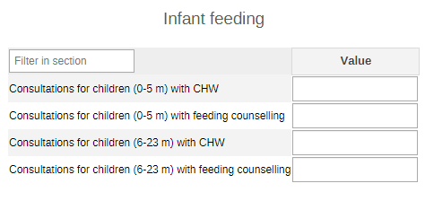

#### 2.1.2. Deworming

The first part of the section is set to give an overview of the target population for the activity by age group (1-4Y, 5-9Y, 140-14Y, 15-19Y, unknown age) and by sex (male, female, other, unknown sex), and the number of reached people (same disaggregation). The second part of the section divides the reached people by type of preventive chemotherapy (Albendazole and Mebendazole). The used drugs can be adapted locally based on availability and national guidelines.

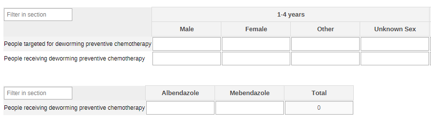

#### 2.1.3. Vitamin A Supplement - Routine

This section of the monthly dataset focuses only on routine activities dedicated to the distribution of Vit A supplements to children during the first and second semester of the year. This has two subsections with the first focusing on routine vitamin A supplementation with children by age groups (6-11m and 12-59m) and by age and the administered IUs (100000 IU and 200000 IU).

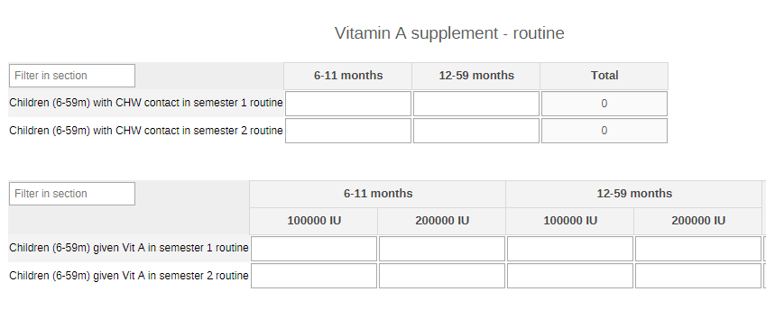

#### 2.1.4. Vitamin A Supplement - Events

The other section on Vitamin A supplementation is dedicated exclusively to mass distributions that are conducted during one-shot interventions organized to reach the maximum number of children at once.

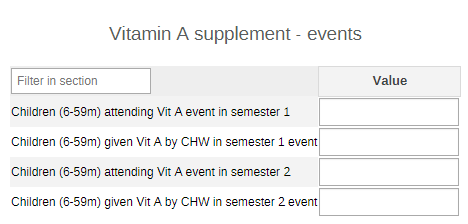

#### 2.1.5. Severe Acute Malnutrition (SAM)

The section provides a simple overview of the core information to be collected during the nutritional assessment in the community by age group (6-11m and 12-59m).

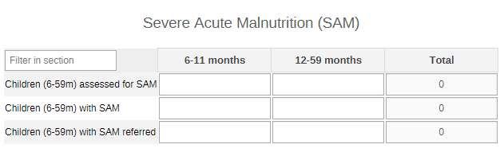

#### 2.1.6.Body weight

The section the total number of weighted children by age (0-11m, 1-4y) and by sex (male, female, other, unknown sex).

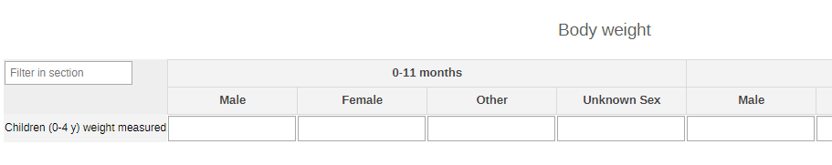

#### 2.1.7. Wasting

The section is dedicated to the assessment of the nutritional status of children under the age of five by age groups (0-11m and 12-59m) via MUAC or bilateral pitting oedema.

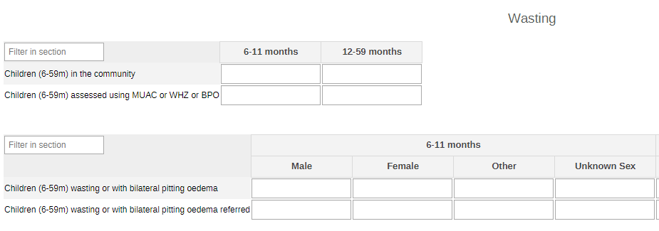

#### 2.1.8. Body Height

The section collects data on the number of assessed children and on how many among them have had their height measured during the consultation.

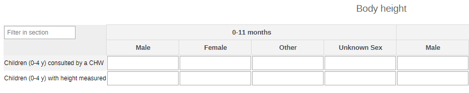

#### 2.1.9. Diarrhoea

The section collects the information on diarrhoea treatment (ORS, Zinc, both)among children aged 0-4 and 5-9 years.

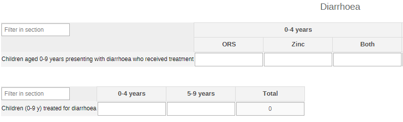

#### 2.1.10. Bacterial Infections

The section collects data on administered treatments against bacterial infections by age group (0-6d, 7-28d, 29-59d, unknown age) and by ABX (Amoxicillin, Gentamicin, Other); and, in particular, how many among these were to treat chest problems by age group (0-11m, 1-4y, 5-9y, unknown age) and by symptoms (fast breathing, chest indrawing, both).

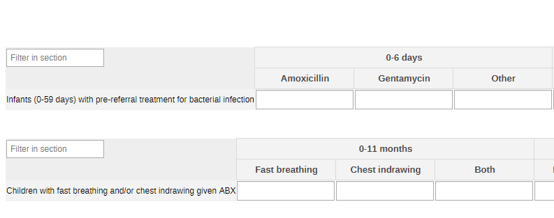

#### 2.1.11. Breathing and Chest Problems

The section provides a simple overview of the screened children by age group (0-11m, 1-4y, 5-9y, unknown age) and by symptoms (fast breathing, chest indrawing, both); and on how many among them have been identified for chest problems and eventually referred.

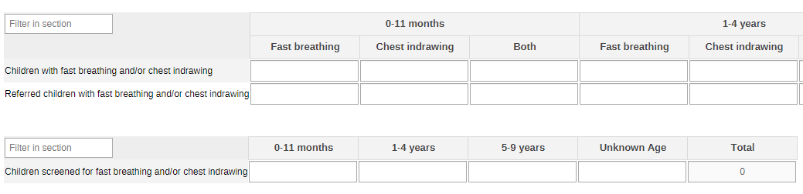

#### 2.1.12. Danger Signs Among Children

The section collects data on danger signs among newborns and young children by age group (0-27d, 28d-11m, 1-4y, 5-9y, unknown age); and provides information on the sessions given to their caregivers on the identifications of such danger signs by se of the caregiver (male, female, other, unknown sex).

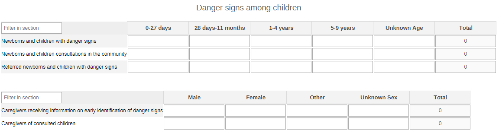

#### 2.1.13. Developmental Delays - Monitored For Early Signs

The section collects data on children under five years of age who have been screened for early signs of developmental delays and how many have been referred for a better follow-up by age groups (0-11m and 1-4y) and by sex (male, female, other, unknown sex).

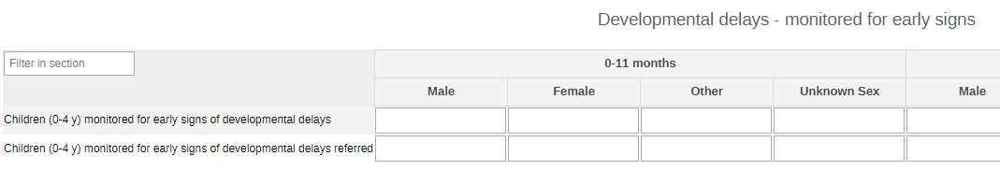

#### 2.1.14.Developmental Delays - Caregivers Receiving Parenting Info

The section also focuses on children under five years of age by age groups (0-11m and 1-4y) and by sex (male, female, other, unknown sex) and their caregivers.

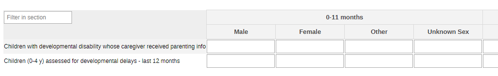

#### 2.1.15. Developmental Delays - Suspects Referred

This section focuses on children up to 17 years of age by age groups (0-11m, 1-4y, 5-9y, 10-14y, 15-17y, unknown age) and by sex (male, female, other, unknown sex).

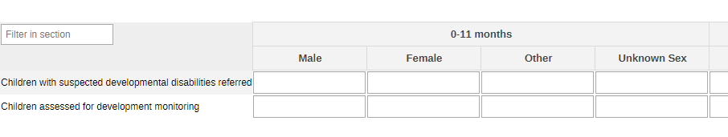

#### 2.1.16. Developmental Delays - Counselled Caregivers

The section provides information on the counseling sessions for the caregivers by sex of the caregiver (male, female, other, unknown sex).

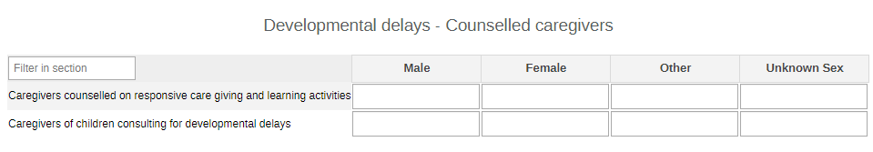

### 2.2. Yearly Child Health Dataset

#### 2.2.1. HIV - All

The section collects the core information on the number of tests returned to people and the positive results among them. The information is disaggregated by age groups (0-4y 5-9y, 10-14, 15-19y, unknown age) and sex (male, female, other, unknown sex).

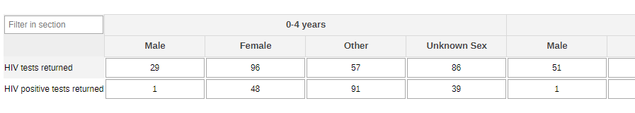

#### 2.2.2. HIV - Key Population

The table gives an overview of the number of returned tests and positive results among key population groups at risk (MSM, SW, Prisoners, IDU, TG, Other - the groups can be adapted to better mirror the local context).

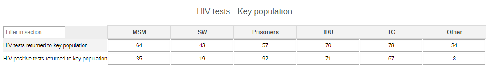

#### 2.2.3. HIV - TB Cases

The section provides the relevant information on HIV testing among presumptive and confirmed TB patients.

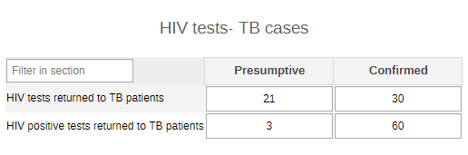

#### 2.2.4. Child Death

The section provides a very simple overview of the number of deaths by sex (male, female, other, unknown sex) among children.

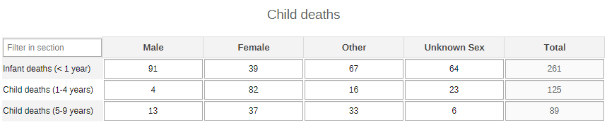

#### 2.2.5. Body Weight

The section collects data on the two ends of the spectrum among measured children: those with high BMI and those with low BMI by age group (5-9y, 10-14y, 15-17y, 18-19y, unknown age), and by age group (0-11m, 1-4y) and by sex (male, female, other, unknown sex) .

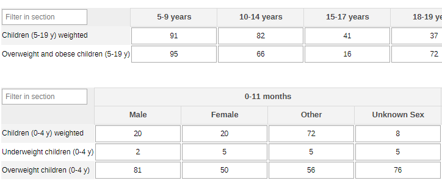

#### 2.2.6. Physical Activity

The section provides info on the levels of physical activities of the screened children. Children between the ages of 5 and 9 years are disaggregated by sex (male, female, other, unknown sex), while the chilndren between the ages of 0 and 4 years are disagrgegated by age groups (0-11m, 1-4y) and by sex (male, female, other, unknown sex).

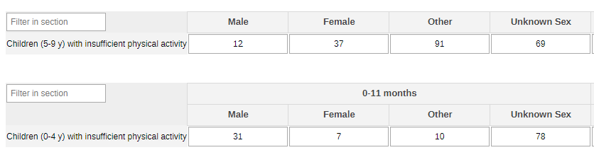

#### 2.2.7. HTS Referral
This section collects data on children >18 months at risk of HIV and therefore referred for further testing. The data are disaggregated by age (0-4y, 5-9y, 10-14y, 15-19y) and by sex (male, female, other, unknown sex).

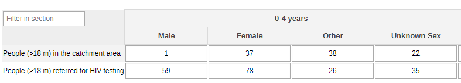

## 3. Validation Rules

The following validation rules have been set up for the Child Health datasets:

| name                                                                                                          | instruction                                                                                                                           | operator              | leftSide description                               | rightSide description                              |
|---------------------------------------------------------------------------------------------------------------|---------------------------------------------------------------------------------------------------------------------------------------|-----------------------|----------------------------------------------------|----------------------------------------------------|
| CH - Caregivers receiving info on danger signs Vs Caregivers of children consulting                           | Caregivers receiving info on danger signs should be less than or equal to Caregivers of children consulting                           | less_than_or_equal_to | Caregivers receiving info on danger signs          | Caregivers of children consulting                  |
| CH - Children presenting fast breathing/chest indrawing Vs Children screened for fast breathing/ indrawing    | Children presenting fast breathing/chest indrawing should be less than or equal to Children screened for fast breathing/ indrawing    | less_than_or_equal_to | Children presenting fast breathing/chest indrawing | Children screened for fast breathing/ indrawing    |
| CH - Children with fast breathing/indrawing referred Vs Children presenting fast breathing/chest indrawing    | Children with fast breathing/indrawing referred should be less than or equal to Children presenting fast breathing/chest indrawing    | less_than_or_equal_to | Children with fast breathing/indrawing referred    | Children presenting fast breathing/chest indrawing |
| CH - Fast breathing/chest indrawing given antibiotic TX Vs Children presenting fast breathing/chest indrawing | Fast breathing/chest indrawing given antibiotic TX should be less than or equal to Children presenting fast breathing/chest indrawing | less_than_or_equal_to | Fast breathing/chest indrawing given antibiotic TX | Children presenting fast breathing/chest indrawing |

## 4. Analytics and Indicators

Just as for the DEs, in the table below the column “Indicator Groups” provides information about whether the indicator is found in groups other than the ChH indicator group.

| name                                                                                       | description                                                                                                                   | Numerator Description                                    | Denominator Description                                                     | Indicator groups                                                                                                          |
|--------------------------------------------------------------------------------------------|-------------------------------------------------------------------------------------------------------------------------------|----------------------------------------------------------|-----------------------------------------------------------------------------|---------------------------------------------------------------------------------------------------------------------------|
| CH028a - HIV tests with returned results                                                   | Number of HIV tests conducted and results returned                                                                            | HIV tests performed where results were returned          | 1                                                                           | CH - Maternal Health; CH - Child Health; CH - ICCM; CH - Adolescent Health; CH - HIV; CH - Sexual and Reproductive Health |
| CH028b - HIV +ve tests returned to people (%)                                              | Proportion of HIV tests performed that were positive and results returned to people                                           | New HIV-positive result or diagnosis was returned        | HIV tests performed where results were returned                             | CH - Maternal Health; CH - Child Health; CH - ICCM; CH - Adolescent Health; CH - HIV; CH - Sexual and Reproductive Health |
| CH052e - Newborns and children with danger signs                                           | Number of newborns and children with danger signs                                                                             | Newborns and children with danger signs                  | 1                                                                           | CH - Newborn Health; CH - Child Health; CH - ICCM                                                                         |
| CH055 - Infant deaths (0-11 m)                                                             | Number of new infant deaths  (0-11 m)                                                                                         | New infant deaths (0-11 m)                               | 1                                                                           | CH - Child Health; CH - Civil registration and vital statistics                                                           |
| CH056 - Child deaths (1-4 years)                                                           | Number of new child deaths (1-4 years)                                                                                        | New child deaths aged 1-4 years                          | 1                                                                           | CH - Child Health; CH - Civil registration and vital statistics                                                           |
| CH057 - Child deaths (5-9 years)                                                           | Number of new child deaths (5-9 years)                                                                                        | New child deaths aged 5-9 years                          | 1                                                                           | CH - Child Health; CH - Civil registration and vital statistics                                                           |
| CH058 - Consultations for children (0-5 m)                                                 | Number of consultations for infants under 6 months with CHW                                                                   | Consultation for children 0-5 mos                        | 1                                                                           | CH - Child Health                                                                                                         |
| CH058 - Consultations for children (0-5 m) with feeding counselling (%)                    | Proportion of consultations for infants under 6 months providing counselling on appropriate infant and young child feeding    | Consultation for children 0-5 m & infant feeding         | Consultations with a CHW for an infant 0-5 months                           | CH - Nutrition; CH - Child Health                                                                                         |
| CH059 - Consultations for children (6-23 m)                                                | Number of consultations for children 6-23 months with CHW                                                                     | Consultation for children 6-23 mos                       | 1                                                                           | CH - Child Health                                                                                                         |
| CH059 - Consultations for children (6-23 m) with feeding counselling (%)                   | Proportion of consultations for children 6-23 months providing counselling on appropriate complementary feeding               | Consultation for children 6-23 mos & comp feeding        | Consultations with a CHW for children 6-23 months                           | CH - Nutrition; CH - Child Health                                                                                         |
| CH05x - Deaths children (0-11 m)                                                           | Number of new children deaths(0-11 m)                                                                                         | New infant deaths (0-11 m)                               | 1                                                                           | CH - Child Health                                                                                                         |
| CH060 - People receiving deworming preventive chemotherapy (%)                             | Proportion of people receiving preventive chemotherapy for deworming                                                          | Receiving a dose of PC for deworming                     | People targeted for PC for deworming                                        | CH - Nutrition; CH - Child Health; CH - Adolescent Health                                                                 |
| CH061b - Children (6-59m) given Vit A each semester event(%)                               | Proportion of children 6-59 months given a dose of vitamin A through event CHW contacts in each semester                      | Children 6-59 months given vitamin A event               | Contacts with children 6-59 months through event CHW contacts for Vitamin A | CH - Nutrition; CH - Child Health                                                                                         |
| CH062 - Children (6-59 m) assessed for wasting (%)                                         | Proportion of children aged 6-59 months assessed for wasting                                                                  | Children aged 6-59 months assessed for wasting           | Children aged 6-59 months in the community                                  | CH - Nutrition; CH - Child Health                                                                                         |
| CH062 - Children (6-59 m) wasting                                                          | Number of children aged 6-59 months with signs and symptoms of wasting                                                        | Children aged 6-59 wasting                               | 1                                                                           | CH - Child Health                                                                                                         |
| CH063 - Children (6-59 m) assessed for SAM (%)                                             | Proportion of children 6-59 months with severe acute malnutrition (SAM)                                                       | Children 6-59 months with SAM                            | Children 6-59 months screened for SAM                                       | CH - Nutrition; CH - Child Health; CH - ICCM                                                                              |
| CH063 - Children (6-59 m) with SAM                                                         | Number  of children 6-59 months with severe acute malnutrition (SAM)                                                          | Children 6-59 months with SAM                            | 1                                                                           | CH - Child Health; CH - ICCM                                                                                              |
| CH064 - Children (6-59 m) weighted                                                         | Number of children under 5 years (6-59 months) who had their weight assessed                                                  | Children 6-59 months with weight assessed                | 1                                                                           | CH - Nutrition; CH - Child Health                                                                                         |
| CH065 - Children (0-4 y) underweight (%)                                                   | Proportion of children under 5 years who are underweight                                                                      | Children aged 0-4 years visited by a CHW and underweight | Children weighed                                                            | CH - Nutrition; CH - Child Health                                                                                         |
| CH066 - Children (6-59m) wasting (%)                                                       | Proportion of children (6-59m) wasting                                                                                        | Children 6-59 months wasting                             | Children (6-59m) assessed using MUAC or WHZ or bilateral pitting oedema     | CH - Nutrition; CH - Child Health                                                                                         |
| CH067 - Children (0-4 y) with measured height (%)                                          | Proportion of children under 5 years who had their height/length measured                                                     | Children 0-4 years whose height was measured             | Children aged 0-4 years consulted by a CHW                                  | CH - Nutrition; CH - Child Health                                                                                         |
| CH068 - Overweight children (0-4 y) (%)                                                    | Proportion of overweight among children under 5 years of age                                                                  | Children 0-4 years visited by CHW and overweight         | Children aged 0-4 years that were measured                                  | CH - Nutrition; CH - Child Health; CH - Noncommunicable diseases                                                          |
| CH069 - Overweight and obese children (5-19 y) (%)                                         | Proportion of overweight and obesity in school-age children and adolescents 5-19 years                                        | Children and adolescents 5-19 years overweight           | Children and adolescents 5-19 years measured                                | CH - Nutrition; CH - Child Health; CH - Adolescent Health; CH - Noncommunicable diseases                                  |
| CH070 - Children (0-9 y) treated for diarrhoea (%)                                         | Proportion of children (0-9 years)who received treatment for diarrhoea                                                        | Children 0-9 years with diarrhoea who received tx        | Children 0-9 yrs presenting diarrhoea assessed                              | CH - Nutrition; CH - Child Health; CH - ICCM                                                                              |
| CH071 - Children with fast breathing and/or chest in-drawing (%)                           | Proportion of children presenting fast breathing and/or chest indrawing                                                       | Children presenting fast breathing/chest indrawing       | Children screened for fast breathing/ indrawing                             | CH - Child Health; CH - ICCM                                                                                              |
| CH072 - Children receiving antibiotics for fast breathing and/or chest in-drawing (%)      | Proportion of children receiving antibiotic treatment for fast breathing and/or chest indrawing                               | Fast breathing/chest indrawing given antibiotic TX       | Children presenting fast breathing/chest indrawing                          | CH - Child Health; CH - ICCM                                                                                              |
| CH073 - Infants (0-59 days) with pre-referral treatment for bacterial infection            | Number of young infants, 0-59 days old who received pre-referral treatment for signs of possible serious bacterial infection  | Infants 0-59 days tx for bacterial infection             | 1                                                                           | CH - Child Health                                                                                                         |
| CH074 - Caregivers receiving info on early identification of danger signs (%)              | Proportion of caregivers receiving information on early identification of danger signs                                        | Caregivers receiving info on danger signs                | Caregivers of children consulting                                           | CH - Child Health                                                                                                         |
| CH075 - Children (0-4 y) monitored for developmental delays (%)                            | Proportion of children aged 0-4 years monitored for early signs of developmental delays                                       | Children 0-4 yrs monitored for signs of dev delays       | Children aged 0-4 years in the catchment area                               | CH - Child Health; CH - Mental health                                                                                     |
| CH076 - Children (0-4 y) referred for developmental disabilities (%)                       | Proportion of children aged 0-4 years with suspected developmental disabilities referred                                      | Children with suspected dev disabilities referred        | Children assessed for their dev monitoring                                  | CH - Child Health; CH - Mental health                                                                                     |
| CH077 - Caregivers counselled on responsive care giving and learning activities (%)        | Proportion of caregivers counselled on responsive caregiving and early learning activities                                    | Counselled on caregiving & early learning                | Caregivers of children consulting for dev delays                            | CH - Child Health; CH - Mental health                                                                                     |
| CH078 - Caregivers of children with developmental disability receiving parenting info (%)  | Proportion of children with suspected developmental disorders and disabilities whose caregivers receive parenting information | Caregivers who received info on parenting                | Children assessed for dev disorders & disabilities                          | CH - Child Health; CH - Mental health                                                                                     |
| CH079 - People (>18 m) referred for HIV testing                                            | Number of people above 18 months referred for HIV testing                                                                     | People >18 months who were referred for HIV test         | 1                                                                           | CH - Child Health; CH - ICCM; CH - HIV                                                                                    |
| CH080 - Children (0-4 y) with insufficient physical activity (%)                           | Proportion of children aged 0-4 years with insufficient physical activity                                                     | Children 0-4 years not meeting required activity         | Children aged 0-4 years in the catchment area                               | CH - Child Health; CH - Noncommunicable diseases                                                                          |
| CH081 - Children (5-9 y) with insufficient physical activity (%)                           | Proportion of children aged 5-9years with insufficient physical activity                                                      | Children 5-9 years with insufficient activity            | Children aged 5-9 years in the catchment area                               | CH - Child Health; CH - Noncommunicable diseases                                                                          |
| CH08x - Children (0-9 y) with insufficient physical activity (%)                           | Proportion of children (0-9 y)with insufficient physical activity                                                             | Children (0-9 y) not meeting required activity           | Children (0-9 y) in the catchment area                                      | CH - Child Health                                                                                                         |

## 5. Dashboards

The module includes a predefined dashboard called “CH - Child Health”.
The dashboard is divided in two based on the periodicity of the datasets.

The first part is for monthly indicators. The predefined items analyse and visualize the main areas of the dataset, though the dashboard should be modified to better mirror the local activities.

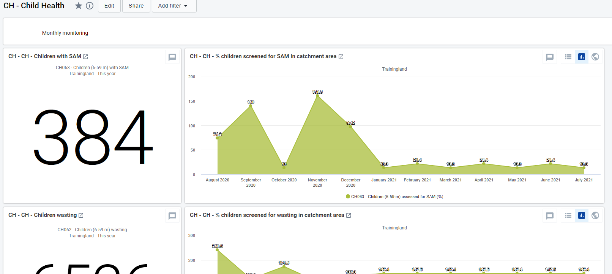

The second part of the dashboard is dedicated to the annual dataset (Annual Household Assessment Indicators). The predefined items analyse and visualize the main areas of the dataset, though the dashboard should be modified to better mirror the local activities.

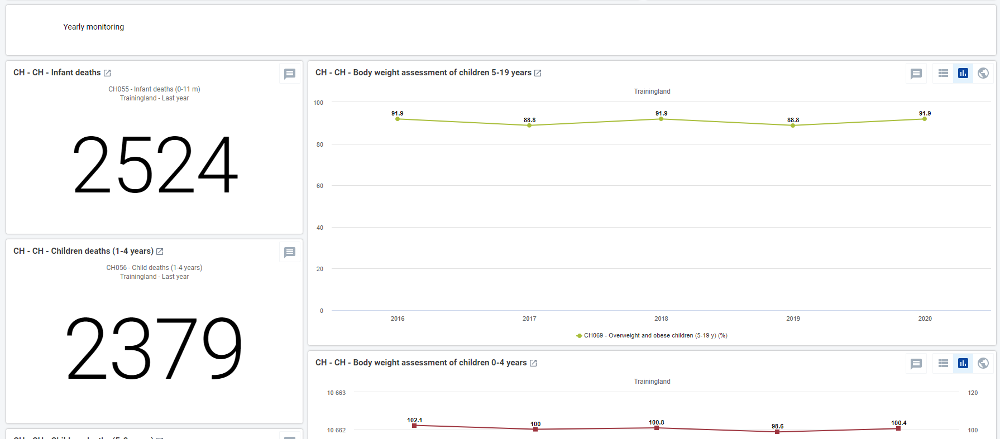
