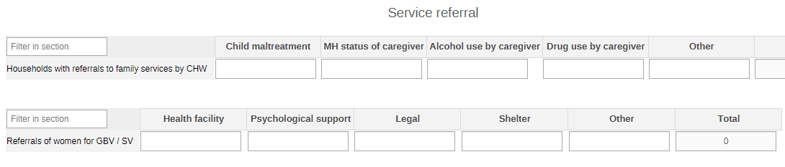
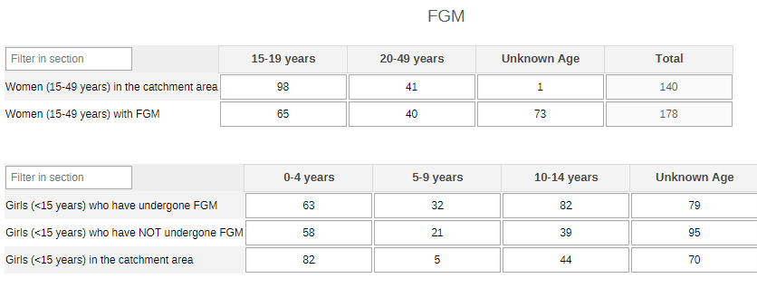
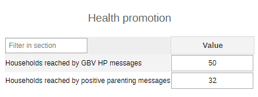
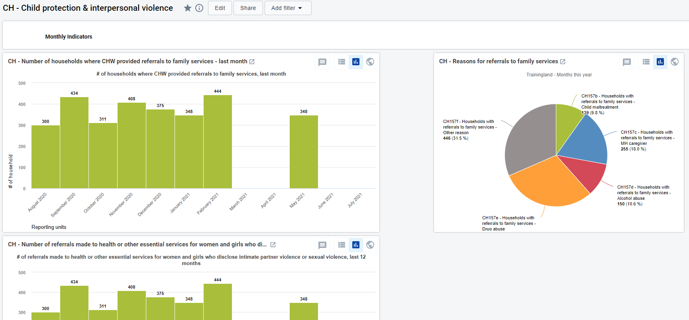
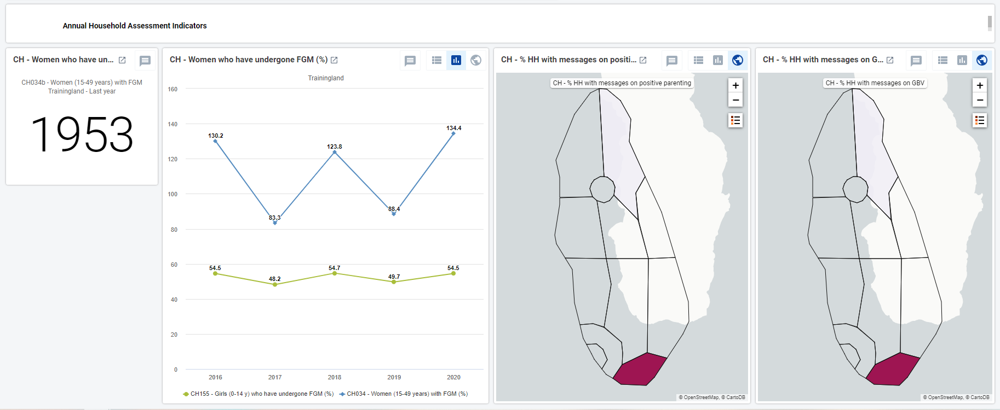

# CH - Child Protection and Interpersonal Violence { #ch-cpiv-aggregate-design }

## 1. Dataset Configuration

### 1.1. Configuration Summary

The aggregate CH - Child Protection and Interpersonal Violence (CPIPV) module includes:

1. A **monthly dataset** with key data elements for child protection and interpersonal violence
2. A **yearly dataset** for the follow up of key annual information on child protection and interpersonal violence
3. **Core indicators** for both datasets
4. A predefined **“CH - Child Protection and Interpersonal Violence” dashboard**

It is recommended that the datasets get assigned to Organisation Units **at the lowest level** of the health system feasible for reporting data, such as Villages or any appropriate community demarcation according to the local context.

### 1.2. Data Elements

The table below summarizes the data elements present in the CPIPV module. The “Data elements groups” and “Datasets” columns will provide extra information on where the same DEs can be found in the other CHIS modules. This should facilitate the mapping of the package among all its modules and navigate the datasets while avoiding the collection and data entry of the same DEs in multiple locations.

All the DEs in the CPIPV module are used in the build up of indicators.

| Name                                                        | Description                                                                                                                                   | Disaggregation              | Data Sets                                                                                             | Data Element Groups                                                                 |
|-------------------------------------------------------------|-----------------------------------------------------------------------------------------------------------------------------------------------|-----------------------------|-------------------------------------------------------------------------------------------------------|-------------------------------------------------------------------------------------|
| CH034a - Women (15-49 years) with FGM                       | Women aged 15-49 years who have undergone FGM                                                                                                 | Age (15-49 years)           | CH - Child protection & interpersonal violence (Yearly); CH - Sexual and Reproductive Health (Yearly) | CH - Sexual and Reproductive Health; CH - Child protection & interpersonal violence |
| CH034b - Women (15-49 years) in the catchment area          | Women (15-49 years) in the catchment area                                                                                                     | Age (15-49 years)           | CH - Sexual and Reproductive Health (Yearly); CH - Child protection & interpersonal violence (Yearly) | CH - Sexual and Reproductive Health; CH - Child protection & interpersonal violence |
| CH153 - Households reached by GBV HP messages               | Households reached with health promotion messages about the impacts of violence against women and where to seek help                          | default                     | CH - Child protection & interpersonal violence (Yearly)                                               | CH - Child protection & interpersonal violence                                      |
| CH154a - Referrals of women for GBV or SV                   | Referrals made to health or other essential services for women and girls who disclose intimate partner violence or sexual violence            | Age (15-50+years)           | CH - Child protection & interpersonal violence (Monthly)                                              | CH - Child protection & interpersonal violence                                      |
| CH154b - Referrals of women for GBV / SV                    | Referrals made to health or other essential services for women and girls who disclose intimate partner violence or sexual violence by service | Service for sexual violence | CH - Child protection & interpersonal violence (Monthly)                                              | CH - Child protection & interpersonal violence                                      |
| CH155a - Girls (0-14 years) who have undergone FGM          | Girls (0-14 years) who have undergone FGM                                                                                                     | Age (<15 years)             | CH - Child protection & interpersonal violence (Yearly)                                               | CH - Child protection & interpersonal violence                                      |
| CH155b - Girls (0-14 years) not undergone FGM               | Girls (0-14 years) who have NOT undergone FGM                                                                                                 | Age (<15 years)             | CH - Child protection & interpersonal violence (Yearly)                                               | CH - Child protection & interpersonal violence                                      |
| CH155c - Girls (0-14 years) in the catchment area           | Girls (0-14 years) in the catchment area                                                                                                      | Age (<15 years)             | CH - Child protection & interpersonal violence (Yearly)                                               | CH - Child protection & interpersonal violence                                      |
| CH156 - Households reached by positive parenting messages   | Households where CHW raised awareness of positive parenting                                                                                   | default                     | CH - Child protection & interpersonal violence (Yearly)                                               | CH - Child protection & interpersonal violence                                      |
| CH157 - Households with referrals to family services by CHW | Households where CHW provided referrals to family services                                                                                    | Referral reasons            | CH - Child protection & interpersonal violence (Monthly)                                              | CH - Child protection & interpersonal violence                                      |

## 2.Dataset Details

### 2.1. Monthly Child Protection and Interpersonal Violence Dataset

#### 2.1.1. Service Referral

The section is set to collect the information necessary to identify the causes of intervention (child maltreatment, MH status of caregiver, alcohol use by caregiver, drugs use by caregiver, other) and the services of referral (health facility, psychological support, legl, shelter, other). The categories can be edited to better mirror the local context.

## 2.2. Yearly Child Protection and Interpersonal Violence Dataset

### 2.2.1. FGM

The section reports the core information on FGM practices in the community. The data are disaggregated by age groups depending on the target population (15-19y, 20-49y, unknown age; or 0-4y, 5-9y, 10-14y, unknown age).

### 2.2.2. Health Promotion

The section provides a very simple overview of the Health promotion sessions among GBV survivors.

## 3. Validation Rules

The following validation rules have been set up for the CPIV datasets:
| name                                                                                               | instruction                                                                                                                | operator              | leftSide description                           | rightSide description                        | Groups                                                                              |
|----------------------------------------------------------------------------------------------------|----------------------------------------------------------------------------------------------------------------------------|-----------------------|------------------------------------------------|----------------------------------------------|-------------------------------------------------------------------------------------|
| CH - Girls aged 0-14 y  who have NOT undergone FGM Vs Girls 0-14 y                                 | Girls aged  0-14 y  who have NOT undergone FGM should be less than or equal to Girls aged  0-14 y                          | less_than_or_equal_to | Girls aged  0-14 y  who have NOT undergone FGM | Girls aged  0-14 y                           | CH - Child protection & interpersonal violence                                      |
| CH - Girls aged  0-14 y who have undergone FGM Vs Girls  0-14 y                                    | Girls aged  0-14 y who have undergone FGM should be less than or equal to Girls aged  0-14 y                               | less_than_or_equal_to | Girls aged  0-14 y who have undergone FGM      | Girls aged  0-14 y                           | CH - Child protection & interpersonal violence                                      |
| CH - Referrals of women and girls on GBV by service Vs Referrals of women and girls on GBV         | Referrals of women and girls on GBV by service should be less than or equal to Referrals of women and girls on GBV         | less_than_or_equal_to | Referrals of women and girls on GBV by service | Referrals of women and girls on GBV          | CH - Child protection & interpersonal violence                                      |
| CH - Women aged 15-49 years who have undergone FGM Vs Women aged 15-49 years in the catchment area | Women aged 15-49 years who have undergone FGM should be less than or equal to Women aged 15-49 years in the catchment area | less_than_or_equal_to | Women aged 15-49 years who have undergone FGM  | Women aged 15-49 years in the catchment area | CH - Sexual and Reproductive Health; CH - Child protection & interpersonal violence |

## 4. Analytics and Indicators

Just as for the DEs, in the table below the column “Indicator Groups” provides information about whether the indicator is found in groups other than the CPIV indicator group.
| name                                                                       | description                                                                                                                                  | Numerator Description                          | Denominator Description                      | Indicator groups                                                                    |   |
|----------------------------------------------------------------------------|----------------------------------------------------------------------------------------------------------------------------------------------|------------------------------------------------|----------------------------------------------|-------------------------------------------------------------------------------------|---|
| CH034b - Women (15-49 years) with FGM                                      | Number of women aged 15-49 years old who have undergone female genital mutilation                                                            | Women aged 15-49 years who have undergone FGM  | 1                                            | CH - Child protection & interpersonal violence                                      |   |
| CH034 - Women (15-49 years) with FGM (%)                                   | Proportion of women aged 15-49 years old who have undergone female genital mutilation                                                        | Women aged 15-49 years who have undergone FGM  | Women aged 15-49 years in the catchment area | CH - Child protection & interpersonal violence; CH - Sexual and Reproductive Health |   |
| CH153 - Households reached by GBV HP messages (%)                          | Proportion of households reached with health promotion messages about the impacts of violence against women and where to seek help           | HHs reached with health promotion on GBV       | Households in the catchment area             | CH - Child protection & interpersonal violence                                      |   |
| CH154 - Women referred for GBV or SV                                       | Number of referrals made to health or other essential services for women and girls who disclose intimate partner violence or sexual violence | Referrals of women and girls on GBV            | 1                                            | CH - Child protection & interpersonal violence                                      |   |
| CH155 - Girls (0-14 y) who have undergone FGM (%)                          | Proportion of girls  (0-14 y)who have undergone female genital mutilation (FGM) or are at risk of FGM                                        | Girls (0-14 y) who have undergone FGM          | Girls (0-14 y)                               | CH - Child protection & interpersonal violence                                      |   |
| CH156 - Households reached by positive parenting messages (%)              | Proportion of households where CHW raised awareness of positive parenting                                                                    | HHs CHW raised awareness of positive parenting | Households in the catchment area             | CH - Child protection & interpersonal violence                                      |   |
| CH157b - Households with referrals to family services - Child maltreatment | Proportion of households where CHW provided referrals to family services due to child maltreatment                                           | HH with child maltreatment                     | 1                                            | CH - Child protection & interpersonal violence                                      |   |
| CH157c - Households with referrals to family services - MH caregiver       | Proportion of households where CHW provided referrals to family services due to the MH status of the caregiver                               | HH with MH unstable status of caregiver        | 1                                            | CH - Child protection & interpersonal violence                                      |   |
| CH157d - Households with referrals to family services - Alcohol abuse      | Proportion of households where CHW provided referrals to family services due to alcohol abuse by the caregiver                               | Alcohol abuse                                  | 1                                            | CH - Child protection & interpersonal violence                                      |   |
| CH157e - Households with referrals to family services - Drug abuse         | Proportion of households where CHW provided referrals to family services due to drug abuse by the caregiver                                  | Drug abuse                                     | 1                                            | CH - Child protection & interpersonal violence                                      |   |
| CH157f - Households with referrals to family services - Other reason       | Proportion of households where CHW provided referrals to family services due to other reasons                                                | Other reason of referral                       | 1                                            | CH - Child protection & interpersonal violence                                      |   |
| CH157 - Households with referrals to family services by CHW (%)            | Proportion of households where CHW provided referrals to family services                                                                     | HHs referred to family services by CHW         | Households in the catchment area             | CH - Child protection & interpersonal violence                                      |   |

## 5. Dashboards

The module includes a predefined dashboard called “CH - Child Protection and Interpersonal Violence”.
The dashboard is divided in two based on the periodicity of the datasets.

The first part is for monthly indicators. The predefined items analyse and visualize the main areas of the dataset, though the dashboard should be modified to better mirror the local activities.

The second part of the dashboard is dedicated to the annual dataset (Annual Household Assessment Indicators). The predefined items analyse and visualize the main areas of the dataset, though the dashboard should be modified to better mirror the local activities.

