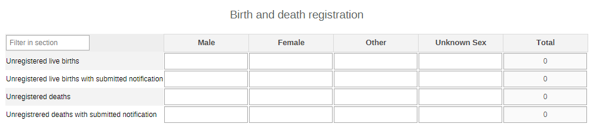
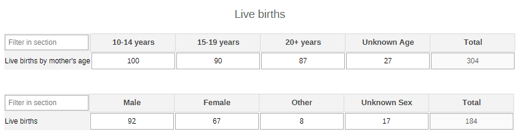
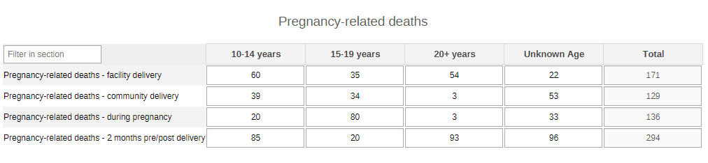
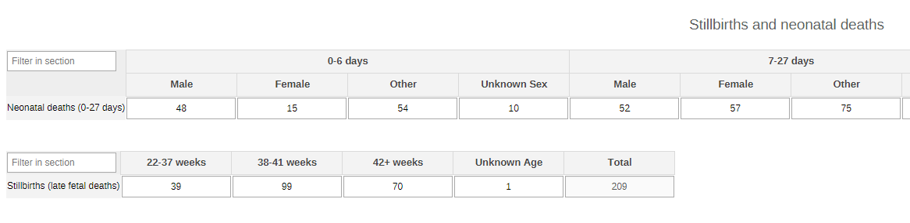
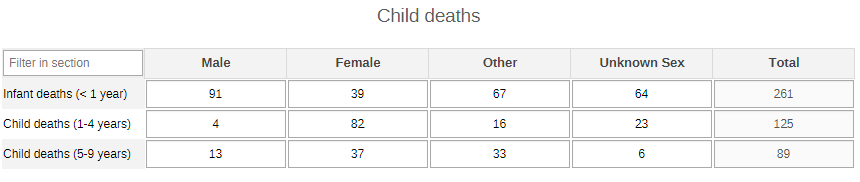
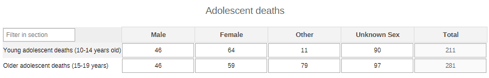
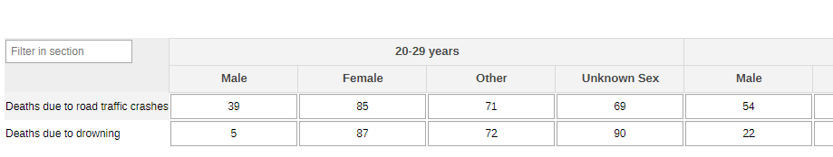
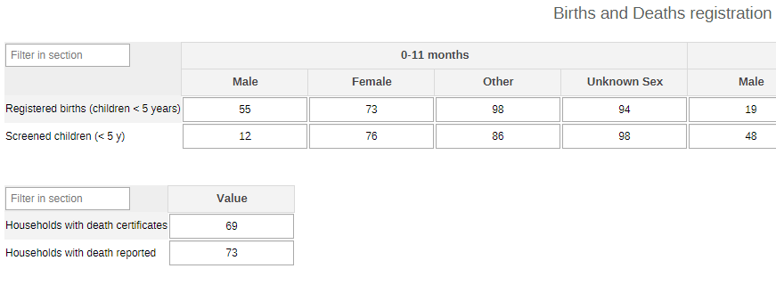
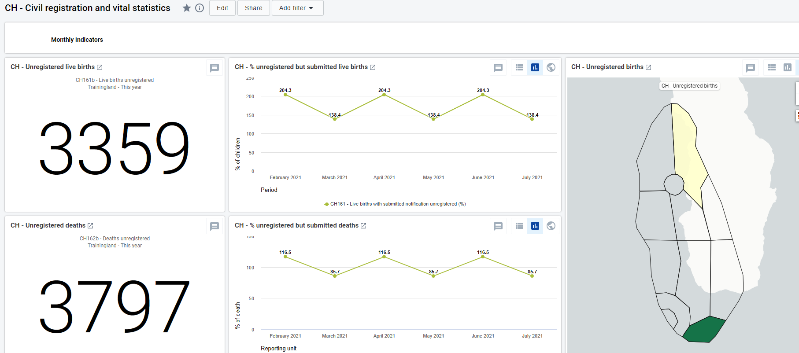

# CH - Civil Registration and Vital Statistics (CRVS) { #ch-crvs-aggregate-design }

## 1. Datasets

## 1.1. Configuration Summary

The aggregate CH - CRVS module includes:

1. A **monthly dataset** with key data elements for CRVS
2. A **yearly dataset** for the follow up of key annual information on CRVS
3. **Core indicators** for both datasets
4. A predefined **“CH - Civil registration and vital statistics” dashboard**

It is recommended that the datasets get assigned to Organisation Units **at the lowest level** of the health system feasible for reporting data, such as Villages or any appropriate community demarcation according to the local context.

### 1.2. Data Elements

The table below summarizes the data elements present in the CRVS module. The “Data elements groups” and “Datasets” columns will provide extra information on where the same DEs can be found in the other CHIS modules. This should facilitate the mapping of the package among all its modules and navigate the datasets while avoiding the collection and data entry of the same DEs in multiple locations.

All the DEs in the CRVS module are used in the build up of indicators.

| Name                                                              | Description                                                                                                         | Datasets                                                                                    | DE groups                                                                                      |
|-------------------------------------------------------------------|---------------------------------------------------------------------------------------------------------------------|---------------------------------------------------------------------------------------------|------------------------------------------------------------------------------------------------|
| CH082 - Young adolescent deaths (10-14 years old)                 | Young adolescent deaths (10-14 years old)                                                                           | CH - Adolescent Health (Yearly), CH - Civil registration and vital statistics (Yearly)      | CH - Civil registration and vital statistics, CH - Adolescent Health                           |
| CH083 - Older adolescent deaths (15-19 years)                     | Older adolescent deaths (15-19 years)                                                                               | CH - Adolescent Health (Yearly), CH - Civil registration and vital statistics (Yearly)      | CH - Civil registration and vital statistics, CH - Adolescent Health                           |
| CH055 - Infant deaths (0-11 m)                                    | Infant deaths (0-11 m)                                                                                              | CH - Child Health (Yearly), CH - Civil registration and vital statistics (Yearly)           | CH - Civil registration and vital statistics, CH - Child Health                                |
| CH056 - Child deaths (1-4 years)                                  | Child deaths (1-4 years)                                                                                            | CH - Child Health (Yearly), CH - Civil registration and vital statistics (Yearly)           | CH - Civil registration and vital statistics, CH - Child Health                                |
| CH057 - Child deaths (5-9 years)                                  | Child deaths (5-9 years)                                                                                            | CH - Child Health (Yearly), CH - Civil registration and vital statistics (Yearly)           | CH - Civil registration and vital statistics, CH - Child Health                                |
| CH161a - Unregistered live births with submitted notification     | Live births not registered for which notification was submitted by CHW to local authorities in the reporting period | CH - Civil registration and vital statistics (Monthly)                                      | CH - Civil registration and vital statistics                                                   |
| CH161b - Unregistered live births                                 | Unregistered live births                                                                                            | CH - Civil registration and vital statistics (Monthly)                                      | CH - Civil registration and vital statistics                                                   |
| CH162a - Unregistered deaths with submitted notification          | Deaths that were not registered for which notification was submitted by CHW to local authorities                    | CH - Civil registration and vital statistics (Monthly)                                      | CH - Civil registration and vital statistics                                                   |
| CH162b - Unregistered deaths                                      | Unregistered deaths                                                                                                 | CH - Civil registration and vital statistics (Monthly)                                      | CH - Civil registration and vital statistics                                                   |
| CH002a - Live births delivered in the community                   | Live births delivered in the community                                                                              | CH - Civil registration and vital statistics (Yearly), CH - Population composition (Yearly) | CH - Population composition, CH - Newborn Health, CH - Civil registration and vital statistics |
| CH002b - Live births delivered in the community (by mother's age) | Live births delivered in the community by age of mother                                                             | CH - Civil registration and vital statistics (Yearly), CH - Population composition (Yearly) | CH - Civil registration and vital statistics, CH - Population composition                      |
| CH044a - Deaths pregnancy-related - during pregnancy              | Deaths pregnancy-related - during pregnancy                                                                         | CH - Civil registration and vital statistics (Yearly), CH - Maternal Health (Yearly)        | CH - Civil registration and vital statistics, CH - Maternal Health                             |
| CH044b - Deaths pregnancy-related - facility delivery             | New pregnancy-related deaths during childbirth at facility                                                          | CH - Civil registration and vital statistics (Yearly), CH - Maternal Health (Yearly)        | CH - Civil registration and vital statistics, CH - Maternal Health                             |
| CH044c - Deaths pregnancy-related - community delivery            | New pregnancy-related deaths during childbirth at community                                                         | CH - Civil registration and vital statistics (Yearly), CH - Maternal Health (Yearly)        | CH - Civil registration and vital statistics, CH - Maternal Health                             |
| CH044d - Deaths pregnancy-related - 2m pre/post delivery          | New pregnancy-related deaths within two months of delivery or end of pregnancy                                      | CH - Civil registration and vital statistics (Yearly), CH - Maternal Health (Yearly)        | CH - Civil registration and vital statistics, CH - Maternal Health                             |
| CH045 - Stillbirths (late fetal deaths)                           | Stillbirths (late fetal deaths)                                                                                     | CH - Civil registration and vital statistics (Yearly), CH - Newborn Health (Yearly)         | CH - Civil registration and vital statistics, CH - Newborn Health                              |
| CH046 - Neonatal deaths (0-27 days)                               | Neonatal deaths (0-27 days)                                                                                         | CH - Civil registration and vital statistics (Yearly), CH - Newborn Health (Yearly)         | CH - Civil registration and vital statistics, CH - Newborn Health                              |
| CH158a - New adult deaths in the reporting period                 | New adult deaths in the reporting period                                                                            | CH - Civil registration and vital statistics (Yearly)                                       | CH - Civil registration and vital statistics                                                   |
| CH159 - Deaths due to road traffic crashes                        | Deaths due to road traffic crashes                                                                                  | CH - Civil registration and vital statistics (Yearly)                                       | CH - Civil registration and vital statistics                                                   |
| CH160a - Deaths due to drowning                                   | Deaths due to drowning                                                                                              | CH - Civil registration and vital statistics (Yearly)                                       | CH - Civil registration and vital statistics                                                   |
| CH163a - Children (0-4 y) registered birth                        | Children aged 0-4 years whose births are registered with the civil authority                                        | CH - Civil registration and vital statistics (Yearly)                                       | CH - Civil registration and vital statistics                                                   |
| CH163b - Children (0-4 y) screened for registration               | Children (0-4 y) screened for registration                                                                          | CH - Civil registration and vital statistics (Yearly)                                       | CH - Civil registration and vital statistics                                                   |
| CH164a - Households with death certificates                       | Households with death certificates                                                                                  | CH - Civil registration and vital statistics (Yearly)                                       | CH - Civil registration and vital statistics                                                   |
| CH164b - Households with death reported                           | Households with death reported                                                                                      | CH - Civil registration and vital statistics (Yearly)                                       | CH - Civil registration and vital statistics                                                   |

## 2. Dataset Details

### 2.1. Monthly CRVS Dataset

#### 2.1.1. Birth and Death Registration

The section is set to collect the information necessary to identify births and deaths in the community on a monthly basis by sex (male, female, other, unknown sex).

## 2.2. Yearly CRVS Dataset

### 2.2.1. Live Births

The section reports the core information on deliveries in the community. The data are disaggregated by age of the mother (10-14y, 15-19y, 20+y, unknown age) and by sex of the child (male, female, other, unknown sex).

### 2.2.2. Pregnancy-related Deaths

The section provides an overview of the women’s deaths during pregnancy and delivery by the age of the mother (10-14y, 15-19y, 20+y, unknown age).

### 2.2.3. Stillbirths and Neonatal Deaths

The section collects the data on neonatal deaths (occurring before the 28th day from birth) by age group (0-6d, 7-27d, unknown age) and by sex (male, female, other, unknown sex); and on stillbirths by gestational week (22-37w, 38-41w, 42+w, unknown age). The lower limit for the stillbirth gestational age has been set at 22 weeks as per international standards. If any other national guidelines have different thresholds (e.g. 20 weeks) the lower threshold can be changed accordingly.

### 2.2.4. Child Deaths

The section collects the data the deaths of children under up tp nine years of age by sex (male, female, other, unknown sex).

### 2.2.5. Adolescent Deaths

The section collects the data on the deaths of adolescent by sex (male, female, other, unknown sex).

### 2.2.6. Adult Deaths

The section collects the data on the number of adult deaths by age groups (20-29y, 30-39y, 40-49y, 50-59y, 60-69y, 70-79y, 80+y, unknown age) and by sex (male, female, other, unknown sex).

### 2.2.7. Deaths Due to Accidents

The adult deaths can also be collected by cause in case there is the need to put the accent on accident-related deaths. The data can be disaggregated by age groups (20-29y, 30-39y, 40-49y, 50-59y, 60-69y, 70-79y, 80+y, unknown age) and by sex (male, female, other, unknown sex).
The causes can be adapted locally to better reflect the context and its leading causes.

### 2.2.8. Birth and Death Registration

The reports the numbers of births that have been reported and registered in the national CRVS by age (0-11m, 1-4y) and sex (male, female, other, unknown sex). The section also includes the totals for deaths reported and certified.

## 3. Validation Rules

The following validation rules have been set up for the CRVS datasets:

| name                                                                                            | instruction                                                                                                             | operator              | leftSide description                               | rightSide description                             |   |
|-------------------------------------------------------------------------------------------------|-------------------------------------------------------------------------------------------------------------------------|-----------------------|----------------------------------------------------|---------------------------------------------------|---|
| CH - Children 0-4 y whose births are registered Vs Children 0-4 y screened for registration     | Children 0-4 y whose births are registered should be less than or equal to Children 0-4 y screened                      | less_than_or_equal_to | Children 0-4 y whose births are registered         | Children aged  0-4 y  screened birth registration |   |
| CH - Deaths not registered notified local authorities Vs Deaths that were not registered        | Deaths not registered notified local authorities should be less than or equal to Deaths that were not registered        | less_than_or_equal_to | Deaths not registered notified local authorities   | Deaths that were not registered                   |   |
| CH - Households with a death certificate for deaths Vs Households with death reported           | Households with a death certificate for deaths should be less than or equal to Households with death reported           | less_than_or_equal_to | Households with a death certificate for deaths     | Households with death reported                    |   |
| CH - Live births delivered by age of mother Vs Live births delivered in the community           | Live births delivered by age of mother should be less than or equal to Live births delivered in the community           | less_than_or_equal_to | Live births delivered by age of mother             | Live births delivered in the community            |   |
| CH - Live births not reg but notified local authorities Vs Live births that were not registered | Live births not reg but notified local authorities should be less than or equal to Live births that were not registered | less_than_or_equal_to | Live births not reg but notified local authorities | Live births that were not registered              |   |

## 4. Analytics and Indicators

Just as for the DEs, in the table below the column “Indicator Groups” provides information about whether the indicator is found in groups other than the CRVS indicator group.

| Name                                                             | Description                                                                                                                       | Numerator                                          | Denominator                          | Indicator Groups                                                          |
|------------------------------------------------------------------|-----------------------------------------------------------------------------------------------------------------------------------|----------------------------------------------------|--------------------------------------|---------------------------------------------------------------------------|
| CH002 - Live births delivered in the community                   | Number of live births                                                                                                             | Live births delivered in the community             | 1                                    | CH - Population composition, CH - Civil registration and vital statistics |
| CH044 - Pregnancy-related deaths                                 | Number of pregnancy-related deaths                                                                                                | Pregnancy-related deaths                           | 1                                    | CH - Maternal Health, CH - Civil registration and vital statistics        |
| CH045 - Stillbirths (late fetal deaths)                          | Number of stillbirths (late fetal deaths) in the community                                                                        | Stillbirths                                        | 1                                    | CH - Newborn Health, CH - Civil registration and vital statistics         |
| CH046 - Neonatal deaths (0-27 days)                              | Number of neonatal deaths (0-27 days) in the community                                                                            | Neonatal deaths (0-27 days)                        | 1                                    | CH - Newborn Health, CH - Civil registration and vital statistics         |
| CH055 - Infant deaths (0-11 m)                                   | Number of new infant deaths (0-11 m)                                                                                              | New infant deaths (0-11 m)                         | 1                                    | CH - Child Health, CH - Civil registration and vital statistics           |
| CH056 - Child deaths (1-4 years)                                 | Number of new child deaths (1-4 years)                                                                                            | New child deaths aged 1-4 years                    | 1                                    | CH - Child Health, CH - Civil registration and vital statistics           |
| CH057 - Child deaths (5-9 years)                                 | Number of new child deaths (5-9 years)                                                                                            | New child deaths aged 5-9 years                    | 1                                    | CH - Child Health, CH - Civil registration and vital statistics           |
| CH082 - Young adolescent deaths (10-14 years old)                | Number of new young adolescent deaths (10-14 years old)                                                                           | New young adolescent aged 10-14 years deaths       | 1                                    | CH - Adolescent Health, CH - Civil registration and vital statistics      |
| CH083 - Older adolescent deaths (15-19 years)                    | Number of new older adolescent deaths (15-19 years)                                                                               | New older adolescent aged 15-19 years deaths       | 1                                    | CH - Adolescent Health, CH - Civil registration and vital statistics      |
| CH158 - New adult deaths in the reporting period                 | Number of adult deaths                                                                                                            | New adult deaths in the reporting period           | 1                                    | CH - Civil registration and vital statistics                              |
| CH159 - Deaths due to road traffic crashes                       | Number of deaths due to road traffic crashes                                                                                      | Deaths due to road traffic crashes                 | 1                                    | CH - Civil registration and vital statistics                              |
| CH160 - Deaths due to drowning                                   | Number of deaths due to drowning                                                                                                  | Deaths due to drowning                             | 1                                    | CH - Civil registration and vital statistics                              |
| CH161b - Live births unregistered                                | Number of unregistered live births                                                                                                | Live births not reg                                | 1                                    | CH - Civil registration and vital statistics                              |
| CH161 - Live births with submitted notification unregistered (%) | Proportion of live births not registered for which notification was submitted by CHW to local authorities in the reporting period | Live births not reg but notified local authorities | Live births that were not registered | CH - Civil registration and vital statistics                              |
| CH162b - Deaths unregistered                                     | Number of unregistered deaths                                                                                                     | Deaths not registered                              | 1                                    | CH - Civil registration and vital statistics                              |
| CH162 - Deaths with submitted notification unregistered (%)      | Proportion of deaths that were not registered for which notification was submitted by CHW to local authorities                    | Deaths not registered notified local authorities   | Deaths that were not registered      | CH - Civil registration and vital statistics                              |
| CH163 - Births (0-4 y) registered (%)                            | Proportion of children 0-4 yrs whose births are registered with the civil authority                                               | Children (0-4 y) whose births are registered       | Children (0-4 y) screened            | CH - Civil registration and vital statistics                              |
| CH164 - Households with death certificates (%)                   | Proportion of deaths that were registered in a timely manner over the reporting period                                            | Households with a death certificate for deaths     | Households with death reported       | CH - Civil registration and vital statistics                              |

## 5. Dashboards

The module includes a predefined dashboard called “CH - Civil registration and vital statistics”.
The dashboard is divided in two based on the periodicity of the datasets.

The first part is for monthly indicators. The predefined items analyse and visualize the main areas of the dataset, though the dashboard should be modified to better mirror the local activities.

The second part of the dashboard is dedicated to the annual dataset (Annual Household Assessment Indicators). The predefined items analyse and visualize the main areas of the dataset, though the dashboard should be modified to better mirror the local activities.

