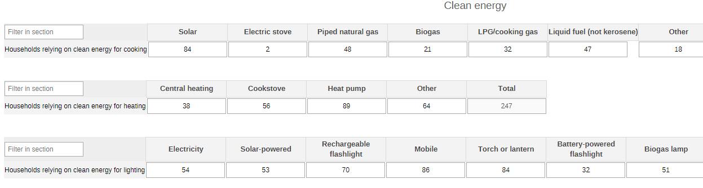
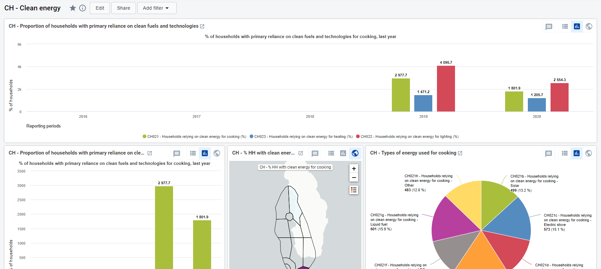

# CH - Clean Energy { #ch-ene-aggregate-design }

## 1. Datasets

### 1.1. Configuration Summary

The aggregate CH - Clean energy (CE) module includes:

1. A yearly dataset for the follow up of key annual information on Clean Energy
2. Core indicators for the dataset
3. A predefined “CH - Clean energy” dashboard

It is recommended that the datasets get assigned to Organisation Units at the lowest level of the health system feasible for reporting data, such as Villages or any appropriate community demarcation according to the local context.

### 1.2. Data Elements

The table below summarizes the data elements present in the CE module. The “Data elements groups” and “Datasets” columns will provide extra information on where the same DEs can be found in the other CHIS modules. This should facilitate the mapping of the package among all its modules and navigate the datasets while avoiding the collection and data entry of the same DEs in multiple locations.

All the DEs in the CE module are used in the build up of indicators.

| Name                                                    | Description                                                                   | Disaggregation      | Data Sets                                                          | Data Element Groups                              |   |
|---------------------------------------------------------|-------------------------------------------------------------------------------|---------------------|--------------------------------------------------------------------|--------------------------------------------------|---|
| CH021 - Households relying on clean energy for cooking  | Households with primary reliance on clean fuels and technologies for cooking  | Energy for cooking  | CH - Clean energy (Yearly); CH - Noncommunicable diseases (Yearly) | CH - Noncommunicable diseases; CH - Clean energy |   |
| CH022 - Households relying on clean energy for lighting | Households with primary reliance on clean fuels and technologies for lighting | Energy for lighting | CH - Clean energy (Yearly)                                         | CH - Clean energy                                |   |
| CH023 - Households relying on clean energy for heating  | Households with primary reliance on clean fuels and technologies for heating  | Energy for heating  | CH - Clean energy (Yearly)                                         | CH - Clean energy                                |   |                                 |

## 2. Dataset Details

### 2.1. Clean Energy

The section is set to collect the information necessary to identify the different sources of energy used in the surveyed households for cooking, heating, and lighting. The cooking data are disaggregated by source (solar, electric stove, piped natural gas, biogas, LPG/cooking gas, liquid fuel, other). The heating data are disaggregated by type (central heating, cookstove, heat pump, other). The lighting data are disaggregated by source of power (electricity, solar power, rechargeable flashlight, mobile, torch/lantern, battery powered flashlight, biogas lamp, LPG lamp, other).

## 3. Validation Rules

There are no validation rules configured for the Clean Energy module.

## 4. Analytics and Indicators

Just as for the DEs, in the table below the column “Indicator Groups” provides information about whether the indicator is found in groups other than the CE indicator group.

| name                                                                                  | description                                                                                                              | Numerator Description                                                         | Denominator Description          | Indicator groups  |   |
|---------------------------------------------------------------------------------------|--------------------------------------------------------------------------------------------------------------------------|-------------------------------------------------------------------------------|----------------------------------|-------------------|---|
| CH021b - Households relying on clean energy for cooking - Solar                       | Proportion of households with primary reliance on clean fuels and technologies for cooking - solar energy                | HHs cooking with solar                                                        | 1                                | CH - Clean energy |   |
| CH021c - Households relying on clean energy for cooking - Electric stove              | Proportion of households with primary reliance on clean fuels and technologies for cooking - electric stove              | HHs cooking with electric stove                                               | 1                                | CH - Clean energy |   |
| CH021d - Households relying on clean energy for cooking - Piped natural gas           | Proportion of households with primary reliance on clean fuels and technologies for cooking - Piped natural gas           | HHs cooking with Piped natural gas                                            | 1                                | CH - Clean energy |   |
| CH021e - Households relying on clean energy for cooking - Biogas                      | Proportion of households with primary reliance on clean fuels and technologies for cooking - Biogas                      | HHs cooking with Biogas                                                       | 1                                | CH - Clean energy |   |
| CH021f - Households relying on clean energy for cooking - LPG                         | Proportion of households with primary reliance on clean fuels and technologies for cooking - LPG / cooking gas           | HHs cooking with LPG                                                          | 1                                | CH - Clean energy |   |
| CH021g - Households relying on clean energy for cooking - Liquid fuel                 | Proportion of households with primary reliance on clean fuels and technologies for cooking - Liquid fuel (not kerosene)  | HHs cooking with Liquid fuel                                                  | 1                                | CH - Clean energy |   |
| CH021h - Households relying on clean energy for cooking - Other                       | Proportion of households with primary reliance on clean fuels and technologies for cooking - Other                       | HHs cooking with other                                                        | 1                                | CH - Clean energy |   |
| CH021 - Households relying on clean energy for cooking (%)                            | Proportion of households with primary reliance on clean fuels and technologies for cooking                               | HHs that rely on clean fuels and tech for cooking                             | Households in the catchment area | CH - Clean energy |   |
| CH022b - Households relying on clean energy for lighting - Electricity                | Proportion of households with primary reliance on clean fuels and technologies for lighting - Electricity                | HHs that rely on clean fuels and tech for lighting Electricity                | 1                                | CH - Clean energy |   |
| CH022c - Households relying on clean energy for lighting - Solar power                | Proportion of households with primary reliance on clean fuels and technologies for lighting - Solar power                | HHs that rely on clean fuels and tech for lighting Solar power                | 1                                | CH - Clean energy |   |
| CH022d - Households relying on clean energy for lighting - Rechargeable flashlight    | Proportion of households with primary reliance on clean fuels and technologies for lighting - Rechargeable flashlight    | HHs that rely on clean fuels and tech for lighting Rechargeable flashlight    | 1                                | CH - Clean energy |   |
| CH022e - Households relying on clean energy for lighting - Mobile                     | Proportion of households with primary reliance on clean fuels and technologies for lighting - Mobile                     | HHs that rely on clean fuels and tech for lighting Mobile                     | 1                                | CH - Clean energy |   |
| CH022f - Households relying on clean energy for lighting - Torch or lantern           | Proportion of households with primary reliance on clean fuels and technologies for lighting - Torch or lantern           | HHs that rely on clean fuels and tech for lighting Torch or lantern           | 1                                | CH - Clean energy |   |
| CH022g - Households relying on clean energy for lighting - Battery-powered flashlight | Proportion of households with primary reliance on clean fuels and technologies for lighting - Battery-powered flashlight | HHs that rely on clean fuels and tech for lighting Battery-powered flashlight | 1                                | CH - Clean energy |   |
| CH022h - Households relying on clean energy for lighting - Biogas lamp                | Proportion of households with primary reliance on clean fuels and technologies for lighting - Biogas lamp                | HHs that rely on clean fuels and tech for lighting Biogas lamp                | 1                                | CH - Clean energy |   |
| CH022 - Households relying on clean energy for lighting (%)                           | Proportion of households with primary reliance on clean fuels and technologies for lighting                              | HHs that rely on clean fuels and tech for lighting                            | Households in the catchment area | CH - Clean energy |   |
| CH022i - Households relying on clean energy for lighting - LPG lamp                   | Proportion of households with primary reliance on clean fuels and technologies for lighting - LPG lamp                   | HHs that rely on clean fuels and tech for lighting LPG lamp                   | 1                                | CH - Clean energy |   |
| CH022l - Households relying on clean energy for lighting - Other                      | Proportion of households with primary reliance on clean fuels and technologies for lighting - Other                      | HHs that rely on clean fuels and tech for lighting Other                      | 1                                | CH - Clean energy |   |
| CH023b - Households relying on clean energy for heating - Central heating             | Number of households with primary reliance on clean fuels and technologies for heating - Central heating                 | HHs that rely on clean fuels and tech for heating - Central heating           | 1                                | CH - Clean energy |   |
| CH023c - Households relying on clean energy for heating - Stove                       | Number of households with primary reliance on clean fuels and technologies for heating - Stove                           | HHs that rely on clean fuels and tech for heating - stove                     | 1                                | CH - Clean energy |   |
| CH023d - Households relying on clean energy for heating - Heat pump                   | Number of households with primary reliance on clean fuels and technologies for heating - Heat pump                       | HHs that rely on clean fuels and tech for heating -Heat pump                  | 1                                | CH - Clean energy |   |
| CH023e - Households relying on clean energy for heating - Other                       | Number of households with primary reliance on clean fuels and technologies for heating - Other                           | HHs that rely on clean fuels and tech for heating -other                      | 1                                | CH - Clean energy |   |
| CH023 - Households relying on clean energy for heating (%)                            | Proportion of households with primary reliance on clean fuels and technologies for heating                               | HHs that rely on clean fuels and tech for heating                             | Households in the catchment area | CH - Clean energy |   |

## 5. Dashboards

The module includes a predefined dashboard called “CH - Clean energy”.

The predefined items analyse and visualize the main areas of the dataset, though the dashboard should be modified to better mirror the local activities.

