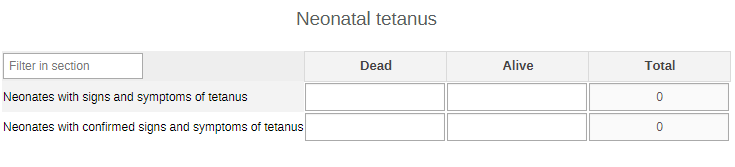
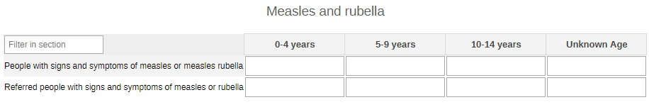
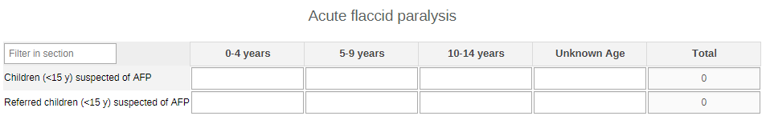
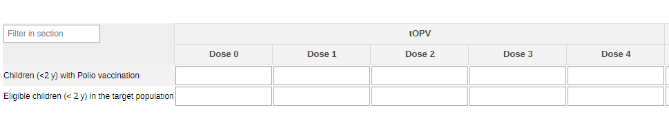
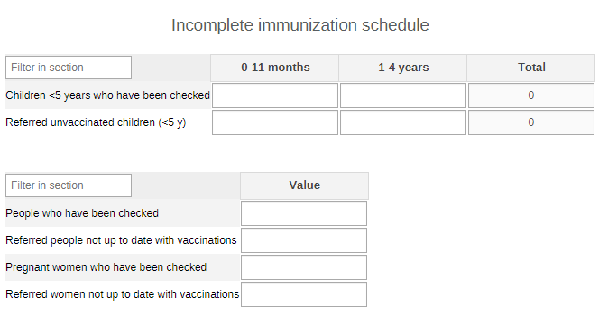
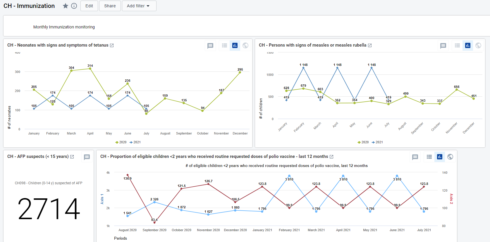
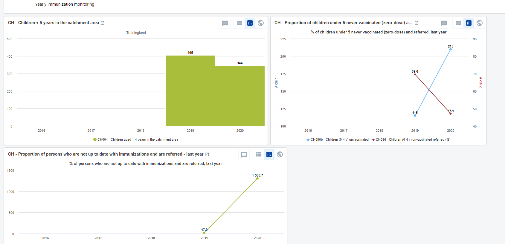

# CH - Immunization { #ch-epi-aggregate-design }

## 1. Datasets

### 1.1. Configuration Summary

The aggregate CH - Immunization module includes:

1. A **monthly dataset** with key data elements for Immunization
2. A **yearly dataset** for the follow up of key annual information on Immunization activities
3. **Core indicators** for both datasets
4. A predefined **“CH - Immunization” dashboard**

It is recommended that the datasets get assigned to Organisation Units **at the lowest level** of the health system feasible for reporting data, such as Villages or any appropriate community demarcation according to the local context.

## 1.2. Data elements

The table below summarizes the data elements present in the Immunization module. The “Data elements groups” and “Datasets” columns will provide extra information on where the same DEs can be found in the other CHIS modules. This should facilitate the mapping of the package among all its modules and navigate the datasets while avoiding the collection and data entry of the same DEs in multiple locations.

All the DEs in the Immunization module are used in the build up of indicators.

| Name                                                                 | Description                                                                                                       | Datasets                                         | DE groups                    |
|----------------------------------------------------------------------|-------------------------------------------------------------------------------------------------------------------|--------------------------------------------------|------------------------------|
| CH095a - People not up to date with vaccinations referred            | Persons who are not up to date with immunizations and referred                                                    | CH - ICCM (Monthly), CH - Immunization (Yearly)  | CH - Immunization, CH - ICCM |
| CH095b - People checked for vaccination                              | People checked for vaccination for vaccination completion                                                         | CH - ICCM (Monthly), CH - Immunization (Yearly)  | CH - Immunization, CH - ICCM |
| CH095c - Women not up to date with vaccinations referred             | Women not up to date with vaccinations referred                                                                   | CH - ICCM (Monthly), CH - Immunization (Yearly)  | CH - Immunization, CH - ICCM |
| CH095d - Pregnant women checked for vaccination                      | Pregnant women checked for vaccination completion                                                                 | CH - ICCM (Monthly), CH - Immunization (Yearly)  | CH - Immunization, CH - ICCM |
| CH096a - Unvaccinated children (0-4 y) referred                      | Children 0-4 years whose parents state they have never been vaccinated, and who are referred                      | CH - ICCM (Monthly), CH - Immunization (Yearly)  | CH - Immunization, CH - ICCM |
| CH096b - Children (0-4 y) checked for vaccination                    | Children (0-4 y) checked for vaccination completion                                                               | CH - ICCM (Monthly), CH - Immunization (Yearly)  | CH - Immunization, CH - ICCM |
| CH100a - Children (0-23 m) with Polio vaccination                    | Eligible children 0-23 mears who received routine requested doses of polio vaccine according to national schedule | CH - ICCM (Monthly), CH - Immunization (Monthly) | CH - Immunization, CH - ICCM |
| CH100b - Children (0-23 m) eligible for OPV in the target population | Children (0-23 m) eligible for OPV in the target population                                                       | CH - ICCM (Monthly), CH - Immunization (Monthly) | CH - Immunization, CH - ICCM |
| CH097a - Neonates with signs and symptoms of tetanus                 | Neonates with signs and symptoms of tetanus                                                                       | CH - Immunization (Monthly)                      | CH - Immunization            |
| CH097b - Neonates with confirmed signs and symptoms of tetanus       | Neonates with confirmed signs and symptoms of tetanus                                                             | CH - Immunization (Monthly)                      | CH - Immunization            |
| CH098a - Children (0-14 y) suspected of AFP                          | Children < 15 years of age with suspicion of acute flaccid paralysis                                              | CH - Immunization (Monthly)                      | CH - Immunization            |
| CH098b - Children (0-14 y) suspected of AFP referred                 | Children < 15 years of age with suspicion of acute flaccid paralysis referred                                     | CH - Immunization (Monthly)                      | CH - Immunization            |
| CH099a - People with signs and symptoms of measles or rubella        | People with signs and symptoms of measles or measles rubella                                                      | CH - Immunization (Monthly)                      | CH - Immunization            |
| CH099b - People with signs of measles or rubella referred            | People with signs of measles or rubella referred                                                                  | CH - Immunization (Monthly)                      | CH - Immunization            |

## 2. Dataset Details

### 2.1. Monthly Immunization Dataset

#### 2.1.1. Neonatal Tetanus

The section is set to collect the basic information on newborns showing danger signs of NNT by outcome (dead or alive).

#### 2.1.2. Measles and Rubella

The section is set to collect the basic information on children <15 years of age suffering from danger signs of measles and/or rubella by age groups (0-4y. 5-9y, 10-14y, unknown age).

#### 2.1.3. Acute Flaccid Paralysis

The section collects data on signs of AFP among children under the age of 15 years by age groups (0-4y. 5-9y, 10-14y, unknown age).

#### 2.1.4. OPV

The section collects data on the type of polio vaccine and the doses administered to eligible children under the age of 2 by type of OPV and dose (0 to 4).

### 2.2.Yearly Immunization Dataset

#### 2.2.1. Incomplete Immunization Schedule

The section collects the data on children under 5 years of age (0-11m, 1-4y), people above the age of 5, and pregnant women whose vaccination schedule is not up to date according to their national guideline.

## 3. Validation Rules

There are no validation rules set up for the Immunization datasets.

## 4. Analytics and Indicators

Just as for the DEs, in the table below the column “Indicator Groups” provides information about whether the indicator is found in groups other than the Immunization indicator group.

| Name                                                         | Description                                                                                                                   | Numerator                                          | Denominator                                             | Indicator Groups                               |
|--------------------------------------------------------------|-------------------------------------------------------------------------------------------------------------------------------|----------------------------------------------------|---------------------------------------------------------|------------------------------------------------|
| CH003 - Infants aged 0-11 months in the catchment area       | Number of infants in the catchment area (0 to less than 1 year old)                                                           | Infants aged 0-11 months in the catchment area     | 1                                                       | CH - Immunization, CH - Population composition |
| CH004 - Children aged 1-4 years in the catchment area        | Number of children in the catchment area (1 to less than 5 years old)                                                         | Children aged 1-4 years in the catchment area      | 1                                                       | CH - Immunization, CH - Population composition |
| CH095 - Referred people not up to date with vaccinations (%) | Proportion of persons who are not up to date with immunizations and are referred                                              | Not up to date with immunizations and referred     | Persons who have been checked                           | CH - Immunization, CH - ICCM                   |
| CH096b - Children (0-4 y) unvaccinated                       | Number of Children (0-4 y) whose parents state they have never been vaccinated                                                | Children (0-4 y) never vaccinated                  | 1                                                       | CH - Immunization                              |
| CH096 - Children (0-4 y) unvaccinated referred (%)           | Proportion of Children 0-4 yrs whose parents state they have never been vaccinated, and who are referred                      | Children (0-4 y) never vaccinated and referred     | Children  (0-4 y) who have been checked for vaccination | CH - Immunization, CH - ICCM                   |
| CH097 - Neonates with signs and symptoms of tetanus          | Detection and reporting of neonatal tetanus                                                                                   | Neonates with signs and symptoms of tetanus        | 1                                                       | CH - Immunization                              |
| CH098 - Children (0-14 y) suspected of AFP                   | Detection and reporting of acute flaccid paralysis among children (0-4 y)                                                     | Children (0-14 y) with signs of AFP                | 1                                                       | CH - Immunization                              |
| CH099 - People with signs and symptoms of measles / rubella  | Detection and reporting of rash and fever for measles or measles/rubella                                                      | Persons with signs of measles or measles rubella   | 1                                                       | CH - Immunization                              |
| CH100b - Children (0-23 y) eligible for Polio vaccine        | Number of eligible children 0-23 y for polio vaccine according to national schedule                                           | Children 0-23 m                                    | 1                                                       | CH - Immunization                              |
| CH100 - Children (0-59 m) vaccinated for polio (%)           | Proportion of eligible children (0-59 m) who received routine requested doses of polio vaccine according to national schedule | Children (0-59 m) who given routine doses of polio | Children (0-59 m) in the target population              | CH - Immunization, CH - ICCM                   |

## 6. Dashboards

The module includes a predefined dashboard called “CH - Immunization”.

The dashboard is divided in two based on the periodicity of the datasets.

The first part is for monthly indicators. The predefined items analyse and visualize the main areas of the dataset, though the dashboard should be modified to better mirror the local activities.

The second part of the dashboard is dedicated to the annual dataset (Annual Household Assessment Indicators). The predefined items analyse and visualize the main areas of the dataset, though the dashboard should be modified to better mirror the local activities.

