# CH - HIV { #ch-hiv-aggregate-design }

## 1. Datasets

### 1.1. Configuration Summary

The aggregate CH - HIV module includes:

1. A **monthly dataset** with key data elements for HIV
2. A **yearly dataset** for the follow up of key annual information on HIV
3. **Core indicators** for both datasets
4. A predefined **“CH - HIV” dashboard**

It is recommended that the datasets get assigned to Organisation Units **at the lowest level** of the health system feasible for reporting data, such as Villages or any appropriate community demarcation according to the local context.

### 1.2. Data Elements

The table below summarizes the data elements present in the HIV module. The “Data elements groups” and “Datasets” columns will provide extra information on where the same DEs can be found in the other CHIS modules. This should facilitate the mapping of the package among all its modules and navigate the datasets while avoiding the collection and data entry of the same DEs in multiple locations.

All the DEs in the HIV module are used in the build up of indicators.

| Name                                                                                  | Description                                                                                                              | Disaggregation                    | Data Sets                                                                                                                                                                                   | Data Element Groups                                                                                                             |   |
|---------------------------------------------------------------------------------------|--------------------------------------------------------------------------------------------------------------------------|-----------------------------------|---------------------------------------------------------------------------------------------------------------------------------------------------------------------------------------------|---------------------------------------------------------------------------------------------------------------------------------|---|
| CH024 - Condoms distributed                                                           | Condoms distributed                                                                                                      | Type of condoms                   | CH - Sexual and Reproductive Health (Yearly); CH - HIV (Yearly)                                                                                                                             | CH - Sexual and Reproductive Health; CH - HIV                                                                                   |   |
| CH027a - Adolescents seeking FP services                                              | Adolescents and young people seeking family planning services from CHW                                                   | Age (10-50+years)                 | CH - Adolescent Health (Monthly); CH - Sexual and Reproductive Health (Monthly); CH - HIV (Monthly)                                                                                         | CH - Sexual and Reproductive Health; CH - Adolescent Health; CH - HIV                                                           |   |
| CH027b - Adolescents seeking FP methods tested for HIV                                | Adolescents and young people seeking family planning services who were tested for HIV by CHW                             | Age (0-50+years)/HIV Results      | CH - Sexual and Reproductive Health (Monthly); CH - HIV (Monthly); CH - Adolescent Health (Monthly)                                                                                         | CH - Sexual and Reproductive Health; CH - Adolescent Health; CH - HIV                                                           |   |
| CH028a - HIV positive tests returned                                                  | HIV tests conducted in which a new HIV-positive result or diagnosis was returned                                         | Age (0-50+years)/Sex (Other/Unk)  | CH - Maternal Health (Yearly); CH - Adolescent Health (Yearly); CH - Sexual and Reproductive Health (Yearly); CH - HIV (Yearly); CH - ICCM (Monthly); CH - Child Health (Yearly)            | CH - Sexual and Reproductive Health; CH - ICCM; CH - Child Health; CH - Maternal Health; CH - Adolescent Health; CH - HIV       |   |
| CH028b - HIV tests returned                                                           | HIV tests returned                                                                                                       | Age (0-50+years)/Sex (Other/Unk)  | CH - HIV (Yearly); CH - Adolescent Health (Yearly); CH - ICCM (Monthly); CH - Sexual and Reproductive Health (Yearly); CH - Maternal Health (Yearly); CH - Child Health (Yearly)            | CH - Sexual and Reproductive Health; CH - ICCM; CH - Child Health; CH - Maternal Health; CH - Adolescent Health; CH - HIV       |   |
| CH028c - HIV positive tests returned to key population                                | HIV tests conducted amongst key population in which a new HIV-positive result or diagnosis was returned                  | Key Population                    | CH - ICCM (Monthly); CH - Adolescent Health (Yearly); CH - Child Health (Yearly); CH - HIV (Yearly); CH - Maternal Health (Yearly); CH - Sexual and Reproductive Health (Yearly)            | CH - Sexual and Reproductive Health; CH - ICCM; CH - Child Health; CH - Maternal Health; CH - Adolescent Health; CH - HIV       |   |
| CH028d - HIV tests returned to key population                                         | HIV tests performed amongst key population where results were returned                                                   | Key Population                    | CH - Child Health (Yearly); CH - Adolescent Health (Yearly); CH - HIV (Yearly); CH - Maternal Health (Yearly); CH - Sexual and Reproductive Health (Yearly); CH - ICCM (Monthly)            | CH - Sexual and Reproductive Health; CH - ICCM; CH - Child Health; CH - Maternal Health; CH - Adolescent Health; CH - HIV       |   |
| CH028e - HIV positive tests returned to TB patients                                   | HIV tests conducted amongst TB in which a new HIV-positive result or diagnosis was returned                              | Type of TB Case                   | CH - HIV (Yearly); CH - Maternal Health (Yearly); CH - Child Health (Yearly); CH - ICCM (Monthly); CH - Sexual and Reproductive Health (Yearly); CH - Adolescent Health (Yearly)            | CH - Sexual and Reproductive Health; CH - ICCM; CH - Child Health; CH - Maternal Health; CH - Adolescent Health; CH - HIV       |   |
| CH028f - HIV tests returned to TB patients                                            | HIV tests performed amongst TB where results were returned                                                               | Type of TB Case                   | CH - ICCM (Monthly); CH - Sexual and Reproductive Health (Yearly); CH - Adolescent Health (Yearly); CH - Maternal Health (Yearly); CH - Child Health (Yearly); CH - HIV (Yearly)            | CH - Sexual and Reproductive Health; CH - ICCM; CH - Child Health; CH - Maternal Health; CH - Adolescent Health; CH - HIV       |   |
| CH030a - Women tested for syphilis - 1st ANC                                          | Women attending 1st ANC visit provided by CHW who were tested for syphilis                                               | Age (10-20+years)                 | CH - Maternal Health (Monthly); CH - Sexual and Reproductive Health (Monthly); CH - HIV (Monthly)                                                                                           | CH - Sexual and Reproductive Health; CH - Maternal Health; CH - HIV                                                             |   |
| CH030b - Women tested for syphilis by CHW - 1st ANC                                   | Women tested for syphilis by CHW - 1st ANC                                                                               | Age (10-20+years)                 | CH - HIV (Monthly); CH - Sexual and Reproductive Health (Monthly); CH - Maternal Health (Monthly)                                                                                           | CH - Sexual and Reproductive Health; CH - Maternal Health; CH - HIV                                                             |   |
| CH030c - Women tested for syphilis - 2nd+ ANC                                         | Women attending other ANC visits provided by CHW who were tested for syphilis                                            | Age (10-20+years)                 | CH - Maternal Health (Monthly); CH - Sexual and Reproductive Health (Monthly); CH - HIV (Monthly)                                                                                           | CH - Sexual and Reproductive Health; CH - Maternal Health; CH - HIV                                                             |   |
| CH030d - Women tested for syphilis by CHW - 2nd+ ANC                                  | Women attending other ANC visits provided by CHW                                                                         | Age (10-20+years)                 | CH - Sexual and Reproductive Health (Monthly); CH - HIV (Monthly); CH - Maternal Health (Monthly)                                                                                           | CH - Sexual and Reproductive Health; CH - Maternal Health; CH - HIV                                                             |   |
| CH031a - Women screened for cervical cancer                                           | Women screened for cervical cancer                                                                                       | Age (10-50+years)                 | CH - Sexual and Reproductive Health (Yearly); CH - Noncommunicable diseases (Yearly); CH - HIV (Yearly)                                                                                     | CH - Sexual and Reproductive Health; CH - Noncommunicable diseases; CH - HIV                                                    |   |
| CH031b - Women who should have had a screening test for cervical cancer               | Women who should have had a screening test for cervical cancer                                                           | Age (10-50+years)                 | CH - Noncommunicable diseases (Yearly); CH - Sexual and Reproductive Health (Yearly); CH - HIV (Yearly)                                                                                     | CH - Sexual and Reproductive Health; CH - Noncommunicable diseases; CH - HIV                                                    |   |
| CH041a - People assessed for MNS disorders/ MH conditions                             | People assessed for MNS disorders/ MH conditions                                                                         | Age (10-70+years)/Sex (Other/Unk) | CH - Tuberculosis (Monthly); CH - Maternal Health (Monthly); CH - HIV (Monthly); CH - Mental health (Monthly); CH - Adolescent Health (Monthly); CH - Neglected tropical diseases (Monthly) | CH - Mental health; CH - Neglected tropical diseases; CH - Maternal Health; CH - Adolescent Health; CH - HIV; TB - Tuberculosis |   |
| CH041b - People with possible MNS symptoms                                            | People with possible MNS symptoms                                                                                        | Age (10-70+years)/Sex (Other/Unk) | CH - Tuberculosis (Monthly); CH - Maternal Health (Monthly); CH - Neglected tropical diseases (Monthly); CH - HIV (Monthly); CH - Mental health (Monthly); CH - Adolescent Health (Monthly) | CH - Mental health; CH - Neglected tropical diseases; CH - Maternal Health; CH - Adolescent Health; CH - HIV; TB - Tuberculosis |   |
| CH041c - People assessed for MNS disorders/ MH conditions                             | People assessed for MNS disorders/mental health conditions by type                                                       | Mental health conditions          | CH - Adolescent Health (Monthly); CH - Tuberculosis (Monthly); CH - Neglected tropical diseases (Monthly); CH - Maternal Health (Monthly); CH - HIV (Monthly); CH - Mental health (Monthly) | CH - Mental health; CH - Neglected tropical diseases; CH - Maternal Health; CH - Adolescent Health; CH - HIV; TB - Tuberculosis |   |
| CH041d - People with possible MNS symptoms                                            | People with possible symptoms of MNS conditions                                                                          | Mental health conditions          | CH - Tuberculosis (Monthly); CH - HIV (Monthly); CH - Maternal Health (Monthly); CH - Adolescent Health (Monthly); CH - Mental health (Monthly); CH - Neglected tropical diseases (Monthly) | CH - Mental health; CH - Neglected tropical diseases; CH - Maternal Health; CH - Adolescent Health; CH - HIV; TB - Tuberculosis |   |
| CH041e - Women assessed for MNS disorders/ MH conditions                              | Women and adolescent girls assessed for MNS disorders / MH conditions                                                    | Pregnant/Postpartum               | CH - Tuberculosis (Monthly); CH - Maternal Health (Monthly); CH - Neglected tropical diseases (Monthly); CH - Adolescent Health (Monthly); CH - Mental health (Monthly); CH - HIV (Monthly) | CH - Mental health; CH - Neglected tropical diseases; CH - Maternal Health; CH - Adolescent Health; CH - HIV; TB - Tuberculosis |   |
| CH041f - Women with possible MNS symptoms                                             | Women and adolescent girls with possible MNS symptoms                                                                    | Pregnant/Postpartum               | CH - Tuberculosis (Monthly); CH - Maternal Health (Monthly); CH - Neglected tropical diseases (Monthly); CH - Adolescent Health (Monthly); CH - HIV (Monthly); CH - Mental health (Monthly) | CH - Mental health; CH - Neglected tropical diseases; CH - Maternal Health; CH - Adolescent Health; CH - HIV; TB - Tuberculosis |   |
| CH042a - People  with MNS disorders referred                                          | People with MNS disorders referred                                                                                       | Age (10-70+years)/Sex (Other/Unk) | CH - Neglected tropical diseases (Monthly); CH - Adolescent Health (Monthly); CH - HIV (Monthly); CH - Maternal Health (Monthly); CH - Tuberculosis (Monthly); CH - Mental health (Monthly) | CH - Mental health; CH - Neglected tropical diseases; CH - Maternal Health; CH - Adolescent Health; CH - HIV; TB - Tuberculosis |   |
| CH042b - People with MNS disorders referred by type                                   | People with MNS disorders referred by type                                                                               | Mental health conditions          | CH - HIV (Monthly); CH - Mental health (Monthly); CH - Adolescent Health (Monthly); CH - Tuberculosis (Monthly); CH - Neglected tropical diseases (Monthly); CH - Maternal Health (Monthly) | CH - Mental health; CH - Neglected tropical diseases; CH - Maternal Health; CH - Adolescent Health; CH - HIV; TB - Tuberculosis |   |
| CH042c - Women with MNS disorders referred                                            | Women and adolescent girls with MNS disorders/mental health conditions referred                                          | Pregnant/Postpartum               | CH - Tuberculosis (Monthly); CH - HIV (Monthly); CH - Maternal Health (Monthly); CH - Mental health (Monthly); CH - Adolescent Health (Monthly); CH - Neglected tropical diseases (Monthly) | CH - Mental health; CH - Neglected tropical diseases; CH - Maternal Health; CH - Adolescent Health; CH - HIV; TB - Tuberculosis |   |
| CH043a - People with MNS disorders receiving services                                 | People with MNS disorders/mental health conditions receiving services                                                    | Age (10-70+years)/Sex (Other/Unk) | CH - Mental health (Yearly); CH - HIV (Yearly); CH - Maternal Health (Yearly); CH - Neglected tropical diseases (Yearly); CH - Adolescent Health (Yearly); CH - Tuberculosis (Yearly)       | CH - Mental health; CH - Neglected tropical diseases; CH - Maternal Health; CH - Adolescent Health; CH - HIV; TB - Tuberculosis |   |
| CH043b - People assessed for MNS disorders                                            | People assessed for MNS disorders/mental health conditions                                                               | Age (10-70+years)/Sex (Other/Unk) | CH - Adolescent Health (Yearly); CH - Tuberculosis (Yearly); CH - Mental health (Yearly); CH - Maternal Health (Yearly); CH - HIV (Yearly); CH - Neglected tropical diseases (Yearly)       | CH - Mental health; CH - Neglected tropical diseases; CH - Maternal Health; CH - Adolescent Health; CH - HIV; TB - Tuberculosis |   |
| CH043c - People with MNS disorders receiving services - MH awareness                  | People with MNS disorders/mental health conditions receiving services - mental health awareness                          | default                           | CH - Neglected tropical diseases (Yearly); CH - Mental health (Yearly); CH - Tuberculosis (Yearly); CH - Adolescent Health (Yearly); CH - Maternal Health (Yearly); CH - HIV (Yearly)       | CH - Mental health; CH - Neglected tropical diseases; CH - Maternal Health; CH - Adolescent Health; CH - HIV; TB - Tuberculosis |   |
| CH043d - People with MNS disorders receiving services - MH HP                         | People with MNS disorders/mental health conditions receiving services - mental health promotion and prevention           | default                           | CH - Tuberculosis (Yearly); CH - Mental health (Yearly); CH - Maternal Health (Yearly); CH - Neglected tropical diseases (Yearly); CH - Adolescent Health (Yearly); CH - HIV (Yearly)       | CH - Mental health; CH - Neglected tropical diseases; CH - Maternal Health; CH - Adolescent Health; CH - HIV; TB - Tuberculosis |   |
| CH043e - People with MNS disorders receiving services - MH support                    | People with MNS disorders/mental health conditions receiving services - support for people with mental health conditions | default                           | CH - Maternal Health (Yearly); CH - Neglected tropical diseases (Yearly); CH - HIV (Yearly); CH - Mental health (Yearly); CH - Tuberculosis (Yearly); CH - Adolescent Health (Yearly)       | CH - Mental health; CH - Neglected tropical diseases; CH - Maternal Health; CH - Adolescent Health; CH - HIV; TB - Tuberculosis |   |
| CH043f - People with MNS disorders receiving services - recovery/rehab                | People with MNS disorders/mental health conditions receiving services - recovery and rehabilitation                      | default                           | CH - Adolescent Health (Yearly); CH - Tuberculosis (Yearly); CH - Neglected tropical diseases (Yearly); CH - HIV (Yearly); CH - Maternal Health (Yearly); CH - Mental health (Yearly)       | CH - Mental health; CH - Neglected tropical diseases; CH - Maternal Health; CH - Adolescent Health; CH - HIV; TB - Tuberculosis |   |
| CH043g - Women with MNS disorders receiving services                                  | Women and adolescent girls with MNS disorders/mental health conditions receiving services                                | Pregnant/Postpartum               | CH - Mental health (Yearly); CH - Tuberculosis (Yearly); CH - Maternal Health (Yearly); CH - HIV (Yearly); CH - Neglected tropical diseases (Yearly); CH - Adolescent Health (Yearly)       | CH - Mental health; CH - Neglected tropical diseases; CH - Maternal Health; CH - Adolescent Health; CH - HIV; TB - Tuberculosis |   |
| CH043h - Women assessed for MNS disorders                                             | Women and adolescent girls assessed for MNS disorders/mental health conditions                                           | Pregnant/Postpartum               | CH - Neglected tropical diseases (Yearly); CH - Tuberculosis (Yearly); CH - Mental health (Yearly); CH - Adolescent Health (Yearly); CH - Maternal Health (Yearly); CH - HIV (Yearly)       | CH - Mental health; CH - Neglected tropical diseases; CH - Maternal Health; CH - Adolescent Health; CH - HIV; TB - Tuberculosis |   |
| CH079a - People (>18 m) referred for HIV testing                                      | People (>18 m) referred for HIV testing                                                                                  | Age (0-50+years)/Sex (Other/Unk)  | CH - HIV (Yearly); CH - ICCM (Monthly); CH - Child Health (Yearly)                                                                                                                          | CH - ICCM; CH - Child Health; CH - HIV                                                                                          |   |
| CH079b - People (>18 m) in the catchment area                                         | People (>18 m) in the catchment area                                                                                     | Age (0-50+years)/Sex (Other/Unk)  | CH - Child Health (Yearly); CH - ICCM (Monthly); CH - HIV (Yearly)                                                                                                                          | CH - ICCM; CH - Child Health; CH - HIV                                                                                          |   |
| CH101a - Infants (0-59 days) referred for HIV test                                    | Infants who were referred for an HIV test within two months of birth                                                     | default                           | CH - HIV (Monthly)                                                                                                                                                                          | CH - HIV                                                                                                                        |   |
| CH101b - Pregnant women PLWHA giving birth                                            | Pregnant women living with HIV giving birth in the past 12 months in the catchment area                                  | default                           | CH - HIV (Monthly)                                                                                                                                                                          | CH - HIV                                                                                                                        |   |
| CH102a - Individual HIVST kits distributed                                            | Individual HIVST kits distributed                                                                                        | Age (10-50+years)/Sex (Other/Unk) | CH - HIV (Yearly)                                                                                                                                                                           | CH - HIV                                                                                                                        |   |
| CH102b - Individual HIVST kits distributed to key population                          | Individual HIVST kits distributed to key population                                                                      | Key Population                    | CH - HIV (Yearly)                                                                                                                                                                           | CH - HIV                                                                                                                        |   |
| CH103a - Index cases offered partner services                                         | Index cases offered partner services                                                                                     | Age (0-50+years)/Sex (Other/Unk)  | CH - HIV (Yearly)                                                                                                                                                                           | CH - HIV                                                                                                                        |   |
| CH103b - Index cases accepting partner services                                       | Index cases accepting partner services                                                                                   | Age (0-50+years)/Sex (Other/Unk)  | CH - HIV (Yearly)                                                                                                                                                                           | CH - HIV                                                                                                                        |   |
| CH103c - Partners of index cases whose information is elicited from index cases       | Partners of index cases whose information is elicited from index cases                                                   | Age (0-50+years)/Sex (Other/Unk)  | CH - HIV (Yearly)                                                                                                                                                                           | CH - HIV                                                                                                                        |   |
| CH103d - Partners of index cases who received HTS                                     | Partners of index cases who received HTS                                                                                 | Age (0-50+years)/Sex (Other/Unk)  | CH - HIV (Yearly)                                                                                                                                                                           | CH - HIV                                                                                                                        |   |
| CH103e - Partners of index cases who received HTS  by status                          | Partners of index cases who received HTS  by status                                                                      | HIV Status                        | CH - HIV (Yearly)                                                                                                                                                                           | CH - HIV                                                                                                                        |   |
| CH103f - Key population index cases offered partner services                          | Index cases who are key population and offered partner services                                                          | Key Population                    | CH - HIV (Yearly)                                                                                                                                                                           | CH - HIV                                                                                                                        |   |
| CH104a - People receiving oral PrEP at least once                                     | People receiving oral PrEP at least once                                                                                 | Age (0-50+years)/Sex (Other/Unk)  | CH - HIV (Monthly)                                                                                                                                                                          | CH - HIV                                                                                                                        |   |
| CH104b - People on PrEP receiving CHW counselling                                     | People who received oral PrEP at least once who were supported and counselled by CHW                                     | Age (0-50+years)/Sex (Other/Unk)  | CH - HIV (Monthly)                                                                                                                                                                          | CH - HIV                                                                                                                        |   |
| CH104c - Key population receiving oral PrEP at least once                             | People who received oral PrEP at least once who are key population                                                       | Key Population                    | CH - HIV (Monthly)                                                                                                                                                                          | CH - HIV                                                                                                                        |   |
| CH105a - PLWHA ART Dropouts                                                           | PLWHA on ART at last period who were not on Tx at the end of the this reporting period                                   | Age (0-50+years)/Sex (Other/Unk)  | CH - HIV (Yearly)                                                                                                                                                                           | CH - HIV                                                                                                                        |   |
| CH105b - PLWHA newly initiated on ART                                                 | PLWHA newly initiated on ART this period who were not on Tx at the end of the this reporting period                      | Age (0-50+years)/Sex (Other/Unk)  | CH - HIV (Yearly)                                                                                                                                                                           | CH - HIV                                                                                                                        |   |
| CH105c - PLWHA on ART at the end of the last reporting period                         | PLWHA on ART at the end of the last reporting period                                                                     | Age (0-50+years)/Sex (Other/Unk)  | CH - HIV (Yearly)                                                                                                                                                                           | CH - HIV                                                                                                                        |   |
| CH105d - Key population PLWHA on ART at the end of the last reporting period          | Key population PLWHA on ART at the end of the last reporting period                                                      | Key Population                    | CH - HIV (Yearly)                                                                                                                                                                           | CH - HIV                                                                                                                        |   |
| CH106a -  PLWHA on ART in the reporting period                                        | PLWHA newly initiated on ART during the current reporting period                                                         | Age (0-50+years)/Sex (Other/Unk)  | CH - HIV (Monthly)                                                                                                                                                                          | CH - HIV                                                                                                                        |   |
| CH106b - People with Known HIV status in catchment area                               | PLWHA who know their HIV status in the catchment area                                                                    | Age (0-50+years)/Sex (Other/Unk)  | CH - HIV (Monthly)                                                                                                                                                                          | CH - HIV                                                                                                                        |   |
| CH106c - Key population on ART in the reporting period                                | PLWHA newly initiated on ART during the current reporting period who are key population                                  | Key Population                    | CH - HIV (Monthly)                                                                                                                                                                          | CH - HIV                                                                                                                        |   |
| CH106d - Key population with known HIV status in catchment area                       | PLWHA who know their HIV status in the catchment area who are key population                                             | Key Population                    | CH - HIV (Monthly)                                                                                                                                                                          | CH - HIV                                                                                                                        |   |
| CH107a - Key population avoiding health care due to stigma and discrimination         | Key population avoiding health care due to stigma and discrimination                                                     | Age (10-50+years)                 | CH - HIV (Yearly)                                                                                                                                                                           | CH - HIV                                                                                                                        |   |
| CH107b - Key population avoiding health care due to stigma and discrimination by type | Key population avoiding health care due to stigma and discrimination by type                                             | Key Population                    | CH - HIV (Yearly)                                                                                                                                                                           | CH - HIV                                                                                                                        |   |
| CH107c - Key population assessed on stigma and discrimination                         | Key population assessed on stigma and discrimination                                                                     | Key Population                    | CH - HIV (Yearly)                                                                                                                                                                           | CH - HIV                                                                                                                        |   |
| CH108a - PLWHA avoiding health care due to stigma and discrimination                  | PLWHA avoiding health care due to stigma and discrimination                                                              | Age (10-50+years)                 | CH - HIV (Yearly)                                                                                                                                                                           | CH - HIV                                                                                                                        |   |
| CH108b - PLWHA assessed on stigma and discrimination                                  | PLWHA assessed on stigma and discrimination                                                                              | Age (10-50+years)                 | CH - HIV (Yearly)                                                                                                                                                                           | CH - HIV                                                                                                                        |   |
| CH109a - People eligible referred for economic support                                | Eligible people referred for economic (livelihood) support by a CHW                                                      | Age (0-50+years)/Sex (Other/Unk)  | CH - Tuberculosis (Monthly); CH - HIV (Monthly); CH - People-centred services (Monthly)                                                                                                     | CH - People-centred services; CH - HIV; TB - Tuberculosis                                                                       |   |
| CH109b - People eligible for economic support in catchment area                       | People eligible in the catchment area for economic (livelihood) support                                                  | Age (0-50+years)/Sex (Other/Unk)  | CH - Tuberculosis (Monthly); CH - People-centred services (Monthly); CH - HIV (Monthly)                                                                                                     | CH - People-centred services; CH - HIV; TB - Tuberculosis                                                                       |   |
| CH109c - People eligible for economic support referred                                | Eligible people referred for economic (livelihood) support by a CHW by condition                                         | Condition for support             | CH - HIV (Monthly); CH - Tuberculosis (Monthly); CH - People-centred services (Monthly)                                                                                                     | CH - People-centred services; CH - HIV; TB - Tuberculosis                                                                       |   |
| CH109d - People eligible for economic support by condition                            | Eligible people in the catchment area for economic (livelihood) support by condition                                     | Condition for support             | CH - People-centred services (Monthly); CH - HIV (Monthly); CH - Tuberculosis (Monthly)                                                                                                     | CH - People-centred services; CH - HIV; TB - Tuberculosis                                                                       |   |
| CH110a - People eligible that receive(d) any form of economic support                 | People eligible that receive(d) any form of economic support                                                             | Age (0-50+years)/Sex (Other/Unk)  | CH - HIV (Yearly); CH - Tuberculosis (Yearly); CH - People-centred services (Yearly)                                                                                                        | CH - People-centred services; CH - HIV; TB - Tuberculosis                                                                       |   |
| CH110b - People eligible that receive(d) any form of economic support                 | People eligible that receive(d) any form of economic support                                                             | Age (0-50+years)/Sex (Other/Unk)  | CH - HIV (Yearly); CH - Tuberculosis (Yearly); CH - People-centred services (Yearly)                                                                                                        | CH - People-centred services; CH - HIV; TB - Tuberculosis                                                                       |   |
| CH111a -  People eligible referred for legal services                                 | People eligible referred for legal services                                                                              | Age (0-50+years)/Sex (Other/Unk)  | CH - People-centred services (Monthly); CH - Tuberculosis (Monthly); CH - HIV (Monthly)                                                                                                     | CH - People-centred services; CH - HIV; TB - Tuberculosis                                                                       |   |
| CH111b - People eligible for legal services  in the catchment area                    | People eligible for legal services  in the catchment area                                                                | Age (0-50+years)/Sex (Other/Unk)  | CH - Tuberculosis (Monthly); CH - HIV (Monthly); CH - People-centred services (Monthly)                                                                                                     | CH - People-centred services; CH - HIV; TB - Tuberculosis                                                                       |   |
| CH111c - People eligible referred for legal services                                  | People eligible referred for legal services by a CHW by condition                                                        | Condition for support             | CH - People-centred services (Monthly); CH - Tuberculosis (Monthly); CH - HIV (Monthly)                                                                                                     | CH - People-centred services; CH - HIV; TB - Tuberculosis                                                                       |   |
| CH111d - People eligible for legal services by condition                              | People eligible in the catchment area for legal services by condition                                                    | Condition for support             | CH - HIV (Monthly); CH - People-centred services (Monthly); CH - Tuberculosis (Monthly)                                                                                                     | CH - People-centred services; CH - HIV; TB - Tuberculosis                                                                       |   |
| CH112a - People eligible that receive(d) any form of legal services                   | People eligible that receive(d) any form of legal services                                                               | Age (0-50+years)/Sex (Other/Unk)  | CH - Tuberculosis (Yearly); CH - HIV (Yearly); CH - People-centred services (Yearly)                                                                                                        | CH - People-centred services; CH - HIV; TB - Tuberculosis                                                                       |   |
| CH112b - People eligible that receive(d) any form of legal services by condition      | People eligible that receive(d) any form of legal services by condition                                                  | Condition for support             | CH - Tuberculosis (Yearly); CH - People-centred services (Yearly); CH - HIV (Yearly)                                                                                                        | CH - People-centred services; CH - HIV; TB - Tuberculosis                                                                       |   |

## 2.Dataset Details

### 2.1. Monthly HIV Dataset

#### 2.1.1. Family Planning & HIV

The section is set to collect the information necessary to identify the people of reproductive age accessing the service by age group (10-14y, 15-19y); and being tested for HIV by age group (10-14y, 15-19y) and by sex (male, female, other, unknown sex).

The category combinations for the age groups have age groups that go beyond the [WHO definition of adolescents](https://www.who.int/southeastasia/health-topics/adolescent-health)  “WHO defines 'Adolescents' as individuals in the 10-19 years age group and 'Youth' as the 15-24 year age group. While 'Young People' covers the age range 10-24 years” . This has been done to avoid creating ad hoc age groups for each and every dataset. The age groups above the definition of Adolescent have been greyed-out and therefore blocked for data entry. Countries should nonetheless edit and apply the age categories that better reflect the local context and guidelines.

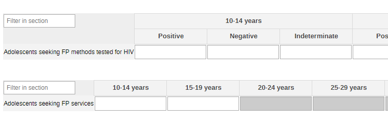

#### 2.1.2. Syphilis Screening

The section is set to collect the information necessary to identify women suffering from syphilis during their ANC visits. The data is disaggregated by age group (10-14y, 15-19y, 20+, unknown age).

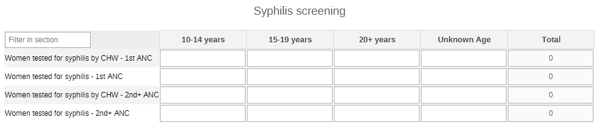

#### 2.1.3. Mental health disorders/conditions - All

The section is set to collect the information on the MH of the people accessing HIV services in the community. The data is disaggregated by age groups (10-14, 15-19y, 20-39y, 40-49y, 50-59y, 60-69y, 70+, unknown age) and by sex (male, female, other, unknown sex).

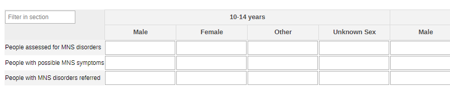

#### 2.1.4. Mental Health Disorders/conditions - by Type

The section collects the numbers of he MH assessment by MH condition/disorder (depression, psychoses, mental and behavioural conditions, dementia, substance use, drug use, other).

#### 2.1.5. Mental Health Disorders/conditions - Pregnant and Postpartum

The section is dedicated to the MH assessments to women disaggregated by pregnancy status (pregnant and postpartum)

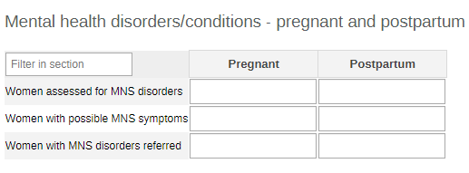

#### 2.1.6. Infant Testing

The section is set to collect the information on accessibility of HIV for infants during the first two months of life.

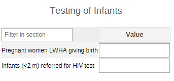

#### 2.1.7. PrEP

The section is set to collect the information on PrEP uptake within the target community. The data are disaggregated by key population (MSM, SW, prisoners, IDU, TG, other); and by age group (0-4y, 5-9y, 10-14y, 15-19y, 20-24y, 25-29y, 30-34y, 35-39y, 40-44y, 45-49y 50+y, unknown age) and sex (male, female, other, unknown sex) among the general population.

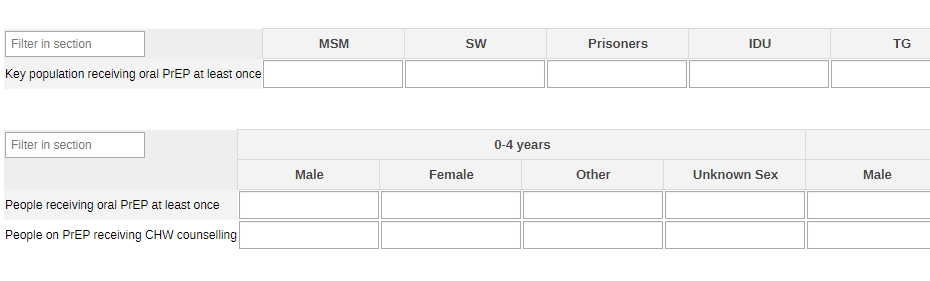

#### 2.1.8. ART

The section is set to collect the information on ART cohorts by key populations (MSM, SW, prisoners, IDU, TG, other), and by age group (0-4y, 5-9y, 10-14y, 15-19y, 20-24y, 25-29y, 30-34y, 35-39y, 40-44y, 45-49y 50+y, unknown age) and sex (male, female, other, unknown sex) among the general population.

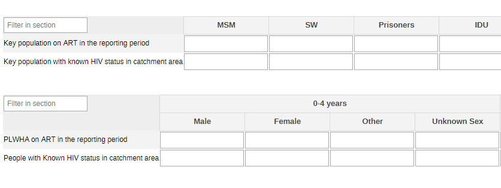

#### 2.1.9. Legal and Economic Support

The section is set to collect the information on people who are eligible for economic and legal support within the HIV population of the targeted community. The first table divides the people and by age group (0-4y, 5-9y, 10-14y, 15-19y, 20-24y, 25-29y, 30-34y, 35-39y, 40-44y, 45-49y 50+y, unknown age) and sex (male, female, other, unknown sex), while the second by condition (HIV, TB, NTDs, other). The category can be changed to better represent the local context.

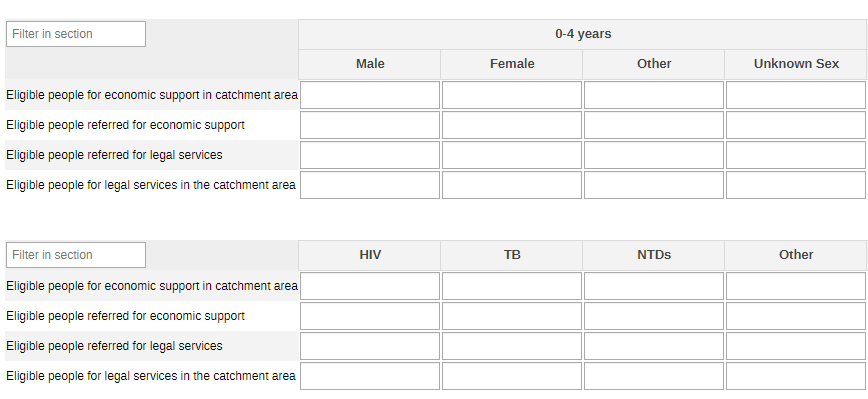

### 2.2. Yearly HIV Dataset

#### 2.2.1. Condom Distribution

A quick count of the female and male condoms distributed in the community.

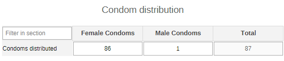

#### 2.2.2. HIV Tests - All

The section collects the total number of returned tests and positive test results by age group (0-4y, 5-9y, 10-14y, 15-19y, 20-24y, 25-29y, 30-34y, 35-39y, 40-44y, 45-49y 50+y, unknown age) and sex (male, female, other, unknown sex).

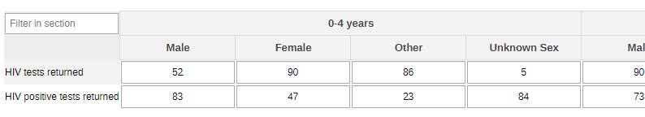

#### 2.2.3. HIV Tests - Key Population

A quick count of the number of tests performed and with positive results by key populations (MSM, SW, prisoners, IDU, TG, other).

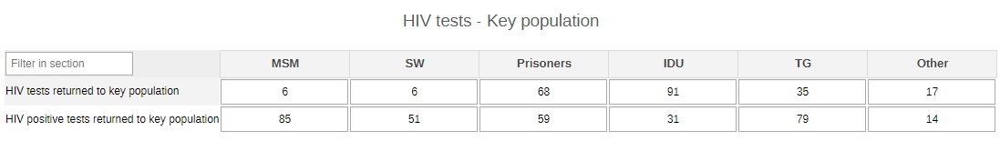

#### 2.2.4. HIV Tests - TB Cases

The section collects the information on HIV tests among presumptive cases.

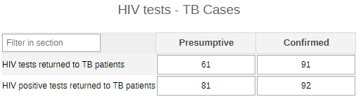

#### 2.2.5. Cervical Cancer Screening

A quick count of the number of cervical cancer screenings performed within the community by age groups (10-14y, 15-19y, 20-24y, 25-29y, 30-49y, 50+y, unknown age).

#### 2.2.6. Mental Health Conditions/disorders - All

The section collects the totals among the PLWHIVA in the community accessing MH services after assessment. The data is disaggregated by age groups (10-14y, 15-19y, 20-39y, 40-49y, 50-59y, 60-69y, 70+y, unknown age) and sex (male, female, other, unknown age).

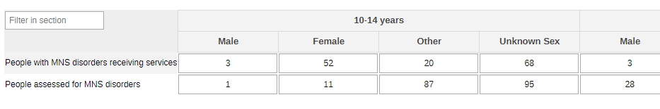

#### 2.2.7. Mental Health Conditions/disorders - Awareness and Support

The section collects the total people receiving specific MH support activities among the HIV patients.

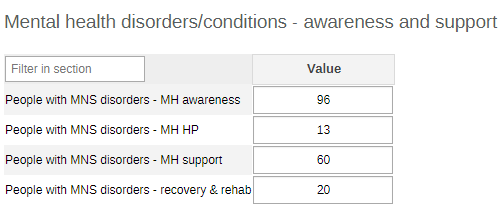

#### 2.2.8. Mental Health Conditions/disorders - Pregnant and Postpartum

The section provides an overview of the women living with HIV/AIDS receiving MH support.

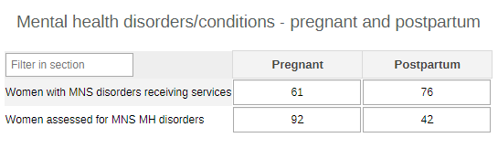

#### 2.2.9. Referrals for HTS

This section provides an overview of the referrals of PLWHA referred from the community for further care. The data are disaggregated by key population (MSM, SW, prisoners, IDU, TG, other), by age group (0-4y, 5-9y, 10-14y, 15-19y, 20-24y, 25-29y, 30-34y, 35-39y, 40-44y, 45-49y 50+y, unknown age) and sex (male, female, other, unknown sex) among the general population above 18 months, and by age groups (10-14y, 15-19y, 20-24y, 25-29y, 30-49y, 50+y, unknown age) for the distributed kits.

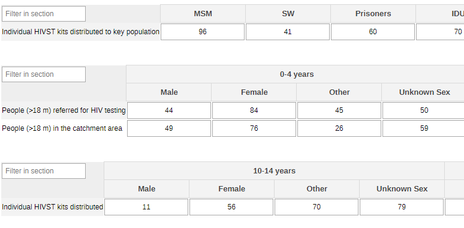

#### 2.2.10. Partner Testing Services

This section provides an overview of the services offered to the partners of PLWHA by key population (MSM, SW, prisoners, IDU, TG, other), by age (0-4y, 5-9y, 10-14y, 15-19y, 20-24y, 25-29y, 30-34y, 35-39y, 40-44y, 45-49y 50+y, unknown age) and sex (male, female, other, unknown sex), and by test result (known positive, newly diagnosed positive, negative).

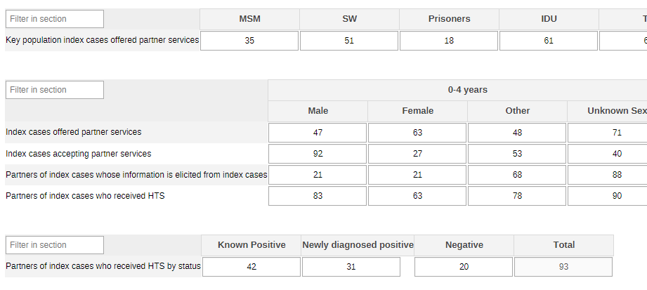

#### 2.2.11. ART

This section collects the data on the ART cohort in the community. The data are disaggregated by key population (MSM, SW, prisoners, IDU, TG, other), by age group (0-4y, 5-9y, 10-14y, 15-19y, 20-24y, 25-29y, 30-34y, 35-39y, 40-44y, 45-49y 50+y, unknown age) and sex (male, female, other, unknown sex) among the general population.

#### 2.2.12. Stigma and Discrimination

This section collects the data on the level of stigma and discrimination that key populations and, in general, PLWHA are perceiving at community level and to which degree this is affecting their ability to access health care. The data are disaggregated by key population (MSM, SW, prisoners, IDU, TG, other) and by age groups (10-14y, 15-19y, 20-24y, 25-29y, 30-49y, 50+y, unknown age).

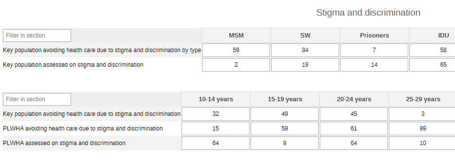

#### 2.2.13. Legal and Economic Support

This section collects the data on the eligibility of PLWHA to economical and legal support. The first table divides the people and by age group (0-4y, 5-9y, 10-14y, 15-19y, 20-24y, 25-29y, 30-34y, 35-39y, 40-44y, 45-49y 50+y, unknown age) and sex (male, female, other, unknown sex), while the second by condition (HIV, TB, NTDs, other). The category can be changed to better represent the local context.

## 3. Validation Rules

The following validation rules have been set up for the HIV datasets:
|                                                      Name                                                     |                                                              Instruction                                                              |        Operator       |                      Left side                     |                     Right side                     |
|:-------------------------------------------------------------------------------------------------------------:|:-------------------------------------------------------------------------------------------------------------------------------------:|:---------------------:|:--------------------------------------------------:|:--------------------------------------------------:|
| CH - Eligible for economic support by condition Vs Eligible people for economic (livelihood) support          | Eligible for economic support by condition should be less than or equal to Eligible people for economic (livelihood) support          | less_than_or_equal_to | Eligible for economic support by condition         | Eligible people for economic (livelihood) support  |
| CH - Eligible people for legal services by condition Vs Eligible people for legal services                    | Eligible people for legal services by condition should be less than or equal to Eligible people for legal services                    | less_than_or_equal_to | Eligible people for legal services by condition    | Eligible people for legal services                 |
| CH - Eligible referred for legal services by a CHW Vs Eligible people for legal services                      | Eligible referred for legal services by a CHW should be less than or equal to Eligible people for legal services                      | less_than_or_equal_to | Eligible referred for legal services by a CHW      | Eligible people for legal services                 |
| CH - Receive(d) any form of econ support by condition Vs Receive(d) any form of economic support              | Receive(d) any form of econ support by condition should be less than or equal to Receive(d) any form of economic support              | less_than_or_equal_to | Receive(d) any form of econ support by condition   | Receive(d) any form of economic support            |
| CH - Receive(d) any form of legal services by condition Vs Receive(d) any form of legal services              | Receive(d) any form of legal services by condition should be less than or equal to Receive(d) any form of legal services              | less_than_or_equal_to | Receive(d) any form of legal services by condition | Receive(d) any form of legal services              |
| CH - Referred for economic support Vs Eligible people for economic (livelihood) support                       | Referred for economic support should be less than or equal to Eligible people for economic (livelihood) support                       | less_than_or_equal_to | Referred for economic support                      | Eligible people for economic (livelihood) support  |
| CH - Referred for econonic support by condition Vs Referred for economic support                              | Referred for econonic support by condition should be less than or equal to Referred for economic support                              | less_than_or_equal_to | Referred for econonic support by condition         | Referred for economic support                      |
| CH - Referred for legal services by condition Vs Eligible referred for legal services by a CHW                | Referred for legal services by condition should be less than or equal to Eligible referred for legal services by a CHW                | less_than_or_equal_to | Referred for legal services by condition           | Eligible referred for legal services by a CHW      |
| CH - Women attending 1st ANC visit provided by CHW Vs Attending 1st ANC visit & tested for syphilis           | Women attending 1st ANC visit provided by CHW should be less than or equal to Attending 1st ANC visit & tested for syphilis           | less_than_or_equal_to | Women attending 1st ANC visit provided by CHW      | Attending 1st ANC visit & tested for syphilis      |
| CH - Women attending other ANC visits provided by CHW Vs Other ANC visits tested for syphilis                 | Women attending other ANC visits provided by CHW should be less than or equal to Other ANC visits tested for syphilis                 | less_than_or_equal_to | Women attending other ANC visits provided by CHW   | Other ANC visits tested for syphilis               |
| CH - Women who had a screening test for cervical cancer Vs Women who should have screened for cervical cancer | Women who had a screening test for cervical cancer should be less than or equal to Women who should have screened for cervical cancer | less_than_or_equal_to | Women who had a screening test for cervical cancer | Women who should have screened for cervical cancer |
| CH - AGW assessed for MNS disorders Vs AGW with a possible MNS symptoms                                       | AGW assessed for MNS disorders should be less than or equal to AGW with a possible MNS symptoms                                       | less_than_or_equal_to | AGW assessed for MNS disorders                     | AGW with a possible MNS symptoms                   |
| CH - AGW with MNS disorders/receiving Vs AGW assessed for MNS MH disorders                                    | AGW with MNS disorders/receiving should be less than or equal to AGW assessed for MNS MH disorders                                    | less_than_or_equal_to | AGW with MNS disorders/receiving                   | AGW assessed for MNS MH disorders                  |
| CH - AGW with MNS disorders/receiving Vs People with MNS disorders/receiving                                  | AGW with MNS disorders/receiving should be less than or equal to People with MNS disorders/receiving                                  | less_than_or_equal_to | AGW with MNS disorders/receiving                   | People with MNS disorders/receiving                |
| CH - Assessed for MNS disorders conditions by type Vs People with a possible MNS symptoms by type             | Assessed for MNS disorders conditions by type should be less than or equal to People with a possible MNS symptoms by type             | less_than_or_equal_to | Assessed for MNS disorders conditions by type      | People with a possible MNS symptoms by type        |
| CH - MNS disorders receiving - recovery & rehab Vs People with MNS disorders/receiving                        | MNS disorders receiving - recovery & rehab should be less than or equal to People with MNS disorders/receiving                        | less_than_or_equal_to | MNS disorders receiving - recovery & rehab         | People with MNS disorders/receiving                |
| CH - MNS disorders receiving - support for MH Vs People with MNS disorders/receiving                          | MNS disorders receiving - support for MH should be less than or equal to People with MNS disorders/receiving                          | less_than_or_equal_to | MNS disorders receiving - support for MH           | People with MNS disorders/receiving                |
| CH - People assessed for MNS disorders conditions Vs Assessed for MNS disorders conditions by type            | People assessed for MNS disorders conditions should be less than or equal to Assessed for MNS disorders conditions by type            | less_than_or_equal_to | People assessed for MNS disorders conditions       | Assessed for MNS disorders conditions by type      |
| CH - People assessed for MNS disorders conditions Vs People with a possible MNS symptoms                      | People assessed for MNS disorders conditions should be less than or equal to People with a possible MNS symptoms                      | less_than_or_equal_to | People assessed for MNS disorders conditions       | People with a possible MNS symptoms                |
| CH - People with a possible MNS symptoms by type Vs People with a possible MNS symptoms                       | People with a possible MNS symptoms by type should be less than or equal to People with a possible MNS symptoms                       | less_than_or_equal_to | People with a possible MNS symptoms by type        | People with a possible MNS symptoms                |
| CH - People with MNS disorders - MH promotion and prev Vs People with MNS disorders/receiving                 | People with MNS disorders - MH promotion and prev should be less than or equal to People with MNS disorders/receiving                 | less_than_or_equal_to | People with MNS disorders - MH promotion and prev  | People with MNS disorders/receiving                |
| CH - People with MNS disorders receiving - MH awareness Vs People with MNS disorders/receiving                | People with MNS disorders receiving - MH awareness should be less than or equal to People with MNS disorders/receiving                | less_than_or_equal_to | People with MNS disorders receiving - MH awareness | People with MNS disorders/receiving                |
| CH - People with MNS disorders/receiving Vs People assessed for MNS disorders                                 | People with MNS disorders/receiving should be less than or equal to People assessed for MNS disorders                                 | less_than_or_equal_to | People with MNS disorders/receiving                | People assessed for MNS disorders                  |
| CH - People with MNS disorders referred Vs People assessed for MNS disorders conditions                       | People with MNS disorders referred should be less than or equal to People assessed for MNS disorders conditions                       | less_than_or_equal_to | People with MNS disorders referred                 | People assessed for MNS disorders conditions       |
| CH - HIV tests performed amongst KP & results returned Vs HIV tests performed where results were returned     | HIV tests performed amongst KP & results returned should be less than or equal to HIV tests performed where results were returned     | less_than_or_equal_to | HIV tests performed amongst KP & results returned  | HIV tests performed where results were returned    |
| CH - HIV tests performed amongst TB & results returned Vs HIV tests performed where results were returned     | HIV tests performed amongst TB & results returned should be less than or equal to HIV tests performed where results were returned     | less_than_or_equal_to | HIV tests performed amongst TB & results returned  | HIV tests performed where results were returned    |
| CH - New HIV-positive result or diagnosis was returned Vs HIV tests performed where results were returned     | New HIV-positive result or diagnosis was returned should be less than or equal to HIV tests performed where results were returned     | less_than_or_equal_to | New HIV-positive result or diagnosis was returned  | HIV tests performed where results were returned    |
| CH - New HIV-positive result returned for KP Vs HIV tests performed amongst KP & results returned             | New HIV-positive result returned for KP should be less than or equal to HIV tests performed amongst KP & results returned             | less_than_or_equal_to | New HIV-positive result returned for KP            | HIV tests performed amongst KP & results returned  |
| CH - New HIV-positive result returned for KP Vs New HIV-positive result or diagnosis was returned             | New HIV-positive result returned for KP should be less than or equal to New HIV-positive result or diagnosis was returned             | less_than_or_equal_to | New HIV-positive result returned for KP            | New HIV-positive result or diagnosis was returned  |
| CH - New HIV-positive result returned for TB Vs HIV tests performed amongst TB & results returned             | New HIV-positive result returned for TB should be less than or equal to HIV tests performed amongst TB & results returned             | less_than_or_equal_to | New HIV-positive result returned for TB            | HIV tests performed amongst TB & results returned  |
| CH - New HIV-positive result returned for TB Vs New HIV-positive result or diagnosis was returned             | New HIV-positive result returned for TB should be less than or equal to New HIV-positive result or diagnosis was returned             | less_than_or_equal_to | New HIV-positive result returned for TB            | New HIV-positive result or diagnosis was returned  |
| CH - AYP seeking FP services tested for HIV by CHW Vs AYP seeking family planning services from CHW           | AYP seeking FP services tested for HIV by CHW should be less than or equal to AYP seeking family planning services from CHW           | less_than_or_equal_to | AYP seeking FP services tested for HIV by CHW      | AYP seeking family planning services from CHW      |
| CH - Index cases accepting partner services Vs Index cases offered partner services                           | Index cases accepting partner services should be less than or equal to Index cases offered partner services                           | less_than_or_equal_to | Index cases accepting partner services             | Index cases offered partner services               |
| CH - Index cases who are KP & offered partner services Vs Index cases offered partner services                | Index cases who are KP & offered partner services should be less than or equal to Index cases offered partner services                | less_than_or_equal_to | Index cases who are KP & offered partner services  | Index cases offered partner services               |
| CH - Individual HIVST kits distributed to key pop Vs Individual HIVST kits distributed                        | Individual HIVST kits distributed to key pop should be less than or equal to Individual HIVST kits distributed                        | less_than_or_equal_to | Individual HIVST kits distributed to key pop       | Individual HIVST kits distributed                  |
| CH - Infants referred for HIV test <2 months of birth Vs Pregnant PLWHA giving birth                          | Infants referred for HIV test <2 months of birth should be less than or equal to Pregnant PLWHA giving birth                          | less_than_or_equal_to | Infants referred for HIV test <2 months of birth   | Pregnant PLWHA giving birth                        |
| CH - KP avoiding health care due to discrim by type Vs KP avoiding health care due to discrimination          | KP avoiding health care due to discrim by type should be less than or equal to KP avoiding health care due to discrimination          | less_than_or_equal_to | KP avoiding health care due to discrim by type     | KP avoiding health care due to discrimination      |
| CH - KP avoiding health care due to discrimination Vs KP assessed on stigma and discrimination                | KP avoiding health care due to discrimination should be less than or equal to KP assessed on stigma and discrimination                | less_than_or_equal_to | KP avoiding health care due to discrimination      | KP assessed on stigma and discrimination           |
| CH - On ART last period not on Tx end this period KP Vs PLWHA on ART end of the last reporting period         | On ART last period not on Tx end this period KP should be less than or equal to PLWHA on ART end of the last reporting period         | less_than_or_equal_to | On ART last period not on Tx end this period KP    | PLWHA on ART end of the last reporting period      |
| CH - Partners of index cases received HTS by status Vs Partners of index cases who received HTS               | Partners of index cases received HTS by status should be less than or equal to Partners of index cases who received HTS               | less_than_or_equal_to | Partners of index cases received HTS by status     | Partners of index cases who received HTS           |
| CH - Partners of index cases who received HTS Vs Index cases offered partner services                         | Partners of index cases who received HTS should be less than or equal to Index cases offered partner services                         | less_than_or_equal_to | Partners of index cases who received HTS           | Index cases offered partner services               |
| CH - Partners whose info is elicited from index cases Vs Index cases offered partner services                 | Partners whose info is elicited from index cases should be less than or equal to Index cases offered partner services                 | less_than_or_equal_to | Partners whose info is elicited from index cases   | Index cases offered partner services               |
| CH - People >18 months who were referred for HIV test Vs People >18 months in the catchment area              | People >18 months who were referred for HIV test should be less than or equal to People >18 months in the catchment area              | less_than_or_equal_to | People >18 months who were referred for HIV test   | People >18 months in the catchment area            |
| CH - PLWHA avoiding health care due to stigma Vs PLWHA assessed on stigma and discrimination                  | PLWHA avoiding health care due to stigma should be less than or equal to PLWHA assessed on stigma and discrimination                  | less_than_or_equal_to | PLWHA avoiding health care due to stigma           | PLWHA assessed on stigma and discrimination        |
| CH - Received oral PrEP 1+ supported by CHW Vs People who received oral PrEP at least once                    | Received oral PrEP 1+ supported by CHW should be less than or equal to People who received oral PrEP at least once                    | less_than_or_equal_to | Received oral PrEP 1+ supported by CHW             | People who received oral PrEP at least once        |

## 4. Analytics and Indicators

Just as for the DEs, in the table below the column “Indicator Groups” provides information about whether the indicator is found in groups other than the HIV indicator group.
|                                     Name                                    |                Numerator description               |                  Denominator description                  |                                                         Indicator groups                                                        |   |
|:---------------------------------------------------------------------------:|:--------------------------------------------------:|:---------------------------------------------------------:|:-------------------------------------------------------------------------------------------------------------------------------:|---|
| CH024 - Condoms distributed                                                 | Condoms distributed                                | 1                                                         | CH - HIV, CH - Sexual and Reproductive Health                                                                                   |   |
| CH027 - Adolescents seeking FP methods tested for HIV (%)                   | AYP seeking FP services tested for HIV by CHW      | AYP seeking family planning services from CHW             | CH - Adolescent Health, CH - HIV, CH - Sexual and Reproductive Health                                                           |   |
| CH028a - HIV tests with returned results                                    | HIV tests performed where results were returned    | 1                                                         | CH - Maternal Health, CH - Child Health, CH - ICCM, CH - Adolescent Health, CH - HIV, CH - Sexual and Reproductive Health       |   |
| CH028b - HIV +ve tests returned to people (%)                               | New HIV-positive result or diagnosis was returned  | HIV tests performed where results were returned           | CH - Maternal Health, CH - Child Health, CH - ICCM, CH - Adolescent Health, CH - HIV, CH - Sexual and Reproductive Health       |   |
| CH030 - Antenatal care attendees tested for syphilis (%)                    | Women attending ANC & tested for syphilis          | Women attending ANC provided by CHW                       | CH - Maternal Health, CH - HIV, CH - Sexual and Reproductive Health                                                             |   |
| CH031 - Women screened for cervical cancer (%)                              | Women who had a screening test for cervical cancer | Women who should have screened for cervical cancer        | CH - HIV, CH - Sexual and Reproductive Health                                                                                   |   |
| CH041 - People assessed for MSN disorders (%)                               | People assessed for MNS disorders conditions       | People with a possible MNS symptoms                       | CH - Maternal Health, CH - Tuberculosis, CH - Adolescent Health, CH - HIV, CH - Neglected tropical diseases, CH - Mental health |   |
| CH042 - People referred for MNS disorders (%)                               | People with MNS disorders referred                 | People assessed for MNS disorders conditions              | CH - Maternal Health, CH - Tuberculosis, CH - Adolescent Health, CH - HIV, CH - Neglected tropical diseases, CH - Mental health |   |
| CH043 - People with MNS disorders receiving services (%)                    | People with MNS disorders/receiving                | People assessed for MNS disorders conditions              | CH - Maternal Health, CH - Tuberculosis, CH - Adolescent Health, CH - HIV, CH - Neglected tropical diseases, CH - Mental health |   |
| CH079 - People (>18 m) referred for HIV testing                             | People >18 months who were referred for HIV test   | 1                                                         | CH - Child Health, CH - ICCM, CH - HIV                                                                                          |   |
| CH101b - Women LWHA giving birth in community                               | Women LWHA giving birth in community               | 1                                                         | CH - HIV                                                                                                                        |   |
| CH101 - Infants (<2 m) referred for HIV test (%)                            | Infants referred for HIV test <2 months of birth   | Pregnant PLWHA giving birth                               | CH - HIV                                                                                                                        |   |
| CH102 - Individual HIVST kits distributed                                   | Individual HIVST kits distributed                  | 1                                                         | CH - HIV                                                                                                                        |   |
| CH103 - People tested via HIV index partner testing services                | Partners of index cases who received HTS           | 1                                                         | CH - HIV                                                                                                                        |   |
| CH104 - People on PrEP receiving CHW counselling (%)                        | Received oral PrEP 1+ supported by CHW             | People who received oral PrEP at least once               | CH - HIV                                                                                                                        |   |
| CH105 - PLWHA newly initiated on ART (%)                                    | On ART last period not on Tx end this period       | On ART at the end of last period + new on ART this period | CH - HIV                                                                                                                        |   |
| CH106 - PLWHA on ART during the reporting period (%)                        | People on ART at the end of the reporting period   | PLWHA who know their HIV status                           | CH - HIV                                                                                                                        |   |
| CH107 - People in key groups avoiding health care due to stigmatization (%) | KP avoiding health care due to discrimination      | KP assessed on stigma and discrimination                  | CH - HIV                                                                                                                        |   |
| CH108 - PLWHA avoiding health care due to stigmatization (%)                | PLWHA avoiding health care due to stigma           | PLWHA assessed on stigma and discrimination               | CH - HIV                                                                                                                        |   |
| CH109 - Eligible people referred for economic support (%)                   | Referred for economic support                      | Eligible people for economic (livelihood) support         | CH - Tuberculosis, CH - HIV, CH - People-centred services                                                                       |   |
| CH110 - Eligible people having received economic support (%)                | Receive(d) any form of economic support            | Eligible people for economic (livelihood) support         | CH - Tuberculosis, CH - HIV, CH - People-centred services                                                                       |   |
| CH111 - Eligible people referred for legal services (%)                     | Eligible referred for legal services by a CHW      | Eligible people for legal services                        | CH - Tuberculosis, CH - HIV, CH - People-centred services                                                                       |   |
| CH112 - Eligible people having received legal services (%)                  | Receive(d) any form of legal services              | Eligible people for legal services                        | CH - Tuberculosis, CH - HIV, CH - People-centred services                                                                       |   |

## 5. Dashboards

The module includes a predefined dashboard called “CH - HIV”.

The dashboard is divided in two based on the periodicity of the datasets.

The first part is for monthly indicators. The predefined items analyse and visualize the main areas of the dataset, though the dashboard should be modified to better mirror the local activities.

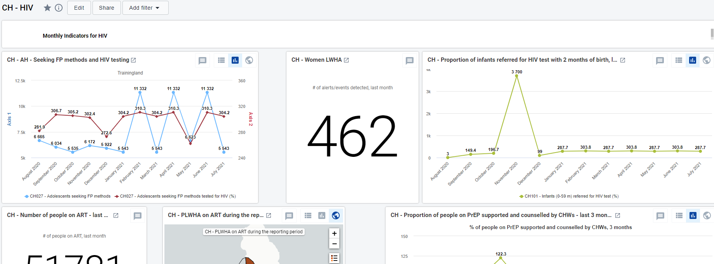

The second part of the dashboard is dedicated to the annual dataset (Annual Household Assessment Indicators). The predefined items analyse and visualize the main areas of the dataset, though the dashboard should be modified to better mirror the local activities.

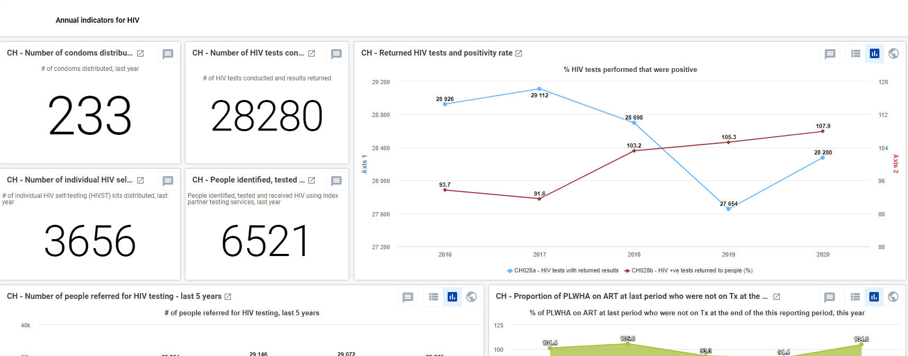
