# CH - Integrated community case management (ICCM) { #ch-iccm-aggregate-design }

## 1. Datasets

### 1.1. Configuration Summary

The aggregate CH - ICCM module includes:

1. A **monthly dataset** with key data elements for ICCM
2. **Core indicators** for both datasets
3. A predefined **“CH - ICCM” dashboard**

It is recommended that the datasets get assigned to Organisation Units **at the lowest level** of the health system feasible for reporting data, such as Villages or any appropriate community demarcation according to the local context.

### 1.2. Data Elements

The table below summarizes the data elements present in the ICCM module. The “Data elements groups” and “Datasets” columns will provide extra information on where the same DEs can be found in the other CHIS modules. This should facilitate the mapping of the package among all its modules and navigate the datasets while avoiding the collection and data entry of the same DEs in multiple locations.

All the DEs in the ICCM module are used in the build up of indicators.

| Name                                                                                           | Description                                                                                                       | Disaggregation                        | Data Sets                                                                                                                                                                        | Data Element Groups                                                                                                       |   |
|------------------------------------------------------------------------------------------------|-------------------------------------------------------------------------------------------------------------------|---------------------------------------|----------------------------------------------------------------------------------------------------------------------------------------------------------------------------------|---------------------------------------------------------------------------------------------------------------------------|---|
| CH028a - HIV positive tests returned                                                           | HIV tests conducted in which a new HIV-positive result or diagnosis was returned                                  | Age (0-50+years)/Sex (Other/Unk)      | CH - Maternal Health (Yearly); CH - Adolescent Health (Yearly); CH - Sexual and Reproductive Health (Yearly); CH - HIV (Yearly); CH - ICCM (Monthly); CH - Child Health (Yearly) | CH - Sexual and Reproductive Health; CH - ICCM; CH - Child Health; CH - Maternal Health; CH - Adolescent Health; CH - HIV |   |
| CH028b - HIV tests returned                                                                    | HIV tests returned                                                                                                | Age (0-50+years)/Sex (Other/Unk)      | CH - HIV (Yearly); CH - Adolescent Health (Yearly); CH - ICCM (Monthly); CH - Sexual and Reproductive Health (Yearly); CH - Maternal Health (Yearly); CH - Child Health (Yearly) | CH - Sexual and Reproductive Health; CH - ICCM; CH - Child Health; CH - Maternal Health; CH - Adolescent Health; CH - HIV |   |
| CH028c - HIV positive tests returned to key population                                         | HIV tests conducted amongst key population in which a new HIV-positive result or diagnosis was returned           | Key Population                        | CH - ICCM (Monthly); CH - Adolescent Health (Yearly); CH - Child Health (Yearly); CH - HIV (Yearly); CH - Maternal Health (Yearly); CH - Sexual and Reproductive Health (Yearly) | CH - Sexual and Reproductive Health; CH - ICCM; CH - Child Health; CH - Maternal Health; CH - Adolescent Health; CH - HIV |   |
| CH028d - HIV tests returned to key population                                                  | HIV tests performed amongst key population where results were returned                                            | Key Population                        | CH - Child Health (Yearly); CH - Adolescent Health (Yearly); CH - HIV (Yearly); CH - Maternal Health (Yearly); CH - Sexual and Reproductive Health (Yearly); CH - ICCM (Monthly) | CH - Sexual and Reproductive Health; CH - ICCM; CH - Child Health; CH - Maternal Health; CH - Adolescent Health; CH - HIV |   |
| CH028e - HIV positive tests returned to TB patients                                            | HIV tests conducted amongst TB in which a new HIV-positive result or diagnosis was returned                       | Type of TB Case                       | CH - HIV (Yearly); CH - Maternal Health (Yearly); CH - Child Health (Yearly); CH - ICCM (Monthly); CH - Sexual and Reproductive Health (Yearly); CH - Adolescent Health (Yearly) | CH - Sexual and Reproductive Health; CH - ICCM; CH - Child Health; CH - Maternal Health; CH - Adolescent Health; CH - HIV |   |
| CH028f - HIV tests returned to TB patients                                                     | HIV tests performed amongst TB where results were returned                                                        | Type of TB Case                       | CH - ICCM (Monthly); CH - Sexual and Reproductive Health (Yearly); CH - Adolescent Health (Yearly); CH - Maternal Health (Yearly); CH - Child Health (Yearly); CH - HIV (Yearly) | CH - Sexual and Reproductive Health; CH - ICCM; CH - Child Health; CH - Maternal Health; CH - Adolescent Health; CH - HIV |   |
| CH052a - Newborns and children with danger signs                                               | Newborns and children with danger signs in the community                                                          | Age (0 days-9 years)                  | CH - ICCM (Monthly); CH - Newborn Health (Monthly); CH - Child Health (Monthly)                                                                                                  | CH - Newborn Health; CH - ICCM                                                                                            |   |
| CH052b - Newborns and children with danger signs referred                                      | Newborns and children with danger signs referred                                                                  | Age (0 days-9 years)                  | CH - Newborn Health (Monthly); CH - ICCM (Monthly); CH - Child Health (Monthly)                                                                                                  | CH - Newborn Health; CH - ICCM                                                                                            |   |
| CH052c - Newborns and children consultations in the community                                  | Newborns and children consultations in the community                                                              | Age (0 days-9 years)                  | CH - ICCM (Monthly); CH - Child Health (Monthly); CH - Newborn Health (Monthly)                                                                                                  | CH - Newborn Health; CH - ICCM                                                                                            |   |
| CH063a - Children (6-59m) with SAM                                                             | Children aged 6-59 months with severe acute malnutrition                                                          | Age (6-59 months)                     | CH - ICCM (Monthly); CH - Nutrition (Monthly); CH - Child Health (Monthly)                                                                                                       | CH - Nutrition; CH - ICCM; CH - Child Health                                                                              |   |
| CH063b - Children (6-59m) assessed for SAM                                                     | Children aged 6-59 months screened for severe acute malnutrition                                                  | Age (6-59 months)                     | CH - Child Health (Monthly); CH - Nutrition (Monthly); CH - ICCM (Monthly)                                                                                                       | CH - Nutrition; CH - ICCM; CH - Child Health                                                                              |   |
| CH063c - Children (6-59m) with SAM referred                                                    | Children aged 6-59 months with severe acute malnutrition referred                                                 | Age (6-59 months)                     | CH - Child Health (Monthly); CH - ICCM (Monthly); CH - Nutrition (Monthly)                                                                                                       | CH - Nutrition; CH - ICCM; CH - Child Health                                                                              |   |
| CH070a - Children (0-9 y) treated for diarrhoea                                                | Children aged 0-9 years presenting with diarrhoea who received treatment                                          | Age (0-9 years)/Diarrhoea treatment   | CH - ICCM (Monthly); CH - Nutrition (Monthly); CH - Child Health (Monthly)                                                                                                       | CH - Nutrition; CH - ICCM; CH - Child Health                                                                              |   |
| CH070b - Children (0-9 y) assessed for diarrhoea                                               | Children aged 0-9 years presenting with diarrhoea assessed by CHW                                                 | Age (0-9 years)                       | CH - ICCM (Monthly); CH - Nutrition (Monthly); CH - Child Health (Monthly)                                                                                                       | CH - Nutrition; CH - ICCM; CH - Child Health                                                                              |   |
| CH071a - Children with fast breathing and/or chest indrawing                                   | Children with fast breathing and/or chest indrawing                                                               | Age (0 months-9 years)/Chest problems | CH - Child Health (Monthly); CH - ICCM (Monthly)                                                                                                                                 | CH - ICCM; CH - Child Health                                                                                              |   |
| CH071b - Children with fast breathing and/or chest indrawing referred                          | Children with fast breathing and/or chest indrawing referred                                                      | Age (0 months-9 years)/Chest problems | CH - ICCM (Monthly); CH - Child Health (Monthly)                                                                                                                                 | CH - ICCM; CH - Child Health                                                                                              |   |
| CH071c - Children screened for fast breathing and/or chest indrawing                           | Children screened for fast breathing and/or chest indrawing                                                       | Age (0 months-9 years)                | CH - ICCM (Monthly); CH - Child Health (Monthly)                                                                                                                                 | CH - ICCM; CH - Child Health                                                                                              |   |
| CH079a - People (>18 m) referred for HIV testing                                               | People (>18 m) referred for HIV testing                                                                           | Age (0-50+years)/Sex (Other/Unk)      | CH - HIV (Yearly); CH - ICCM (Monthly); CH - Child Health (Yearly)                                                                                                               | CH - ICCM; CH - Child Health; CH - HIV                                                                                    |   |
| CH079b - People (>18 m) in the catchment area                                                  | People (>18 m) in the catchment area                                                                              | Age (0-50+years)/Sex (Other/Unk)      | CH - Child Health (Yearly); CH - ICCM (Monthly); CH - HIV (Yearly)                                                                                                               | CH - ICCM; CH - Child Health; CH - HIV                                                                                    |   |
| CH095a - People not up to date with vaccinations referred                                      | Persons who are not up to date with immunizations and referred                                                    | default                               | CH - ICCM (Monthly); CH - Immunization (Yearly)                                                                                                                                  | CH - ICCM; CH - Immunization                                                                                              |   |
| CH095b - People checked for vaccination                                                        | People checked for vaccination for vaccination completion                                                         | default                               | CH - ICCM (Monthly); CH - Immunization (Yearly)                                                                                                                                  | CH - ICCM; CH - Immunization                                                                                              |   |
| CH095c - Women not up to date with vaccinations referred                                       | Women not up to date with vaccinations referred                                                                   | default                               | CH - Immunization (Yearly); CH - ICCM (Monthly)                                                                                                                                  | CH - ICCM; CH - Immunization                                                                                              |   |
| CH095d - Pregnant women checked for vaccination                                                | Pregnant women checked for vaccination completion                                                                 | default                               | CH - Immunization (Yearly); CH - ICCM (Monthly)                                                                                                                                  | CH - ICCM; CH - Immunization                                                                                              |   |
| CH096a - Unvaccinated children (0-4 y) referred                                                | Children 0-4 years whose parents state they have never been vaccinated, and who are referred                      | Age (<5 years)                        | CH - Immunization (Yearly); CH - ICCM (Monthly)                                                                                                                                  | CH - ICCM; CH - Immunization                                                                                              |   |
| CH096b - Children (0-4 y) checked for vaccination                                              | Children (0-4 y) checked for vaccination completion                                                               | Age (<5 years)                        | CH - Immunization (Yearly); CH - ICCM (Monthly)                                                                                                                                  | CH - ICCM; CH - Immunization                                                                                              |   |
| CH100a - Children (0-23 m) with Polio vaccination                                              | Eligible children 0-23 mears who received routine requested doses of polio vaccine according to national schedule | OPV type/OPV Dose                     | CH - ICCM (Monthly); CH - Immunization (Monthly)                                                                                                                                 | CH - ICCM; CH - Immunization                                                                                              |   |
| CH100b - Children (0-23 m) eligible for OPV in the target population                           | Children (0-23 m) eligible for OPV in the target population                                                       | OPV type/OPV Dose                     | CH - ICCM (Monthly); CH - Immunization (Monthly)                                                                                                                                 | CH - ICCM; CH - Immunization                                                                                              |   |
| CH119a - Febrile cased tested by RDT                                                           | Febrile cases who received a RDT                                                                                  | Age (0-20+years)                      | CH - Malaria (Monthly); CH - ICCM (Monthly)                                                                                                                                      | CH - ICCM; CH - Malaria                                                                                                   |   |
| CH119b - Febrile cases of malaria                                                              | Febrile cases of malaria                                                                                          | Age (0-20+years)                      | CH - ICCM (Monthly); CH - Malaria (Monthly)                                                                                                                                      | CH - ICCM; CH - Malaria                                                                                                   |   |
| CH120a - Suspected cases tested by RDT                                                         | Suspected cases tested by RDT                                                                                     | Age (0-20+years)                      | CH - ICCM (Monthly); CH - Malaria (Monthly)                                                                                                                                      | CH - ICCM; CH - Malaria                                                                                                   |   |
| CH120b - Suspected cases of malaria                                                            | Suspected cases of malaria                                                                                        | Age (0-20+years)                      | CH - Malaria (Monthly); CH - ICCM (Monthly)                                                                                                                                      | CH - ICCM; CH - Malaria                                                                                                   |   |
| CH121c - Confirmed malaria cases by parasite                                                   | Confirmed malaria cases by parasite                                                                               | Parasite species                      | CH - Malaria (Monthly); CH - ICCM (Monthly)                                                                                                                                      | CH - ICCM; CH - Malaria                                                                                                   |   |
| CH121 - Confirmed malaria cases                                                                | Confirmed malaria cases                                                                                           | Age (0-20+years)                      | CH - Malaria (Monthly); CH - ICCM (Monthly)                                                                                                                                      | CH - ICCM; CH - Malaria                                                                                                   |   |
| CH121d - Febrile cased tested by RDT by parasite                                               | Febrile cased tested by RDT by parasite                                                                           | Parasite species                      | CH - ICCM (Monthly); CH - Malaria (Monthly)                                                                                                                                      | CH - ICCM; CH - Malaria                                                                                                   |   |
| CH122a - Malaria cases receiving first line anti-malarial                                      | Patients with malaria who received first-line antimalarial treatment according to national policy                 | Malaria case type/Age (0-20+years)    | CH - ICCM (Monthly); CH - Malaria (Monthly)                                                                                                                                      | CH - ICCM; CH - Malaria                                                                                                   |   |
| CH122b - Patients with malaria                                                                 | Patients with malaria                                                                                             | Malaria case type/Age (0-20+years)    | CH - ICCM (Monthly); CH - Malaria (Monthly)                                                                                                                                      | CH - ICCM; CH - Malaria                                                                                                   |   |
| CH123a - Children with confirmed malaria and danger signs referred                             | Children with confirmed malaria and danger signs referred                                                         | Age (0 months-9 years)                | CH - ICCM (Monthly); CH - Malaria (Monthly)                                                                                                                                      | CH - ICCM; CH - Malaria                                                                                                   |   |
| CH123b - Children with confirmed malaria and danger signs                                      | Children with confirmed malaria and danger signs                                                                  | Age (0 months-9 years)                | CH - Malaria (Monthly); CH - ICCM (Monthly)                                                                                                                                      | CH - ICCM; CH - Malaria                                                                                                   |   |
| CH124a - Children with malaria danger signs referred after administration of rectal artesunate | Children with malaria danger signs referred after administration of rectal artesunate                             | Age (0 months-9 years)                | CH - ICCM (Monthly); CH - Malaria (Monthly)                                                                                                                                      | CH - ICCM; CH - Malaria                                                                                                   |   |
| CH124b - Children with malaria danger signs                                                    | Children with malaria danger signs                                                                                | Age (0 months-9 years)                | CH - Malaria (Monthly); CH - ICCM (Monthly)                                                                                                                                      | CH - ICCM; CH - Malaria                                                                                                   |   |

## 2. Dataset Details

### 2.1. Child Health - Newborn

The section is set to collect the information necessary to have a snapshot of the health of the children in the community. The table collects data on danger signs and the reactivity of the community upon those signs by age groups (0-27d, 28d-11m, 1-4y,5-9y unknown age).

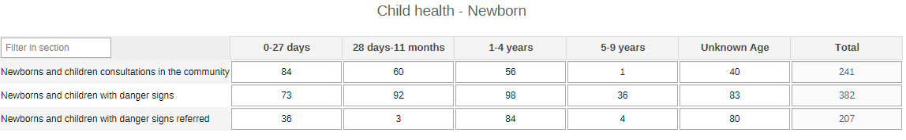

### 2.2. Child Health - Nutrition

The section collects data on malnutrition by age groups (6-11m and 12-59m).

### 2.3. Child Health - Diarrhoea

The section focuses on diarrhoea and rehydration by age group (0-4y, 5-9y) and its treatment (ORS, Zinc, both).

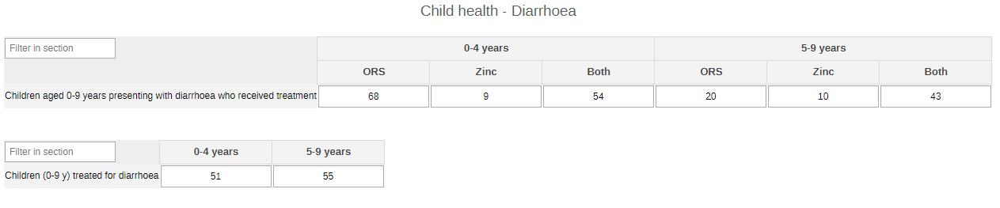

### 2.4. Child Health - Fast Breathing

The section collects info on possible chest infections and respiratory problems by age groups (0-11m, 1-4y, 5-9y, unknown age) and symptoms (fast breathing, chest indrawing, both).

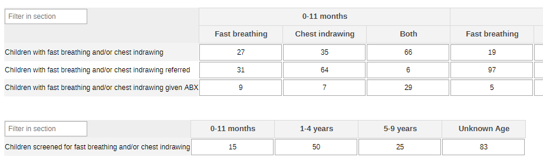

### 2.5. Malaria - Suspected Cases Tested

The section focuses on suspected and tested cases in the community by age groups (0-4y, 5-9y, 10-14y, 15-19y, 20+y, unknown age).

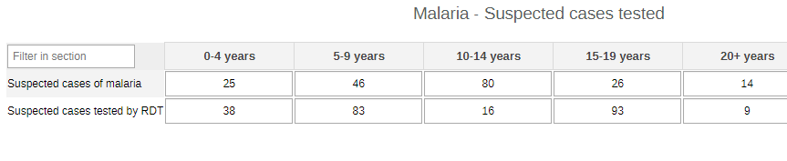

### 2.6. Malaria - Febrile Cases Tested

The section collects data about suspected febrile cases, tested cases, and confirmed cases of malaria. The info is disaggregated by age groups (0-4y, 5-9y, 10-14y, 15-19y, 20+y, unknown age).

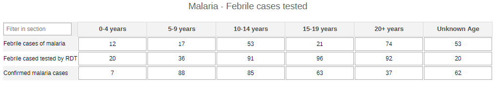

### 2.7. Malaria - Cases by Parasite

The malaria section could also be set up as the tables below, where the data are collected by Plasmodium spp.

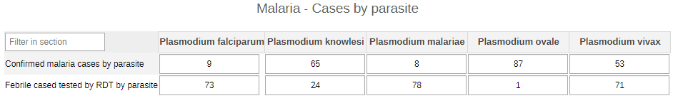

### 2.8. Malaria - Treatment

The cases in this table are tallied by type of case vs. treatment with first line antimalarials( combination of age groups - 0-4y, 5-9y, 10-14y, 15-19y, 20+y, unknown age - and result - confirmed with RDT, suspected, febrile not confirmed).

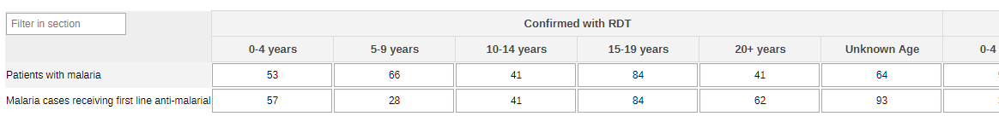

### 2.9. Malaria - Danger Signs

In this table there is a focus on children in the second table with danger signs and referrals of children up to the age of 9 years by age groups (0-11m, 1-4y, 5-9y, unknown age).

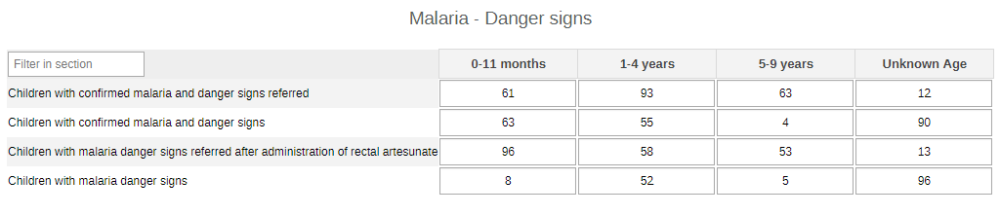

### 2.10. Immunization - Never Vaccinated

The section focuses on children up to four years of age and on how many among the screened ones are completely unvaccinated.

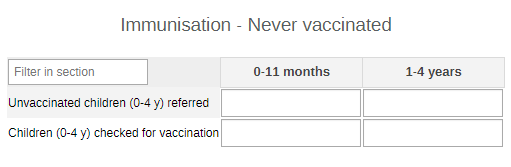

### 2.11. Immunization - Not Up to Date

The section collects the data for people and women who are not up to date with the vaccination calendar according to their stage of life and pregnancy.

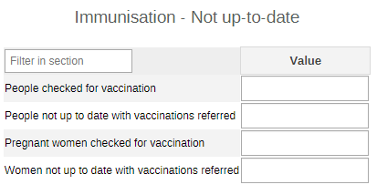

### 2.12. Immunization - Polio

The section monitors children up to 23 months and their Polio vaccinations status by OPV and dose (0 to 4).

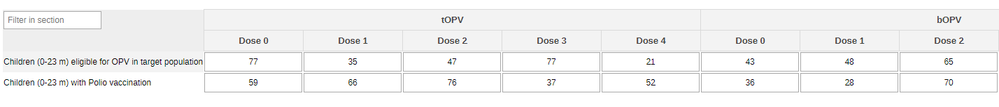

### 2.13. HIV Test - All

The section reports core information on HIV-related activities.
The table gives an overview of the number of performed tests and positive results among all people tested. The data are disaggregated by age groups (0-4y, 5-9y, 10-14y, 15-19y, 20-24y, 25-29y, 30-34y, 35-39y, 40-44y, 45-49y, 50+y, unknown age) and sex (male, female, other, unknonw sex).

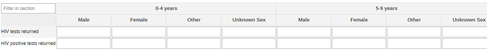

### 2.14. HIV Test - Key Population

The table captures data for the key population groups at risk (MSM, SW, Prisoners, IDU, TG, Other). The categories should be adapted locally to better mirror the contexts and the activities.

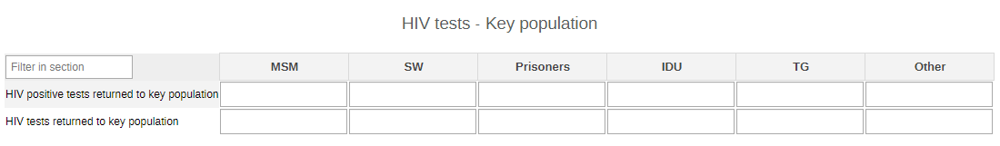

### 2.15. HIV Test - TB Cases

The table gives the information among TB-confirmed and -presumptive patients.

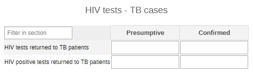

### 2.16. HIV Test - Referrals

The section focuses on all people above 18 months of age who are referred for HIV testing. The data are disaggregated by age groups (0-4y, 5-9y, 10-14y, 15-19y, 20-24y, 25-29y, 30-34y, 35-39y, 40-44y, 45-49y, 50+y, unknown age) and sex (male, female, other, unknonw sex).

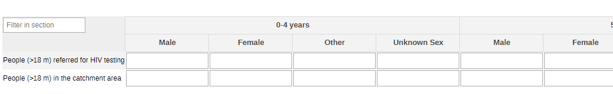

## 3. Validation Rules

The following validation rules have been set up for the ICCM dataset.

| name                                                                                                        | instruction                                                                                                                         | operator              | leftSide description                               | rightSide description                                |   |
|-------------------------------------------------------------------------------------------------------------|-------------------------------------------------------------------------------------------------------------------------------------|-----------------------|----------------------------------------------------|------------------------------------------------------|---|
| CH - New HIV-positive result returned for TB Vs HIV tests performed amongst TB & results returned           | New HIV-positive result returned for TB should be less than or equal to HIV tests performed amongst TB & results returned           | less_than_or_equal_to | New HIV-positive result returned for TB            | HIV tests performed amongst TB & results returned    |   |
| CH - Children presenting fast breathing/chest indrawing Vs Children screened for fast breathing/ indrawing  | Children presenting fast breathing/chest indrawing should be less than or equal to Children screened for fast breathing/ indrawing  | less_than_or_equal_to | Children presenting fast breathing/chest indrawing | Children screened for fast breathing/ indrawing      |   |
| CH - Received first-line antimalarial Tx Vs Patients with malaria                                           | Received first-line antimalarial Tx should be less than or equal to Patients with malaria                                           | less_than_or_equal_to | Received first-line antimalarial Tx                | Patients with malaria                                |   |
| CH - Children 6-59 months with SAM referred Vs Children 6-59 months screened for SAM                        | Children 6-59 months with SAM referred should be less than or equal to Children 6-59 months screened for SAM                        | less_than_or_equal_to | Children 6-59 months with SAM referred             | Children 6-59 months screened for SAM                |   |
| CH - Given rectal artesunate and referred Vs Children with malaria danger signs                             | Given rectal artesunate and referred should be less than or equal to Children with malaria danger signs                             | less_than_or_equal_to | Given rectal artesunate and referred               | Children with malaria danger signs                   |   |
| CH - PG not up to date with immunizations and referred Vs Not up to date with immunizations and referred    | PG not up to date with immunizations and referred should be less than or equal to Not up to date with immunizations and referred    | less_than_or_equal_to | PG not up to date with immunizations and referred  | Not up to date with immunizations and referred       |   |
| CH - New HIV-positive result returned for KP Vs HIV tests performed amongst KP & results returned           | New HIV-positive result returned for KP should be less than or equal to HIV tests performed amongst KP & results returned           | less_than_or_equal_to | New HIV-positive result returned for KP            | HIV tests performed amongst KP & results returned    |   |
| CH - Children with fast breathing/indrawing referred Vs Children presenting fast breathing/chest indrawing  | Children with fast breathing/indrawing referred should be less than or equal to Children presenting fast breathing/chest indrawing  | less_than_or_equal_to | Children with fast breathing/indrawing referred    | Children presenting fast breathing/chest indrawing   |   |
| CH - Not up to date with immunizations and referred Vs Persons who have been checked                        | Not up to date with immunizations and referred should be less than or equal to Persons who have been checked                        | less_than_or_equal_to | Not up to date with immunizations and referred     | Persons who have been checked                        |   |
| CH - People >18 months who were referred for HIV test Vs People >18 months in the catchment area            | People >18 months who were referred for HIV test should be less than or equal to People >18 months in the catchment area            | less_than_or_equal_to | People >18 months who were referred for HIV test   | People >18 months in the catchment area              |   |
| CH - Children 6-59 months with SAM Vs Children 6-59 months screened for SAM                                 | Children 6-59 months with SAM should be less than or equal to Children 6-59 months screened for SAM                                 | less_than_or_equal_to | Children 6-59 months with SAM                      | Children 6-59 months screened for SAM                |   |
| CH - Suspected cases who received a RDT Vs Suspected cases of malaria                                       | Suspected cases who received a RDT should be less than or equal to Suspected cases of malaria                                       | less_than_or_equal_to | Suspected cases who received a RDT                 | Suspected cases of malaria                           |   |
| CH - Children 0-23m who given routine doses of polio Vs Eligible children 0-23m in the target population    | Children 0-23m who given routine doses of polio should be less than or equal to Eligible children 0-23m in the target population    | less_than_or_equal_to | Children 0-23m who given routine doses of polio    | Children 0-23m eligible in the target population     |   |
| CH - Children with conf malaria & danger signs referred Vs Children with confirmed malaria and danger signs | Children with conf malaria & danger signs referred should be less than or equal to Children with confirmed malaria and danger signs | less_than_or_equal_to | Children with conf malaria & danger signs referred | Children with confirmed malaria and danger signs     |   |
| CH - Newborns and children with danger signs referred Vs Newborns and children with danger signs            | Newborns and children with danger signs referred should be less than or equal to Newborns and children with danger signs            | less_than_or_equal_to | Newborns and children with danger signs referred   | Newborns and children with danger signs              |   |
| CH - HIV tests performed amongst TB & results returned Vs HIV tests performed where results were returned   | HIV tests performed amongst TB & results returned should be less than or equal to HIV tests performed where results were returned   | less_than_or_equal_to | HIV tests performed amongst TB & results returned  | HIV tests performed where results were returned      |   |
| CH - Febrile cases who received a RDT Vs Febrile cases of malaria                                           | Febrile cases who received a RDT should be less than or equal to Febrile cases of malaria                                           | less_than_or_equal_to | Febrile cases who received a RDT                   | Febrile cases of malaria                             |   |
| CH - HIV tests performed amongst KP & results returned Vs HIV tests performed where results were returned   | HIV tests performed amongst KP & results returned should be less than or equal to HIV tests performed where results were returned   | less_than_or_equal_to | HIV tests performed amongst KP & results returned  | HIV tests performed where results were returned      |   |
| CH - New HIV-positive result returned for TB Vs New HIV-positive result or diagnosis was returned           | New HIV-positive result returned for TB should be less than or equal to New HIV-positive result or diagnosis was returned           | less_than_or_equal_to | New HIV-positive result returned for TB            | New HIV-positive result or diagnosis was returned    |   |
| CH - New HIV-positive result returned for KP Vs New HIV-positive result or diagnosis was returned           | New HIV-positive result returned for KP should be less than or equal to New HIV-positive result or diagnosis was returned           | less_than_or_equal_to | New HIV-positive result returned for KP            | New HIV-positive result or diagnosis was returned    |   |
| CH - Newborns and children with danger signs Vs Newborns and children consultations in the community        | Newborns and children with danger signs should be less than or equal to Newborns and children consultations in the community        | less_than_or_equal_to | Newborns and children with danger signs            | Newborns and children consultations in the community |   |
| CH - Children 0-9 years with diarrhoea who received tx Vs Children 0-9 y presenting diarrhoea assessed      | Children 0-9 years with diarrhoea who received tx should be less than or equal to Children 0-9 y presenting diarrhoea assessed      | less_than_or_equal_to | Children 0-9 years with diarrhoea who received tx  | Children 0-9 y presenting diarrhoea assessed         |   |
| CH - New HIV-positive result or diagnosis was returned Vs HIV tests performed where results were returned   | New HIV-positive result or diagnosis was returned should be less than or equal to HIV tests performed where results were returned   | less_than_or_equal_to | New HIV-positive result or diagnosis was returned  | HIV tests performed where results were returned      |   |
| CH - Children 0-4 y never vaccinated and referred Vs Children 0-4 y who have been checked                   | Children 0-4 y never vaccinated and referred should be less than or equal to Children 0-4 y who have been checked                   | less_than_or_equal_to | Children 0-4 y never vaccinated and referred       | Children 0-4 y who have been checked for vaccination |   |
| CH - Confirmed malaria cases by parasite Vs Confirmed malaria cases                                         | Confirmed malaria cases by parasite should be less than or equal to Confirmed malaria cases                                         | less_than_or_equal_to | Confirmed malaria cases by parasite                | Confirmed malaria cases                              |   |
| CH - Confirmed malaria cases Vs Febrile cases who received a RDT by parasite                                | Confirmed malaria cases should be less than or equal to Febrile cases who received a RDT by parasite                                | less_than_or_equal_to | Confirmed malaria cases                            | Febrile cases who received a RDT by parasite         |   |

## 4. Analytics and Indicators

Just as for the DEs, in the table below the column “Indicator Groups” provides information about whether the indicator is found in groups other than the ICCM indicator group.

| name                                                                                  | description                                                                                                                   | numerator Description                              | denominator Description                                 | Indicator groups                                                                                                          |   |
|---------------------------------------------------------------------------------------|-------------------------------------------------------------------------------------------------------------------------------|----------------------------------------------------|---------------------------------------------------------|---------------------------------------------------------------------------------------------------------------------------|---|
| CH028a - HIV tests with returned results                                              | Number of HIV tests conducted and results returned                                                                            | HIV tests performed where results were returned    | 1                                                       | CH - Maternal Health; CH - Child Health; CH - ICCM; CH - Adolescent Health; CH - HIV; CH - Sexual and Reproductive Health |   |
| CH028b - HIV +ve tests returned to people (%)                                         | Proportion of HIV tests performed that were positive and results returned to people                                           | New HIV-positive result or diagnosis was returned  | HIV tests performed where results were returned         | CH - Maternal Health; CH - Child Health; CH - ICCM; CH - Adolescent Health; CH - HIV; CH - Sexual and Reproductive Health |   |
| CH052a - Newborns and children with danger signs referred (%)                         | Proportion of newborns and children referred with danger signs                                                                | Newborns and children with danger signs referred   | Newborns and children with danger signs                 | CH - Newborn Health; CH - ICCM                                                                                            |   |
| CH052b - Newborns and children with danger signs (%)                                  | Proportion of newborns and children with danger signs                                                                         | Newborns and children with danger signs            | Newborns and children consultations in the community    | CH - Newborn Health; CH - ICCM                                                                                            |   |
| CH052c - Newborns and children consultations in the community                         | Newborns and children consultations in the community                                                                          | Newborns and children consultations                | 1                                                       | CH - Newborn Health; CH - ICCM                                                                                            |   |
| CH052d - Newborns and children referred with danger signs                             | Number of newborns and children referred with danger signs                                                                    | Newborns and children with danger signs referred   | 1                                                       | CH - Newborn Health; CH - ICCM                                                                                            |   |
| CH052e - Newborns and children with danger signs                                      | Number of newborns and children with danger signs                                                                             | Newborns and children with danger signs            | 1                                                       | CH - Newborn Health; CH - Child Health; CH - ICCM                                                                         |   |
| CH063 - Children (6-59 m) assessed for SAM (%)                                        | Proportion of children 6-59 months with severe acute malnutrition (SAM)                                                       | Children 6-59 months with SAM                      | Children 6-59 months screened for SAM                   | CH - Nutrition; CH - Child Health; CH - ICCM                                                                              |   |
| CH063 - Children (6-59 m) with SAM                                                    | Number  of children 6-59 months with severe acute malnutrition (SAM)                                                          | Children 6-59 months with SAM                      | 1                                                       | CH - Child Health; CH - ICCM                                                                                              |   |
| CH070b - Children (0-9 y) assessed for diarrhoea                                      | Children (0-9 y) assessed for diarrhoea                                                                                       | Children (0-9 y) assessed for diarrhoea            | 1                                                       | CH - Nutrition; CH - Child Health; CH - ICCM                                                                              |   |
| CH070 - Children (0-9 y) treated for diarrhoea (%)                                    | Proportion of children (0-9 years)who received treatment for diarrhoea                                                        | Children 0-9 years with diarrhoea who received tx  | Children 0-9 yrs presenting diarrhoea assessed          | CH - Nutrition; CH - Child Health; CH - ICCM                                                                              |   |
| CH071 - Children with fast breathing and/or chest in-drawing (%)                      | Proportion of children presenting fast breathing and/or chest indrawing                                                       | Children presenting fast breathing/chest indrawing | Children screened for fast breathing/ indrawing         | CH - Child Health; CH - ICCM                                                                                              |   |
| CH072 - Children receiving antibiotics for fast breathing and/or chest in-drawing (%) | Proportion of children receiving antibiotic treatment for fast breathing and/or chest indrawing                               | Fast breathing/chest indrawing given antibiotic TX | Children presenting fast breathing/chest indrawing      | CH - Child Health; CH - ICCM                                                                                              |   |
| CH079 - People (>18 m) referred for HIV testing                                       | Number of people above 18 months referred for HIV testing                                                                     | People >18 months who were referred for HIV test   | 1                                                       | CH - Child Health; CH - ICCM; CH - HIV                                                                                    |   |
| CH095 - Referred people not up to date with vaccinations (%)                          | Proportion of persons who are not up to date with immunizations and are referred                                              | Not up to date with immunizations and referred     | Persons who have been checked                           | CH - Immunization; CH - ICCM                                                                                              |   |
| CH096 - Children (0-4 y) unvaccinated referred (%)                                    | Proportion of Children 0-4 yrs whose parents state they have never been vaccinated, and who are referred                      | Children (0-4 y) never vaccinated and referred     | Children  (0-4 y) who have been checked for vaccination | CH - Immunization; CH - ICCM                                                                                              |   |
| CH100 - Children (0-59 m) vaccinated for polio (%)                                    | Proportion of eligible children (0-59 m) who received routine requested doses of polio vaccine according to national schedule | Children (0-59 m) who given routine doses of polio | Children (0-59 m) in the target population              | CH - Immunization; CH - ICCM                                                                                              |   |
| CH119b - Febrile cases of malaria                                                     | Febrile cases of malaria                                                                                                      | Febrile cases                                      | 1                                                       | CH - ICCM; CH - Malaria                                                                                                   |   |
| CH119 - Febrile cased tested by RDT (%)                                               | Proportion of febrile cases who received a rapid diagnostic test (RDT)                                                        | Febrile cases who received a RDT                   | Febrile cases of malaria                                | CH - ICCM; CH - Malaria                                                                                                   |   |
| CH120b - Suspected cases of malaria                                                   | Suspected cases of malaria                                                                                                    | Suspected cases                                    | 1                                                       | CH - ICCM; CH - Malaria                                                                                                   |   |
| CH120 - Suspected cases tested by RDT (%)                                             | Proportion of suspected cases who received a RDT                                                                              | Suspected cases who received a RDT                 | Suspected cases of malaria                              | CH - ICCM; CH - Malaria                                                                                                   |   |
| CH121a - Suspected cases being confirmed (%)                                          | Proportion of suspected malaria cases that are confirmed by testing                                                           | Confirmed malaria cases                            | Suspected cases who received a RDT                      | CH - ICCM; CH - Malaria                                                                                                   |   |
| CH121b - Confirmed malaria cases                                                      | Number of confirmed malaria cases                                                                                             | Confirmed malaria cases                            | 1                                                       | CH - ICCM; CH - Malaria                                                                                                   |   |
| CH122 - Malaria cases receiving first line anti-malarial (%)                          | Proportion of patients with malaria who received first-line antimalarial treatment according to national policy               | Received first-line antimalarial Tx                | Patients with malaria                                   | CH - ICCM; CH - Malaria                                                                                                   |   |
| CH123 - Children referred with danger signs (%)                                       | Proportion of children with confirmed malaria and danger signs who are referred                                               | Children with conf malaria & danger signs referred | Children with confirmed malaria and danger signs        | CH - ICCM; CH - Malaria                                                                                                   |   |
| CH124 - Suspected children referred after rectal Artesunate (%)                       | Proportion of children with malaria danger signs referred after administration of rectal artesunate                           | Given rectal artesunate and referred               | Children with malaria danger signs                      | CH - ICCM; CH - Malaria                                                                                                   |   |

## 5. Dashboards

The module includes a predefined dashboard called “CH - ICCM”.

The predefined items analyse and visualize the main areas of the dataset by section, though the dashboard should be modified to better mirror the local activities.

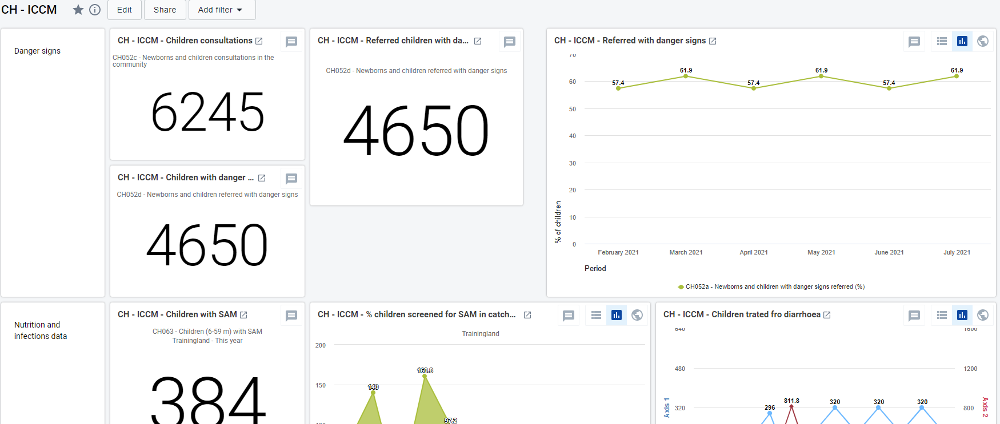
