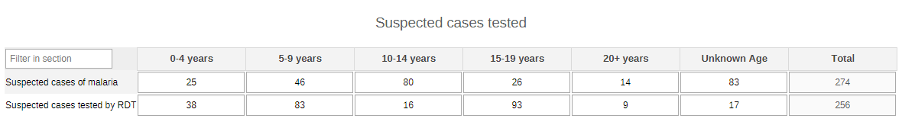
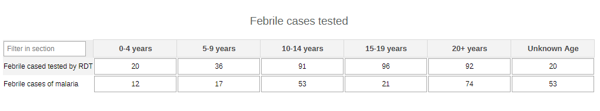
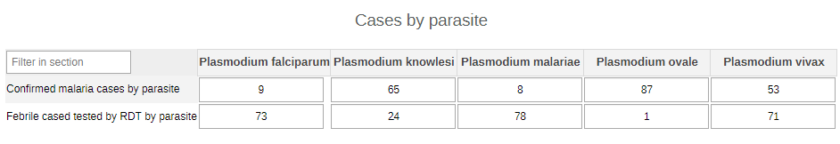
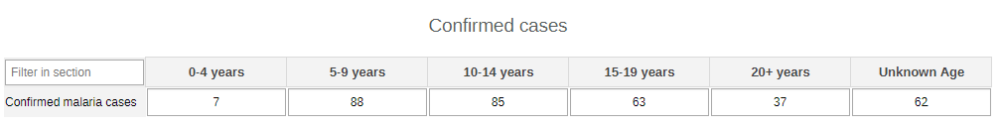
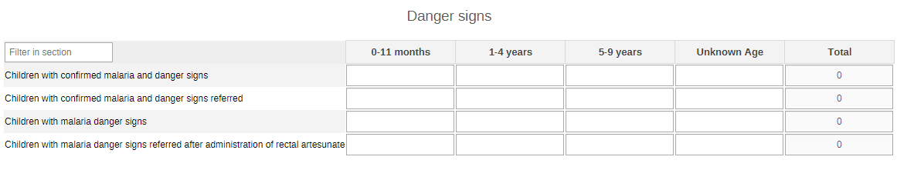
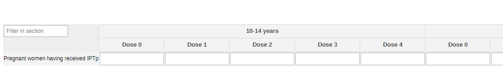
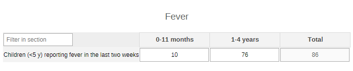
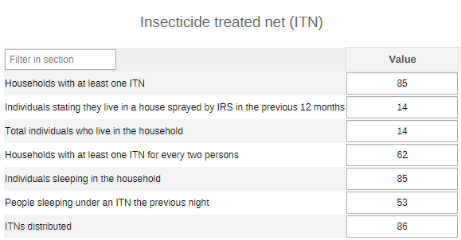
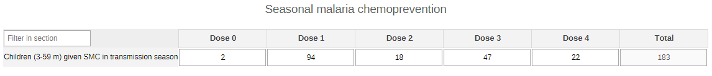
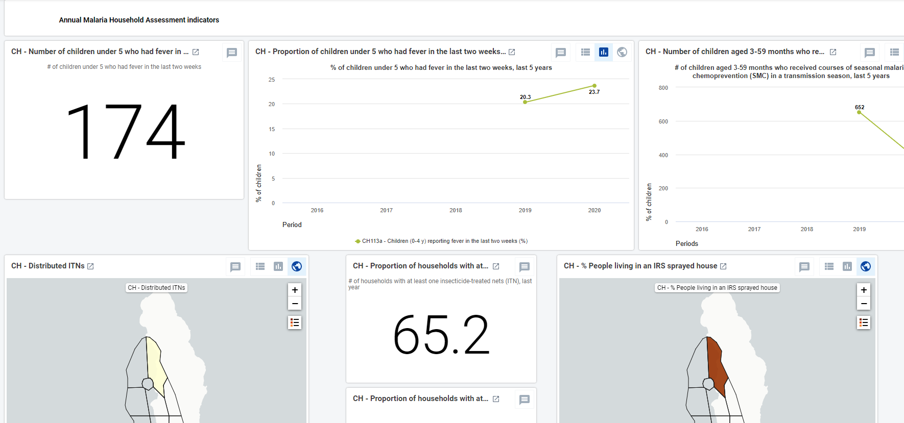

# CH - Malaria { #ch-mal-aggregate-design }

## 1.Datasets

### 1.1. Configuration Summary

The aggregate CH - Malaria module includes:

1. A **monthly dataset** with key data elements for malaria
2. A **yearly dataset** for the follow up of key annual information on malaria
3. **Core indicators** for both datasets
4. A predefined **“CH - Malaria” dashboard**

It is recommended that the datasets get assigned to Organisation Units **at the lowest level** of the health system feasible for reporting data, such as Villages or any appropriate community demarcation according to the local context.

### 1.2. Data Elements

The table below summarizes the data elements present in the Malaria module. The “Data elements groups” and “Datasets” columns will provide extra information on where the same DEs can be found in the other CHIS modules. This should facilitate the mapping of the package among all its modules and navigate the datasets while avoiding the collection and data entry of the same DEs in multiple locations.

All the DEs in the Malaria module are used in the build up of indicators.
| Name                                                                                           | Description                                                                                       | Disaggregation                     | Data Sets                                   | Data Element Groups     |   |
|------------------------------------------------------------------------------------------------|---------------------------------------------------------------------------------------------------|------------------------------------|---------------------------------------------|-------------------------|---|
| CH113a - Children (0-4 y) reporting fever in the last two weeks                                | Children (0-4 y) reporting fever in the last two weeks                                            | Age (<5 years)                     | CH - Malaria (Yearly)                       | CH - Malaria            |   |
| CH114 - Households with at least one ITN                                                       | Households with at least one ITN                                                                  | default                            | CH - Malaria (Yearly)                       | CH - Malaria            |   |
| CH115a - Households with at least one ITN for every two persons                                | Households with at least one ITN for every two persons                                            | default                            | CH - Malaria (Yearly)                       | CH - Malaria            |   |
| CH115b - Total individuals who live in the household                                           | Total individuals who live in the household                                                       | default                            | CH - Malaria (Yearly)                       | CH - Malaria            |   |
| CH116a - People sleeping under an ITN the previous night                                       | Individuals stating they slept under an ITN the previous night                                    | default                            | CH - Malaria (Yearly)                       | CH - Malaria            |   |
| CH116b - Individuals sleeping in the household                                                 | Individuals sleeping in the household                                                             | default                            | CH - Malaria (Yearly)                       | CH - Malaria            |   |
| CH117 - People living in an IRS-sprayed house                                                  | Individuals stating they live in a house sprayed by IRS in the previous 12 months                 | default                            | CH - Malaria (Yearly)                       | CH - Malaria            |   |
| CH118 - ITNs distributed                                                                       | ITNs distributed                                                                                  | default                            | CH - Malaria (Yearly)                       | CH - Malaria            |   |
| CH119a - Febrile cased tested by RDT                                                           | Febrile cases who received a RDT                                                                  | Age (0-20+years)                   | CH - Malaria (Monthly); CH - ICCM (Monthly) | CH - ICCM; CH - Malaria |   |
| CH119b - Febrile cases of malaria                                                              | Febrile cases of malaria                                                                          | Age (0-20+years)                   | CH - ICCM (Monthly); CH - Malaria (Monthly) | CH - ICCM; CH - Malaria |   |
| CH120a - Suspected cases tested by RDT                                                         | Suspected cases tested by RDT                                                                     | Age (0-20+years)                   | CH - ICCM (Monthly); CH - Malaria (Monthly) | CH - ICCM; CH - Malaria |   |
| CH120b - Suspected cases of malaria                                                            | Suspected cases of malaria                                                                        | Age (0-20+years)                   | CH - Malaria (Monthly); CH - ICCM (Monthly) | CH - ICCM; CH - Malaria |   |
| CH121c - Confirmed malaria cases by parasite                                                   | Confirmed malaria cases by parasite                                                               | Parasite species                   | CH - Malaria (Monthly); CH - ICCM (Monthly) | CH - ICCM; CH - Malaria |   |
| CH121 - Confirmed malaria cases                                                                | Confirmed malaria cases                                                                           | Age (0-20+years)                   | CH - Malaria (Monthly); CH - ICCM (Monthly) | CH - ICCM; CH - Malaria |   |
| CH121d - Febrile cased tested by RDT by parasite                                               | Febrile cased tested by RDT by parasite                                                           | Parasite species                   | CH - ICCM (Monthly); CH - Malaria (Monthly) | CH - ICCM; CH - Malaria |   |
| CH122a - Malaria cases receiving first line anti-malarial                                      | Patients with malaria who received first-line antimalarial treatment according to national policy | Malaria case type/Age (0-20+years) | CH - ICCM (Monthly); CH - Malaria (Monthly) | CH - ICCM; CH - Malaria |   |
| CH122b - Patients with malaria                                                                 | Patients with malaria                                                                             | Malaria case type/Age (0-20+years) | CH - ICCM (Monthly); CH - Malaria (Monthly) | CH - ICCM; CH - Malaria |   |
| CH123a - Children with confirmed malaria and danger signs referred                             | Children with confirmed malaria and danger signs referred                                         | Age (0 months-9 years)             | CH - ICCM (Monthly); CH - Malaria (Monthly) | CH - ICCM; CH - Malaria |   |
| CH123b - Children with confirmed malaria and danger signs                                      | Children with confirmed malaria and danger signs                                                  | Age (0 months-9 years)             | CH - Malaria (Monthly); CH - ICCM (Monthly) | CH - ICCM; CH - Malaria |   |
| CH124a - Children with malaria danger signs referred after administration of rectal artesunate | Children with malaria danger signs referred after administration of rectal artesunate             | Age (0 months-9 years)             | CH - ICCM (Monthly); CH - Malaria (Monthly) | CH - ICCM; CH - Malaria |   |
| CH124b - Children with malaria danger signs                                                    | Children with malaria danger signs                                                                | Age (0 months-9 years)             | CH - Malaria (Monthly); CH - ICCM (Monthly) | CH - ICCM; CH - Malaria |   |
| CH125 - Pregnant women having received IPTp                                                    | Pregnant women having received IPTp                                                               | Age (10-20+years)/Malaria IPT Dose | CH - Malaria (Monthly)                      | CH - Malaria            |   |
| CH126 - Children (3-59 m) given SMC in transmission season                                     | Children aged 3-59 months who received courses of SMC in a transmission season                    | Malaria IPT Dose                   | CH - Malaria (Yearly)                       | CH - Malaria            |   |

## 2. Dataset Details

### 2.1. Monthly Malaria Dataset

#### 2.1.1. Suspected Cases Tested

This section provides a summary of the data on suspected and tested cases in the community by age group (0-4y, 5-9y, 10-14y, 15-19y, 20+y, unknown age).

#### 2.1.2. Febrile Cases Tested

The section reports the febrile cases and those tested for malaria by age groups (0-4y, 5-9y, 10-14y, 15-19y, 20+y, unknown age).

#### 2.1.3. Cases by Parasite

The section collects the data on tested and confirmed cases by Plasmodium spp.

#### 2.1.4. Treatment

The section collects the cases of the patients who received a first-line treatment. The data are disaggregated with combination of age groups (0-4y, 5-9y, 10-14y, 15-19y, 20+y, unknown age) and result (confirmed with RDT, suspected, febrile not confirmed).

#### 2.1.5. Confirmed Cases

The section presents the total numbers of confirmed cases by age groups (0-4y, 5-9y, 10-14y, 15-19y, 20+y, unknown age).

#### 2.1.6. Danger Signs

The section collects data on danger signs among children up to 9 years of age by age groups (0-11m, 1-4y, 5-9y unknown age).

#### 2.1.7. IPTp for Pregnant Women

A quick data collection tally for pregnant women receiving preventing chemoprophylaxis by age groups (10-14y, 15-19y, 20+, unknown age) and doses (0 to 4).

### 2.2. Yearly Malaria Dataset

#### 2.2.1. Fever

A simple count of children with fever in the past two weeks by age groups (0-11 months and 1-4 years)

#### 2.2.2. Insecticide treated net (ITN)

The section provides a general overview of the availability and the use of ITNs in the community.

#### 2.2.3. Seasonal Malaria Chemoprevention

The section tallies the number of children under the age of 5 years to whom the SMC has been distributed. The data is disaggregated by dose (0 to 4).

## 3. Validation Rules

The following validation rules have been set up for the Malaria datasets:

|                                                     Name                                                    |                                                             Instruction                                                             |        Operator       |                      Left side                     |                    Right side                    |
|:-----------------------------------------------------------------------------------------------------------:|:-----------------------------------------------------------------------------------------------------------------------------------:|:---------------------:|:--------------------------------------------------:|:------------------------------------------------:|
| CH - Children with conf malaria & danger signs referred Vs Children with confirmed malaria and danger signs | Children with conf malaria & danger signs referred should be less than or equal to Children with confirmed malaria and danger signs | less_than_or_equal_to | Children with conf malaria & danger signs referred | Children with confirmed malaria and danger signs |
| CH - Confirmed malaria cases by parasite Vs Confirmed malaria cases                                         | Confirmed malaria cases by parasite should be less than or equal to Confirmed malaria cases                                         | less_than_or_equal_to | Confirmed malaria cases by parasite                | Confirmed malaria cases                          |
| CH - Confirmed malaria cases Vs Febrile cases who received a RDT by parasite                                | Confirmed malaria cases should be less than or equal to Febrile cases who received a RDT by parasite                                | less_than_or_equal_to | Confirmed malaria cases                            | Febrile cases who received a RDT by parasite     |
| CH - Febrile cases who received a RDT Vs Febrile cases of malaria                                           | Febrile cases who received a RDT should be less than or equal to Febrile cases of malaria                                           | less_than_or_equal_to | Febrile cases who received a RDT                   | Febrile cases of malaria                         |
| CH - Given rectal artesunate and referred Vs Children with malaria danger signs                             | Given rectal artesunate and referred should be less than or equal to Children with malaria danger signs                             | less_than_or_equal_to | Given rectal artesunate and referred               | Children with malaria danger signs               |
| CH - HHs with at least one ITN for every two persons Vs Individuals who live in the household               | HHs with at least one ITN for every two persons should be less than or equal to Individuals who live in the household               | less_than_or_equal_to | HHs with at least one ITN for every two persons    | Individuals who live in the household            |
| CH - People who live in a house sprayed by IRS Vs Individuals who live in the household                     | People who live in a house sprayed by IRS should be less than or equal to Individuals who live in the household                     | less_than_or_equal_to | People who live in a house sprayed by IRS          | Individuals who live in the household            |
| CH - Received first-line antimalarial Tx Vs Patients with malaria                                           | Received first-line antimalarial Tx should be less than or equal to Patients with malaria                                           | less_than_or_equal_to | Received first-line antimalarial Tx                | Patients with malaria                            |
| CH - Slept under an ITN the previous night Vs Individuals in the households visited                         | Slept under an ITN the previous night should be less than or equal to Individuals in the households visited                         | less_than_or_equal_to | Slept under an ITN the previous night              | Individuals in the households visited            |
| CH - Suspected cases who received a RDT Vs Suspected cases of malaria                                       | Suspected cases who received a RDT should be less than or equal to Suspected cases of malaria                                       | less_than_or_equal_to | Suspected cases who received a RDT                 | Suspected cases of malaria                       |

## 4. Analytics and Indicators

Just as for the DEs, in the table below the column “Indicator Groups” provides information about whether the indicator is found in groups other than the malaria indicator group.
|                                Name                                |                Numerator description               |              Denominator description             |     Indicator groups    |   |
|:------------------------------------------------------------------:|:--------------------------------------------------:|:------------------------------------------------:|:-----------------------:|---|
| CH113a - Children (<5 y) reporting fever in the last two weeks (%) | Children <5 years had fever in the last two weeks  | Children under 5 in the catchment area           | CH - Malaria            |   |
| CH114 - Households with at least one ITN (%)                       | Households with at least one ITN                   | Households in the catchment area                 | CH - Malaria            |   |
| CH115 - Households with at least one ITN for every two persons (%) | HHs with at least one ITN for every two persons    | Totalindividuals who live in the household       | CH - Malaria            |   |
| CH116 - People sleeping under an ITN the previous night (%)        | Slept under an ITN the previous night              | Individuals in the households visited            | CH - Malaria            |   |
| CH117 - People living in an IRS-sprayed house (%)                  | People who live in a house sprayed by IRS          | Totalindividuals who live in the household       | CH - Malaria            |   |
| CH118 - ITNs distributed                                           | ITNs distributed                                   | 1                                                | CH - Malaria            |   |
| CH119 - Febrile cased tested by RDT (%)                            | Febrile cases who received a RDT                   | Febrile cases of malaria                         | CH - ICCM, CH - Malaria |   |
| CH120 - Suspected cases tested by RDT (%)                          | Suspected cases who received a RDT                 | Suspected cases of malaria                       | CH - ICCM, CH - Malaria |   |
| CH121a - Suspected cases being confirmed (%)                       | Confirmed malaria cases                            | Suspected cases who received a RDT               | CH - ICCM, CH - Malaria |   |
| CH122 - Malaria cases receiving first line anti-malarial (%)       | Received first-line antimalarial Tx                | Patients with malaria                            | CH - ICCM, CH - Malaria |   |
| CH123 - Children referred with danger signs (%)                    | Children with conf malaria & danger signs referred | Children with confirmed malaria and danger signs | CH - ICCM, CH - Malaria |   |
| CH124 - Suspected children referred after rectal Artesunate (%)    | Given rectal artesunate and referred               | Children with malaria danger signs               | CH - ICCM, CH - Malaria |   |
| CH125 - Pregnant women having received IPTp                        | Pregnant women who have received doses of IPTp     | 1                                                | CH - Malaria            |   |
| CH126 - Children (3-59 m) given SMC in transmission season         | Children 3-59 mos given SMC in a transm season     | 1                                                | CH - Malaria            |   |

## 5. Dashboards

The module includes a predefined dashboard called “CH - Malaria”.

The dashboard is divided in two based on the periodicity of the datasets.

The first part is for monthly indicators. The predefined items on the dashboard include data the activities present in the different sections of the dataset, but the content should be adapted based on the local activities.

The second part of the dashboard is dedicated to the annual dataset (Annual Household Assessment Indicators). The predefined analyse and visualize the main areas of the dataset, though the dashboard should be modified to better mirror the local activities.

