# CH - Maternal Health { #ch-mat-aggregate-design }

## 1.Datasets

### 1.1. Configuration Summary

The aggregate CH - Maternal Health (MatH) module includes:

1. A **monthly dataset** with key data elements for adolescent health
2. A **yearly dataset** for the follow up of key annual information on adolescent health
3. **Core indicators** for both datasets
4. A predefined **“CH - Maternal Health”** dashboard

It is recommended that the datasets get assigned to Organisation Units **at the lowest level** of the health system feasible for reporting data, such as Villages or any appropriate community demarcation according to the local context.

## 1.2. Data Elements

The table below summarizes the data elements present in the MatH module. The “Data elements groups” and “Datasets” columns will provide extra information on where the same DEs can be found in the other CHIS modules. This should facilitate the mapping of the package among all its modules and navigate the datasets while avoiding the collection and data entry of the same DEs in multiple locations.

All the DEs in the MatH module are used in the build up of indicators.

| Name                                                                               | Description                                                                                                              | Datasets                                                                                                                                                                                    | DE groups                                                                                                                       |
|------------------------------------------------------------------------------------|--------------------------------------------------------------------------------------------------------------------------|---------------------------------------------------------------------------------------------------------------------------------------------------------------------------------------------|---------------------------------------------------------------------------------------------------------------------------------|
| CH041a - People assessed for MNS disorders/ MH conditions                          | People assessed for MNS disorders/ MH conditions                                                                         | CH - Adolescent Health (Monthly), CH - HIV (Monthly), CH - Maternal Health (Monthly), CH - Mental health (Monthly), CH - Neglected tropical diseases (Monthly), CH - Tuberculosis (Monthly) | CH - Neglected tropical diseases, CH - HIV, CH - Maternal Health, CH - Adolescent Health, CH - Mental health, TB - Tuberculosis |
| CH041b - People with possible MNS symptoms                                         | People with possible MNS symptoms                                                                                        | CH - Adolescent Health (Monthly), CH - HIV (Monthly), CH - Maternal Health (Monthly), CH - Mental health (Monthly), CH - Neglected tropical diseases (Monthly), CH - Tuberculosis (Monthly) | CH - Neglected tropical diseases, CH - HIV, CH - Maternal Health, CH - Adolescent Health, CH - Mental health, TB - Tuberculosis |
| CH041c - People assessed for MNS disorders/ MH conditions                          | People assessed for MNS disorders/mental health conditions by type                                                       | CH - Adolescent Health (Monthly), CH - HIV (Monthly), CH - Maternal Health (Monthly), CH - Mental health (Monthly), CH - Neglected tropical diseases (Monthly), CH - Tuberculosis (Monthly) | CH - Neglected tropical diseases, CH - HIV, CH - Maternal Health, CH - Adolescent Health, CH - Mental health, TB - Tuberculosis |
| CH041d - People with possible MNS symptoms                                         | People with possible symptoms of MNS conditions                                                                          | CH - Adolescent Health (Monthly), CH - HIV (Monthly), CH - Maternal Health (Monthly), CH - Mental health (Monthly), CH - Neglected tropical diseases (Monthly), CH - Tuberculosis (Monthly) | CH - Neglected tropical diseases, CH - HIV, CH - Maternal Health, CH - Adolescent Health, CH - Mental health, TB - Tuberculosis |
| CH041e - Women assessed for MNS disorders/ MH conditions                           | Women and adolescent girls assessed for MNS disorders / MH conditions                                                    | CH - Adolescent Health (Monthly), CH - HIV (Monthly), CH - Maternal Health (Monthly), CH - Mental health (Monthly), CH - Neglected tropical diseases (Monthly), CH - Tuberculosis (Monthly) | CH - Neglected tropical diseases, CH - HIV, CH - Maternal Health, CH - Adolescent Health, CH - Mental health, TB - Tuberculosis |
| CH041f - Women with possible MNS symptoms                                          | Women and adolescent girls with possible MNS symptoms                                                                    | CH - Adolescent Health (Monthly), CH - HIV (Monthly), CH - Maternal Health (Monthly), CH - Mental health (Monthly), CH - Neglected tropical diseases (Monthly), CH - Tuberculosis (Monthly) | CH - Neglected tropical diseases, CH - HIV, CH - Maternal Health, CH - Adolescent Health, CH - Mental health, TB - Tuberculosis |
| CH042a - People with MNS disorders referred                                        | People with MNS disorders referred                                                                                       | CH - Adolescent Health (Monthly), CH - HIV (Monthly), CH - Maternal Health (Monthly), CH - Mental health (Monthly), CH - Neglected tropical diseases (Monthly), CH - Tuberculosis (Monthly) | CH - Neglected tropical diseases, CH - HIV, CH - Maternal Health, CH - Adolescent Health, CH - Mental health, TB - Tuberculosis |
| CH042b - People with MNS disorders referred by type                                | People with MNS disorders referred by type                                                                               | CH - Adolescent Health (Monthly), CH - HIV (Monthly), CH - Maternal Health (Monthly), CH - Mental health (Monthly), CH - Neglected tropical diseases (Monthly), CH - Tuberculosis (Monthly) | CH - Neglected tropical diseases, CH - HIV, CH - Maternal Health, CH - Adolescent Health, CH - Mental health, TB - Tuberculosis |
| CH042c - Women with MNS disorders referred                                         | Women and adolescent girls with MNS disorders/mental health conditions referred                                          | CH - Adolescent Health (Monthly), CH - HIV (Monthly), CH - Maternal Health (Monthly), CH - Mental health (Monthly), CH - Neglected tropical diseases (Monthly), CH - Tuberculosis (Monthly) | CH - Neglected tropical diseases, CH - HIV, CH - Maternal Health, CH - Adolescent Health, CH - Mental health, TB - Tuberculosis |
| CH028a - HIV positive tests returned                                               | HIV tests conducted in which a new HIV-positive result or diagnosis was returned                                         | CH - Adolescent Health (Yearly), CH - Child Health (Yearly), CH - HIV (Yearly), CH - ICCM (Monthly), CH - Maternal Health (Yearly), CH - Sexual and Reproductive Health (Yearly)            | CH - HIV, CH - Maternal Health, CH - ICCM, CH - Adolescent Health, CH - Sexual and Reproductive Health, CH - Child Health       |
| CH028b - HIV tests returned                                                        | HIV tests returned                                                                                                       | CH - Adolescent Health (Yearly), CH - Child Health (Yearly), CH - HIV (Yearly), CH - ICCM (Monthly), CH - Maternal Health (Yearly), CH - Sexual and Reproductive Health (Yearly)            | CH - HIV, CH - Maternal Health, CH - ICCM, CH - Adolescent Health, CH - Sexual and Reproductive Health, CH - Child Health       |
| CH028c - HIV positive tests returned to key population                             | HIV tests conducted amongst key population in which a new HIV-positive result or diagnosis was returned                  | CH - Adolescent Health (Yearly), CH - Child Health (Yearly), CH - HIV (Yearly), CH - ICCM (Monthly), CH - Maternal Health (Yearly), CH - Sexual and Reproductive Health (Yearly)            | CH - HIV, CH - Maternal Health, CH - ICCM, CH - Adolescent Health, CH - Sexual and Reproductive Health, CH - Child Health       |
| CH028d - HIV tests returned to key population                                      | HIV tests performed amongst key population where results were returned                                                   | CH - Adolescent Health (Yearly), CH - Child Health (Yearly), CH - HIV (Yearly), CH - ICCM (Monthly), CH - Maternal Health (Yearly), CH - Sexual and Reproductive Health (Yearly)            | CH - HIV, CH - Maternal Health, CH - ICCM, CH - Adolescent Health, CH - Sexual and Reproductive Health, CH - Child Health       |
| CH028e - HIV positive tests returned to TB patients                                | HIV tests conducted amongst TB in which a new HIV-positive result or diagnosis was returned                              | CH - Adolescent Health (Yearly), CH - Child Health (Yearly), CH - HIV (Yearly), CH - ICCM (Monthly), CH - Maternal Health (Yearly), CH - Sexual and Reproductive Health (Yearly)            | CH - HIV, CH - Maternal Health, CH - ICCM, CH - Adolescent Health, CH - Sexual and Reproductive Health, CH - Child Health       |
| CH028f - HIV tests returned to TB patients                                         | HIV tests performed amongst TB where results were returned                                                               | CH - Adolescent Health (Yearly), CH - Child Health (Yearly), CH - HIV (Yearly), CH - ICCM (Monthly), CH - Maternal Health (Yearly), CH - Sexual and Reproductive Health (Yearly)            | CH - HIV, CH - Maternal Health, CH - ICCM, CH - Adolescent Health, CH - Sexual and Reproductive Health, CH - Child Health       |
| CH043a - People with MNS disorders receiving services                              | People with MNS disorders/mental health conditions receiving services                                                    | CH - Adolescent Health (Yearly), CH - HIV (Yearly), CH - Maternal Health (Yearly), CH - Mental health (Yearly), CH - Neglected tropical diseases (Yearly), CH - Tuberculosis (Yearly)       | CH - Neglected tropical diseases, CH - HIV, CH - Maternal Health, CH - Adolescent Health, CH - Mental health, TB - Tuberculosis |
| CH043b - People assessed for MNS disorders                                         | People assessed for MNS disorders/mental health conditions                                                               | CH - Adolescent Health (Yearly), CH - HIV (Yearly), CH - Maternal Health (Yearly), CH - Mental health (Yearly), CH - Neglected tropical diseases (Yearly), CH - Tuberculosis (Yearly)       | CH - Neglected tropical diseases, CH - HIV, CH - Maternal Health, CH - Adolescent Health, CH - Mental health, TB - Tuberculosis |
| CH043c - People with MNS disorders receiving services - MH awareness               | People with MNS disorders/mental health conditions receiving services - mental health awareness                          | CH - Adolescent Health (Yearly), CH - HIV (Yearly), CH - Maternal Health (Yearly), CH - Mental health (Yearly), CH - Neglected tropical diseases (Yearly), CH - Tuberculosis (Yearly)       | CH - Neglected tropical diseases, CH - HIV, CH - Maternal Health, CH - Adolescent Health, CH - Mental health, TB - Tuberculosis |
| CH043d - People with MNS disorders receiving services - MH HP                      | People with MNS disorders/mental health conditions receiving services - mental health promotion and prevention           | CH - Adolescent Health (Yearly), CH - HIV (Yearly), CH - Maternal Health (Yearly), CH - Mental health (Yearly), CH - Neglected tropical diseases (Yearly), CH - Tuberculosis (Yearly)       | CH - Neglected tropical diseases, CH - HIV, CH - Maternal Health, CH - Adolescent Health, CH - Mental health, TB - Tuberculosis |
| CH043e - People with MNS disorders receiving services - MH support                 | People with MNS disorders/mental health conditions receiving services - support for people with mental health conditions | CH - Adolescent Health (Yearly), CH - HIV (Yearly), CH - Maternal Health (Yearly), CH - Mental health (Yearly), CH - Neglected tropical diseases (Yearly), CH - Tuberculosis (Yearly)       | CH - Neglected tropical diseases, CH - HIV, CH - Maternal Health, CH - Adolescent Health, CH - Mental health, TB - Tuberculosis |
| CH043f - People with MNS disorders receiving services - recovery/rehab             | People with MNS disorders/mental health conditions receiving services - recovery and rehabilitation                      | CH - Adolescent Health (Yearly), CH - HIV (Yearly), CH - Maternal Health (Yearly), CH - Mental health (Yearly), CH - Neglected tropical diseases (Yearly), CH - Tuberculosis (Yearly)       | CH - Neglected tropical diseases, CH - HIV, CH - Maternal Health, CH - Adolescent Health, CH - Mental health, TB - Tuberculosis |
| CH043g - Women with MNS disorders receiving services                               | Women and adolescent girls with MNS disorders/mental health conditions receiving services                                | CH - Adolescent Health (Yearly), CH - HIV (Yearly), CH - Maternal Health (Yearly), CH - Mental health (Yearly), CH - Neglected tropical diseases (Yearly), CH - Tuberculosis (Yearly)       | CH - Neglected tropical diseases, CH - HIV, CH - Maternal Health, CH - Adolescent Health, CH - Mental health, TB - Tuberculosis |
| CH043h - Women assessed for MNS disorders                                          | Women and adolescent girls assessed for MNS disorders/mental health conditions                                           | CH - Adolescent Health (Yearly), CH - HIV (Yearly), CH - Maternal Health (Yearly), CH - Mental health (Yearly), CH - Neglected tropical diseases (Yearly), CH - Tuberculosis (Yearly)       | CH - Neglected tropical diseases, CH - HIV, CH - Maternal Health, CH - Adolescent Health, CH - Mental health, TB - Tuberculosis |
| CH044a - Deaths pregnancy-related - during pregnancy                               | Deaths pregnancy-related - during pregnancy                                                                              | CH - Civil registration and vital statistics (Yearly), CH - Maternal Health (Yearly)                                                                                                        | CH - Civil registration and vital statistics, CH - Maternal Health                                                              |
| CH044b - Deaths pregnancy-related - facility delivery                              | New pregnancy-related deaths during childbirth at facility                                                               | CH - Civil registration and vital statistics (Yearly), CH - Maternal Health (Yearly)                                                                                                        | CH - Civil registration and vital statistics, CH - Maternal Health                                                              |
| CH044c - Deaths pregnancy-related - community delivery                             | New pregnancy-related deaths during childbirth at community                                                              | CH - Civil registration and vital statistics (Yearly), CH - Maternal Health (Yearly)                                                                                                        | CH - Civil registration and vital statistics, CH - Maternal Health                                                              |
| CH044d - Deaths pregnancy-related - 2m pre/post delivery                           | New pregnancy-related deaths within two months of delivery or end of pregnancy                                           | CH - Civil registration and vital statistics (Yearly), CH - Maternal Health (Yearly)                                                                                                        | CH - Civil registration and vital statistics, CH - Maternal Health                                                              |
| CH030a - Women tested for syphilis - 1st ANC                                       | Women attending 1st ANC visit provided by CHW who were tested for syphilis                                               | CH - HIV (Monthly), CH - Maternal Health (Monthly), CH - Sexual and Reproductive Health (Monthly)                                                                                           | CH - HIV, CH - Maternal Health, CH - Sexual and Reproductive Health                                                             |
| CH030b - Women tested for syphilis by CHW - 1st ANC                                | Women tested for syphilis by CHW - 1st ANC                                                                               | CH - HIV (Monthly), CH - Maternal Health (Monthly), CH - Sexual and Reproductive Health (Monthly)                                                                                           | CH - HIV, CH - Maternal Health, CH - Sexual and Reproductive Health                                                             |
| CH030c - Women tested for syphilis - 2nd+ ANC                                      | Women attending other ANC visits provided by CHW who were tested for syphilis                                            | CH - HIV (Monthly), CH - Maternal Health (Monthly), CH - Sexual and Reproductive Health (Monthly)                                                                                           | CH - HIV, CH - Maternal Health, CH - Sexual and Reproductive Health                                                             |
| CH030d - Women tested for syphilis by CHW - 2nd+ ANC                               | Women attending other ANC visits provided by CHW                                                                         | CH - HIV (Monthly), CH - Maternal Health (Monthly), CH - Sexual and Reproductive Health (Monthly)                                                                                           | CH - HIV, CH - Maternal Health, CH - Sexual and Reproductive Health                                                             |
| CH035a - Pregnant women who have 1st ANC contact with CHW during first trimester   | Pregnant women who have 1st ANC contact with CHW during first trimester                                                  | CH - Maternal Health (Monthly)                                                                                                                                                              | CH - Maternal Health                                                                                                            |
| CH035b - Women with at least one ANC CHW visit                                     | Pregnant women who have had at least one ANC contact with CHW                                                            | CH - Maternal Health (Monthly)                                                                                                                                                              | CH - Maternal Health                                                                                                            |
| CH036a - Community ANC contacts                                                    | Community ANC contacts                                                                                                   | CH - Maternal Health (Monthly), CH - Nutrition (Monthly)                                                                                                                                    | CH - Nutrition, CH - Maternal Health                                                                                            |
| CH036b - Pregnant women counseled on breastfeeding during ANC contact              | Community ANC contacts where pregnant women received any breastfeeding counselling                                       | CH - Maternal Health (Monthly), CH - Nutrition (Monthly)                                                                                                                                    | CH - Nutrition, CH - Maternal Health                                                                                            |
| CH037 - Women given iron supplements during ANC                                    | Community ANC contacts during which pregnant women were given/prescribed iron-containing supplements                     | CH - Maternal Health (Monthly), CH - Nutrition (Monthly)                                                                                                                                    | CH - Nutrition, CH - Maternal Health                                                                                            |
| CH039a - Pregnant women referred for maternal complications during ANC             | Women and adolescent girls referred for maternal complications during antenatal care                                     | CH - Maternal Health (Monthly)                                                                                                                                                              | CH - Maternal Health                                                                                                            |
| CH039b - Pregnant women referred for maternal complications during labour/delivery | Women and adolescent girls referred for maternal complications during labour and delivery                                | CH - Maternal Health (Monthly)                                                                                                                                                              | CH - Maternal Health                                                                                                            |
| CH039c - Pregnant women referred for maternal complications during postpartum      | Women and adolescent girls referred for maternal complications during postpartum care                                    | CH - Maternal Health (Monthly)                                                                                                                                                              | CH - Maternal Health                                                                                                            |
| CH040a - Women given postpartum uteronic after delivery without SBA                | Women and adolescent girls who gave birth in the community without SBA and given immediate oral postpartum uterotonic    | CH - Maternal Health (Monthly)                                                                                                                                                              | CH - Maternal Health                                                                                                            |
| CH038a - People with measured raised blood pressure                                | People with measured raised blood pressure                                                                               | CH - Maternal Health (Yearly), CH - Noncommunicable diseases (Yearly)                                                                                                                       | CH - Noncommunicable diseases, CH - Maternal Health                                                                             |
| CH038b - Women with measured raised blood pressure - ANC                           | Women and adolescent girls with measured raised blood pressure during antenatal care                                     | CH - Maternal Health (Yearly), CH - Noncommunicable diseases (Yearly)                                                                                                                       | CH - Noncommunicable diseases, CH - Maternal Health                                                                             |
| CH038c - Women with measured raised blood pressure - delivery                      | Women and adolescent girls with measured raised blood pressure during labour and delivery                                | CH - Maternal Health (Yearly), CH - Noncommunicable diseases (Yearly)                                                                                                                       | CH - Noncommunicable diseases, CH - Maternal Health                                                                             |
| CH038d - Women with high blood pressure - postpartum                               | Women and adolescent girls with measured raised blood pressure during postpartum care                                    | CH - Maternal Health (Yearly), CH - Noncommunicable diseases (Yearly)                                                                                                                       | CH - Noncommunicable diseases, CH - Maternal Health                                                                             |

## 2. Dataset Details

### 2.1. Monthly Maternal Health Dataset

#### 2.1.1. Syphilis Screening at ANC

The section collects data on syphilis screening during ANC visits (first or subsequents). The disaggregation is by age groups (10-14 y, 15-19 y, 20+ y and unknown age)

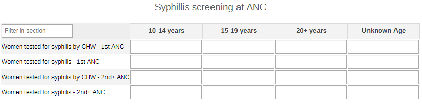

#### 2.1.2. ANC Contacts

The section collects data on the degree of contacts with mothers-to-be for general ANC visits, breastfeeding counselling, and Fe prescriptions. The disaggregation of the data on ANC visits is by age groups (10-14 y, 15-19 y, 20+ y and unknown age).

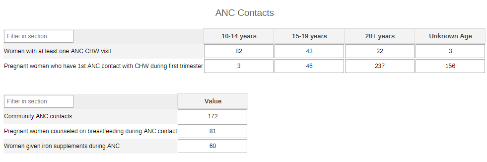

#### 2.1.3. Maternal Complications

The data collected in this section are a simple overview of maternal complications. Firstly is about women receiving uteronics by age groups (10-14 y, 15-19 y, 20+ y and unknown age) and by uteronic (Misoprostol or other - this should be adapted locally depending on the used products), and on the pregnancy stage when the complication arises by age groups (10-14 y, 15-19 y, 20-24y, 25-29y, 30-49y, 50+y).

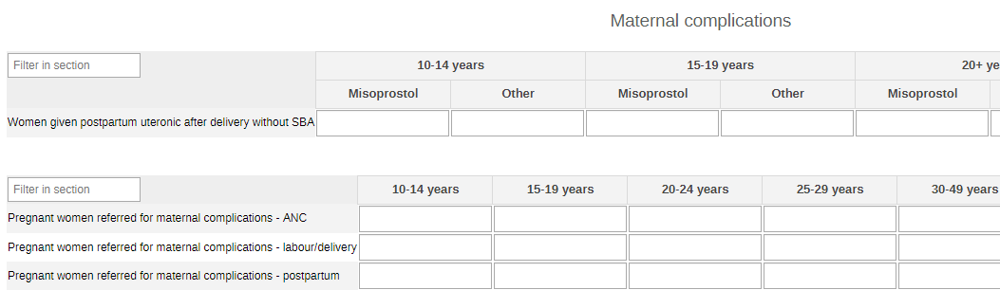

#### 2.1.4. Mental Health Disorders and Conditions - All

The section focuses on all the women benefiting from MH assessments and referrals. The data are disaggregated by age (10-14y, 15-19y, 20-39y, 40-49y, 50-59y, 60-69y, 70+, unknown age) and sex (male, female, other, unknown sex).

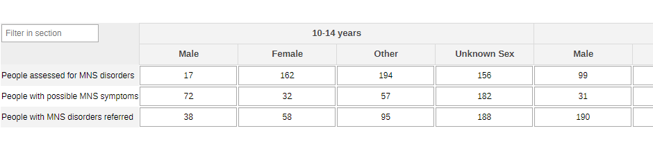

#### 2.1.5. Mental Health Disorders and Conditions - by Type

The information collected on the general female population (section 2.1.4.) can also be disaggregated by type of condition (depression, psychoses, behavioural conditions, dementia, substance use, suicide/self harm) - the conditions should be edited and adapted to the local context.

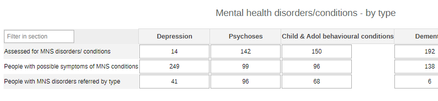

#### 2.1.6. Mental Health Disorders and Conditions - Pregnant and Postpartum

This section collects the same variables as the other two sections on MH, but it focuses specifically on pregnant and postpartum women.

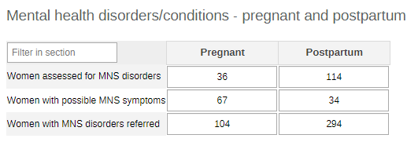

### 2.2. Yearly Maternal Health Dataset

#### 2.2.1. HIV Tests - All

The section collects the info on returned and positive HIV tests among the general population benefiting from the Maternal health services. The data are collected by age (0-4y, 5-9y, 10-14y, 15-19y, 20-24y, 25-29y, 30-34y, 35-39y, 40-44y, 45-49y, 50+y, unknown age) and sex (female, other).

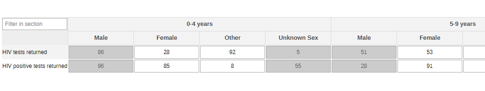

#### 2.2.2. HIV Tests - TB Case

THe section collects the same information as the previous section, though among presumptive and confirmed TB cases.

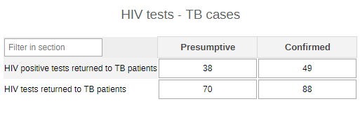

#### 2.2.3. HIV Tests - Key Population

The section provides the information on the key population by type of key population groups (SW, Prisoners, IDU, TG, Other - these can be adapted to better mirror the local context).

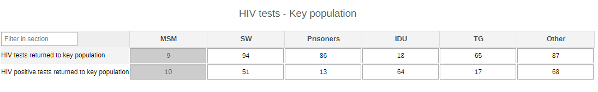

#### 2.2.4. Blood Pressure

The section reports the measurement of high blood pressure by age (10-14y, 15-19y, 20-39y, 40-49y, 50-59y, 60-69y, 70+, unknown age) and sex (female, other), and the pregnancy stage during which the HBP appears by age (10-14 y, 15-19 y, 20-24y, 25-29y, 30-49y, 50+y).

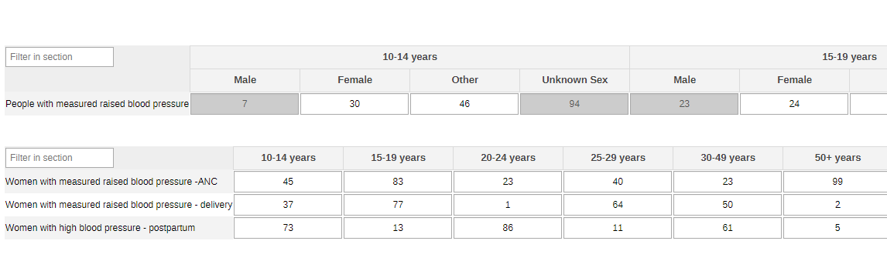

#### 2.2.5. Mental Health Conditions and Disorders - All

The section focuses on all the women benefiting from MH assessments and referrals. The data are disaggregated by age (10-14y, 15-19y, 20-39y, 40-49y, 50-59y, 60-69y, 70+, unknown age) and sex (female, other).

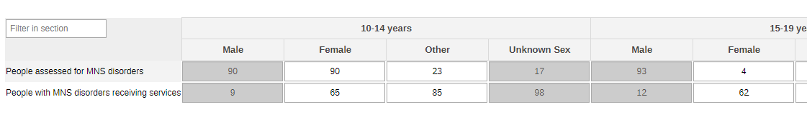

#### 2.2.6. Mental Health Conditions and Disorders - Pregnant and Postpartum

This section collects the same variables as the other section on MH, but it focuses specifically on pregnant and postpartum women.

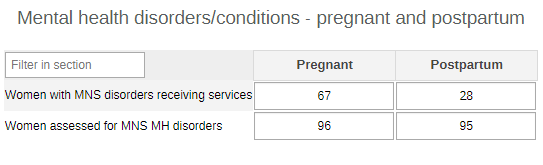

#### 2.2.7. Mental Health Conditions and Disorders - Awareness and Support

The section collects the number of women accessing MH-relates services and support activities.

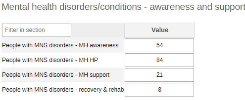

#### 2.2.8. Pregnancy-related Deaths

The DEs in the section show the stages of pregnancy during which the deaths could occur. The data are disaggregated by age (10-14y, 15-19y, 20+y and unknown age).

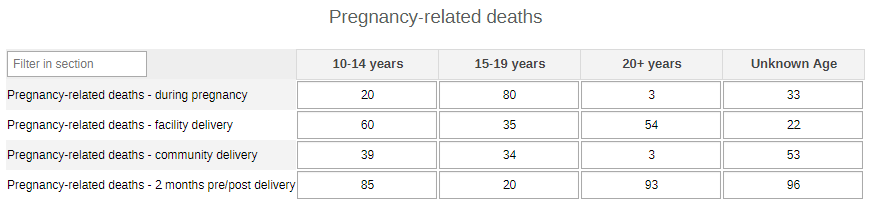

## 3. Validation Rules

The following validation rules have been set up for the Maternal health datasets:

|                                                    Name                                                   |                                                            Instruction                                                            |        Operator       |                      Left side                     |                     Right side                    |
|:---------------------------------------------------------------------------------------------------------:|:---------------------------------------------------------------------------------------------------------------------------------:|:---------------------:|:--------------------------------------------------:|:-------------------------------------------------:|
| CH - AGW assessed for MNS disorders Vs AGW with a possible MNS symptoms                                   | AGW assessed for MNS disorders should be less than or equal to AGW with a possible MNS symptoms                                   | less_than_or_equal_to | AGW assessed for MNS disorders                     | AGW with a possible MNS symptoms                  |
| CH - AGW with MNS disorders/receiving Vs AGW assessed for MNS MH disorders                                | AGW with MNS disorders/receiving should be less than or equal to AGW assessed for MNS MH disorders                                | less_than_or_equal_to | AGW with MNS disorders/receiving                   | AGW assessed for MNS MH disorders                 |
| CH - AGW with MNS disorders/receiving Vs People with MNS disorders/receiving                              | AGW with MNS disorders/receiving should be less than or equal to People with MNS disorders/receiving                              | less_than_or_equal_to | AGW with MNS disorders/receiving                   | People with MNS disorders/receiving               |
| CH - Assessed for MNS disorders conditions by type Vs People with a possible MNS symptoms by type         | Assessed for MNS disorders conditions by type should be less than or equal to People with a possible MNS symptoms by type         | less_than_or_equal_to | Assessed for MNS disorders conditions by type      | People with a possible MNS symptoms by type       |
| CH - MNS disorders receiving - recovery & rehab Vs People with MNS disorders/receiving                    | MNS disorders receiving - recovery & rehab should be less than or equal to People with MNS disorders/receiving                    | less_than_or_equal_to | MNS disorders receiving - recovery & rehab         | People with MNS disorders/receiving               |
| CH - MNS disorders receiving - support for MH Vs People with MNS disorders/receiving                      | MNS disorders receiving - support for MH should be less than or equal to People with MNS disorders/receiving                      | less_than_or_equal_to | MNS disorders receiving - support for MH           | People with MNS disorders/receiving               |
| CH - People assessed for MNS disorders conditions Vs Assessed for MNS disorders conditions by type        | People assessed for MNS disorders conditions should be less than or equal to Assessed for MNS disorders conditions by type        | less_than_or_equal_to | People assessed for MNS disorders conditions       | Assessed for MNS disorders conditions by type     |
| CH - People assessed for MNS disorders conditions Vs People with a possible MNS symptoms                  | People assessed for MNS disorders conditions should be less than or equal to People with a possible MNS symptoms                  | less_than_or_equal_to | People assessed for MNS disorders conditions       | People with a possible MNS symptoms               |
| CH - People with a possible MNS symptoms by type Vs People with a possible MNS symptoms                   | People with a possible MNS symptoms by type should be less than or equal to People with a possible MNS symptoms                   | less_than_or_equal_to | People with a possible MNS symptoms by type        | People with a possible MNS symptoms               |
| CH - People with MNS disorders - MH promotion and prev Vs People with MNS disorders/receiving             | People with MNS disorders - MH promotion and prev should be less than or equal to People with MNS disorders/receiving             | less_than_or_equal_to | People with MNS disorders - MH promotion and prev  | People with MNS disorders/receiving               |
| CH - People with MNS disorders receiving - MH awareness Vs People with MNS disorders/receiving            | People with MNS disorders receiving - MH awareness should be less than or equal to People with MNS disorders/receiving            | less_than_or_equal_to | People with MNS disorders receiving - MH awareness | People with MNS disorders/receiving               |
| CH - People with MNS disorders/receiving Vs People assessed for MNS disorders                             | People with MNS disorders/receiving should be less than or equal to People assessed for MNS disorders                             | less_than_or_equal_to | People with MNS disorders/receiving                | People assessed for MNS disorders                 |
| CH - People with MNS disorders referred Vs People assessed for MNS disorders conditions                   | People with MNS disorders referred should be less than or equal to People assessed for MNS disorders conditions                   | less_than_or_equal_to | People with MNS disorders referred                 | People assessed for MNS disorders conditions      |
| CH - HIV tests performed amongst KP & results returned Vs HIV tests performed where results were returned | HIV tests performed amongst KP & results returned should be less than or equal to HIV tests performed where results were returned | less_than_or_equal_to | HIV tests performed amongst KP & results returned  | HIV tests performed where results were returned   |
| CH - HIV tests performed amongst TB & results returned Vs HIV tests performed where results were returned | HIV tests performed amongst TB & results returned should be less than or equal to HIV tests performed where results were returned | less_than_or_equal_to | HIV tests performed amongst TB & results returned  | HIV tests performed where results were returned   |
| CH - New HIV-positive result or diagnosis was returned Vs HIV tests performed where results were returned | New HIV-positive result or diagnosis was returned should be less than or equal to HIV tests performed where results were returned | less_than_or_equal_to | New HIV-positive result or diagnosis was returned  | HIV tests performed where results were returned   |
| CH - New HIV-positive result returned for KP Vs HIV tests performed amongst KP & results returned         | New HIV-positive result returned for KP should be less than or equal to HIV tests performed amongst KP & results returned         | less_than_or_equal_to | New HIV-positive result returned for KP            | HIV tests performed amongst KP & results returned |
| CH - New HIV-positive result returned for KP Vs New HIV-positive result or diagnosis was returned         | New HIV-positive result returned for KP should be less than or equal to New HIV-positive result or diagnosis was returned         | less_than_or_equal_to | New HIV-positive result returned for KP            | New HIV-positive result or diagnosis was returned |
| CH - New HIV-positive result returned for TB Vs HIV tests performed amongst TB & results returned         | New HIV-positive result returned for TB should be less than or equal to HIV tests performed amongst TB & results returned         | less_than_or_equal_to | New HIV-positive result returned for TB            | HIV tests performed amongst TB & results returned |
| CH - New HIV-positive result returned for TB Vs New HIV-positive result or diagnosis was returned         | New HIV-positive result returned for TB should be less than or equal to New HIV-positive result or diagnosis was returned         | less_than_or_equal_to | New HIV-positive result returned for TB            | New HIV-positive result or diagnosis was returned |
| CH - Women attending 1st ANC visit provided by CHW Vs Attending 1st ANC visit & tested for syphilis       | Women attending 1st ANC visit provided by CHW should be less than or equal to Attending 1st ANC visit & tested for syphilis       | less_than_or_equal_to | Women attending 1st ANC visit provided by CHW      | Attending 1st ANC visit & tested for syphilis     |
| CH - Women attending other ANC visits provided by CHW Vs Other ANC visits tested for syphilis             | Women attending other ANC visits provided by CHW should be less than or equal to Other ANC visits tested for syphilis             | less_than_or_equal_to | Women attending other ANC visits provided by CHW   | Other ANC visits tested for syphilis              |
| CH - AGW with measured raised BP during ANC Vs People with measured raised blood pressure                 | AGW with measured raised BP during ANC should be less than or equal to People with measured raised blood pressure                 | less_than_or_equal_to | AGW with measured raised BP during ANC             | People with measured raised blood pressure        |
| CH - AGW with measured raised BP during postpartum care Vs People with measured raised blood pressure     | AGW with measured raised BP during postpartum care should be less than or equal to People with measured raised blood pressure     | less_than_or_equal_to | AGW with measured raised BP during postpartum care | People with measured raised blood pressure        |
| CH - AGW with raised BP during labor and delivery Vs People with measured raised blood pressure           | AGW with raised BP during labor and delivery should be less than or equal to People with measured raised blood pressure           | less_than_or_equal_to | AGW with raised BP during labor and delivery       | People with measured raised blood pressure        |
| CH - ANC contacts given/prescribed iron supplements Vs Community ANC contacts                             | ANC contacts given/prescribed iron supplements should be less than or equal to Community ANC contacts                             | less_than_or_equal_to | ANC contacts given/prescribed iron supplements     | Community ANC contacts                            |
| CH - ANC contacts received breastfeeding counselling Vs Community ANC contacts                            | ANC contacts received breastfeeding counselling should be less than or equal to Community ANC contacts                            | less_than_or_equal_to | ANC contacts received breastfeeding counselling    | Community ANC contacts                            |
| CH - 1st ANC contact with CHW during 1st trimester Vs Pregnant women who had at least one ANC with CHW    | 1st ANC contact with CHW during 1st trimester should be less than or equal to Pregnant women who had at least one ANC with CHW    | less_than_or_equal_to | 1st ANC contact with CHW during 1st trimester      | Pregnant women who had at least one ANC with CHW  |

## 4. Analytics and Indicators

Just as for the DEs, in the table below the column “Indicator Groups” provides information about whether the indicator is found in groups other than the MatH indicator group.

| Name                                                                          | Description                                                                                                                              | Numerator                                              | Denominator                                      | Indicator Groups                                                                                                                |
|-------------------------------------------------------------------------------|------------------------------------------------------------------------------------------------------------------------------------------|--------------------------------------------------------|--------------------------------------------------|---------------------------------------------------------------------------------------------------------------------------------|
| CH028a - HIV tests with returned results                                      | Number of HIV tests conducted and results returned                                                                                       | HIV tests performed where results were returned        | 1                                                | CH - HIV, CH - Child Health, CH - Maternal Health, CH - Adolescent Health, CH - ICCM, CH - Sexual and Reproductive Health       |
| CH028b - HIV +ve tests returned to people (%)                                 | Proportion of HIV tests performed that were positive and results returned to people                                                      | New HIV-positive result or diagnosis was returned      | HIV tests performed where results were returned  | CH - HIV, CH - Child Health, CH - Maternal Health, CH - Adolescent Health, CH - ICCM, CH - Sexual and Reproductive Health       |
| CH030 - Antenatal care attendees tested for syphilis (%)                      | Proportion of antenatal care attendees tested for syphilis                                                                               | Women attending ANC & tested for syphilis              | Women attending ANC provided by CHW              | CH - HIV, CH - Maternal Health, CH - Sexual and Reproductive Health                                                             |
| CH035 - Pregnant women with 1st ANC visit during 1st trimester (%)            | Proportion of pregnant women who have first antenatal care (ANC) contact with a CHW during the first trimester of pregnancy              | 1st ANC contact with CHW during 1st trimester          | Pregnant women who had at least one ANC with CHW | CH - Maternal Health                                                                                                            |
| CH036 - ANC visits with breastfeeding counselling (%)                         | Proportion of antenatal care contacts during which women received breastfeeding counselling                                              | ANC contacts received breastfeeding counselling        | Community ANC contacts                           | CH - Nutrition, CH - Maternal Health                                                                                            |
| CH036b - Community ANC visits                                                 | Number of antenatal care contacts in the community                                                                                       | ANC contacts                                           | 1                                                | CH - Nutrition, CH - Maternal Health                                                                                            |
| CH037 - Women given/prescribed iron supplements during ANC (%)                | Proportion of community antenatal care contacts given/prescribed iron-containing supplements                                             | ANC contacts given/prescribed iron supplements         | Community ANC contacts                           | CH - Nutrition, CH - Maternal Health                                                                                            |
| CH038b - Females with measured raised blood pressure (%)                      | Proportion of females with raised blood pressure measured by CHW                                                                         | Females with measured raised blood pressure            | Females 10+ years in the catchment area          | CH - Maternal Health, CH - Noncommunicable diseases                                                                             |
| CH038c - Women with measured raised blood pressure - ANC                      | Number of Women with measured raised blood pressure - ANC                                                                                | Women with measured raised blood pressure - ANC        | 1                                                | CH - Maternal Health, CH - Noncommunicable diseases                                                                             |
| CH038d - Women with measured raised blood pressure - Delivery                 | Number of Women with measured raised blood pressure - Delivery                                                                           | Women with measured raised blood pressure - Delivery   | 1                                                | CH - Maternal Health, CH - Noncommunicable diseases                                                                             |
| CH038e - Women with measured raised blood pressure - Postpartum               | Number of Women with measured raised blood pressure - Postpartum                                                                         | Women with measured raised blood pressure - Postpartum | 1                                                | CH - Maternal Health, CH - Noncommunicable diseases                                                                             |
| CH038 - People with measured raised blood pressure (%)                        | Proportion of people with raised blood pressure measured by CHW                                                                          | People with measured raised blood pressure             | People 10+ years in the catchment area           | CH - Maternal Health, CH - Noncommunicable diseases                                                                             |
| CH039b - Pregnant women referred for maternal complications - ANC             | Number of pregnant women referred for maternal complications - ANC                                                                       | Women referred for maternal complications              | 1                                                | CH - Maternal Health                                                                                                            |
| CH039c - Pregnant women referred for maternal complications - Labour/delivery | Number of pregnant women referred for maternal complications - Labour/Delivery                                                           | Women referred for maternal complications              | 1                                                | CH - Maternal Health                                                                                                            |
| CH039d - Pregnant women referred for maternal complications - Postpartum      | Number of pregnant women referred for maternal complications - Postpartum                                                                | Women referred for maternal complications              | 1                                                | CH - Maternal Health                                                                                                            |
| CH039 - Pregnant women referred for maternal complications                    | Number of pregnant women referred for maternal complications                                                                             | Women referred for maternal complications              | 1                                                | CH - Maternal Health                                                                                                            |
| CH040 - Women given postpartum uteronic after delivery without SBA (%)        | Proportion of women who delivered without a skilled birth attendant (SBA) and who were administered oral immediate postpartum uterotonic | AGW without SBA and given postpartum uterotonic        | Live births delivered in the community           | CH - Maternal Health                                                                                                            |
| CH041m - Women assessed for MNS disorders                                     | Number of Women assessed for mental, neurological and substance use (MNS) disorders                                                      | Women assessed for MNS disorders conditions            | 1                                                | CH - HIV, CH - Tuberculosis, CH - Neglected tropical diseases, CH - Maternal Health, CH - Adolescent Health, CH - Mental health |
| CH041 - People assessed for MNS disorders                                     | Number of people assessed for mental, neurological and substance use (MNS) disorders                                                     | People assessed for MNS disorders conditions           | 1                                                | CH - HIV, CH - Tuberculosis, CH - Neglected tropical diseases, CH - Maternal Health, CH - Adolescent Health                     |
| CH041 - People assessed for MNS disorders (%)                                 | Proportion of people assessed for mental, neurological and substance use (MNS) disorders                                                 | People assessed for MNS disorders conditions           | People with a possible MNS symptoms              | CH - HIV, CH - Tuberculosis, CH - Neglected tropical diseases, CH - Maternal Health, CH - Adolescent Health, CH - Mental health |
| CH042b - Women referred for MNS disorders (%)                                 | Proportion of Women with mental, neurologic and substance use (MNS) referred                                                             | People with MNS disorders referred                     | Women assessed for MNS disorders conditions      | CH - HIV, CH - Tuberculosis, CH - Neglected tropical diseases, CH - Maternal Health, CH - Adolescent Health, CH - Mental health |
| CH042 - People referred for MNS disorders (%)                                 | Proportion of people with mental, neurologic and substance use (MNS) referred                                                            | People with MNS disorders referred                     | People assessed for MNS disorders conditions     | CH - HIV, CH - Tuberculosis, CH - Neglected tropical diseases, CH - Maternal Health, CH - Adolescent Health, CH - Mental health |
| CH043 - People with MNS disorders receiving services (%)                      | Proportion of people with mental, neurologic and substance use (MNS) disorders receiving services                                        | People with MNS disorders/receiving                    | People assessed for MNS disorders conditions     | CH - HIV, CH - Tuberculosis, CH - Neglected tropical diseases, CH - Maternal Health, CH - Adolescent Health, CH - Mental health |
| CH044b - Pregnancy-related deaths - during pregnancy                          | Number of pregnancy-related deaths - during pregnancy                                                                                    | Pregnancy-related deaths - During pregnancy            | 1                                                | CH - Maternal Health                                                                                                            |
| CH044c - Pregnancy-related deaths - delivery at facility                      | Number of pregnancy-related deaths - delivery at facility                                                                                | Pregnancy-related deaths - delivery at facility        | 1                                                | CH - Maternal Health                                                                                                            |
| CH044d - Pregnancy-related deaths - delivery in community                     | Number of pregnancy-related deaths - delivery in community                                                                               | Pregnancy-related deaths - delivery community          | 1                                                | CH - Maternal Health                                                                                                            |
| CH044e - Pregnancy-related deaths - 2 months pre/post delivery                | Number of pregnancy-related deaths - 2 months pre/post delivery                                                                          | Pregnancy-related deaths - 2 months pre/post delivery  | 1                                                | CH - Maternal Health                                                                                                            |
| CH044 - Pregnancy-related deaths                                              | Number of pregnancy-related deaths                                                                                                       | Pregnancy-related deaths                               | 1                                                | CH - Maternal Health, CH - Civil registration and vital statistics                                                              |

## 5. Dashboards

The module includes a predefined dashboard called “CH - Adolescent Health”.

The dashboard is divided in two based on the periodicity of the datasets.
The first part is for monthly indicators. The predefined items on the dashboard include data as per the sections present in the dataset, but the content should be adapted based on the local activities.

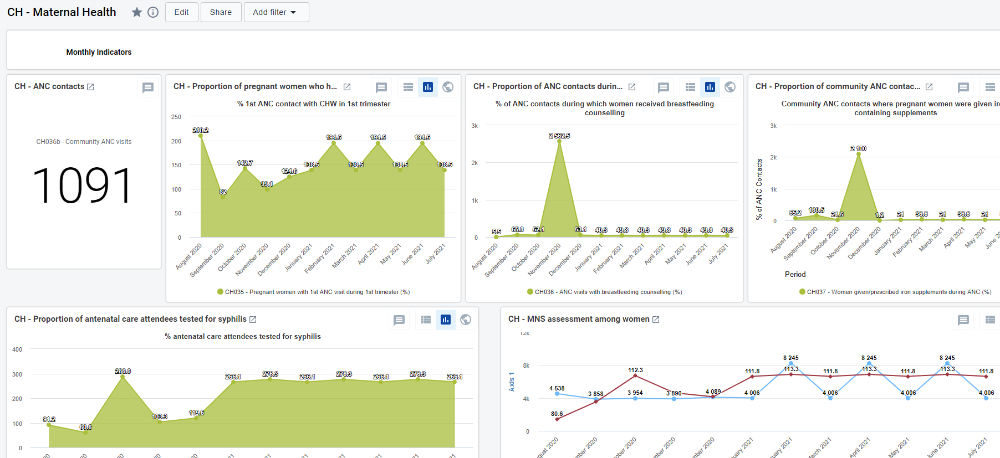

The second part of the dashboard is dedicated to the annual dataset (Annual Household Assessment Indicators). The predefined analyse and visualize the main areas of the dataset, though the dashboard should be modified to better mirror the local activities.

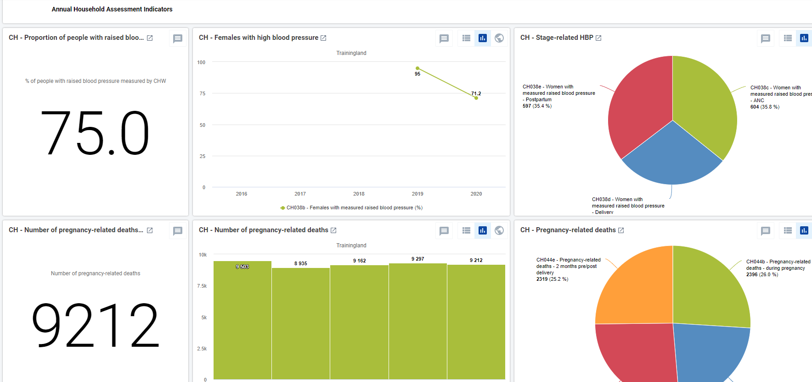
