# CH - Mental Health { #ch-men-aggregate-design }

## 1. Dataset Configuration

### 1.1. Configuration Summary

The aggregate CH - Adolescent Health (MH) module includes:

1. A **monthly dataset** with key data elements for MH
2. A **yearly dataset** for the follow up of key annual information on MH
3. **Core indicators** for both datasets
4. A predefined **“CH - Mental Health”** dashboard

It is recommended that the datasets get assigned to Organisation Units **at the lowest level** of the health system feasible for reporting data, such as Villages or any appropriate community demarcation according to the local context.

## 1.2. Data Elements

The table below summarizes the data elements present in the MH module. The “Data elements groups” and “Datasets” columns will provide extra information on where the same DEs can be found in the other CHIS modules. This should facilitate the mapping of the package among all its modules and navigate the datasets while avoiding the collection and data entry of the same DEs in multiple locations.

All the DEs in the MH module are used in the build up of indicators.

| Name                                                                                    | Description                                                                                                              | Disaggregation                          | Data Sets                                                                                                                                                                                   | Data Element Groups                                                                                                             |   |
|-----------------------------------------------------------------------------------------|--------------------------------------------------------------------------------------------------------------------------|-----------------------------------------|---------------------------------------------------------------------------------------------------------------------------------------------------------------------------------------------|---------------------------------------------------------------------------------------------------------------------------------|---|
| CH041a - People assessed for MNS disorders/ MH conditions                               | People assessed for MNS disorders/ MH conditions                                                                         | Age (10-70+years)/Sex (Other/Unk)       | CH - Tuberculosis (Monthly); CH - Maternal Health (Monthly); CH - HIV (Monthly); CH - Mental health (Monthly); CH - Adolescent Health (Monthly); CH - Neglected tropical diseases (Monthly) | CH - Mental health; CH - Neglected tropical diseases; CH - Maternal Health; CH - Adolescent Health; CH - HIV; TB - Tuberculosis |   |
| CH041b - People with possible MNS symptoms                                              | People with possible MNS symptoms                                                                                        | Age (10-70+years)/Sex (Other/Unk)       | CH - Tuberculosis (Monthly); CH - Maternal Health (Monthly); CH - Neglected tropical diseases (Monthly); CH - HIV (Monthly); CH - Mental health (Monthly); CH - Adolescent Health (Monthly) | CH - Mental health; CH - Neglected tropical diseases; CH - Maternal Health; CH - Adolescent Health; CH - HIV; TB - Tuberculosis |   |
| CH041c - People assessed for MNS disorders/ MH conditions                               | People assessed for MNS disorders/mental health conditions by type                                                       | Mental health conditions                | CH - Adolescent Health (Monthly); CH - Tuberculosis (Monthly); CH - Neglected tropical diseases (Monthly); CH - Maternal Health (Monthly); CH - HIV (Monthly); CH - Mental health (Monthly) | CH - Mental health; CH - Neglected tropical diseases; CH - Maternal Health; CH - Adolescent Health; CH - HIV; TB - Tuberculosis |   |
| CH041d - People with possible MNS symptoms                                              | People with possible symptoms of MNS conditions                                                                          | Mental health conditions                | CH - Tuberculosis (Monthly); CH - HIV (Monthly); CH - Maternal Health (Monthly); CH - Adolescent Health (Monthly); CH - Mental health (Monthly); CH - Neglected tropical diseases (Monthly) | CH - Mental health; CH - Neglected tropical diseases; CH - Maternal Health; CH - Adolescent Health; CH - HIV; TB - Tuberculosis |   |
| CH041e - Women assessed for MNS disorders/ MH conditions                                | Women and adolescent girls assessed for MNS disorders / MH conditions                                                    | Pregnant/Postpartum                     | CH - Tuberculosis (Monthly); CH - Maternal Health (Monthly); CH - Neglected tropical diseases (Monthly); CH - Adolescent Health (Monthly); CH - Mental health (Monthly); CH - HIV (Monthly) | CH - Mental health; CH - Neglected tropical diseases; CH - Maternal Health; CH - Adolescent Health; CH - HIV; TB - Tuberculosis |   |
| CH041f - Women with possible MNS symptoms                                               | Women and adolescent girls with possible MNS symptoms                                                                    | Pregnant/Postpartum                     | CH - Tuberculosis (Monthly); CH - Maternal Health (Monthly); CH - Neglected tropical diseases (Monthly); CH - Adolescent Health (Monthly); CH - HIV (Monthly); CH - Mental health (Monthly) | CH - Mental health; CH - Neglected tropical diseases; CH - Maternal Health; CH - Adolescent Health; CH - HIV; TB - Tuberculosis |   |
| CH042a - People  with MNS disorders referred                                            | People with MNS disorders referred                                                                                       | Age (10-70+years)/Sex (Other/Unk)       | CH - Neglected tropical diseases (Monthly); CH - Adolescent Health (Monthly); CH - HIV (Monthly); CH - Maternal Health (Monthly); CH - Tuberculosis (Monthly); CH - Mental health (Monthly) | CH - Mental health; CH - Neglected tropical diseases; CH - Maternal Health; CH - Adolescent Health; CH - HIV; TB - Tuberculosis |   |
| CH042b - People with MNS disorders referred by type                                     | People with MNS disorders referred by type                                                                               | Mental health conditions                | CH - HIV (Monthly); CH - Mental health (Monthly); CH - Adolescent Health (Monthly); CH - Tuberculosis (Monthly); CH - Neglected tropical diseases (Monthly); CH - Maternal Health (Monthly) | CH - Mental health; CH - Neglected tropical diseases; CH - Maternal Health; CH - Adolescent Health; CH - HIV; TB - Tuberculosis |   |
| CH042c - Women with MNS disorders referred                                              | Women and adolescent girls with MNS disorders/mental health conditions referred                                          | Pregnant/Postpartum                     | CH - Tuberculosis (Monthly); CH - HIV (Monthly); CH - Maternal Health (Monthly); CH - Mental health (Monthly); CH - Adolescent Health (Monthly); CH - Neglected tropical diseases (Monthly) | CH - Mental health; CH - Neglected tropical diseases; CH - Maternal Health; CH - Adolescent Health; CH - HIV; TB - Tuberculosis |   |
| CH043a - People with MNS disorders receiving services                                   | People with MNS disorders/mental health conditions receiving services                                                    | Age (10-70+years)/Sex (Other/Unk)       | CH - Mental health (Yearly); CH - HIV (Yearly); CH - Maternal Health (Yearly); CH - Neglected tropical diseases (Yearly); CH - Adolescent Health (Yearly); CH - Tuberculosis (Yearly)       | CH - Mental health; CH - Neglected tropical diseases; CH - Maternal Health; CH - Adolescent Health; CH - HIV; TB - Tuberculosis |   |
| CH043b - People assessed for MNS disorders                                              | People assessed for MNS disorders/mental health conditions                                                               | Age (10-70+years)/Sex (Other/Unk)       | CH - Adolescent Health (Yearly); CH - Tuberculosis (Yearly); CH - Mental health (Yearly); CH - Maternal Health (Yearly); CH - HIV (Yearly); CH - Neglected tropical diseases (Yearly)       | CH - Mental health; CH - Neglected tropical diseases; CH - Maternal Health; CH - Adolescent Health; CH - HIV; TB - Tuberculosis |   |
| CH043c - People with MNS disorders receiving services - MH awareness                    | People with MNS disorders/mental health conditions receiving services - mental health awareness                          | default                                 | CH - Neglected tropical diseases (Yearly); CH - Mental health (Yearly); CH - Tuberculosis (Yearly); CH - Adolescent Health (Yearly); CH - Maternal Health (Yearly); CH - HIV (Yearly)       | CH - Mental health; CH - Neglected tropical diseases; CH - Maternal Health; CH - Adolescent Health; CH - HIV; TB - Tuberculosis |   |
| CH043d - People with MNS disorders receiving services - MH HP                           | People with MNS disorders/mental health conditions receiving services - mental health promotion and prevention           | default                                 | CH - Tuberculosis (Yearly); CH - Mental health (Yearly); CH - Maternal Health (Yearly); CH - Neglected tropical diseases (Yearly); CH - Adolescent Health (Yearly); CH - HIV (Yearly)       | CH - Mental health; CH - Neglected tropical diseases; CH - Maternal Health; CH - Adolescent Health; CH - HIV; TB - Tuberculosis |   |
| CH043e - People with MNS disorders receiving services - MH support                      | People with MNS disorders/mental health conditions receiving services - support for people with mental health conditions | default                                 | CH - Maternal Health (Yearly); CH - Neglected tropical diseases (Yearly); CH - HIV (Yearly); CH - Mental health (Yearly); CH - Tuberculosis (Yearly); CH - Adolescent Health (Yearly)       | CH - Mental health; CH - Neglected tropical diseases; CH - Maternal Health; CH - Adolescent Health; CH - HIV; TB - Tuberculosis |   |
| CH043f - People with MNS disorders receiving services - recovery/rehab                  | People with MNS disorders/mental health conditions receiving services - recovery and rehabilitation                      | default                                 | CH - Adolescent Health (Yearly); CH - Tuberculosis (Yearly); CH - Neglected tropical diseases (Yearly); CH - HIV (Yearly); CH - Maternal Health (Yearly); CH - Mental health (Yearly)       | CH - Mental health; CH - Neglected tropical diseases; CH - Maternal Health; CH - Adolescent Health; CH - HIV; TB - Tuberculosis |   |
| CH043g - Women with MNS disorders receiving services                                    | Women and adolescent girls with MNS disorders/mental health conditions receiving services                                | Pregnant/Postpartum                     | CH - Mental health (Yearly); CH - Tuberculosis (Yearly); CH - Maternal Health (Yearly); CH - HIV (Yearly); CH - Neglected tropical diseases (Yearly); CH - Adolescent Health (Yearly)       | CH - Mental health; CH - Neglected tropical diseases; CH - Maternal Health; CH - Adolescent Health; CH - HIV; TB - Tuberculosis |   |
| CH043h - Women assessed for MNS disorders                                               | Women and adolescent girls assessed for MNS disorders/mental health conditions                                           | Pregnant/Postpartum                     | CH - Neglected tropical diseases (Yearly); CH - Tuberculosis (Yearly); CH - Mental health (Yearly); CH - Adolescent Health (Yearly); CH - Maternal Health (Yearly); CH - HIV (Yearly)       | CH - Mental health; CH - Neglected tropical diseases; CH - Maternal Health; CH - Adolescent Health; CH - HIV; TB - Tuberculosis |   |
| CH075a - Children (0-4 y) monitored for early signs of developmental delays             | Children aged 0-4 years monitored for early signs of developmental delays                                                | Age (<5 years)/Sex (Other/Unk)          | CH - Child Health (Monthly); CH - Mental health (Monthly)                                                                                                                                   | CH - Child Health; CH - Mental health                                                                                           |   |
| CH075b - Children (0-4 y) monitored for early signs of developmental delays referred    | Children (0-4 y) monitored for early signs of developmental delays referred                                              | Age (<5 years)/Sex (Other/Unk)          | CH - Child Health (Monthly); CH - Mental health (Monthly)                                                                                                                                   | CH - Child Health; CH - Mental health                                                                                           |   |
| CH076a - Children with suspected developmental disabilities referred                    | Children with suspected developmental disabilities referred                                                              | Age (0 months-17 years)/Sex (Other/Unk) | CH - Child Health (Monthly); CH - Mental health (Monthly)                                                                                                                                   | CH - Child Health; CH - Mental health                                                                                           |   |
| CH076b - Children assessed for development monitoring                                   | Children who were assessed for their developmental monitoring                                                            | Age (0 months-17 years)/Sex (Other/Unk) | CH - Mental health (Monthly); CH - Child Health (Monthly)                                                                                                                                   | CH - Child Health; CH - Mental health                                                                                           |   |
| CH077a - Caregivers counselled on responsive caregiving and learning activities         | Caregivers receiving counselling on responsive caregiving and early learning activities                                  | Sex (Other/Unk)                         | CH - Mental health (Monthly); CH - Child Health (Monthly)                                                                                                                                   | CH - Child Health; CH - Mental health                                                                                           |   |
| CH077b - Caregivers of children consulting for developmental delays                     | Caregivers of children consulting for developmental delays                                                               | Sex (Other/Unk)                         | CH - Child Health (Monthly); CH - Mental health (Monthly)                                                                                                                                   | CH - Child Health; CH - Mental health                                                                                           |   |
| CH078a - Children with developmental disability whose caregiver received parenting info | Children with suspected developmental disorders and disabilities whose caregivers receive information on parenting       | Age (0 months-17 years)/Sex (Other/Unk) | CH - Mental health (Monthly); CH - Child Health (Monthly)                                                                                                                                   | CH - Child Health; CH - Mental health                                                                                           |   |
| CH078b - Children (0-4 y) assessed for developmental delays - last 12 months            | Children who were assessed for their developmental disorders and disabilities in the past 12 months                      | Age (0 months-17 years)/Sex (Other/Unk) | CH - Mental health (Monthly); CH - Child Health (Monthly)                                                                                                                                   | CH - Child Health; CH - Mental health                                                                                           |   |
| CH088a - People reporting using alcohol                                                 | People reporting using alcohol                                                                                           | Age (10-70+years)/Sex (Other/Unk)       | CH - Adolescent Health (Yearly); CH - Mental health (Yearly)                                                                                                                                | CH - Adolescent Health; CH - Mental health                                                                                      |   |
| CH088b - People assessed for alcohol use                                                | People assessed for alcohol use                                                                                          | Age (10-70+years)/Sex (Other/Unk)       | CH - Adolescent Health (Yearly); CH - Mental health (Yearly)                                                                                                                                | CH - Adolescent Health; CH - Mental health                                                                                      |   |
| CH088c - Women reporting using alcohol                                                  | Women and adolescent girls reported using alcohol                                                                        | Pregnant/Postpartum                     | CH - Adolescent Health (Yearly); CH - Mental health (Yearly)                                                                                                                                | CH - Adolescent Health; CH - Mental health                                                                                      |   |
| CH088d - Women assessed for alcohol use                                                 | Women and adolescent girls assessed for alcohol use                                                                      | Pregnant/Postpartum                     | CH - Mental health (Yearly); CH - Adolescent Health (Yearly)                                                                                                                                | CH - Adolescent Health; CH - Mental health                                                                                      |   |
| CH089a - People with heavy episodic drinking                                            | People with heavy episodic drinking                                                                                      | Age (10-70+years)/Sex (Other/Unk)       | CH - Adolescent Health (Yearly); CH - Noncommunicable diseases (Yearly); CH - Mental health (Yearly)                                                                                        | CH - Adolescent Health; CH - Mental health; CH - Noncommunicable diseases                                                       |   |
| CH089b - People assessed for heavy episodic drinking                                    | People assessed for heavy episodic drinking                                                                              | Age (10-70+years)/Sex (Other/Unk)       | CH - Mental health (Yearly); CH - Noncommunicable diseases (Yearly); CH - Adolescent Health (Yearly)                                                                                        | CH - Adolescent Health; CH - Mental health; CH - Noncommunicable diseases                                                       |   |
| CH089c - Women with heavy episodic drinking                                             | Women and adolescent girls with heavy episodic drinking                                                                  | Pregnant/Postpartum                     | CH - Noncommunicable diseases (Yearly); CH - Adolescent Health (Yearly); CH - Mental health (Yearly)                                                                                        | CH - Adolescent Health; CH - Mental health; CH - Noncommunicable diseases                                                       |   |
| CH089d - Women assessed for heavy episodic drinking                                     | Women and adolescent girls assessed for heavy episodic drinking                                                          | Pregnant/Postpartum                     | CH - Noncommunicable diseases (Yearly); CH - Adolescent Health (Yearly); CH - Mental health (Yearly)                                                                                        | CH - Adolescent Health; CH - Mental health; CH - Noncommunicable diseases                                                       |   |
| CH090a - People reporting use of any psychoactive drugs                                 | People reporting use of any psychoactive drugs                                                                           | Age (10-70+years)/Sex (Other/Unk)       | CH - Mental health (Yearly); CH - Adolescent Health (Yearly)                                                                                                                                | CH - Adolescent Health; CH - Mental health                                                                                      |   |
| CH090b - People assessed for use of any psychoactive drugs                              | People assessed for use of any psychoactive drugs                                                                        | Age (10-70+years)/Sex (Other/Unk)       | CH - Mental health (Yearly); CH - Adolescent Health (Yearly)                                                                                                                                | CH - Adolescent Health; CH - Mental health                                                                                      |   |
| CH090c - People reporting the use of psychoactive drugs                                 | People who report use of any psychoactive drugs by type                                                                  | Drugs Used                              | CH - Adolescent Health (Yearly); CH - Mental health (Yearly)                                                                                                                                | CH - Adolescent Health; CH - Mental health                                                                                      |   |
| CH090d - Women reporting use of any psychoactive drugs                                  | Women and adolescent girls who use of any psychoactive drugs                                                             | Pregnant/Postpartum                     | CH - Mental health (Yearly); CH - Adolescent Health (Yearly)                                                                                                                                | CH - Adolescent Health; CH - Mental health                                                                                      |   |
| CH090e - Women assessed for use of any psychoactive drugs                               | Women and adolescent girls assessed for use of any psychoactive drugs                                                    | Pregnant/Postpartum                     | CH - Adolescent Health (Yearly); CH - Mental health (Yearly)                                                                                                                                | CH - Adolescent Health; CH - Mental health                                                                                      |   |
| CH091a - People reporting use of injection drugs                                        | People reporting use of injection drugs                                                                                  | Age (10-70+years)/Sex (Other/Unk)       | CH - Adolescent Health (Yearly); CH - Mental health (Yearly)                                                                                                                                | CH - Adolescent Health; CH - Mental health                                                                                      |   |
| CH091b - People assessed for injection drug use                                         | People assessed for injection drug use                                                                                   | Age (10-70+years)/Sex (Other/Unk)       | CH - Adolescent Health (Yearly); CH - Mental health (Yearly)                                                                                                                                | CH - Adolescent Health; CH - Mental health                                                                                      |   |
| CH091c - Women reporting use of injection drugs                                         | Women and adolescent girls injecting drug use                                                                            | Pregnant/Postpartum                     | CH - Mental health (Yearly); CH - Adolescent Health (Yearly)                                                                                                                                | CH - Adolescent Health; CH - Mental health                                                                                      |   |
| CH091d - Women assessed for injection drug use                                          | Women and adolescent girls assessed for injecting drug use                                                               | Pregnant/Postpartum                     | CH - Mental health (Yearly); CH - Adolescent Health (Yearly)                                                                                                                                | CH - Adolescent Health; CH - Mental health                                                                                      |   |
| CH092a - People with suicidal ideation or plan                                          | People with suicidal ideation or plan                                                                                    | Age (10-70+years)/Sex (Other/Unk)       | CH - Mental health (Monthly); CH - Adolescent Health (Monthly)                                                                                                                              | CH - Adolescent Health; CH - Mental health                                                                                      |   |
| CH092b - People assessed for suicidal ideation or plan                                  | People assessed for suicidal ideation or plan                                                                            | Age (10-70+years)/Sex (Other/Unk)       | CH - Mental health (Monthly); CH - Adolescent Health (Monthly)                                                                                                                              | CH - Adolescent Health; CH - Mental health                                                                                      |   |
| CH093a - People who reported attempting suicide                                         | People who reported attempting suicide                                                                                   | Age (10-70+years)/Sex (Other/Unk)       | CH - Mental health (Monthly); CH - Adolescent Health (Monthly)                                                                                                                              | CH - Adolescent Health; CH - Mental health                                                                                      |   |
| CH093b - People assessed for attempting suicide                                         | People assessed for attempting suicide                                                                                   | Age (10-70+years)/Sex (Other/Unk)       | CH - Mental health (Monthly); CH - Adolescent Health (Monthly)                                                                                                                              | CH - Adolescent Health; CH - Mental health                                                                                      |   |
| CH094a - Leisure screen time during the week                                            | Amount of time usually spent on a typical weekday dedicated to screen time for leisure activities                        | Age (<1-30+ years)/Sex (Other/Unk)      | CH - Mental health (Yearly); CH - Adolescent Health (Yearly)                                                                                                                                | CH - Adolescent Health; CH - Mental health                                                                                      |   |
| CH094b - Leisure screen time during the weekend                                         | Amount of time usually spent on a typical weekend day dedicated to screen time for leisure activities                    | Age (<1-30+ years)/Sex (Other/Unk)      | CH - Adolescent Health (Yearly); CH - Mental health (Yearly)                                                                                                                                | CH - Adolescent Health; CH - Mental health                                                                                      |   |
| CH094c - People assessed on leisure screen time                                         | People assessed on screen time for leisure activities                                                                    | Age (<1-30+ years)/Sex (Other/Unk)      | CH - Adolescent Health (Yearly); CH - Mental health (Yearly)                                                                                                                                | CH - Adolescent Health; CH - Mental health                                                                                      |   |
| CH170a - Deaths due to drug overdose                                                    | Persons who died from drug overdose deaths in the past 12 months                                                         | Age (10-70+years)/Sex (Other/Unk)       | CH - Mental health (Yearly)                                                                                                                                                                 | CH - Mental health                                                                                                              |   |
| CH170b - Deaths due to drug overdose by type                                            | Persons who died from drug overdose deaths in the past 12 months by type                                                 | Overdose drugs                          | CH - Mental health (Yearly)                                                                                                                                                                 | CH - Mental health                                                                                                              |   |

## 2. Dataset Details

### 2.1. Monthly Mental Health Dataset

#### 2.1.1. Mental Health Disorders and Conditions - All

The section focuses on all the people benefiting from MH assessments and referrals. The data are disaggregated by age (10-14y, 15-19y, 20-39y, 40-49y, 50-59y, 60-69y, 70+, unknown age) and sex (male, female, other, unknown).

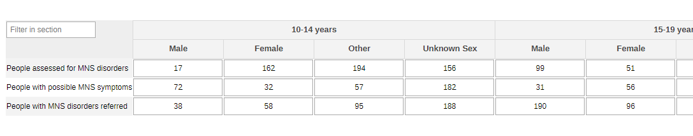

#### 2.1.2. Mental Health Disorders and Conditions - by Type

The information collected on the general population (section 2.1.1.) can also be disaggregated by type of condition (depression, psychoses, behavioural conditions, dementia, substance use, suicide/self harm) - the conditions should be edited and adapted to the local context.

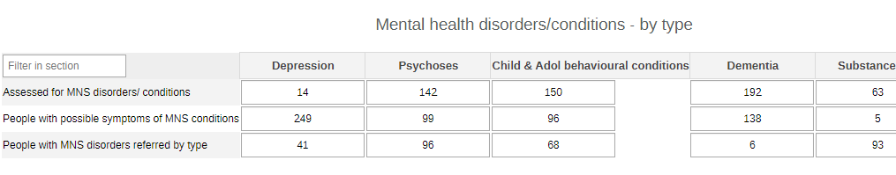

#### 2.1.3. Mental Health Disorders and Conditions - Pregnant and Postpartum

This section collects the same variables as the other two sections on MH, but it focuses specifically on pregnant and postpartum women benefiting from MH community activities.

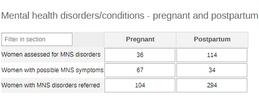

#### 2.1.4. Developmental Delays - Monitored for Early Signs

The section collects the information related to the assessment of early developmental disabilities among children under 5 years of age by age groups (0-11m and 1-4y) and sex (male, female, other, unknown sex).

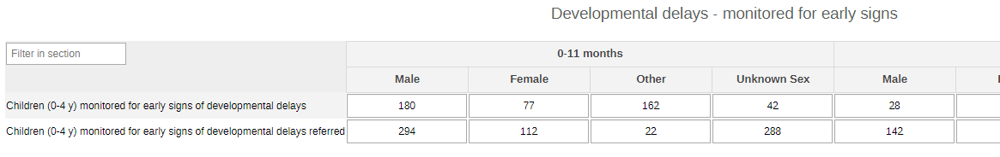

#### 2.1.5. Developmental Delays - Suspects Referred

The section collects the information related to the assessment of developmental disabilities among children as per WHO definition (up to 18 years). The data are disaggregated by age groups (0-11m, 1-4y, 5-9y, 10-14y, 15-17y, unknown) and sex (male, female, other, unknown).

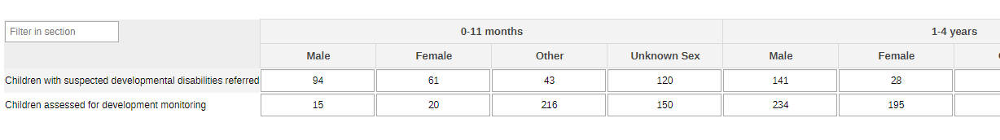

#### 2.1.6. Developmental Delays - Caregivers Counselled

The section collects data on sensibilization activities given to caregivers of children with developmental disabilities. The data are disaggregated by sex of the caregiver (male, female, other, unknown).

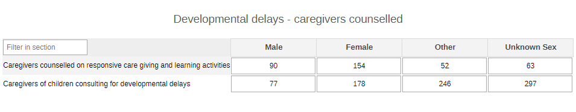

#### 2.1.7. Developmental Delays - Caregivers Receiving Parenting Info

The section summarizes the data collected during parenting information sessions among caregivers of children assessed for developmental delays during the past 12 months.

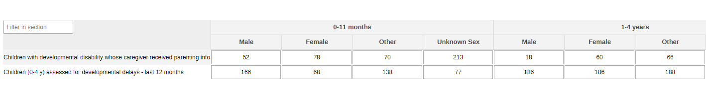

#### 2.1.8. Suicide Attempts

The section collects information on the risk of suicide (ideation, attempted, or reported) in the community. The data are collected by age (10-14y, 15-19y, 20-39y, 40-49y, 50-59y, 60-69y, 70+y, unknown age) and sex (male, female, other, unknown sex).

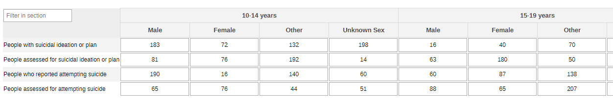

### 2.2. Yearly Mental Health Dataset

#### 2.2.1. Mental Health Conditions and Disorders - All

The section focuses on all the people benefiting from MH assessments and referrals. The data are disaggregated by age (10-14y, 15-19y, 20-39y, 40-49y, 50-59y, 60-69y, 70+, unknown age) and sex (male, female, other, unknown).

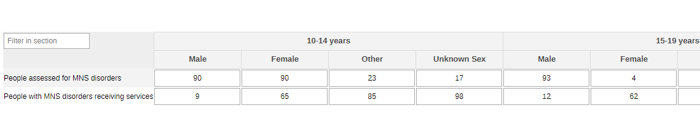

#### 2.2.2. Mental Health conditions and Disorders - Pregnant and Postpartum

This section collects the same variables as the other section on MH, but it focuses specifically on pregnant and postpartum women.

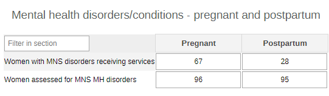

#### 2.2.3. Mental Health Conditions and Disorders - Awareness and Support

The section collects the number of people accessing MH-related services and support activities.

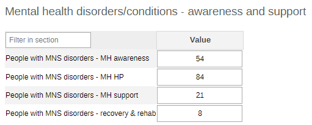

#### 2.2.4. Alcohol Use - All

The section reports the data on the alcohol use assessment carried in the community. The data are disaggregated by age groups (10-14y, 15-19y, 20-39y, 40-49y, 50-59y, 60-69y, 70+, unknown age) and sex (male, female, other, unknown).

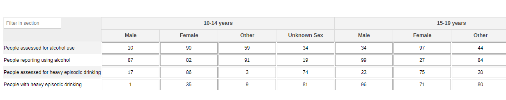

#### 2.2.5. Alcohol Use - Pregnant and Postpartum

The section on alcohol use is focused on the assessment carried out among the pregnant and postpartum women in the community.

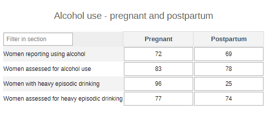

#### 2.2.6. Drug Use - All

The section reports the data on the assessment on drug use carried out among the general population. The data are disaggregated by age groups (10-14y, 15-19y, 20-39y, 40-49y, 50-59y, 60-69y, 70+, unknown age) and sex (male, female, other, unknown).

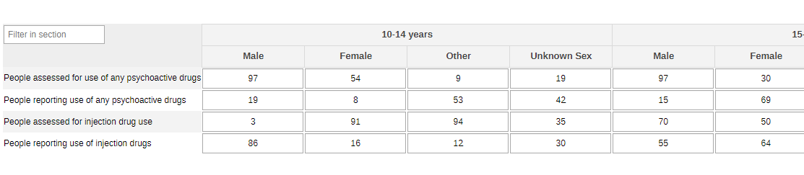

#### 2.2.7. Drug Use - by Type

The data collected in section 2.2.6. can also be disaggregated by the type of consumed drug. Currently the data re disaggregated by cannabis, opioids, cocaine, amphetamine, other, but the categories should be modified according to the local context.

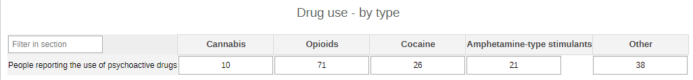

#### 2.2.8. Drug Use - Pregnant and Postpartum

The section reports the data coming from the assessment on drug use among pregnant and postpartum women in the community.

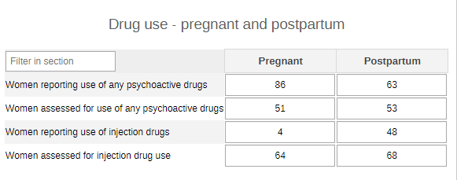

#### 2.2.9. Drug Overdoses

The section collects the number of deaths due to drug overdoses. The first table reports teh data byage groups (10-14y, 15-19y, 20-39y, 40-49y, 50-59y, 60-69y, 70+, unknown age) and sex (male, female, other, unknown); whereas the second table reports the same information by the type of drug that caused the overdose (opioids, non-opioid, other, unknown drug).

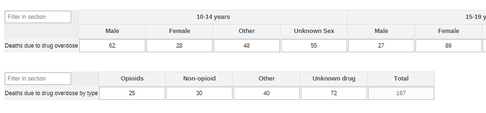

#### 2.2.10. Screen Time

The information reported in the section provides the necessary info to get an estimate of the times spent in front of a screen during people’s spare time during the week and the weekend. The data are disaggregated by age groups (<1y, 1-2y, 3-4y, 5-12y, 13-17y, 18-24y, 25-29y, 30+y, unknown) and by sex (male, female, other unknown).

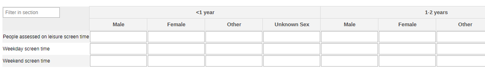

## 3. Validation Rules

The following validation rules have been set up for the Adolescent health datasets:

| name                                                                                                      | instruction                                                                                                                       | operator              | leftSide description                               | rightSide description                              |   |
|-----------------------------------------------------------------------------------------------------------|-----------------------------------------------------------------------------------------------------------------------------------|-----------------------|----------------------------------------------------|----------------------------------------------------|---|
| CH - AGW assessed for heavy episodic drinking Vs People assessed for heavy episodic drinking              | AGW assessed for heavy episodic drinking should be less than or equal to People assessed for heavy episodic drinking              | less_than_or_equal_to | AGW assessed for heavy episodic drinking           | People assessed for heavy episodic drinking        |   |
| CH - AGW assessed for injecting drug use Vs People assessed for injecting drug use                        | AGW assessed for injecting drug use should be less than or equal to People assessed for injecting drug use                        | less_than_or_equal_to | AGW assessed for injecting drug use                | People assessed for injecting drug use             |   |
| CH - AGW assessed for MNS disorders Vs AGW with a possible MNS symptoms                                   | AGW assessed for MNS disorders should be less than or equal to AGW with a possible MNS symptoms                                   | less_than_or_equal_to | AGW assessed for MNS disorders                     | AGW with a possible MNS symptoms                   |   |
| CH - AGW assessed for use of any psychoactive drugs Vs People assessed for use of any psychoactive drugs  | AGW assessed for use of any psychoactive drugs should be less than or equal to People assessed for use of any psychoactive drugs  | less_than_or_equal_to | AGW assessed for use of any psychoactive drugs     | People assessed for use of any psychoactive drugs  |   |
| CH - AGW who use of any psychoactive drugs Vs People who report use of any psychoactive drugs             | AGW who use of any psychoactive drugs should be less than or equal to People who report use of any psychoactive drugs             | less_than_or_equal_to | AGW who use of any psychoactive drugs              | People who report use of any psychoactive drugs    |   |
| CH - AGW with heavy episodic drinking Vs People with heavy episodic drinking                              | AGW with heavy episodic drinking should be less than or equal to People with heavy episodic drinking                              | less_than_or_equal_to | AGW with heavy episodic drinking                   | People with heavy episodic drinking                |   |
| CH - AGW with MNS disorders/receiving Vs AGW assessed for MNS MH disorders                                | AGW with MNS disorders/receiving should be less than or equal to AGW assessed for MNS MH disorders                                | less_than_or_equal_to | AGW with MNS disorders/receiving                   | AGW assessed for MNS MH disorders                  |   |
| CH - AGW with MNS disorders/receiving Vs People with MNS disorders/receiving                              | AGW with MNS disorders/receiving should be less than or equal to People with MNS disorders/receiving                              | less_than_or_equal_to | AGW with MNS disorders/receiving                   | People with MNS disorders/receiving                |   |
| CH - Assessed for MNS disorders conditions by type Vs People with a possible MNS symptoms by type         | Assessed for MNS disorders conditions by type should be less than or equal to People with a possible MNS symptoms by type         | less_than_or_equal_to | Assessed for MNS disorders conditions by type      | People with a possible MNS symptoms by type        |   |
| CH - Caregivers who received info on parenting Vs Children assessed for dev disorders & disabilities      | Caregivers who received info on parenting should be less than or equal to Children assessed for dev disorders & disabilities      | less_than_or_equal_to | Caregivers who received info on parenting          | Children assessed for dev disorders & disabilities |   |
| CH - Children 0-4 years with dev delays referred Vs Children 0-4 y monitored for signs of dev delays      | Children 0-4 years with dev delays referred should be less than or equal to Children 0-4 y monitored for signs of dev delays      | less_than_or_equal_to | Children 0-4 years with dev delays referred        | Children 0-4 y monitored for signs of dev delays   |   |
| CH - Children with suspected dev disabilities referred Vs Children assessed for their dev monitoring      | Children with suspected dev disabilities referred should be less than or equal to Children assessed for their dev monitoring      | less_than_or_equal_to | Children with suspected dev disabilities referred  | Children assessed for their dev monitoring         |   |
| CH - Counselled on caregiving & early learning Vs Caregivers of children consulting for dev delays        | Counselled on caregiving & early learning should be less than or equal to Caregivers of children consulting for dev delays        | less_than_or_equal_to | Counselled on caregiving & early learning          | Caregivers of children consulting for dev delays   |   |
| CH - Died from drug overdose deaths by type Vs Died from drug overdose deaths                             | Died from drug overdose deaths by type should be less than or equal to Died from drug overdose deaths                             | less_than_or_equal_to | Deaths due to overdose by type                     | Deaths due to overdose                             |   |
| CH - MNS disorders receiving - recovery & rehab Vs People with MNS disorders/receiving                    | MNS disorders receiving - recovery & rehab should be less than or equal to People with MNS disorders/receiving                    | less_than_or_equal_to | MNS disorders receiving - recovery & rehab         | People with MNS disorders/receiving                |   |
| CH - MNS disorders receiving - support for MH Vs People with MNS disorders/receiving                      | MNS disorders receiving - support for MH should be less than or equal to People with MNS disorders/receiving                      | less_than_or_equal_to | MNS disorders receiving - support for MH           | People with MNS disorders/receiving                |   |
| CH - People assessed for MNS disorders conditions Vs Assessed for MNS disorders conditions by type        | People assessed for MNS disorders conditions should be less than or equal to Assessed for MNS disorders conditions by type        | less_than_or_equal_to | People assessed for MNS disorders conditions       | Assessed for MNS disorders conditions by type      |   |
| CH - People assessed for MNS disorders conditions Vs People with a possible MNS symptoms                  | People assessed for MNS disorders conditions should be less than or equal to People with a possible MNS symptoms                  | less_than_or_equal_to | People assessed for MNS disorders conditions       | People with a possible MNS symptoms                |   |
| CH - People reported using alcohol Vs Number people assessed for alcohol use                              | People reported using alcohol should be less than or equal to Number people assessed for alcohol use                              | less_than_or_equal_to | People reported using alcohol                      | Number people assessed for alcohol use             |   |
| CH - People who reported attempting suicide Vs People assessed for attempting suicide                     | People who reported attempting suicide should be less than or equal to People assessed for attempting suicide                     | less_than_or_equal_to | People who reported attempting suicide             | People assessed for attempting suicide             |   |
| CH - People who report injecting drug use Vs People assessed for injecting drug use                       | People who report injecting drug use should be less than or equal to People assessed for injecting drug use                       | less_than_or_equal_to | People who report injecting drug use               | People assessed for injecting drug use             |   |
| CH - People who report use of any psychoactive drugs Vs People assessed for use of any psychoactive drugs | People who report use of any psychoactive drugs should be less than or equal to People assessed for use of any psychoactive drugs | less_than_or_equal_to | People who report use of any psychoactive drugs    | People assessed for use of any psychoactive drugs  |   |
| CH - People with a possible MNS symptoms by type Vs People with a possible MNS symptoms                   | People with a possible MNS symptoms by type should be less than or equal to People with a possible MNS symptoms                   | less_than_or_equal_to | People with a possible MNS symptoms by type        | People with a possible MNS symptoms                |   |
| CH - People with heavy episodic drinking Vs People assessed for heavy episodic drinking                   | People with heavy episodic drinking should be less than or equal to People assessed for heavy episodic drinking                   | less_than_or_equal_to | People with heavy episodic drinking                | People assessed for heavy episodic drinking        |   |
| CH - People with MNS disorders - MH promotion and prev Vs People with MNS disorders/receiving             | People with MNS disorders - MH promotion and prev should be less than or equal to People with MNS disorders/receiving             | less_than_or_equal_to | People with MNS disorders - MH promotion and prev  | People with MNS disorders/receiving                |   |
| CH - People with MNS disorders receiving - MH awareness Vs People with MNS disorders/receiving            | People with MNS disorders receiving - MH awareness should be less than or equal to People with MNS disorders/receiving            | less_than_or_equal_to | People with MNS disorders receiving - MH awareness | People with MNS disorders/receiving                |   |
| CH - People with MNS disorders/receiving Vs People assessed for MNS disorders                             | People with MNS disorders/receiving should be less than or equal to People assessed for MNS disorders                             | less_than_or_equal_to | People with MNS disorders/receiving                | People assessed for MNS disorders                  |   |
| CH - People with MNS disorders referred Vs People assessed for MNS disorders conditions                   | People with MNS disorders referred should be less than or equal to People assessed for MNS disorders conditions                   | less_than_or_equal_to | People with MNS disorders referred                 | People assessed for MNS disorders conditions       |   |
| CH - People with suicidal ideation or plan Vs People assessed for suicidal ideation or plan               | People with suicidal ideation or plan should be less than or equal to People assessed for suicidal ideation or plan               | less_than_or_equal_to | People with suicidal ideation or plan              | People assessed for suicidal ideation or plan      |   |
| CH - Reported use of any psychoactive drugs type Vs People who report use of any psychoactive drugs       | Reported use of any psychoactive drugs type should be less than or equal to People who report use of any psychoactive drugs       | less_than_or_equal_to | Reported use of any psychoactive drugs type        | People who report use of any psychoactive drugs    |   |
| CH - Women and adolescent girls injecting drug use Vs People who report injecting drug use                | Women and adolescent girls injecting drug use should be less than or equal to People who report injecting drug use                | less_than_or_equal_to | Women and adolescent girls injecting drug use      | People who report injecting drug use               |   |

## 4. Analytics and Indicators

Just as for the DEs, in the table below the column “Indicator Groups” provides information about whether the indicator is found in groups other than the MH indicator group.

| name                                                                                       | description                                                                                                                   | numerator Description                              | denominator Description                            | Indicator groups                                                                                                                |   |
|--------------------------------------------------------------------------------------------|-------------------------------------------------------------------------------------------------------------------------------|----------------------------------------------------|----------------------------------------------------|---------------------------------------------------------------------------------------------------------------------------------|---|
| CH041 - People assessed for MSN disorders (%)                                              | Proportion of people assessed for mental, neurological and substance use (MNS) disorders                                      | People assessed for MNS disorders conditions       | People with a possible MNS symptoms                | CH - Maternal Health; CH - Tuberculosis; CH - Adolescent Health; CH - HIV; CH - Neglected tropical diseases; CH - Mental health |   |
| CH042 - People referred for MNS disorders (%)                                              | Proportion of people with mental, neurologic and substance use (MNS) referred                                                 | People with MNS disorders referred                 | People assessed for MNS disorders conditions       | CH - Maternal Health; CH - Tuberculosis; CH - Adolescent Health; CH - HIV; CH - Neglected tropical diseases; CH - Mental health |   |
| CH043 - People with MNS disorders receiving services (%)                                   | Proportion of people with mental, neurologic and substance use (MNS) disorders receiving services                             | People with MNS disorders/receiving                | People assessed for MNS disorders conditions       | CH - Maternal Health; CH - Tuberculosis; CH - Adolescent Health; CH - HIV; CH - Neglected tropical diseases; CH - Mental health |   |
| CH075 - Children (0-4 y) monitored for developmental delays (%)                            | Proportion of children aged 0-4 years monitored for early signs of developmental delays                                       | Children 0-4 yrs monitored for signs of dev delays | Children aged 0-4 years in the catchment area      | CH - Child Health; CH - Mental health                                                                                           |   |
| CH076 - Children (0-4 y) referred for developmental disabilities (%)                       | Proportion of children aged 0-4 years with suspected developmental disabilities referred                                      | Children with suspected dev disabilities referred  | Children assessed for their dev monitoring         | CH - Child Health; CH - Mental health                                                                                           |   |
| CH077 - Caregivers counselled on responsive care giving and learning activities (%)        | Proportion of caregivers counselled on responsive caregiving and early learning activities                                    | Counselled on caregiving & early learning          | Caregivers of children consulting for dev delays   | CH - Child Health; CH - Mental health                                                                                           |   |
| CH078 - Caregivers of children with developmental disability receiving parenting info (%)  | Proportion of children with suspected developmental disorders and disabilities whose caregivers receive parenting information | Caregivers who received info on parenting          | Children assessed for dev disorders & disabilities | CH - Child Health; CH - Mental health                                                                                           |   |
| CH088 - Alcohol consumers (%)                                                              | Proportion of people reporting consuming alcohol                                                                              | People reported using alcohol                      | Number people assessed for alcohol use             | CH - Mental health; CH - Adolescent Health                                                                                      |   |
| CH089 - People with heavy episodic drinking (%)                                            | Proportion of people with heavy episodic drinking                                                                             | People with heavy episodic drinking                | People assessed for heavy episodic drinking        | CH - Adolescent Health; CH - Mental health; CH - Noncommunicable diseases                                                       |   |
| CH090 - People using psychoactive drugs (%)                                                | Proportion of people who reporting psychoactive drugs                                                                         | People who report use of any psychoactive drugs    | People assessed for use of any psychoactive drugs  | CH - Mental health; CH - Adolescent Health                                                                                      |   |
| CH091 - People injecting psychoactive drugs (%)                                            | Proportion of people who report injecting psychoactive drugs                                                                  | People who report injecting drug use               | People assessed for injecting drug use             | CH - Mental health; CH - Adolescent Health                                                                                      |   |
| CH092 - People with suicidal plan                                                          | Number of people with suicidal ideation or plan                                                                               | People with suicidal ideation or plan              | 1                                                  | CH - Mental health; CH - Adolescent Health                                                                                      |   |
| CH093 - People with suicide attempts                                                       | Number of People who reported attempting suicide                                                                              | People who reported attempting suicide             | 1                                                  | CH - Mental health; CH - Adolescent Health                                                                                      |   |
| CH094a - Average time of screen time as leisure activity (week)                            | Average time on weekdays dedicated to screen time for leisure activities                                                      | Weekday screen time for leisure activities         | 1                                                  | CH - Mental health; CH - Adolescent Health                                                                                      |   |
| CH094b - Average time of screen time as leisure activity (weekend)                         | Average time on weekend days dedicated to screen time for leisure activities                                                  | Weekend screen time for leisure activities         | 1                                                  | CH - Mental health; CH - Adolescent Health                                                                                      |   |
| CH170 - Deaths due to drug overdose (%)                                                    | Proportion of drug overdose deaths                                                                                            | Deaths due to drug overdose                        | People 15+ years                                   | CH - Mental health                                                                                                              |   |

## 5. Dashboards

The module includes a predefined dashboard called “CH - Mental Health”.

The dashboard is divided in two based on the periodicity of the datasets.

The first part is for monthly indicators. The predefined items on the dashboard include data as per the sections present in the dataset, but the content should be adapted based on the local activities.

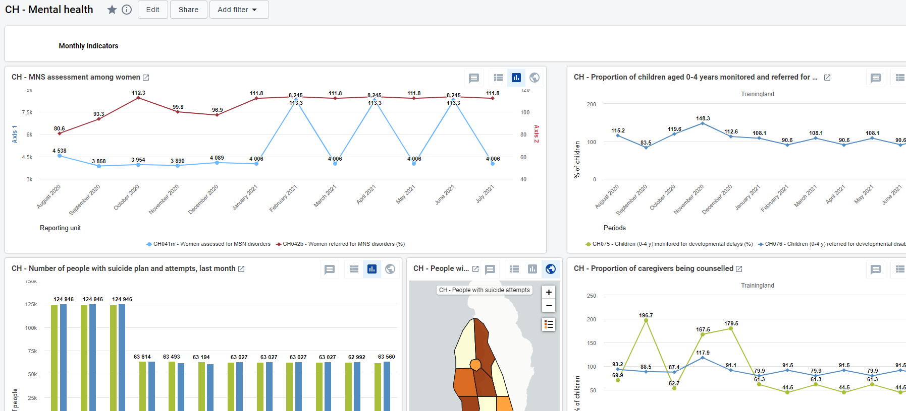

The second part of the dashboard is dedicated to the annual dataset (Annual Household Assessment Indicators). The predefined analyse and visualize the main areas of the dataset, though the dashboard should be modified to better mirror the local activities.

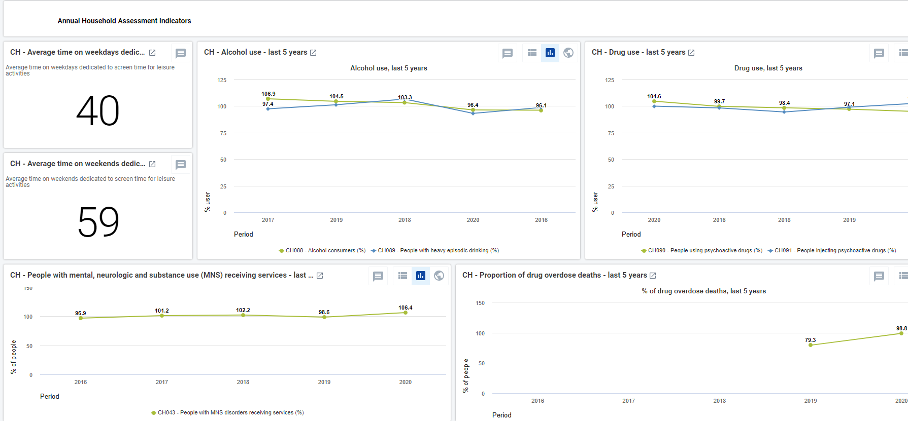
