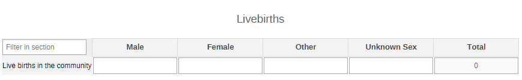
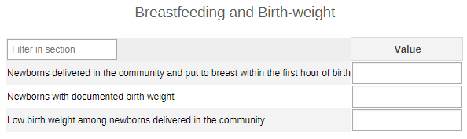
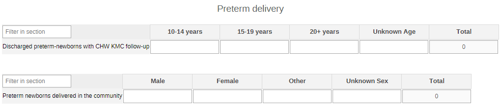
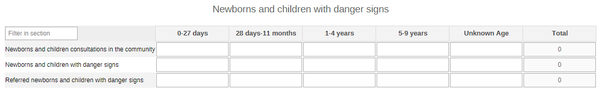
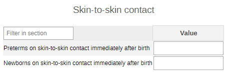
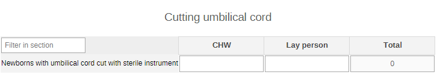
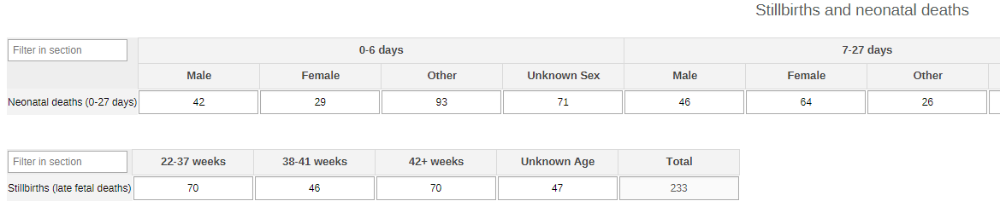
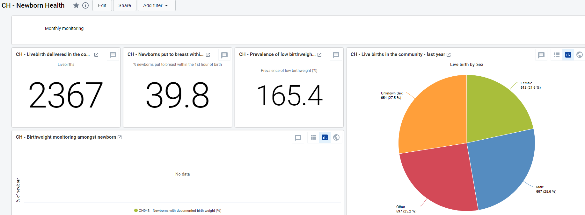

# CH - Newborn Health { #ch-nbh-aggregate-design }

## 1. Datasets

### 1.1. Configuration

The aggregate CH - Newborn Health module includes:

1. A **monthly dataset** with key data elements for newborn health
2. A **yearly dataset** for the follow up of key annual information on newborn health
3. **Core indicators** for both datasets
4. A predefined **“CH - Newborn Health”** dashboard

It is recommended that the datasets get assigned to Organisation Units **at the lowest level** of the health system feasible for reporting data, such as Villages or any appropriate community demarcation according to the local context.

### 1.2. Data Elements

The table below summarizes the data elements present in the Newborn health module. The “Data elements groups” and “Datasets” columns will provide extra information on where the same DEs can be found in the other CHIS modules. This should facilitate the mapping of the package among all its modules and navigate the datasets while avoiding the collection and data entry of the same DEs in multiple locations.

All the DEs in the Newborn Health module are used in the build up of indicators.

| Name                                                                                         | Description                                                                                           | Disaggregation                  | Data Sets                                                                           | Data Element Groups                                               |   |
|----------------------------------------------------------------------------------------------|-------------------------------------------------------------------------------------------------------|---------------------------------|-------------------------------------------------------------------------------------|-------------------------------------------------------------------|---|
| CH045 - Stillbirths (late fetal deaths)                                                      | Stillbirths (late fetal deaths)                                                                       | Age (Gestation)                 | CH - Newborn Health (Yearly); CH - Civil registration and vital statistics (Yearly) | CH - Newborn Health; CH - Civil registration and vital statistics |   |
| CH046 - Neonatal deaths (0-27 days)                                                          | Neonatal deaths (0-27 days)                                                                           | Age (0-27 days)/Sex (Other/Unk) | CH - Civil registration and vital statistics (Yearly); CH - Newborn Health (Yearly) | CH - Newborn Health; CH - Civil registration and vital statistics |   |
| CH047a - Live births in the community                                                        | Live births in the community                                                                          | Sex (Other/Unk)                 | CH - Newborn Health (Monthly)                                                       | CH - Newborn Health                                               |   |
| CH047 - Newborns delivered in the community and put to breast within the first hour of birth | Newborns delivered in the community and put to breast within the first hour of birth                  | default                         | CH - Nutrition (Monthly); CH - Newborn Health (Monthly)                             | CH - Newborn Health; CH - Nutrition                               |   |
| CH048 - Newborns with documented birth weight                                                | Newborns delivered in the community with documented birthweight                                       | default                         | CH - Newborn Health (Monthly); CH - Nutrition (Monthly)                             | CH - Newborn Health; CH - Nutrition                               |   |
| CH049 - Newborns with low birth weight delivered in the community                            | Newborns with low birthweight delivered in the community                                              | default                         | CH - Nutrition (Monthly); CH - Newborn Health (Monthly)                             | CH - Newborn Health; CH - Nutrition                               |   |
| CH050 - Newborn preterm discharged with CHW KMC follow-up                                    | Preterm newborns discharged from facility that received follow-up on KMC by CHW                       | Age (10-20+years)               | CH - Newborn Health (Monthly)                                                       | CH - Newborn Health                                               |   |
| CH051 - Newborns preterm delivered in the community                                          | Newborns preterm delivered in the community                                                           | Sex (Other/Unk)                 | CH - Newborn Health (Monthly)                                                       | CH - Newborn Health                                               |   |
| CH052a - Newborns and children with danger signs                                             | Newborns and children with danger signs in the community                                              | Age (0 days-9 years)            | CH - ICCM (Monthly); CH - Newborn Health (Monthly); CH - Child Health (Monthly)     | CH - Newborn Health; CH - ICCM                                    |   |
| CH052b - Newborns and children with danger signs referred                                    | Newborns and children with danger signs referred                                                      | Age (0 days-9 years)            | CH - Newborn Health (Monthly); CH - ICCM (Monthly); CH - Child Health (Monthly)     | CH - Newborn Health; CH - ICCM                                    |   |
| CH052c - Newborns and children consultations in the community                                | Newborns and children consultations in the community                                                  | Age (0 days-9 years)            | CH - ICCM (Monthly); CH - Child Health (Monthly); CH - Newborn Health (Monthly)     | CH - Newborn Health; CH - ICCM                                    |   |
| CH053a - Newborns on skin-to-skin contact immediately after birth                            | Newborns initiated on skin-to-skin contact immediately after birth in community                       | default                         | CH - Newborn Health (Monthly)                                                       | CH - Newborn Health                                               |   |
| CH053b - Preterms on skin-to-skin contact immediately after birth                            | Preterms on skin-to-skin contact immediately after birth                                              | default                         | CH - Newborn Health (Monthly)                                                       | CH - Newborn Health                                               |   |
| CH054 - Newborns with umbilical cord cut with sterile instrument                             | Newborns born in the community who had their umbilical cord cut with a new blade or boiled instrument | Person delivering               | CH - Newborn Health (Monthly)                                                       | CH - Newborn Health                                               |   |

## 2. Dataset Details

### 2.1. Monthly Newborn Health Dataset

#### 2.1.1. Live Births

This section is a simple agrgegation of the number of live births in the community by sex (male, female, other, unknown sex).

#### 2.1.2. Breastfeeding and Birth Weight

This section collects the basic information needed to get an overview of the weight and breastfeeding habits upon birth.

#### 2.1.3. Preterm Delivery

The section gathers data on preterm deliveries and the use of KMC in the community. The data is disaggregated by age of the mother (10-14y, 15-19y, 20+y, unknown age) in the case of KMC, and by sex in the case of preterm babies (male, female, other, unknown sex).

#### 2.1.4. Newborns and Children with Danger Signs

The section gathers information on danger signs identified among newborn babies and children in the community. The information is disaggregated by age groups (0-27d, 28d-11m, 1-4y, 5-9y, unknown age).

#### 2.1.5. Skin-to-skin Contact

This provides the space to report the simple aggregate on the number of newborns and preterm babies put to skin-to-skin contact after birth.

#### 2.1.6. Cutting the Umbilical Cord

This provides the space to report the simple aggregate on the number of umbilical cord cutting procedures carried out with clean or sterile instruments.

The information is disaggregated by the type of person performing the cut (lay person, CHW) - the options should be modified locally to better mirror the context.

### 2.2. Yearly Newborn Health Dataset

#### 2.2.1. Stillbirths and Neonatal Deaths

This section gathers data on neonatal deaths disaggregated by age (0-6d, 7-27d, unknown age) and sex (male, female, other, unknown sex); and on stillbirths by gestational age (22-37w, 38-41w, 42+w, unknown age).

## 3. Validation Rules

The following validation rules have been set up for the Adolescent health datasets:

|                                                 Name                                                 |                                                          Instruction                                                         |        Operator       |                     Left side                    |                      Right side                      |
|:----------------------------------------------------------------------------------------------------:|:----------------------------------------------------------------------------------------------------------------------------:|:---------------------:|:------------------------------------------------:|:----------------------------------------------------:|
| CH - Newborns and children with danger signs <= Newborns and children consultations in the community | Newborns and children with danger signs should be less than or equal to Newborns and children consultations in the community | less_than_or_equal_to | Newborns and children with danger signs          | Newborns and children consultations in the community |
| CH - Newborns and children with danger signs referred <= Newborns and children with danger signs     | Newborns and children with danger signs referred should be less than or equal to Newborns and children with danger signs     | less_than_or_equal_to | Newborns and children with danger signs referred | Newborns and children with danger signs              |
| CH - Newborns with low birth weight <= Newborns with documented birth weight                         | Newborns with low birthweight should be less than or equal to Newborns with documented birth weight                          | less_than_or_equal_to | Newborns with low birthweight                    | Newborns with documented birth weight                |
| CH - Preterm started on skin-to-skin immediately <= Preterm newborns                                 | Preterm started on skin-to-skin immediately should be less than or equal to Preterm newborns                                 | less_than_or_equal_to | Preterm started on skin-to-skin immediately      | Preterm newborns                                     |

## 4. Analytics and Indicators

Just as for the DEs, in the table below the column “Indicator Groups” provides information about whether the indicator is found in groups other than the aH indicator group.

|                                           Name                                          |                            Numerator description                           |                Denominator description               |                          Indicator groups                         |   |
|:---------------------------------------------------------------------------------------:|:--------------------------------------------------------------------------:|:----------------------------------------------------:|:-----------------------------------------------------------------:|---|
| CH002a - Live birth delivered in the community                                          | Livebirth                                                                  | 1                                                    | CH - Newborn Health, CH - Nutrition                               |   |
| CH045 - Stillbirths (late fetal deaths)                                                 | Stillbirths                                                                | 1                                                    | CH - Newborn Health, CH - Civil registration and vital statistics |   |
| CH046 - Neonatal deaths (0–27 days)                                                     | Neonatal deaths (0–27 days)                                                | 1                                                    | CH - Newborn Health, CH - Civil registration and vital statistics |   |
| CH047 - Newborns breastfed within the 1st hour (%)                                      | Newborns delivered in the community put to breast within one hour of birth | Livebirth                                            | CH - Newborn Health, CH - Nutrition                               |   |
| CH048 - Newborns with documented birth weight (%)                                       | Newborns with documented birthweight                                       | Livebirth                                            | CH - Newborn Health, CH - Nutrition                               |   |
| CH049 - Low birth weight among newborns delivered in the community (%)                  | Newborns with low birthweight                                              | Newborns with documented birthweight                 | CH - Newborn Health, CH - Nutrition                               |   |
| CH050 - Discharged preterm-newborns with CHW KMC follow-up                              | Preterm that received follow-up on KMC by CHW                              | 1                                                    | CH - Newborn Health                                               |   |
| CH051a - Preterm-newborns delivered in the community                                    | Preterm newborns                                                           | 1                                                    | CH - Newborn Health                                               |   |
| CH051 - Preterm-newborns delivered in the community (%)                                 | Preterm newborns                                                           | Livebirth                                            | CH - Newborn Health                                               |   |
| CH052a - Referred newborns and children with danger signs (%)                           | Newborns and children with danger signs referred                           | Newborns and children with danger signs              | CH - Newborn Health, CH - ICCM                                    |   |
| CH052b - Newborns and children with danger signs (%)                                    | Newborns and children with danger signs                                    | Newborns and children consultations in the community | CH - Newborn Health, CH - ICCM                                    |   |
| CH052c - Newborns and children consultations in the community                           | Newborns and children consultations                                        | 1                                                    | CH - Newborn Health, CH - ICCM                                    |   |
| CH052d - Newborns and children referred with danger signs                               | Newborns and children with danger signs referred                           | 1                                                    | CH - Newborn Health, CH - ICCM                                    |   |
| CH052e - Newborns and children with danger signs                                        | Newborns and children with danger signs                                    | 1                                                    | CH - Newborn Health, CH - Child Health, CH - ICCM                 |   |
| CH053a - Preterm-newborns initiated on skin-to-skin contact immediately after birth (%) | Preterm started on skin-to-skin immediately                                | Preterm newborns                                     | CH - Newborn Health                                               |   |
| CH053b - Newborns initiated on skin-to-skin contact immediately after birth (%)         | Newborns started on skin-to-skin immediately                               | Livebirth                                            | CH - Newborn Health                                               |   |
| CH054 - Newborns with umbilical cord cut with a new blade or boiled instrument          | Umbilical cord cut with a new or boiled instrument                         | 1                                                    | CH - Newborn Health                                               |   |

## 5. Dashboards

The module includes a predefined dashboard called “CH - Newborn Health”.

The dashboard is divided in two based on the periodicity of the datasets.

The first part is for monthly indicators. The predefined items on the dashboard include data as per the sections present in the dataset, but the content should be adapted based on the local activities.

The second part of the dashboard is dedicated to the annual dataset (Annual Household Assessment Indicators). The predefined analyse and visualize the main areas of the dataset, though the dashboard should be modified to better mirror the local activities.

