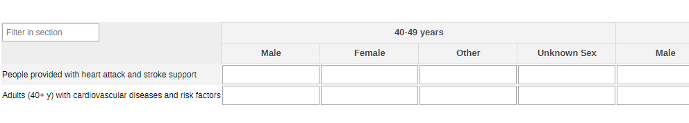
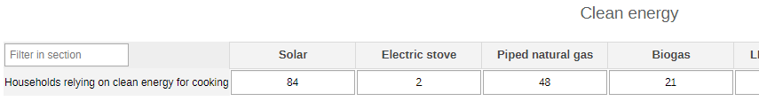
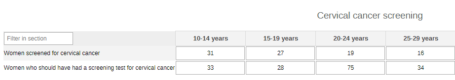
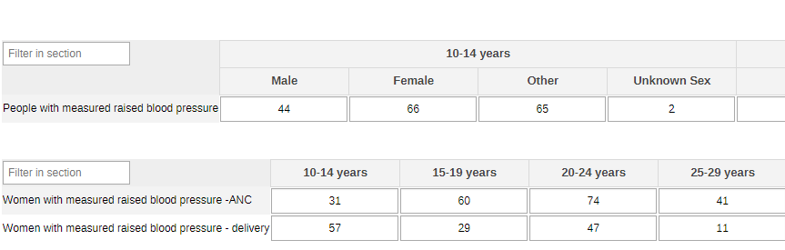
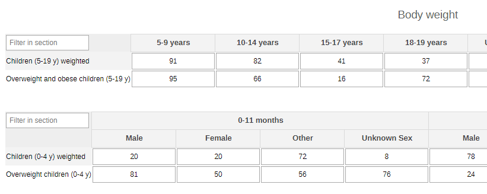
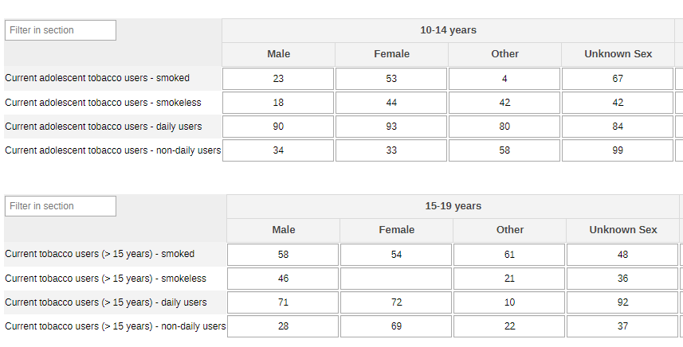
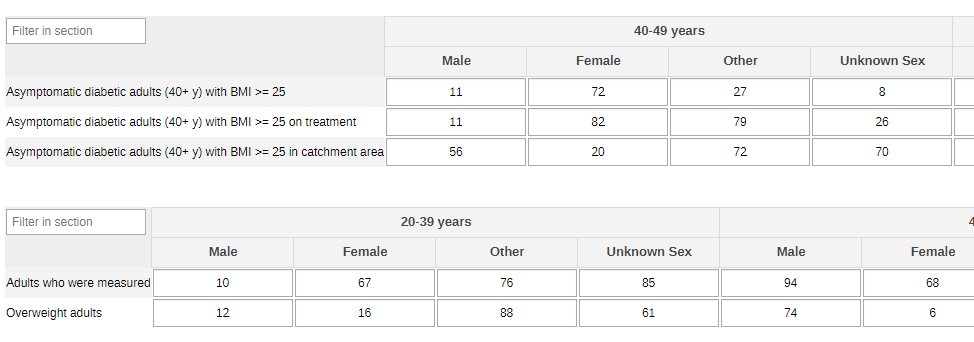
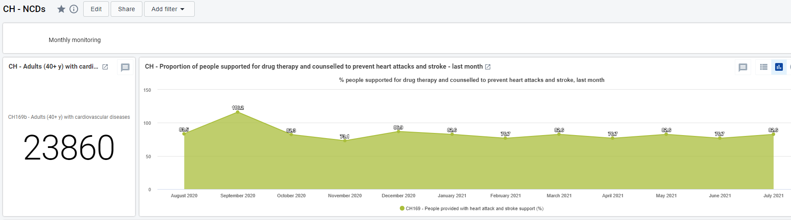
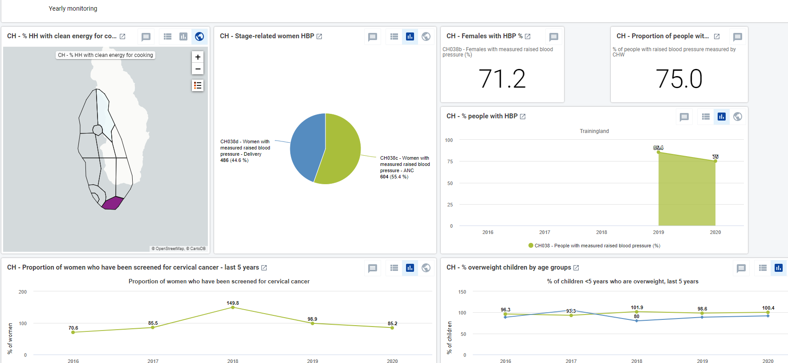

# CH - Non-communicable diseases { #ch-ncd-aggregate-design }

## 1.Datasets

### 1.1. Configuration Summary

The aggregate CH - Non-communicable diseases (NCDs) module includes:

1. A **monthly dataset** with key data elements for NCDs
2. A **yearly dataset** for the follow up of key annual information on NCDs
3. **Core indicators** for both datasets
4. A predefined **“CH - Non-communicable diseases”** dashboard

It is recommended that the datasets get assigned to Organisation Units **at the lowest level** of the health system feasible for reporting data, such as Villages or any appropriate community demarcation according to the local context.

### 1.2. Data Elements

The table below summarizes the data elements present in the AH module. The “Data elements groups” and “Datasets” columns will provide extra information on where the same DEs can be found in the other CHIS modules. This should facilitate the mapping of the package among all its modules and navigate the datasets while avoiding the collection and data entry of the same DEs in multiple locations.

All the DEs in the NCD module are used in the build up of indicators.

| Name                                                                           | Description                                                                                                                | Disaggregation                       | Data Sets                                                                                                                    | Data Element Groups                                                                      |   |
|--------------------------------------------------------------------------------|----------------------------------------------------------------------------------------------------------------------------|--------------------------------------|------------------------------------------------------------------------------------------------------------------------------|------------------------------------------------------------------------------------------|---|
| CH021 - Households relying on clean energy for cooking                         | Households with primary reliance on clean fuels and technologies for cooking                                               | Energy for cooking                   | CH - Clean energy (Yearly); CH - Noncommunicable diseases (Yearly)                                                           | CH - Noncommunicable diseases; CH - Clean energy                                         |   |
| CH031a - Women screened for cervical cancer                                    | Women screened for cervical cancer                                                                                         | Age (10-50+years)                    | CH - Sexual and Reproductive Health (Yearly); CH - Noncommunicable diseases (Yearly); CH - HIV (Yearly)                      | CH - Sexual and Reproductive Health; CH - Noncommunicable diseases; CH - HIV             |   |
| CH031b - Women who should have had a screening test for cervical cancer        | Women who should have had a screening test for cervical cancer                                                             | Age (10-50+years)                    | CH - Noncommunicable diseases (Yearly); CH - Sexual and Reproductive Health (Yearly); CH - HIV (Yearly)                      | CH - Sexual and Reproductive Health; CH - Noncommunicable diseases; CH - HIV             |   |
| CH038a - People with measured raised blood pressure                            | People with measured raised blood pressure                                                                                 | Age (10-70+years)/Sex (Other/Unk)    | CH - Noncommunicable diseases (Yearly); CH - Maternal Health (Yearly)                                                        | CH - Maternal Health; CH - Noncommunicable diseases                                      |   |
| CH038b - Women with measured raised blood pressure -ANC                        | Women and adolescent girls with measured raised blood pressure during antenatal care                                       | Age (10-50+years)                    | CH - Noncommunicable diseases (Yearly); CH - Maternal Health (Yearly)                                                        | CH - Maternal Health; CH - Noncommunicable diseases                                      |   |
| CH038c - Women with measured raised blood pressure - delivery                  | Women and adolescent girls with measured raised blood pressure during labor and delivery                                   | Age (10-50+years)                    | CH - Maternal Health (Yearly); CH - Noncommunicable diseases (Yearly)                                                        | CH - Maternal Health; CH - Noncommunicable diseases                                      |   |
| CH068a - Children (0-4 y) overweight                                           | Children aged 0-4 years visited by CHW and overweight                                                                      | Age (<5 years)/Sex (Other/Unk)       | CH - Child Health (Yearly); CH - Nutrition (Yearly); CH - Noncommunicable diseases (Yearly)                                  | CH - Nutrition; CH - Child Health; CH - Noncommunicable diseases                         |   |
| CH068b - Children (0-4 y) weighted                                             | Children aged 0-4 years whose weight were measured                                                                         | Age (<5 years)/Sex (Other/Unk)       | CH - Noncommunicable diseases (Yearly); CH - Nutrition (Yearly); CH - Child Health (Yearly)                                  | CH - Nutrition; CH - Child Health; CH - Noncommunicable diseases                         |   |
| CH069a - Children (5-19 y) overweight and obese                                | Children and adolescents aged 5-19 years who are overweight                                                                | Age (5-19 years)                     | CH - Nutrition (Yearly); CH - Noncommunicable diseases (Yearly); CH - Child Health (Yearly); CH - Adolescent Health (Yearly) | CH - Nutrition; CH - Adolescent Health; CH - Child Health; CH - Noncommunicable diseases |   |
| CH069b - Children (5-19 y) weighted                                            | Children and adolescents aged 5-19 years who were measured                                                                 | Age (5-19 years)                     | CH - Noncommunicable diseases (Yearly); CH - Child Health (Yearly); CH - Adolescent Health (Yearly); CH - Nutrition (Yearly) | CH - Nutrition; CH - Adolescent Health; CH - Child Health; CH - Noncommunicable diseases |   |
| CH080 - Children (0-4 y) with insufficient physical activity                   | Children aged 0-4 years not meeting who recommendations on physical activity for their age group                           | Age (<5 years)/Sex (Other/Unk)       | CH - Noncommunicable diseases (Yearly); CH - Child Health (Yearly)                                                           | CH - Child Health; CH - Noncommunicable diseases                                         |   |
| CH081 - Children (5-9 y) with insufficient physical activity                   | Children (5-9 y) with insufficient physical activity                                                                       | Sex (Other/Unk)                      | CH - Noncommunicable diseases (Yearly); CH - Child Health (Yearly)                                                           | CH - Child Health; CH - Noncommunicable diseases                                         |   |
| CH086 - Adolescents with insufficient physical activity                        | Adolescents with insufficient physical activity                                                                            | Age (10-19 years)(2)/Sex (Other/Unk) | CH - Adolescent Health (Yearly); CH - Noncommunicable diseases (Yearly)                                                      | CH - Adolescent Health; CH - Noncommunicable diseases                                    |   |
| CH087a - Adolescent current tobacco users - smoked                             | Adolescent current tobacco users - smoked                                                                                  | Age (10-19 years)(2)/Sex (Other/Unk) | CH - Noncommunicable diseases (Yearly); CH - Adolescent Health (Yearly)                                                      | CH - Adolescent Health; CH - Noncommunicable diseases                                    |   |
| CH087b - Adolescent current tobacco users - smokeless                          | Adolescent current tobacco users - smokeless                                                                               | Age (10-19 years)(2)/Sex (Other/Unk) | CH - Adolescent Health (Yearly); CH - Noncommunicable diseases (Yearly)                                                      | CH - Adolescent Health; CH - Noncommunicable diseases                                    |   |
| CH087c - Adolescent current tobacco users - daily users                        | Adolescent current tobacco users - daily users                                                                             | Age (10-19 years)(2)/Sex (Other/Unk) | CH - Adolescent Health (Yearly); CH - Noncommunicable diseases (Yearly)                                                      | CH - Adolescent Health; CH - Noncommunicable diseases                                    |   |
| CH087d - Adolescent current tobacco users - non-daily users                    | Adolescent current tobacco users - non-daily users                                                                         | Age (10-19 years)(2)/Sex (Other/Unk) | CH - Adolescent Health (Yearly); CH - Noncommunicable diseases (Yearly)                                                      | CH - Adolescent Health; CH - Noncommunicable diseases                                    |   |
| CH089a - People with heavy episodic drinking                                   | People with heavy episodic drinking                                                                                        | Age (10-70+years)/Sex (Other/Unk)    | CH - Adolescent Health (Yearly); CH - Noncommunicable diseases (Yearly); CH - Mental health (Yearly)                         | CH - Adolescent Health; CH - Mental health; CH - Noncommunicable diseases                |   |
| CH089b - People assessed for heavy episodic drinking                           | People assessed for heavy episodic drinking                                                                                | Age (10-70+years)/Sex (Other/Unk)    | CH - Mental health (Yearly); CH - Noncommunicable diseases (Yearly); CH - Adolescent Health (Yearly)                         | CH - Adolescent Health; CH - Mental health; CH - Noncommunicable diseases                |   |
| CH089c - Women with heavy episodic drinking                                    | Women and adolescent girls with heavy episodic drinking                                                                    | Pregnant/Postpartum                  | CH - Noncommunicable diseases (Yearly); CH - Adolescent Health (Yearly); CH - Mental health (Yearly)                         | CH - Adolescent Health; CH - Mental health; CH - Noncommunicable diseases                |   |
| CH089d - Women assessed for heavy episodic drinking                            | Women and adolescent girls assessed for heavy episodic drinking                                                            | Pregnant/Postpartum                  | CH - Noncommunicable diseases (Yearly); CH - Adolescent Health (Yearly); CH - Mental health (Yearly)                         | CH - Adolescent Health; CH - Mental health; CH - Noncommunicable diseases                |   |
| CH165a - Current tobacco users (15+ years) - smoked                            | Current tobacco users (> 15 years) - smoked                                                                                | Age (15-70+years)/Sex (Other/Unk)    | CH - Noncommunicable diseases (Yearly)                                                                                       | CH - Noncommunicable diseases                                                            |   |
| CH165b - Current tobacco users (15+ years) - smokeless                         | Current tobacco users (> 15 years) - smokeless                                                                             | Age (15-70+years)/Sex (Other/Unk)    | CH - Noncommunicable diseases (Yearly)                                                                                       | CH - Noncommunicable diseases                                                            |   |
| CH165c - Current tobacco users (15+ years) - daily users                       | Current tobacco users (> 15 years) - daily users                                                                           | Age (15-70+years)/Sex (Other/Unk)    | CH - Noncommunicable diseases (Yearly)                                                                                       | CH - Noncommunicable diseases                                                            |   |
| CH165d - Current tobacco users (15+ years) - non-daily users                   | Current tobacco users (> 15 years) - non-daily users                                                                       | Age (15-70+years)/Sex (Other/Unk)    | CH - Noncommunicable diseases (Yearly)                                                                                       | CH - Noncommunicable diseases                                                            |   |
| CH166 - Adults with insufficient physical activity                             | Adults with insufficient physical activity                                                                                 | Age (20-70+years)/Sex (Other/Unk)    | CH - Noncommunicable diseases (Yearly)                                                                                       | CH - Noncommunicable diseases                                                            |   |
| CH167a - Adults overweight                                                     | Adults overweight                                                                                                          | Age (20-70+years)/Sex (Other/Unk)    | CH - Noncommunicable diseases (Yearly)                                                                                       | CH - Noncommunicable diseases                                                            |   |
| CH167b - Adults assessed for overweight and obese                              | Adults assessed for overweight and obese                                                                                   | Age (20-70+years)/Sex (Other/Unk)    | CH - Noncommunicable diseases (Yearly)                                                                                       | CH - Noncommunicable diseases                                                            |   |
| CH168a - Asymptomatic diabetic adults (40+ y) with BMI >= 25                   | Asymptomatic adults aged 40+ years with a BMI ‚â• 25 with diabetes measured by CHW                                    | Age (40-70+years)/Sex (Other/Unk)    | CH - Noncommunicable diseases (Yearly)                                                                                       | CH - Noncommunicable diseases                                                            |   |
| CH168b - Asymptomatic diabetic adults (40+ y) with BMI >= 25 on treatment      | Asymptomatic adults aged 40+ years with a BMI ‚â• 25 with diabetes measured by CHW and on medication                  | Age (40-70+years)/Sex (Other/Unk)    | CH - Noncommunicable diseases (Yearly)                                                                                       | CH - Noncommunicable diseases                                                            |   |
| CH168c - Asymptomatic diabetic adults (40+ y) with BMI >= 25 in catchment area | Asymptomatic adults aged 40+ years with a BMI ‚â• 25 in the catchment area                                            | Age (40-70+years)/Sex (Other/Unk)    | CH - Noncommunicable diseases (Yearly)                                                                                       | CH - Noncommunicable diseases                                                            |   |
| CH169a - People provided with heart attack and stroke support                  | Persons to whom heart attacks and stroke preventive and curative therapy support/follow-up was provided                    | Age (40-80+years)/Sex (Other/Unk)    | CH - Noncommunicable diseases (Monthly)                                                                                      | CH - Noncommunicable diseases                                                            |   |
| CH169b - Adults (40+ y) with cardiovascular diseases and risk factors          | Adults 40+ years  with cardiovascular disease, or who are smoking, have high blood pressure, high cholesterol, or diabetes | Age (40-80+years)/Sex (Other/Unk)    | CH - Noncommunicable diseases (Monthly)                                                                                      | CH - Noncommunicable diseases                                                            |   |

## 2. Dataset Details

### 2.1. Monthly NCDs Dataset

#### 2.1.1. Heart Attack and Stroke

The section gathers the data related to adults older than 40 years at risk of cardiovascular diseases and to patients receiving support. The data are disaggregated by age (40-49y, 50-59y, 60-69y, 70-79y, 80+y, unknown age) and by sex (male, female, other, unknown sex).

### 2.2. Yearly NCDs Dataset

#### 2.2.1. Clean Energy

This is a simple overview of the number of households relying on clean energy for cooking. The options in the disaggregation should be edited according to the local context.

#### 2.2.2. Cervical Cancer Screening

The section provides the information on the women in the community and whether they have been or should have been screened.

#### 2.2.3. Blood Pressure

The information collected in this section relates to raised blood pressure measurements either among the general population or among women during ANC visits or during delivery. In the former the disaggregation is by age (10-14y, 15-19y, 20-39y, 40-49y, 50-59y, 60-69y, 70+y, unknown age) and sex (male, female, other, unknown sex), while in the latter is by age (10-14y, 15-19y, 20-24y, 25-29y, 30-49y, 50+y, unknown age).

#### 2.2.4. Body Weight

The data in this section screens for overweight children. In the first section the disaggregation is by age (5-9y, 10-14y, 15-17y, 18-19y, unknown age) , while in the second is by age (0-11m, 1-4y) and sex (male, female, other, unknown sex).

#### 2.2.5. Physical Activity

The section provides an overview of the levels of inefficient physical activity in the community. The info for children 0-4 years are disaggregated by age (0-11m and 1-4y) and sex (male, female, other, unknown sex). The info for adults is disaggregated by age (20-39y, 40-49y, 50-59y, 60-69y, 70+yn unknown age) and sex (male, female, other, unknown sex). Being the children between the age of 5 and 9 years belonging to what normally is a standardized age group, the disaggregation of the table is just by sex.

#### 2.2.6. Tobacco Use

The data collected give an overview of the use of tobacco among adolescents and among people above 15 years of age.

#### 2.2.7. Overweight

The collected data provide an overview of the data on 40+ years suffering from diabetes while being overweight (BMI>=25). The data is disaggregated by age (40-49y, 50-59y, 60-69y, 70+y, unknown age) and by sex (male, female, other, unknonw sex). The section also provides information on screening for overweight adults. The data is disaggregated by age (20-39y, 40-49y, 50-59y, 60-69y, 70+y, unknown age) and sex (male, female, other, unknonw sex).

## 3. Validation Rules

The following validation rules have been set up for the NCD health datasets:

| name                                                                                                          | instruction                                                                                                                           | operator              | leftSide description                               | rightSide description                              |   |
|---------------------------------------------------------------------------------------------------------------|---------------------------------------------------------------------------------------------------------------------------------------|-----------------------|----------------------------------------------------|----------------------------------------------------|---|
| CH - Adults who are overweight Vs Adults who were measured                                                    | Adults who are overweight should be less than or equal to Adults who were measured                                                    | less_than_or_equal_to | Adults who are overweight                          | Adults who were measured                           |   |
| CH - Adults with BMI <= 25 and diabetes on medication Vs Adults with BMI<=25 and diabetic                     | Adults with BMI <= 25 and diabetes on medication should be less than or equal to Adults with BMI<=25 and diabetic                     | less_than_or_equal_to | Adults with BMI <= 25 and diabetes on medication   | Adults with BMI<=25 and diabetic                   |   |
| CH - Adults with BMI<=25 and diabetic Vs Asymptomatic adults aged 40+ years with BMI <=25                     | Adults with BMI<=25 and diabetic should be less than or equal to Asymptomatic adults aged 40+ years with BMI <=25                     | less_than_or_equal_to | Adults with BMI<=25 and diabetic                   | Asymptomatic adults aged 40+ years with BMI <=25   |   |
| CH - Adults with insufficient physical activity Vs Adults aged 20+ years in the catchment area                | Adults with insufficient physical activity should be less than or equal to Adults aged 20+ years in the catchment area                | less_than_or_equal_to | Adults with insufficient physical activity         | Adults aged 20+ years in the catchment area        |   |
| CH - AGW assessed for heavy episodic drinking Vs People assessed for heavy episodic drinking                  | AGW assessed for heavy episodic drinking should be less than or equal to People assessed for heavy episodic drinking                  | less_than_or_equal_to | AGW assessed for heavy episodic drinking           | People assessed for heavy episodic drinking        |   |
| CH - AGW with heavy episodic drinking Vs People with heavy episodic drinking                                  | AGW with heavy episodic drinking should be less than or equal to People with heavy episodic drinking                                  | less_than_or_equal_to | AGW with heavy episodic drinking                   | People with heavy episodic drinking                |   |
| CH - AGW with measured raised BP during ANC Vs People with measured raised blood pressure                     | AGW with measured raised BP during ANC should be less than or equal to People with measured raised blood pressure                     | less_than_or_equal_to | AGW with measured raised BP during ANC             | People with measured raised blood pressure         |   |
| CH - AGW with measured raised BP during postpartum care Vs People with measured raised blood pressure         | AGW with measured raised BP during postpartum care should be less than or equal to People with measured raised blood pressure         | less_than_or_equal_to | AGW with measured raised BP during postpartum care | People with measured raised blood pressure         |   |
| CH - AGW with raised BP during labor and delivery Vs People with measured raised blood pressure               | AGW with raised BP during labor and delivery should be less than or equal to People with measured raised blood pressure               | less_than_or_equal_to | AGW with raised BP during labor and delivery       | People with measured raised blood pressure         |   |
| CH - Children 0-4 years visited by CHW and overweight Vs Children aged 0-4 years that were measured           | Children 0-4 years visited by CHW and overweight should be less than or equal to Children aged 0-4 years that were measured           | less_than_or_equal_to | Children 0-4 years visited by CHW and overweight   | Children aged 0-4 years that were measured         |   |
| CH - Children and adolescents 5-19 years overweight Vs Children and adolescents 5-19 years measured           | Children and adolescents 5-19 years overweight should be less than or equal to Children and adolescents 5-19 years measured           | less_than_or_equal_to | Children and adolescents 5-19 years overweight     | Children and adolescents 5-19 years measured       |   |
| CH - People with heavy episodic drinking Vs People assessed for heavy episodic drinking                       | People with heavy episodic drinking should be less than or equal to People assessed for heavy episodic drinking                       | less_than_or_equal_to | People with heavy episodic drinking                | People assessed for heavy episodic drinking        |   |
| CH - Provided heart attacks, stroke and cure support Vs Adults with HD, smokes, high BP, obese or diabetic    | Provided heart attacks, stroke and cure support should be less than or equal to Adults with HD, smokes, high BP, obese or diabetic    | less_than_or_equal_to | Provided heart attacks, stroke and cure support    | Adults with HD, smokes, high BP, obese or diabetic |   |
| CH - Women who had a screening test for cervical cancer Vs Women who should have screened for cervical cancer | Women who had a screening test for cervical cancer should be less than or equal to Women who should have screened for cervical cancer | less_than_or_equal_to | Women who had a screening test for cervical cancer | Women who should have screened for cervical cancer |   |

## 4. Analytics and Indicators

Just as for the DEs, in the table below the column “Indicator Groups” provides information about whether the indicator is found in groups other than the NCD indicator group.

| name                                                                     | description                                                                                                                                        | numerator Description                            | denominator Description                            | Indicator groups                                                                         |   |
|--------------------------------------------------------------------------|----------------------------------------------------------------------------------------------------------------------------------------------------|--------------------------------------------------|----------------------------------------------------|------------------------------------------------------------------------------------------|---|
| CH068 - Overweight children (0-4 y) (%)                                  | Proportion of overweight among children under 5 years of age                                                                                       | Children 0-4 years visited by CHW and overweight | Children aged 0-4 years that were measured         | CH - Nutrition; CH - Child Health; CH - Noncommunicable diseases                         |   |
| CH069 - Overweight and obese children (5-19 y) (%)                       | Proportion of overweight and obesity in school-age children and adolescents 5-19 years                                                             | Children and adolescents 5-19 years overweight   | Children and adolescents 5-19 years measured       | CH - Nutrition; CH - Child Health; CH - Adolescent Health; CH - Noncommunicable diseases |   |
| CH080 - Children (0-4 y) with insufficient physical activity (%)         | Proportion of children aged 0-4 years with insufficient physical activity                                                                          | Children 0-4 years not meeting required activity | Children aged 0-4 years in the catchment area      | CH - Child Health; CH - Noncommunicable diseases                                         |   |
| CH081 - Children (5-9 y) with insufficient physical activity (%)         | Proportion of children aged 5-9years with insufficient physical activity                                                                           | Children 5-9 years with insufficient activity    | Children aged 5-9 years in the catchment area      | CH - Child Health; CH - Noncommunicable diseases                                         |   |
| CH086 - Adolescents with insufficient physical activity (%)              | Proportion of adolescents with insufficient physical activity                                                                                      | Adolescents insufficient physical activity       | Adolescents in the catchment area                  | CH - Noncommunicable diseases; CH - Adolescent Health                                    |   |
| CH087 - Adolescents currently using tobacco (%)                          | Proportion of adolescents currently using tobacco                                                                                                  | Adolescents currently using tobacco              | Adolescents in the catchment area                  | CH - Noncommunicable diseases; CH - Adolescent Health                                    |   |
| CH089 - People with heavy episodic drinking (%)                          | Proportion of people with heavy episodic drinking                                                                                                  | People with heavy episodic drinking              | People assessed for heavy episodic drinking        | CH - Adolescent Health; CH - Mental health; CH - Noncommunicable diseases                |   |
| CH165 - Current tobacco users (> 15 years) (%)                           | Proportion of current tobacco users above the age of 15                                                                                            | Current tobacco users aged 15 years and over     | People 15+ years                                   | CH - Noncommunicable diseases                                                            |   |
| CH166 - Adults with insufficient physical activity (%)                   | Proportion of adults with insufficient physical activity                                                                                           | Adults with insufficient physical activity       | Adults aged 20+ years in the catchment area        | CH - Noncommunicable diseases                                                            |   |
| CH167 - Adults overweight (%)                                            | Proportion of overweight and obesity in adults                                                                                                     | Adults who are overweight                        | Adults who were measured                           | CH - Noncommunicable diseases                                                            |   |
| CH168 - Adults (40+ y) asymptomatic diabetic BMI >= 25 (%)               | Proportion of asymptomatic adults older than 40 with a BMI>=25 who have raised blood glucose/diabetes as per CHW measurements                      | Adults with BMI>=25 and diabetic                 | Asymptomatic adults aged 40+ years with BMI>=25    | CH - Noncommunicable diseases                                                            |   |
| CH168b - Adults (40+ y) asymptomatic diabetic BMI >= 25                  | Number of asymptomatic adults older than 40 with a BMI>=25 who have raised blood glucose/diabetes as per CHW measurements                          | Adults with BMI>=25 and diabetic                 | 1                                                  | CH - Noncommunicable diseases                                                            |   |
| CH168c - Adults (40+ y) asymptomatic diabetic BMI >= 25 on treatment (%) | Proportion of asymptomatic adults older than 40 with a BMI>=25 who have raised blood glucose/diabetes as per CHW measurements and are on treatment | Adults with BMI>=25 and diabetic on treatment    | Asymptomatic adults aged 40+ years with BMI>=25    | CH - Noncommunicable diseases                                                            |   |
| CH169b - Adults (40+ y) with cardiovascular diseases                     | Adults (40+ y) with cardiovascular diseases                                                                                                        | Adults (40+ y) with cardiovascular diseases      | 1                                                  | CH - Noncommunicable diseases                                                            |   |
| CH169 - People provided with heart attack and stroke support (%)         | Proportion of Persons to whom heart attacks and stroke preventive and curative therapy support/follow-up was provided                              | Provided heart attacks, stroke and cure support  | Adults with HD, smokes, high BP, obese or diabetic | CH - Noncommunicable diseases                                                            |   |

## 5. Dashboards

The module includes a predefined dashboard called “CH - NCDs”.

The dashboard is divided in two based on the periodicity of the datasets.

The first part is for monthly indicators. The predefined items on the dashboard include data as per the sections present in the dataset, but the content should be adapted based on the local activities.

The second part of the dashboard is dedicated to the annual dataset (Annual Household Assessment Indicators). The predefined analyse and visualize the main areas of the dataset, though the dashboard should be modified to better mirror the local activities.

