# CH - Neglected Tropical Diseases (NTDs) { #ch-ntd-aggregate-design }

## 1.Datasets

### 1.1. Configuration summary

The aggregate CH - Neglected tropical diseases (NTDs) module includes:

1. A **monthly dataset** with key data elements for NTDs
2. A **yearly dataset** for the follow up of key annual information on adolescent health
3. **Core indicators** for both datasets
4. A predefined **“CH - NTDs” dashboard**

It is recommended that the datasets get assigned to Organisation Units **at the lowest level** of the health system feasible for reporting data, such as Villages or any appropriate community demarcation according to the local context.

### 1.2. Data Elements

The table below summarizes the data elements present in the NTDs module. The “Data elements groups” and “Datasets” columns will provide extra information on where the same DEs can be found in the other CHIS modules. This should facilitate the mapping of the package among all its modules and navigate the datasets while avoiding the collection and data entry of the same DEs in multiple locations.

All the DEs in the NTDs module are used in the build up of indicators.

| Name                                                                     | Description                                                                                                              | Disaggregation                    | Data Sets                                                                                                                                                                                   | Data Element Groups                                                                                                             |   |
|--------------------------------------------------------------------------|--------------------------------------------------------------------------------------------------------------------------|-----------------------------------|---------------------------------------------------------------------------------------------------------------------------------------------------------------------------------------------|---------------------------------------------------------------------------------------------------------------------------------|---|
| CH041a - People assessed for MNS disorders/ MH conditions                | People assessed for MNS disorders/ MH conditions                                                                         | Age (10-70+years)/Sex (Other/Unk) | CH - Tuberculosis (Monthly); CH - Maternal Health (Monthly); CH - HIV (Monthly); CH - Mental health (Monthly); CH - Adolescent Health (Monthly); CH - Neglected tropical diseases (Monthly) | CH - Mental health; CH - Neglected tropical diseases; CH - Maternal Health; CH - Adolescent Health; CH - HIV; TB - Tuberculosis |   |
| CH041b - People with possible MNS symptoms                               | People with possible MNS symptoms                                                                                        | Age (10-70+years)/Sex (Other/Unk) | CH - Tuberculosis (Monthly); CH - Maternal Health (Monthly); CH - Neglected tropical diseases (Monthly); CH - HIV (Monthly); CH - Mental health (Monthly); CH - Adolescent Health (Monthly) | CH - Mental health; CH - Neglected tropical diseases; CH - Maternal Health; CH - Adolescent Health; CH - HIV; TB - Tuberculosis |   |
| CH041c - People assessed for MNS disorders/ MH conditions                | People assessed for MNS disorders/mental health conditions by type                                                       | Mental health conditions          | CH - Adolescent Health (Monthly); CH - Tuberculosis (Monthly); CH - Neglected tropical diseases (Monthly); CH - Maternal Health (Monthly); CH - HIV (Monthly); CH - Mental health (Monthly) | CH - Mental health; CH - Neglected tropical diseases; CH - Maternal Health; CH - Adolescent Health; CH - HIV; TB - Tuberculosis |   |
| CH041d - People with possible MNS symptoms                               | People with possible symptoms of MNS conditions                                                                          | Mental health conditions          | CH - Tuberculosis (Monthly); CH - HIV (Monthly); CH - Maternal Health (Monthly); CH - Adolescent Health (Monthly); CH - Mental health (Monthly); CH - Neglected tropical diseases (Monthly) | CH - Mental health; CH - Neglected tropical diseases; CH - Maternal Health; CH - Adolescent Health; CH - HIV; TB - Tuberculosis |   |
| CH041e - Women assessed for MNS disorders/ MH conditions                 | Women and adolescent girls assessed for MNS disorders / MH conditions                                                    | Pregnant/Postpartum               | CH - Tuberculosis (Monthly); CH - Maternal Health (Monthly); CH - Neglected tropical diseases (Monthly); CH - Adolescent Health (Monthly); CH - Mental health (Monthly); CH - HIV (Monthly) | CH - Mental health; CH - Neglected tropical diseases; CH - Maternal Health; CH - Adolescent Health; CH - HIV; TB - Tuberculosis |   |
| CH041f - Women with possible MNS symptoms                                | Women and adolescent girls with possible MNS symptoms                                                                    | Pregnant/Postpartum               | CH - Tuberculosis (Monthly); CH - Maternal Health (Monthly); CH - Neglected tropical diseases (Monthly); CH - Adolescent Health (Monthly); CH - HIV (Monthly); CH - Mental health (Monthly) | CH - Mental health; CH - Neglected tropical diseases; CH - Maternal Health; CH - Adolescent Health; CH - HIV; TB - Tuberculosis |   |
| CH042a - People  with MNS disorders referred                             | People with MNS disorders referred                                                                                       | Age (10-70+years)/Sex (Other/Unk) | CH - Neglected tropical diseases (Monthly); CH - Adolescent Health (Monthly); CH - HIV (Monthly); CH - Maternal Health (Monthly); CH - Tuberculosis (Monthly); CH - Mental health (Monthly) | CH - Mental health; CH - Neglected tropical diseases; CH - Maternal Health; CH - Adolescent Health; CH - HIV; TB - Tuberculosis |   |
| CH042b - People with MNS disorders referred by type                      | People with MNS disorders referred by type                                                                               | Mental health conditions          | CH - HIV (Monthly); CH - Mental health (Monthly); CH - Adolescent Health (Monthly); CH - Tuberculosis (Monthly); CH - Neglected tropical diseases (Monthly); CH - Maternal Health (Monthly) | CH - Mental health; CH - Neglected tropical diseases; CH - Maternal Health; CH - Adolescent Health; CH - HIV; TB - Tuberculosis |   |
| CH042c - Women with MNS disorders referred                               | Women and adolescent girls with MNS disorders/mental health conditions referred                                          | Pregnant/Postpartum               | CH - Tuberculosis (Monthly); CH - HIV (Monthly); CH - Maternal Health (Monthly); CH - Mental health (Monthly); CH - Adolescent Health (Monthly); CH - Neglected tropical diseases (Monthly) | CH - Mental health; CH - Neglected tropical diseases; CH - Maternal Health; CH - Adolescent Health; CH - HIV; TB - Tuberculosis |   |
| CH043a - People with MNS disorders receiving services                    | People with MNS disorders/mental health conditions receiving services                                                    | Age (10-70+years)/Sex (Other/Unk) | CH - Mental health (Yearly); CH - HIV (Yearly); CH - Maternal Health (Yearly); CH - Neglected tropical diseases (Yearly); CH - Adolescent Health (Yearly); CH - Tuberculosis (Yearly)       | CH - Mental health; CH - Neglected tropical diseases; CH - Maternal Health; CH - Adolescent Health; CH - HIV; TB - Tuberculosis |   |
| CH043b - People assessed for MNS disorders                               | People assessed for MNS disorders/mental health conditions                                                               | Age (10-70+years)/Sex (Other/Unk) | CH - Adolescent Health (Yearly); CH - Tuberculosis (Yearly); CH - Mental health (Yearly); CH - Maternal Health (Yearly); CH - HIV (Yearly); CH - Neglected tropical diseases (Yearly)       | CH - Mental health; CH - Neglected tropical diseases; CH - Maternal Health; CH - Adolescent Health; CH - HIV; TB - Tuberculosis |   |
| CH043c - People with MNS disorders receiving services - MH awareness     | People with MNS disorders/mental health conditions receiving services - mental health awareness                          | default                           | CH - Neglected tropical diseases (Yearly); CH - Mental health (Yearly); CH - Tuberculosis (Yearly); CH - Adolescent Health (Yearly); CH - Maternal Health (Yearly); CH - HIV (Yearly)       | CH - Mental health; CH - Neglected tropical diseases; CH - Maternal Health; CH - Adolescent Health; CH - HIV; TB - Tuberculosis |   |
| CH043d - People with MNS disorders receiving services - MH HP            | People with MNS disorders/mental health conditions receiving services - mental health promotion and prevention           | default                           | CH - Tuberculosis (Yearly); CH - Mental health (Yearly); CH - Maternal Health (Yearly); CH - Neglected tropical diseases (Yearly); CH - Adolescent Health (Yearly); CH - HIV (Yearly)       | CH - Mental health; CH - Neglected tropical diseases; CH - Maternal Health; CH - Adolescent Health; CH - HIV; TB - Tuberculosis |   |
| CH043e - People with MNS disorders receiving services - MH support       | People with MNS disorders/mental health conditions receiving services - support for people with mental health conditions | default                           | CH - Maternal Health (Yearly); CH - Neglected tropical diseases (Yearly); CH - HIV (Yearly); CH - Mental health (Yearly); CH - Tuberculosis (Yearly); CH - Adolescent Health (Yearly)       | CH - Mental health; CH - Neglected tropical diseases; CH - Maternal Health; CH - Adolescent Health; CH - HIV; TB - Tuberculosis |   |
| CH043f - People with MNS disorders receiving services - recovery/rehab   | People with MNS disorders/mental health conditions receiving services - recovery and rehabilitation                      | default                           | CH - Adolescent Health (Yearly); CH - Tuberculosis (Yearly); CH - Neglected tropical diseases (Yearly); CH - HIV (Yearly); CH - Maternal Health (Yearly); CH - Mental health (Yearly)       | CH - Mental health; CH - Neglected tropical diseases; CH - Maternal Health; CH - Adolescent Health; CH - HIV; TB - Tuberculosis |   |
| CH043g - Women with MNS disorders receiving services                     | Women and adolescent girls with MNS disorders/mental health conditions receiving services                                | Pregnant/Postpartum               | CH - Mental health (Yearly); CH - Tuberculosis (Yearly); CH - Maternal Health (Yearly); CH - HIV (Yearly); CH - Neglected tropical diseases (Yearly); CH - Adolescent Health (Yearly)       | CH - Mental health; CH - Neglected tropical diseases; CH - Maternal Health; CH - Adolescent Health; CH - HIV; TB - Tuberculosis |   |
| CH043h - Women assessed for MNS disorders                                | Women and adolescent girls assessed for MNS disorders/mental health conditions                                           | Pregnant/Postpartum               | CH - Neglected tropical diseases (Yearly); CH - Tuberculosis (Yearly); CH - Mental health (Yearly); CH - Adolescent Health (Yearly); CH - Maternal Health (Yearly); CH - HIV (Yearly)       | CH - Mental health; CH - Neglected tropical diseases; CH - Maternal Health; CH - Adolescent Health; CH - HIV; TB - Tuberculosis |   |
| CH135 - Suspected NTD cases reported                                     | Suspected NTD cases reported                                                                                             | Age (0-50+years)/Sex (Other/Unk)  | CH - Neglected tropical diseases (Yearly)                                                                                                                                                   | CH - Neglected tropical diseases                                                                                                |   |
| CH136 - Reported rumours of guinea worm disease/dracunculiasis cases     | Rumours of guinea worm disease/dracunculiasis cases reported                                                             | Age (0-20+years)/Sex (Other/Unk)  | CH - Neglected tropical diseases (Yearly)                                                                                                                                                   | CH - Neglected tropical diseases                                                                                                |   |
| CH137 - Reported rumours of yaws cases                                   | Reported rumours of yaws cases                                                                                           | Age (0-20+years)/Sex (Other/Unk)  | CH - Neglected tropical diseases (Yearly)                                                                                                                                                   | CH - Neglected tropical diseases                                                                                                |   |
| CH138 - People with NTDs referred                                        | People referred to health centre for diagnosis or treatment of NTDs                                                      | Age (0-20+years)/Sex (Other/Unk)  | CH - Neglected tropical diseases (Yearly)                                                                                                                                                   | CH - Neglected tropical diseases                                                                                                |   |
| CH139a - Communities receiving NTDs PC                                   | Communities/villages/localities receiving PC against NTDs                                                                | Age (0-20+years)/Sex (Other/Unk)  | CH - Neglected tropical diseases (Yearly)                                                                                                                                                   | CH - Neglected tropical diseases                                                                                                |   |
| CH139b - Communities in need of NTDs PC                                  | Communities/villages/localities requiring PC against NTDs                                                                | NTDs                              | CH - Neglected tropical diseases (Yearly)                                                                                                                                                   | CH - Neglected tropical diseases                                                                                                |   |
| CH140a - People receiving a dose of NTDs PC                              | People receiving a dose of NTDs PC                                                                                       | Age (0-20+years)/Sex (Other/Unk)  | CH - Neglected tropical diseases (Yearly)                                                                                                                                                   | CH - Neglected tropical diseases                                                                                                |   |
| CH140b - People targeted for PC against NTDs                             | People targeted for PC against NTDs                                                                                      | Age (0-20+years)/Sex (Other/Unk)  | CH - Neglected tropical diseases (Yearly)                                                                                                                                                   | CH - Neglected tropical diseases                                                                                                |   |
| CH140c - People receiving a dose of NTDs PC  by disease                  | People receiving a dose of NTDs PC by disease                                                                            | NTDs                              | CH - Neglected tropical diseases (Yearly)                                                                                                                                                   | CH - Neglected tropical diseases                                                                                                |   |
| CH140d - People targeted for PC against NTDs by disease                  | People targeted for PC against NTDs by disease                                                                           | NTDs                              | CH - Neglected tropical diseases (Yearly)                                                                                                                                                   | CH - Neglected tropical diseases                                                                                                |   |
| CH141a - Households receiving messages on NTDs - case management         | Households that received social mobilization campaigns on NTDs - case management                                         | default                           | CH - Neglected tropical diseases (Yearly)                                                                                                                                                   | CH - Neglected tropical diseases                                                                                                |   |
| CH141b - Households receiving messages on NTDs - OneHealth               | Households that received social mobilization campaigns on NTDs - one health approach                                     | default                           | CH - Neglected tropical diseases (Yearly)                                                                                                                                                   | CH - Neglected tropical diseases                                                                                                |   |
| CH141c -  Households receiving messages on NTDs - PC                     | Households that received social mobilization campaigns on NTDs - PC                                                      | default                           | CH - Neglected tropical diseases (Yearly)                                                                                                                                                   | CH - Neglected tropical diseases                                                                                                |   |
| CH141d -  Households receiving messages on NTDs - VC                     | Households that received social mobilization campaigns on NTDs - vector control                                          | default                           | CH - Neglected tropical diseases (Yearly)                                                                                                                                                   | CH - Neglected tropical diseases                                                                                                |   |
| CH141e - Households targeted for messages on NTDs - case management      | Households targeted for social mobilization campaigns on NTDs - case management                                          | default                           | CH - Neglected tropical diseases (Yearly)                                                                                                                                                   | CH - Neglected tropical diseases                                                                                                |   |
| CH141f - Households targeted for messages on NTDs - OneHealth            | Households targeted for social mobilization campaigns on NTDs - one health approach                                      | default                           | CH - Neglected tropical diseases (Yearly)                                                                                                                                                   | CH - Neglected tropical diseases                                                                                                |   |
| CH141g - Househoulds targeted for messages on NTDs - PC                  | Households targeted for social mobilization campaigns on NTDs - PC                                                       | default                           | CH - Neglected tropical diseases (Yearly)                                                                                                                                                   | CH - Neglected tropical diseases                                                                                                |   |
| CH141h - Households targeted for messages on NTDs - VC                   | Households targeted for social mobilization campaigns on NTDs - vector control                                           | default                           | CH - Neglected tropical diseases (Yearly)                                                                                                                                                   | CH - Neglected tropical diseases                                                                                                |   |
| CH142a - People with animal bites                                        | People with animal bites                                                                                                 | Age (0-20+years)/Sex (Other/Unk)  | CH - Neglected tropical diseases (Yearly)                                                                                                                                                   | CH - Neglected tropical diseases                                                                                                |   |
| CH142b - People with animal bites by animal                              | People with animal bites by animal                                                                                       | NTD_Animals                       | CH - Neglected tropical diseases (Yearly)                                                                                                                                                   | CH - Neglected tropical diseases                                                                                                |   |
| CH143a - Deaths within three months from a snakebite                     | Deaths in the community occurring within three months after a snakebite                                                  | Age (0-20+years)/Sex (Other/Unk)  | CH - Neglected tropical diseases (Yearly)                                                                                                                                                   | CH - Neglected tropical diseases                                                                                                |   |
| CH143b - Deaths within three months from a dog bite                      | Deaths within three months from a dog bite                                                                               | Age (0-20+years)/Sex (Other/Unk)  | CH - Neglected tropical diseases (Yearly)                                                                                                                                                   | CH - Neglected tropical diseases                                                                                                |   |
| CH144a - People screened for skin NTDs                                   | People screened for skin NTDs                                                                                            | Age (0-20+years)/Sex (Other/Unk)  | CH - Neglected tropical diseases (Yearly)                                                                                                                                                   | CH - Neglected tropical diseases                                                                                                |   |
| CH144b - Population targeted for skin NTD screening                      | Population targeted for skin NTD screening                                                                               | Age (0-20+years)/Sex (Other/Unk)  | CH - Neglected tropical diseases (Yearly)                                                                                                                                                   | CH - Neglected tropical diseases                                                                                                |   |
| CH145a - NTD cases with adequate wound case                              | NTD cases who received adequate/recommended wound care                                                                   | Age (0-20+years)/Sex (Other/Unk)  | CH - Neglected tropical diseases (Yearly)                                                                                                                                                   | CH - Neglected tropical diseases                                                                                                |   |
| CH145b - NTD cases presenting with wound(s)                              | NTD cases presenting with wound(s)                                                                                       | Age (0-20+years)/Sex (Other/Unk)  | CH - Neglected tropical diseases (Yearly)                                                                                                                                                   | CH - Neglected tropical diseases                                                                                                |   |
| CH146 - People screened for VL and/or PKDL                               | People screened for signs and symptoms of VL and/or PKDL in the catchment area                                           | Age (0-20+years)/Sex (Other/Unk)  | CH - Neglected tropical diseases (Yearly)                                                                                                                                                   | CH - Neglected tropical diseases                                                                                                |   |
| CH147a - People with visible haematuria or +ve micro-haematuria dipstick | Individuals reporting visible hematuria or with positive dipstick for micro-hematuria                                    | Age (0-20+years)/Sex (Other/Unk)  | CH - Neglected tropical diseases (Yearly)                                                                                                                                                   | CH - Neglected tropical diseases                                                                                                |   |
| CH147b - People screened for micro-hematuria                             | People screened for micro-hematuria                                                                                      | Age (0-20+years)/Sex (Other/Unk)  | CH - Neglected tropical diseases (Yearly)                                                                                                                                                   | CH - Neglected tropical diseases                                                                                                |   |
| CH148a - People with NTD-linked disability receiving rehab support       | People suffering from physical disability related to NTDs who receive rehabilitation support                             | Age (0-20+years)/Sex (Other/Unk)  | CH - Neglected tropical diseases (Yearly)                                                                                                                                                   | CH - Neglected tropical diseases                                                                                                |   |
| CH148b - People with NTD-linked disability                               | People suffering from physical disability related to NTDs                                                                | Age (0-20+years)/Sex (Other/Unk)  | CH - Neglected tropical diseases (Yearly)                                                                                                                                                   | CH - Neglected tropical diseases                                                                                                |   |
| CH149a - NTD cases having received self-care instructions                | NTD cases who received instructions for self-care for relevant NTDs                                                      | Age (0-20+years)/Sex (Other/Unk)  | CH - Neglected tropical diseases (Yearly)                                                                                                                                                   | CH - Neglected tropical diseases                                                                                                |   |
| CH149b - NTD cases relevant for self-care                                | NTD cases relevant for self-care                                                                                         | Age (0-20+years)/Sex (Other/Unk)  | CH - Neglected tropical diseases (Yearly)                                                                                                                                                   | CH - Neglected tropical diseases                                                                                                |   |
| CH150a - Houses with implemented vector reduction measure                | Houses where some domiciliary vector reduction measures were implemented                                                 | default                           | CH - Neglected tropical diseases (Yearly)                                                                                                                                                   | CH - Neglected tropical diseases                                                                                                |   |
| CH150b - Houses targeted for vector reduction measure                    | Houses targeted for domiciliary vector reduction measures                                                                | default                           | CH - Neglected tropical diseases (Yearly)                                                                                                                                                   | CH - Neglected tropical diseases                                                                                                |   |
| CH151a - Surface water bodies enumerated and mapped                      | Surface water bodies enumerated and mapped                                                                               | default                           | CH - Neglected tropical diseases (Yearly)                                                                                                                                                   | CH - Neglected tropical diseases                                                                                                |   |
| CH152a - Households with covered water containers                        | Households with all containers covered and protected with lids                                                           | default                           | CH - Neglected tropical diseases (Yearly)                                                                                                                                                   | CH - Neglected tropical diseases                                                                                                |   |
| CH152b - Households visited in the catchment area                        | Households visited in the catchment area                                                                                 | default                           | CH - Neglected tropical diseases (Yearly)                                                                                                                                                   | CH - Neglected tropical diseases                                                                                                |   |

## 2.Dataset Details

### 2.1. Monthly NTDs Dataset

#### 2.1.1. Mental Health Disorders and Conditions - All

The section focuses on all the people benefiting from MH assessments and referrals. The data are disaggregated by age (10-14y, 15-19y, 20-39y, 40-49y, 50-59y, 60-69y, 70+, unknown age) and sex (male, female, other, unknown).

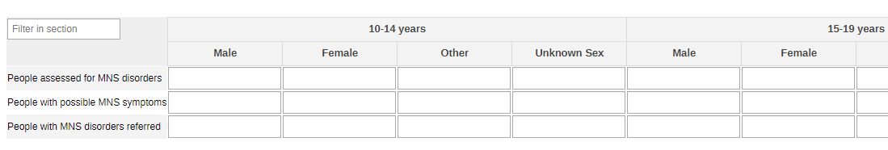

#### 2.1.2. Mental Health Disorders and Conditions - by Type

The information collected on the general population (section 2.1.1.) can also be disaggregated by type of condition (depression, psychoses, behavioural conditions, dementia, substance use, suicide/self harm) - the conditions should be edited and adapted to the local context.

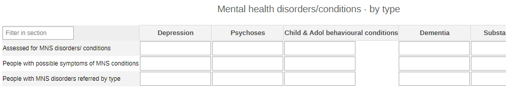

#### 2.1.3. Mental Health Disorders and Conditions - Pregnant and Postpartum

This section collects the same variables as the other two sections on MH, but it focuses specifically on pregnant and postpartum women benefiting from MH community activities.

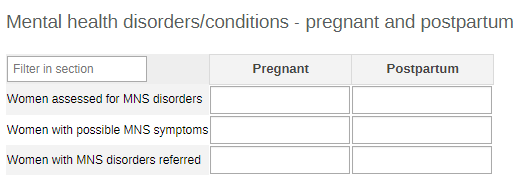

### 2.2. Yearly NTDs Dataset

#### 2.2.1. Mental Health Conditions and Disorders - All

The section focuses on all the people benefiting from MH assessments and referrals. The data are disaggregated by age (10-14y, 15-19y, 20-39y, 40-49y, 50-59y, 60-69y, 70+, unknown age) and sex (male, female, other, unknown).

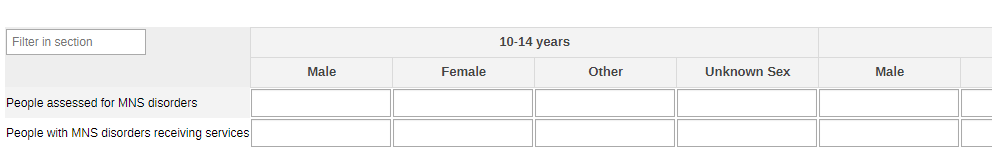

#### 2.2.2. Mental Health Conditions and Disorders - Awareness and Support

The section collects the number of people accessing MH-related services and support activities.

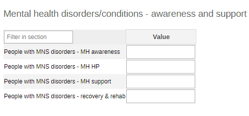

#### 2.2.3. Mental Health Conditions and Disorders - Pregnant and Postpartum

This section collects the same variables as the other section on MH, but it focuses specifically on pregnant and postpartum women.

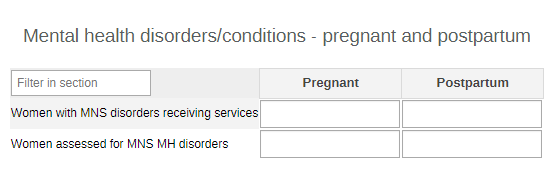

#### 2.2.4. NTDs and PC

The section collects the information about rumours on Guinea worms and Yaws cases and on PC in the community. The data are aggregated by age groups (0-4y, 5-9y, 10-14y, 15-19y, 20+y, unknown age) and sex (male, female, other, unknown sex). The same disaggregation is applied to the reported cases (third table).

The second table collects the totals on PC activities but with more information on the specific targeted disease - The diseases in the cat combo at the moment are: Lymphatic filariasis, Onchocerciasis, Schistosomiasis, Soil-transmitted helminths, Taeniasis, Trachomas, Yaws, and Others. The specified diseases should be edited and better adapted to mirror the local context.

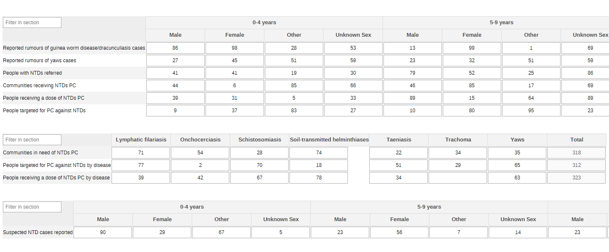

#### 2.2.3. Mobilization/Awareness Campaigns

The section gathers the total on households receiving specific messages on different aspects of NTDs.

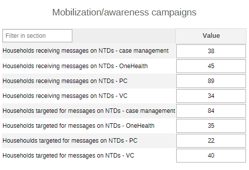

#### 2.2.4. Animal Bites

This section gathers information on general animal bites as much as specific information on snake and dog bites. The collected data are disaggregated by age groups (0-4y, 5-9y, 10-14y, 15-19y, 20+y, unknown age) and sex (male, female, other, unknown sex).

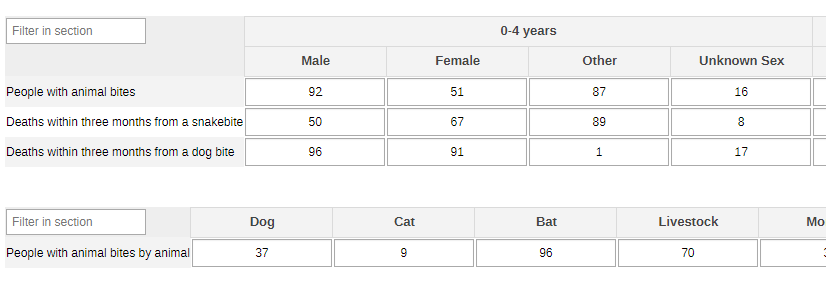

#### 2.2.5. Skin NTDs

This is a simple collection of data on people screened for skin NTDs.

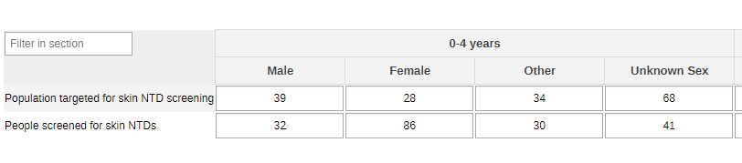

#### 2.2.6. Wound Care

This collects data on people who required and received adequate wound care for the wounds caused by NTDs.

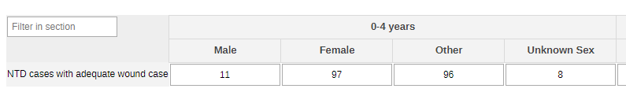

#### 2.2.7. VL and Micro-Haematuria

The section collects data on VL and patients with either evident presence of blood in their urine or with positive results from the micro-haematuria dipstick. The data are disaggregated by age groups (0-4y, 5-9y, 10-14y, 15-19y, 20+y, unknown age) and sex (male, female, other, unknown sex).

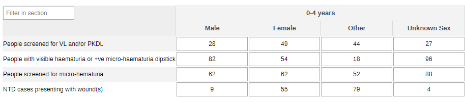

#### 2.2.8. Vector Reduction Measures

This section gathers info on VC activities in the community and the targeted houses.

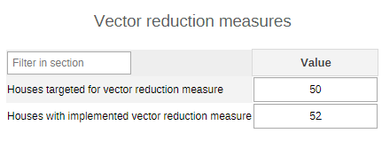

#### 2.2.9. Physical Disability and Self-care

The section collects the information on patients’ access to support activities and to the degree of people self-caring for their NTD-correlated symptoms and signs.

The data is disaggregated by age groups (0-4y, 5-9y, 10-14y, 15-19y, 20+y, unknown age) and sex (male, female, other, unknown sex).

#### 2.2.10. Water Sources

This aggregates teh basic information required to have an overview of safe water storage and the number mapped water sources in the community.

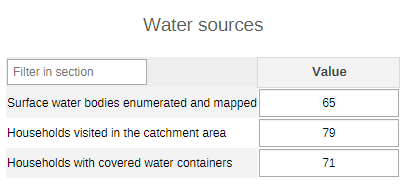

## 3. Validation Rules

The following validation rules have been set up for the NTDs datasets:

| name                                                                                                         | instruction                                                                                                                          | operator              | leftSide description                               | rightSide description                              |
|--------------------------------------------------------------------------------------------------------------|--------------------------------------------------------------------------------------------------------------------------------------|-----------------------|----------------------------------------------------|----------------------------------------------------|
| CH - AGW assessed for MNS disorders Vs AGW with a possible MNS symptoms                                      | AGW assessed for MNS disorders should be less than or equal to AGW with a possible MNS symptoms                                      | less_than_or_equal_to | AGW assessed for MNS disorders                     | AGW with a possible MNS symptoms                   |
| CH - AGW with MNS disorders/receiving Vs AGW assessed for MNS MH disorders                                   | AGW with MNS disorders/receiving should be less than or equal to AGW assessed for MNS MH disorders                                   | less_than_or_equal_to | AGW with MNS disorders/receiving                   | AGW assessed for MNS MH disorders                  |
| CH - AGW with MNS disorders/receiving Vs People with MNS disorders/receiving                                 | AGW with MNS disorders/receiving should be less than or equal to People with MNS disorders/receiving                                 | less_than_or_equal_to | AGW with MNS disorders/receiving                   | People with MNS disorders/receiving                |
| CH - Assessed for MNS disorders conditions by type Vs People with a possible MNS symptoms by type            | Assessed for MNS disorders conditions by type should be less than or equal to People with a possible MNS symptoms by type            | less_than_or_equal_to | Assessed for MNS disorders conditions by type      | People with a possible MNS symptoms by type        |
| CH - Deaths within three months after a dog bite Vs People bitten by an animal in the community              | Deaths within three months after a dog bite should be less than or equal to People bitten by an animal in the community              | less_than_or_equal_to | Deaths within three months after a dog bite        | People bitten by an animal in the community        |
| CH - Deaths within three months after a snakebite Vs People bitten by an animal in the community             | Deaths within three months after a snakebite should be less than or equal to People bitten by an animal in the community             | less_than_or_equal_to | Deaths within three months after a snakebite       | People bitten by an animal in the community        |
| CH - HHs all containers covered and protected with lids Vs Households visited in the catchment area          | HHs all containers covered and protected with lids should be less than or equal to Households visited in the catchment area          | less_than_or_equal_to | HHs all containers covered and protected with lids | Households visited in the catchment area           |
| CH - HHs received campaigns on NTDs - one health appr Vs HHs targeted campaigns on NTDs - one health appr    | HHs received campaigns on NTDs - one health appr should be less than or equal to HHs targeted campaigns on NTDs - one health appr    | less_than_or_equal_to | HHs received campaigns on NTDs - one health appr   | HHs targeted campaigns on NTDs - one health appr   |
| CH - HHs that received campaigns on NTDs - case mgt Vs HHs targeted campaigns on NTDs - case management      | HHs that received campaigns on NTDs - case mgt should be less than or equal to HHs targeted campaigns on NTDs - case management      | less_than_or_equal_to | HHs that received campaigns on NTDs - case mgt     | HHs targeted campaigns on NTDs - case management   |
| CH - HHs that received campaigns on NTDs - PC Vs HHs  targeted campaigns on NTDs - PC                        | HHs that received campaigns on NTDs - PC should be less than or equal to HHs  targeted campaigns on NTDs - PC                        | less_than_or_equal_to | HHs that received campaigns on NTDs - PC           | HHs  targeted campaigns on NTDs - PC               |
| CH - HHs that received campaigns on NTDs - vector contr Vs HHs targeted campaigns on NTDs - vector control   | HHs that received campaigns on NTDs - vector contr should be less than or equal to HHs targeted campaigns on NTDs - vector control   | less_than_or_equal_to | HHs that received campaigns on NTDs - vector contr | HHs targeted campaigns on NTDs - vector control    |
| CH - Houses where vector reduction were implemented Vs Houses targeted for domiciliary vector reduction      | Houses where vector reduction were implemented should be less than or equal to Houses targeted for domiciliary vector reduction      | less_than_or_equal_to | Houses where vector reduction were implemented     | Houses targeted for domiciliary vector reduction   |
| CH - MNS disorders receiving - recovery & rehab Vs People with MNS disorders/receiving                       | MNS disorders receiving - recovery & rehab should be less than or equal to People with MNS disorders/receiving                       | less_than_or_equal_to | MNS disorders receiving - recovery & rehab         | People with MNS disorders/receiving                |
| CH - MNS disorders receiving - support for MH Vs People with MNS disorders/receiving                         | MNS disorders receiving - support for MH should be less than or equal to People with MNS disorders/receiving                         | less_than_or_equal_to | MNS disorders receiving - support for MH           | People with MNS disorders/receiving                |
| CH -  NTD cases who received adequate wound care Vs NTD cases presenting wound requiring care                |  NTD cases who received adequate wound care should be less than or equal to NTD cases presenting wound requiring care                | less_than_or_equal_to |  NTD cases who received adequate wound care        | NTD cases presenting wound requiring care          |
| CH - NTD cases who received instructions for self-care Vs NTD cases relevant for self-care                   | NTD cases who received instructions for self-care should be less than or equal to NTD cases relevant for self-care                   | less_than_or_equal_to | NTD cases who received instructions for self-care  | NTD cases relevant for self-care                   |
| CH - People assessed for MNS disorders conditions Vs Assessed for MNS disorders conditions by type           | People assessed for MNS disorders conditions should be less than or equal to Assessed for MNS disorders conditions by type           | less_than_or_equal_to | People assessed for MNS disorders conditions       | Assessed for MNS disorders conditions by type      |
| CH - People assessed for MNS disorders conditions Vs People with a possible MNS symptoms                     | People assessed for MNS disorders conditions should be less than or equal to People with a possible MNS symptoms                     | less_than_or_equal_to | People assessed for MNS disorders conditions       | People with a possible MNS symptoms                |
| CH - People bitten by an animal in the community Vs People bitten by animal in the community by animal       | People bitten by an animal in the community should be less than or equal to People bitten by animal in the community by animal       | less_than_or_equal_to | People bitten by an animal in the community        | People bitten by animal in the community by animal |
| CH - People receiving a dose of PC against NTDs Vs People targeted for PC against NTDs                       | People receiving a dose of PC against NTDs should be less than or equal to People targeted for PC against NTDs                       | less_than_or_equal_to | People receiving a dose of PC against NTDs         | People targeted for PC against NTDs                |
| CH - People screened for skin NTDs Vs  Population targeted for skin NTD screening                            | People screened for skin NTDs should be less than or equal to  Population targeted for skin NTD screening                            | less_than_or_equal_to | People screened for skin NTDs                      |  Population targeted for skin NTD screening        |
| CH - People with a possible MNS symptoms by type Vs People with a possible MNS symptoms                      | People with a possible MNS symptoms by type should be less than or equal to People with a possible MNS symptoms                      | less_than_or_equal_to | People with a possible MNS symptoms by type        | People with a possible MNS symptoms                |
| CH - People with MNS disorders - MH promotion and prev Vs People with MNS disorders/receiving                | People with MNS disorders - MH promotion and prev should be less than or equal to People with MNS disorders/receiving                | less_than_or_equal_to | People with MNS disorders - MH promotion and prev  | People with MNS disorders/receiving                |
| CH - People with MNS disorders receiving - MH awareness Vs People with MNS disorders/receiving               | People with MNS disorders receiving - MH awareness should be less than or equal to People with MNS disorders/receiving               | less_than_or_equal_to | People with MNS disorders receiving - MH awareness | People with MNS disorders/receiving                |
| CH - People with MNS disorders/receiving Vs People assessed for MNS disorders                                | People with MNS disorders/receiving should be less than or equal to People assessed for MNS disorders                                | less_than_or_equal_to | People with MNS disorders/receiving                | People assessed for MNS disorders                  |
| CH - People with MNS disorders referred Vs People assessed for MNS disorders conditions                      | People with MNS disorders referred should be less than or equal to People assessed for MNS disorders conditions                      | less_than_or_equal_to | People with MNS disorders referred                 | People assessed for MNS disorders conditions       |
| CH - People with visible hematuria or with +ve dipstick Vs Individuals screened for micro-hematuria          | People with visible hematuria or with +ve dipstick should be less than or equal to Individuals screened for micro-hematuria          | less_than_or_equal_to | People with visible hematuria or with +ve dipstick | Individuals screened for micro-hematuria           |
| CH - Villages receiving PC against NTDs Vs Villages requiring PC against NTDs                                | Villages receiving PC against NTDs should be less than or equal to Villages requiring PC against NTDs                                | less_than_or_equal_to | Villages receiving PC against NTDs                 | Villages requiring PC against NTDs                 |
| CH - With disability related to NTDs who receive rehab Vs Suffering from physical disability related to NTDs | With disability related to NTDs who receive rehab should be less than or equal to Suffering from physical disability related to NTDs | less_than_or_equal_to | With disability related to NTDs who receive rehab  | Suffering from physical disability related to NTDs |

## 4. Analytics and Indicators

Just as for the DEs, in the table below the column “Indicator Groups” provides information about whether the indicator is found in groups other than the NTDs indicator group.

| name                                                                         | description                                                                                                                                    | numerator Description                              | denominator Description                            | Indicator groups                                                                                                                |
|------------------------------------------------------------------------------|------------------------------------------------------------------------------------------------------------------------------------------------|----------------------------------------------------|----------------------------------------------------|---------------------------------------------------------------------------------------------------------------------------------|
| CH041 - People assessed for MSN disorders (%)                                | Proportion of people assessed for mental, neurological and substance use (MNS) disorders                                                       | People assessed for MNS disorders conditions       | People with a possible MNS symptoms                | CH - Maternal Health; CH - Tuberculosis; CH - Adolescent Health; CH - HIV; CH - Neglected tropical diseases; CH - Mental health |
| CH042 - People referred for MNS disorders (%)                                | Proportion of people with mental, neurologic and substance use (MNS) referred                                                                  | People with MNS disorders referred                 | People assessed for MNS disorders conditions       | CH - Maternal Health; CH - Tuberculosis; CH - Adolescent Health; CH - HIV; CH - Neglected tropical diseases; CH - Mental health |
| CH043 - People with MNS disorders receiving services (%)                     | Proportion of people with mental, neurologic and substance use (MNS) disorders receiving services                                              | People with MNS disorders/receiving                | People assessed for MNS disorders conditions       | CH - Maternal Health; CH - Tuberculosis; CH - Adolescent Health; CH - HIV; CH - Neglected tropical diseases; CH - Mental health |
| CH135 - Suspected NTD cases reported                                         | Number of suspected neglected tropical disease (NTD) cases reported                                                                            | Suspected NTD cases reported                       | 1                                                  | CH - Neglected tropical diseases                                                                                                |
| CH136 - Reported rumours of guinea worm disease/dracunculiasis cases         | Number of reported rumours of guinea worm disease/dracunculiasis cases                                                                         | Rumours of guinea worm disease cases reported      | 1                                                  | CH - Neglected tropical diseases                                                                                                |
| CH137 - Reported rumours of yaws cases                                       | Number of reported rumoured yaws cases                                                                                                         | Rumoured yaws cases reported                       | 1                                                  | CH - Neglected tropical diseases                                                                                                |
| CH138 - People referred for NTDs                                             | Number of people referred to health centre for diagnosis or treatment of NTDs                                                                  | Referred for diagnosis or Tx of NTDs               | 1                                                  | CH - Neglected tropical diseases                                                                                                |
| CH139 - Communities receiving NTDs PC                                        | Proportion of Communities/villages/localities receiving PC against NTDs                                                                        | Villages receiving PC against NTDs                 | Villages requiring PC against NTDs                 | CH - Neglected tropical diseases                                                                                                |
| CH140 - People receiving a dose of NTDs PC (%)                               | Proportion of people having received a dose of chemo-prophylaxis for any targeted NTD                                                          | People receiving a dose of PC against NTDs         | People targeted for PC against NTDs                | CH - Neglected tropical diseases                                                                                                |
| CH141b - Households receiving NTD messages - CM                              | Proportion of households in the targeted communities that received social mobilization/awareness campaigns on NTDs - case management           | Receiving NTD messages - CM                        | 1                                                  | CH - Neglected tropical diseases                                                                                                |
| CH141c - Households receiving NTD messages - OneHealth                       | Proportion of households in the targeted communities that received social mobilization/awareness campaigns on NTDs - OneHealth                 | Receiving NTD messages - OneHealth                 | 1                                                  | CH - Neglected tropical diseases                                                                                                |
| CH141d - Households receiving NTD messages - PC                              | Proportion of households in the targeted communities that received social mobilization/awareness campaigns on NTDs - PC                        | Receiving NTD messages - PC                        | 1                                                  | CH - Neglected tropical diseases                                                                                                |
| CH141e - Households receiving NTD messages - VC                              | Proportion of households in the targeted communities that received social mobilization/awareness campaigns on NTDs - VC                        | Receiving NTD messages - VC                        | 1                                                  | CH - Neglected tropical diseases                                                                                                |
| CH141 - Households having received social mobilization campaigns on NTDs (%) | Proportion of households in the targeted communities that received social mobilization/awareness campaigns on NTDs                             | HHs that received campaigns on NTDs - case mgt     | HHs received campaigns on NTDs - one health appr   | CH - Neglected tropical diseases                                                                                                |
| CH142 - People with animal bites                                             | Number of people bitten by an animal (animal bite cases) in the community, by animal                                                           | People bitten by an animal in the community        | 1                                                  | CH - Neglected tropical diseases                                                                                                |
| CH143 - Deaths within three months from a snakebite                          | Number of deaths in the community occurring within three months after a snakebite or a dog bite                                                | Deaths within three months after a snakebite       | 1                                                  | CH - Neglected tropical diseases                                                                                                |
| CH144 - People screened for skin NTDs (%)                                    | Proportion of people screened for skin lesions consistent with NTDs (and population coverage)                                                  | People screened for skin NTDs                      | Population targeted for skin NTD screening         | CH - Neglected tropical diseases                                                                                                |
| CH145 - NTD cases with adequate wound case (%)                               | Proportion of NTD cases that received adequate/recommended wound care                                                                          |  NTD cases who received adequate wound care        | NTD cases presenting wound requiring care          | CH - Neglected tropical diseases                                                                                                |
| CH146b - People presenting with wounds                                       | Number of People presenting with wounds                                                                                                        | People presenting with wounds                      | 1                                                  | CH - Neglected tropical diseases                                                                                                |
| CH146 - People screened for VL and/or PKDL                                   | Number of people screened for signs and symptoms of visceral leishmaniasis (VL) and/or PKDL (and population coverage)                          | Screened for signs of VL and/or PKDL               | 1                                                  | CH - Neglected tropical diseases                                                                                                |
| CH147 - People with visible haematuria or +ve micro-haematuria dipstick (%)  | Proportion of people presenting hematuria, either visible hematuria reported by the patient or micro-hematuria detected by a positive dipstick | People with visible hematuria or with +ve dipstick | Individuals screened for micro-hematuria           | CH - Neglected tropical diseases                                                                                                |
| CH148 - People with NTD-linked disability receiving rehab support (%)        | Proportion of people suffering from physical disability related to NTDs who receive rehabilitation support                                     | With disability related to NTDs who receive rehab  | Suffering from physical disability related to NTDs | CH - Neglected tropical diseases                                                                                                |
| CH149 - NTD cases having received self-care instructions (%)                 | Proportion of NTD cases who received instructions for self-care for relevant NTDs                                                              | NTD cases who received instructions for self-care  | NTD cases relevant for self-care                   | CH - Neglected tropical diseases                                                                                                |
| CH150 - Houses with implemented vector reduction measure (%)                 | Proportion of targeted houses covered by domiciliary vector reduction measures                                                                 | Houses where vector reduction were implemented     | Houses targeted for domiciliary vector reduction   | CH - Neglected tropical diseases                                                                                                |
| CH151 - Surface water bodies enumerated and mapped                           | Number of surface water bodies enumerated and mapped                                                                                           | Surface water bodies enumerated and mapped         | 1                                                  | CH - Neglected tropical diseases                                                                                                |
| CH152b - Households visited in catchment area                                | Households visited in catchment area                                                                                                           | HH in area                                         | 1                                                  | CH - Neglected tropical diseases                                                                                                |
| CH152 - Households with covered water containers (%)                         | Proportion of households with all water storage containers covered and protected                                                               | HHs all containers covered and protected with lids | Households visited in the catchment area           | CH - Neglected tropical diseases                                                                                                |

## 5. Dashboards

The module includes a predefined dashboard called “CH - NTDs”.

The predefined items on the dashboard include data as per the sections present in the dataset, but the content should be adapted based on the local activities.

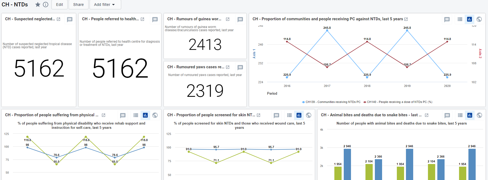
