# CH - Nutrition { #ch-nut-aggregate-design }

## 1. Datasets

### 1.1. Configuration Summary

The aggregate CH - Nutrition (NUT) module includes:

1. A **monthly dataset** with key data elements for nutrition
2. A **yearly dataset** for the follow up of key annual information on nutrition
3. **Core indicators** for both datasets
4. A predefined **“CH - Nutrition” dashboard**

It is recommended that the datasets get assigned to Organisation Units **at the lowest level** of the health system feasible for reporting data, such as Villages or any appropriate community demarcation according to the local context.

### 1.2. Data Elements

The table below summarizes the data elements present in the NUT module. The “Data elements groups” and “Datasets” columns will provide extra information on where the same DEs can be found in the other CHIS modules. This should facilitate the mapping of the package among all its modules and navigate the datasets while avoiding the collection and data entry of the same DEs in multiple locations.

All the DEs in the NUT module are used in the build up of indicators.

| Name                                                                                         | Description                                                                                                                    | Datasets                                                                                                                     | DE groups                                                                                |
|----------------------------------------------------------------------------------------------|--------------------------------------------------------------------------------------------------------------------------------|------------------------------------------------------------------------------------------------------------------------------|------------------------------------------------------------------------------------------|
| CH060a - People receiving deworming preventive chemotherapy                                  | People receiving a dose of preventive chemotherapy for deworming                                                               | CH - Adolescent Health (Monthly), CH - Child Health (Monthly), CH - Nutrition (Monthly)                                      | CH - Adolescent Health, CH - Nutrition, CH - Child Health                                |
| CH060b - People targeted for deworming preventive chemotherapy                               | People targeted for preventive chemotherapy for deworming                                                                      | CH - Adolescent Health (Monthly), CH - Child Health (Monthly), CH - Nutrition (Monthly)                                      | CH - Adolescent Health, CH - Nutrition, CH - Child Health                                |
| CH060c - People receiving deworming preventive chemotherapy                                  | People receiving a dose of preventive chemotherapy for deworming by drug                                                       | CH - Adolescent Health (Monthly), CH - Child Health (Monthly), CH - Nutrition (Monthly)                                      | CH - Adolescent Health, CH - Nutrition, CH - Child Health                                |
| CH069a - Children (5-19 y) overweight and obese                                              | Children and adolescents aged 5-19 years who are overweight                                                                    | CH - Adolescent Health (Yearly), CH - Child Health (Yearly), CH - Noncommunicable diseases (Yearly), CH - Nutrition (Yearly) | CH - Adolescent Health, CH - Noncommunicable diseases, CH - Nutrition, CH - Child Health |
| CH069b - Children (5-19 y) weighted                                                          | Children and adolescents aged 5-19 years who were measured                                                                     | CH - Adolescent Health (Yearly), CH - Child Health (Yearly), CH - Noncommunicable diseases (Yearly), CH - Nutrition (Yearly) | CH - Adolescent Health, CH - Noncommunicable diseases, CH - Nutrition, CH - Child Health |
| CH084a - Women receiving anaemia-preventing iron supplements                                 | Adolescent girls and menstruating women who received anaemia-preventing iron supplements                                       | CH - Adolescent Health (Yearly), CH - Nutrition (Yearly)                                                                     | CH - Nutrition, CH - Adolescent Health                                                   |
| CH084b - Consultations with adolescent girls and menstruating women                          | Number of menstruating women and young adolescent girls who have received a consultation                                       | CH - Adolescent Health (Yearly), CH - Nutrition (Yearly)                                                                     | CH - Nutrition, CH - Adolescent Health                                                   |
| CH085a - Women underweight                                                                   | Non-pregnant women and adolescent girls with low BMI                                                                           | CH - Adolescent Health (Yearly), CH - Nutrition (Yearly)                                                                     | CH - Nutrition, CH - Adolescent Health                                                   |
| CH085b - Consultations with non-pregnant women                                               | Consultations non-pregnant women and adolescent girls                                                                          | CH - Adolescent Health (Yearly), CH - Nutrition (Yearly)                                                                     | CH - Nutrition, CH - Adolescent Health                                                   |
| CH058a - Consultations for children (0-5 m) with feeding counselling                         | Consultations with a CHW for an infant aged 0-5 months providing any counselling on appropriate infant and young child feeding | CH - Child Health (Monthly), CH - Nutrition (Monthly)                                                                        | CH - Nutrition, CH - Child Health                                                        |
| CH058b - Consultations for children (0-5 m) with CHW                                         | Consultations for children (0-5 m) with CHW                                                                                    | CH - Child Health (Monthly), CH - Nutrition (Monthly)                                                                        | CH - Nutrition, CH - Child Health                                                        |
| CH059a - Consultations for children (6-23 m) with feeding counselling                        | Consultations with a CHW for children aged 6-23 months providing any counselling on appropriate complementary feeding          | CH - Child Health (Monthly), CH - Nutrition (Monthly)                                                                        | CH - Nutrition, CH - Child Health                                                        |
| CH059b - Consultations for children (6-23 m) with CHW                                        | Consultations for children (6-23 m) with CHW                                                                                   | CH - Child Health (Monthly), CH - Nutrition (Monthly)                                                                        | CH - Nutrition, CH - Child Health                                                        |
| CH061a - Children (6-59m) given Vit A in semester 1 - routine                                | Children aged 6-59 months who received vitamin a via routine contacts with CHW in semester 1                                   | CH - Child Health (Monthly), CH - Nutrition (Monthly)                                                                        | CH - Nutrition, CH - Child Health                                                        |
| CH061b - Children (6-59m) given Vit A in semester 2 routine                                  | Children aged 6-59 months who received vitamin a via routine contacts with CHW in semester 2                                   | CH - Child Health (Monthly), CH - Nutrition (Monthly)                                                                        | CH - Nutrition, CH - Child Health                                                        |
| CH061c - Children (6-59m) with CHW contact in semester 1 routine                             | Children aged 6-59 months with at least one community contact in semester 1                                                    | CH - Child Health (Monthly), CH - Nutrition (Monthly)                                                                        | CH - Nutrition, CH - Child Health                                                        |
| CH061d - Children (6-59m) with CHW contact in semester 2 routine                             | Children aged 6-59 months with at least one community contact in semester 2                                                    | CH - Child Health (Monthly), CH - Nutrition (Monthly)                                                                        | CH - Nutrition, CH - Child Health                                                        |
| CH061e - Children (6-59m) given Vit A by CHW in semester 1 event                             | Children aged 6-59 months who received vitamin a by CHW via event in semester 1                                                | CH - Child Health (Monthly), CH - Nutrition (Monthly)                                                                        | CH - Nutrition, CH - Child Health                                                        |
| CH061f - Children (6-59m) given Vit A by CHW in semester 2 event                             | Children aged 6-59 months who received vitamin a by CHW via event in semester 2                                                | CH - Child Health (Monthly), CH - Nutrition (Monthly)                                                                        | CH - Nutrition, CH - Child Health                                                        |
| CH061g - Children (6-59m) attending Vit A event in semester 1                                | Children aged 6-59 months attending events with vitamin A supplementation distributed via CHW in semester 1                    | CH - Child Health (Monthly), CH - Nutrition (Monthly)                                                                        | CH - Nutrition, CH - Child Health                                                        |
| CH061h - Children (6-59m) attending Vit A event in semester 2                                | Children aged 6-59 months attending events with vitamin A supplementation distributed via CHW in semester 2                    | CH - Child Health (Monthly), CH - Nutrition (Monthly)                                                                        | CH - Nutrition, CH - Child Health                                                        |
| CH062a - Children (6-59m) assessed using MUAC or WHZ or bilateral pitting oedema             | Children (6-59m) assessed using MUAC or WHZ or bilateral pitting oedema                                                        | CH - Child Health (Monthly), CH - Nutrition (Monthly)                                                                        | CH - Nutrition, CH - Child Health                                                        |
| CH062b - Children (6-59m) in the community                                                   | Children (6-59m) in the community                                                                                              | CH - Child Health (Monthly), CH - Nutrition (Monthly)                                                                        | CH - Nutrition, CH - Child Health                                                        |
| CH063a - Children (6-59m) with SAM                                                           | Children aged 6-59 months with severe acute malnutrition                                                                       | CH - Child Health (Monthly), CH - ICCM (Monthly), CH - Nutrition (Monthly)                                                   | CH - ICCM, CH - Nutrition, CH - Child Health                                             |
| CH063b - Children (6-59m) assessed for SAM                                                   | Children aged 6-59 months screened for severe acute malnutrition                                                               | CH - Child Health (Monthly), CH - ICCM (Monthly), CH - Nutrition (Monthly)                                                   | CH - ICCM, CH - Nutrition, CH - Child Health                                             |
| CH063c - Children (6-59m) with SAM referred                                                  | Children aged 6-59 months with severe acute malnutrition referred                                                              | CH - Child Health (Monthly), CH - ICCM (Monthly), CH - Nutrition (Monthly)                                                   | CH - ICCM, CH - Nutrition, CH - Child Health                                             |
| CH064 - Children (0-4 y) weight measured                                                     | Children aged <5 years visited by a CHW whose weight was assessed                                                              | CH - Child Health (Monthly), CH - Nutrition (Monthly)                                                                        | CH - Nutrition, CH - Child Health                                                        |
| CH066a - Children (6-59m) wasting or with bilateral pitting oedema                           | Children aged 6-59 months wasting or bilateral pitting oedema                                                                  | CH - Child Health (Monthly), CH - Nutrition (Monthly)                                                                        | CH - Nutrition, CH - Child Health                                                        |
| CH066b - Children (6-59m) wasting or with bilateral pitting oedema referred                  | Children (6-59m) wasting or with bilateral pitting oedema referred                                                             | CH - Child Health (Monthly), CH - Nutrition (Monthly)                                                                        | CH - Nutrition, CH - Child Health                                                        |
| CH067a - Children (0-4 y) with height measured                                               | Children aged 0-4 years visited by a CHW whose height/length was measured                                                      | CH - Child Health (Monthly), CH - Nutrition (Monthly)                                                                        | CH - Nutrition, CH - Child Health                                                        |
| CH067b - Children (0-4 y) consulted by a CHW                                                 | Children (0-4 y) consulted by a CHW                                                                                            | CH - Child Health (Monthly), CH - Nutrition (Monthly)                                                                        | CH - Nutrition, CH - Child Health                                                        |
| CH070a - Children (0-9 y) treated for diarrhoea                                              | Children aged 0-9 years presenting with diarrhoea who received treatment                                                       | CH - Child Health (Monthly), CH - ICCM (Monthly), CH - Nutrition (Monthly)                                                   | CH - ICCM, CH - Nutrition, CH - Child Health                                             |
| CH070b - Children (0-9 y) assessed for diarrhoea                                             | Children aged 0-9 years presenting with diarrhoea assessed by CHW                                                              | CH - Child Health (Monthly), CH - ICCM (Monthly), CH - Nutrition (Monthly)                                                   | CH - ICCM, CH - Nutrition, CH - Child Health                                             |
| CH065 - Children (0-4 y) underweight                                                         | Number of children aged 0-5 years with weight for height > +2 SD from the median of the WHO Child Growth Standards             | CH - Child Health (Yearly), CH - Nutrition (Monthly)                                                                         | CH - Nutrition, CH - Child Health                                                        |
| CH068a - Children (0-4 y) overweight                                                         | Children aged 0-4 years visited by CHW and overweight                                                                          | CH - Child Health (Yearly), CH - Noncommunicable diseases (Yearly), CH - Nutrition (Yearly)                                  | CH - Noncommunicable diseases, CH - Nutrition, CH - Child Health                         |
| CH068b - Children (0-4 y) weighted                                                           | Children aged 0-4 years whose weight were measured                                                                             | CH - Child Health (Yearly), CH - Noncommunicable diseases (Yearly), CH - Nutrition (Yearly)                                  | CH - Noncommunicable diseases, CH - Nutrition, CH - Child Health                         |
| CH036a - Community ANC contacts                                                              | Community ANC contacts                                                                                                         | CH - Maternal Health (Monthly), CH - Nutrition (Monthly)                                                                     | CH - Nutrition, CH - Maternal Health                                                     |
| CH036b - Pregnant women counseled on breastfeeding during ANC contact                        | Community ANC contacts where pregnant women received any breastfeeding counselling                                             | CH - Maternal Health (Monthly), CH - Nutrition (Monthly)                                                                     | CH - Nutrition, CH - Maternal Health                                                     |
| CH037 - Women given iron supplements during ANC                                              | Community ANC contacts during which pregnant women were given/prescribed iron-containing supplements                           | CH - Maternal Health (Monthly), CH - Nutrition (Monthly)                                                                     | CH - Nutrition, CH - Maternal Health                                                     |
| CH047 - Newborns delivered in the community and put to breast within the first hour of birth | Newborns delivered in the community and put to breast within the first hour of birth                                           | CH - Newborn Health (Monthly), CH - Nutrition (Monthly)                                                                      | CH - Nutrition, CH - Newborn Health                                                      |
| CH048 - Newborns with documented birth weight                                                | Newborns delivered in the community with documented birthweight                                                                | CH - Newborn Health (Monthly), CH - Nutrition (Monthly)                                                                      | CH - Nutrition, CH - Newborn Health                                                      |
| CH049 - Newborns with low birth weight delivered in the community                            | Newborns with low birthweight delivered in the community                                                                       | CH - Newborn Health (Monthly), CH - Nutrition (Monthly)                                                                      | CH - Nutrition, CH - Newborn Health                                                      |
| CH065b - Children (0-4y) visited by a CHW                                                    | Children 0-4y visited by a CHW                                                                                                 | CH - Nutrition (Monthly)                                                                                                     | CH - Nutrition                                                                           |

## 2. Dataset Details

### 2.1.Monthly NUT Dataset

#### 2.1.1. ANC Contacts

The section gives an overview of the ANC contacts with women in the community and the activities carried out during those contacts (FE supplements distribution and breastfeeding counseling).

#### 2.1.2. Breastfeeding and Birth Weight

This section collects the basic information needed to get an overview of the weight and breastfeeding habits upon birth.

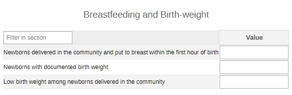

#### 2.1.3. Infant Feeding

The section collects data on feeding counselling for children 0-5 months and for children 6-23 months.

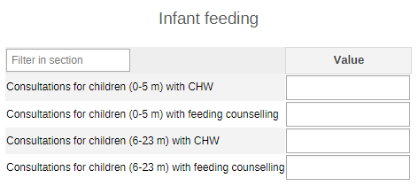

#### 2.1.4. Deworming

The data collected provides the info on deworming PC. The info is disaggregated by age (1-4y, 5-9y, 10-14y, 15-19y, 20+y, unknown age) and sex (male, female, other, unknown sex). The data on people receiving PC is disaggregated by type of medication (Albendazole and Mebedazole). This disaggregation should be adapted according to local availability of PC drugs.

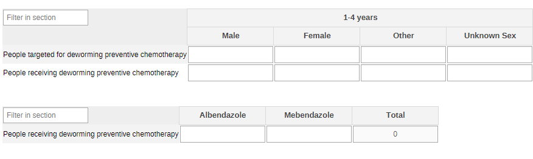

#### 2.1.5. Vitamin A Supplementation - Routine

The section focuses on routine vitamin A supplementation with children by age groups (6-11m and 12-59m) and by age and the administered IUs (100000 IU and 200000 IU).

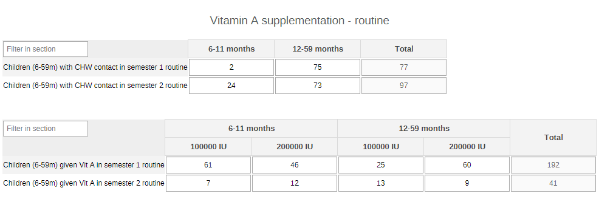

#### 2.1.6. Vitamin A Supplementation - Events

The section focuses on the attendance to Vitamin A distribution one shot events. There is no disaggregation of data, though the collected info refer only to children aged 6-59 months.

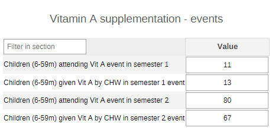

#### 2.1.7. Body Height

The section reports the number of children who have been measured in height out of all the consultations. The data are disaggregated by age (0-11m and 1-4y) and by sex (male, female, other, unknown).

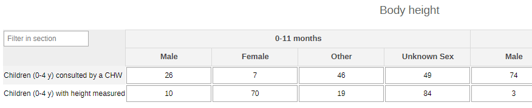

#### 2.1.8. Body Weight

This is a very simple reporting of the number of weighted children by age(0-11m and 1-4y) and by sex (male, female, other, unknown).

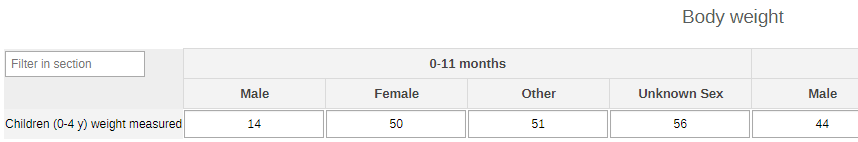

#### 2.1.9. Severe Acute Malnutrition (SAM)

The data collected in this section focus on screenings for SAM among children under 5 years of age. The data is disaggregated by age (0-11m and 1-4y).

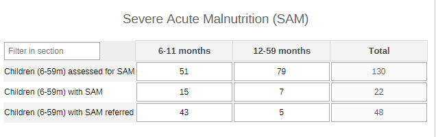

#### 2.1.10. Wasting

The section collects data on the screening for wasting (MUAC, WHZ, bilateral pitting oedema) among children under the age of five years in the community. The data are disaggregated by age (6-11m, 12-59m) and by sex for the oedema (mala, female, other, unknown).

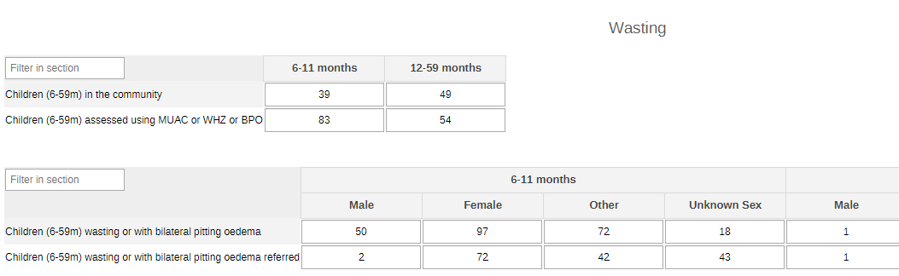

#### 2.1.11. Underweight Children

The section is a simple aggregation of the information on screened children and on those who have been found to be underweight.

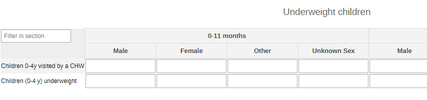

#### 2.1.12. Diarrhoea

The section provides data on children (0-9y) screened and treated for diarrhoea. The data is disaggregated by age (0-4y, and 5-9y) and by rehydration approach (Zinc, ORS, both).

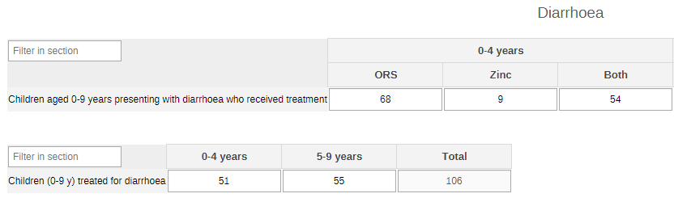

### 2.2. Yearly NUT Dataset

#### 2.2.1. Overweight (0-4 y)

The section provides info on children between the age of 0 and 4 years and their weight assessment to monitor for overweight children by age (0-11 and 1-4y) and sex (male, female, other, unknown sex).

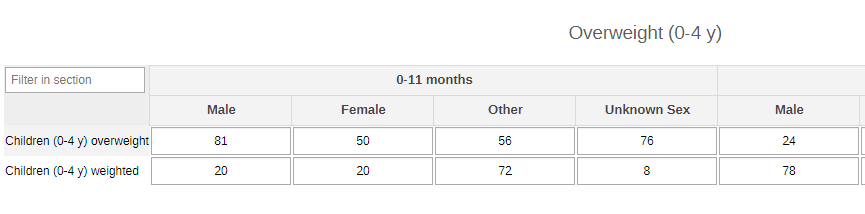

#### 2.2.2. Obesity (5-19 y)

The section focuses on the nutritional assessment of obese children in the community. The table disaggregates the data by age (5-9y, 10-14y, 15-17y, 18-19y, unknown age).

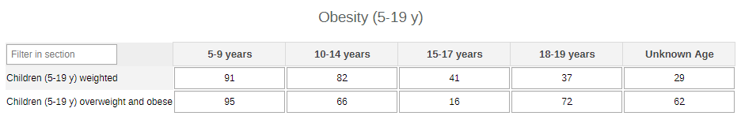

#### 2.2.3. Underweight Women

The section focuses on the weight assessment of women who are not pregnant. The table disaggregates the data by age (10-14y, 15-19y, 20+, unknown age).

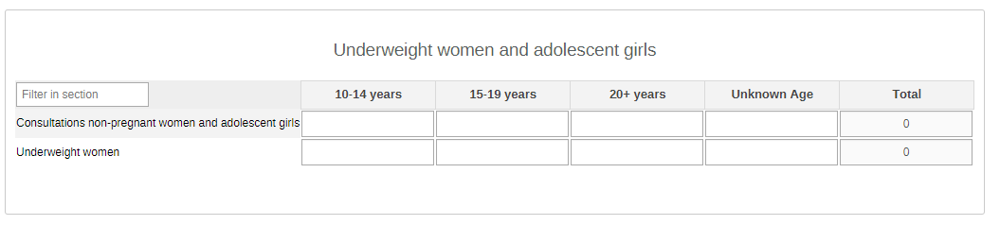

#### 2.2.4. Iron Supplement

The section provides info on Iron supplementation among menstruating women. The data is disaggregated by age (10-14y, 15-19y, 20+y, unknown age).

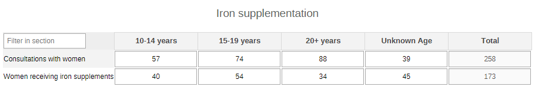

## 3. Validation Rules

The following validation rules have been set up for the Nutrition datasets:

| name                                                                                                       | instruction                                                                                                                        | operator              | leftSide description                              | rightSide description                             |
|------------------------------------------------------------------------------------------------------------|------------------------------------------------------------------------------------------------------------------------------------|-----------------------|---------------------------------------------------|---------------------------------------------------|
| CH - AG and menstruating women who received Vs Consultations with AG and menstruating women                | AG and menstruating women who received should be less than or equal to Consultations with AG and menstruating women                | less_than_or_equal_to | AG and menstruating women who received            | Consultations with AG and menstruating women      |
| CH - ANC contacts given/prescribed iron supplements Vs Community ANC contacts                              | ANC contacts given/prescribed iron supplements should be less than or equal to Community ANC contacts                              | less_than_or_equal_to | ANC contacts given/prescribed iron supplements    | Community ANC contacts                            |
| CH - ANC contacts received breastfeeding counselling Vs Community ANC contacts                             | ANC contacts received breastfeeding counselling should be less than or equal to Community ANC contacts                             | less_than_or_equal_to | ANC contacts received breastfeeding counselling   | Community ANC contacts                            |
| CH - Children 0-4 years visited by CHW and overweight Vs Children aged 0-4 years that were measured        | Children 0-4 years visited by CHW and overweight should be less than or equal to Children aged 0-4 years that were measured        | less_than_or_equal_to | Children 0-4 years visited by CHW and overweight  | Children aged 0-4 years that were measured        |
| CH - Children 0-4 years whose height was measured Vs Children aged 0-4 years consulted by a CHW            | Children 0-4 years whose height was measured should be less than or equal to Children aged 0-4 years consulted by a CHW            | less_than_or_equal_to | Children 0-4 years whose height was measured      | Children aged 0-4 years consulted by a CHW        |
| CH - Children 0-9 years with diarrhoea who received tx Vs Children 0-9 y presenting diarrhoea assessed     | Children 0-9 years with diarrhoea who received tx should be less than or equal to Children 0-9 y presenting diarrhoea assessed     | less_than_or_equal_to | Children 0-9 years with diarrhoea who received tx | Children 0-9 y presenting diarrhoea assessed      |
| CH - Children 6-59 months visited by CHW & underweight Vs Children aged 6-59 months visited by a CHW       | Children 6-59 months visited by CHW & underweight should be less than or equal to Children aged 6-59 months visited by a CHW       | less_than_or_equal_to | Children 6-59 months visited by CHW & underweight | Children aged 6-59 months visited by a CHW        |
| CH - Children 6-59 months wasting referred Vs Children 6-59 months wasting                                 | Children 6-59 months wasting referred should be less than or equal to Children 6-59 months wasting                                 | less_than_or_equal_to | Children 6-59 months wasting referred             | Children 6-59 months wasting                      |
| CH - Children 6-59 months wasting Vs Children aged 6-59 months that were measured                          | Children 6-59 months wasting should be less than or equal to Children aged 6-59 months that were measured                          | less_than_or_equal_to | Children 6-59 months wasting                      | Children aged 6-59 months that were measured      |
| CH - Children 6-59 months with SAM referred Vs Children 6-59 months screened for SAM                       | Children 6-59 months with SAM referred should be less than or equal to Children 6-59 months screened for SAM                       | less_than_or_equal_to | Children 6-59 months with SAM referred            | Children 6-59 months screened for SAM             |
| CH - Children 6-59 months with SAM Vs Children 6-59 months screened for SAM                                | Children 6-59 months with SAM should be less than or equal to Children 6-59 months screened for SAM                                | less_than_or_equal_to | Children 6-59 months with SAM                     | Children 6-59 months screened for SAM             |
| CH - Children 6-59 months with weight assessed Vs Children aged 6-59 months in the community               | Children 6-59 months with weight assessed should be less than or equal to Children aged 6-59 months in the community               | less_than_or_equal_to | Children 6-59 months with weight assessed         | Children aged 6-59 months in the community        |
| CH - Children 6-59 mo received vit A by event in sem 1 Vs Children 6-59 mo attending vit A event in sem 1  | Children 6-59 mo received vit A by event in sem 1 should be less than or equal to Children 6-59 mo attending vit A event in sem 1  | less_than_or_equal_to | Children 6-59 mo received vit A by event in sem 1 | Children 6-59 mo attending vit A event in sem 1   |
| CH - Children 6-59 mo received vit A by event in sem 2 Vs Children 6-59 mo attending vit A event in sem 2  | Children 6-59 mo received vit A by event in sem 2 should be less than or equal to Children 6-59 mo attending vit A event in sem 2  | less_than_or_equal_to | Children 6-59 mo received vit A by event in sem 2 | Children 6-59 mo attending vit A event in sem 2   |
| CH - Children 6-59 mo received vit A in routine sem 1 Vs Children 6-59 mo with at least 1 contact in sem 1 | Children 6-59 mo received vit A in routine sem 1 should be less than or equal to Children 6-59 mo with at least 1 contact in sem 1 | less_than_or_equal_to | Children 6-59 mo received vit A in routine sem 1  | Children 6-59 mo with at least 1 contact in sem 1 |
| CH - Children 6-59 mo received vit A in routine sem 2 Vs Children 6-59 mo with at least 1 contact in sem 2 | Children 6-59 mo received vit A in routine sem 2 should be less than or equal to Children 6-59 mo with at least 1 contact in sem 2 | less_than_or_equal_to | Children 6-59 mo received vit A in routine sem 2  | Children 6-59 mo with at least 1 contact in sem 2 |
| CH - Children aged 6-59 months assessed for wasting Vs Children aged 6-59 months in the community          | Children aged 6-59 months assessed for wasting should be less than or equal to Children aged 6-59 months in the community          | less_than_or_equal_to | Children aged 6-59 months assessed for wasting    | Children aged 6-59 months in the community        |
| CH - Children and adolescents 5-19 years overweight Vs Children and adolescents 5-19 years measured        | Children and adolescents 5-19 years overweight should be less than or equal to Children and adolescents 5-19 years measured        | less_than_or_equal_to | Children and adolescents 5-19 years overweight    | Children and adolescents 5-19 years measured      |
| CH - Consultation for children 0-5 m & infant feeding Vs Consultations with a CHW for an infant 0-5 months | Consultation for children 0-5 m & infant feeding should be less than or equal to Consultations with a CHW for an infant 0-5 months | less_than_or_equal_to | Consultation for children 0-5 m & infant feeding  | Consultations with a CHW for an infant 0-5 months |
| CH - Consultation for children 6-23 m & comp feeding Vs Consultations with a CHW for children 6-23 months  | Consultation for children 6-23 m & comp feeding should be less than or equal to Consultations with a CHW for children 6-23 months  | less_than_or_equal_to | Consultation for children 6-23 m & comp feeding   | Consultations with a CHW for children 6-23 months |
| CH - Non-pregnant AGW with low BMI Vs Consultations non-pregnant AGW                                       | Non-pregnant AGW with low BMI should be less than or equal to Consultations non-pregnant AGW                                       | less_than_or_equal_to | Non-pregnant AGW with low BMI                     | Consultations non-pregnant AGW                    |
| CH - Receiving a dose of PC for deworming by drug Vs Receiving a dose of PC for deworming                  | Receiving a dose of PC for deworming by drug should be less than or equal to Receiving a dose of PC for deworming                  | less_than_or_equal_to | Receiving a dose of PC for deworming by drug      | Receiving a dose of PC for deworming              |
| CH - Receiving a dose of PC for deworming Vs People targeted for PC for deworming                          | Receiving a dose of PC for deworming should be less than or equal to People targeted for PC for deworming                          | less_than_or_equal_to | Receiving a dose of PC for deworming              | People targeted for PC for deworming              |

## 4. Analytics and Indicators

Just as for the DEs, in the table below the column “Indicator Groups” provides information about whether the indicator is found in groups other than the NUT indicator group.

| Name                                                                     | Description                                                                                                                | Numerator                                                                  | Denominator                                                                 | Indicator Groups                                                                         |
|--------------------------------------------------------------------------|----------------------------------------------------------------------------------------------------------------------------|----------------------------------------------------------------------------|-----------------------------------------------------------------------------|------------------------------------------------------------------------------------------|
| CH002a - Live birth delivered in the community                           | Live birth delivered in the community                                                                                      | Livebirth                                                                  | 1                                                                           | CH - Nutrition, CH - Newborn Health                                                      |
| CH036 - ANC visits with breastfeeding counselling (%)                    | Proportion of antenatal care contacts during which women received breastfeeding counselling                                | ANC contacts received breastfeeding counselling                            | Community ANC contacts                                                      | CH - Nutrition, CH - Maternal Health                                                     |
| CH036b - Community ANC visits                                            | Number of antenatal care contacts in the community                                                                         | ANC contacts                                                               | 1                                                                           | CH - Nutrition, CH - Maternal Health                                                     |
| CH037 - Women given/prescribed iron supplements during ANC (%)           | Proportion of community antenatal care contacts given/prescribed iron-containing supplements                               | ANC contacts given/prescribed iron supplements                             | Community ANC contacts                                                      | CH - Nutrition, CH - Maternal Health                                                     |
| CH047 - Newborns breastfed within the 1st hour (%)                       | Proportion of newborns delivered in the community who were put to breast within the first hour of birth                    | Newborns delivered in the community put to breast within one hour of birth | Livebirth                                                                   | CH - Nutrition, CH - Newborn Health                                                      |
| CH048 - Newborns with documented birth weight (%)                        | Proportion of newborns delivered in the community with documented birth weight                                             | Newborns with documented birthweight                                       | Livebirth                                                                   | CH - Nutrition, CH - Newborn Health                                                      |
| CH049 - Low birth weight among newborns delivered in the community (%)   | Prevalence of low birthweight among newborns delivered in the community                                                    | Newborns with low birthweight                                              | Newborns with documented birthweight                                        | CH - Nutrition, CH - Newborn Health                                                      |
| CH058 - Consultations for children (0-5 m)                               | Number of consultations for infants under 6 months with CHW                                                                | Consultation for children 0-5 mos                                          | 1                                                                           | CH - Nutrition, CH - Child Health                                                        |
| CH058 - Consultations for children (0-5 m) with feeding counselling (%)  | Proportion of consultations for infants under 6 months providing counselling on appropriate infant and young child feeding | Consultation for children 0-5 m & infant feeding                           | Consultations with a CHW for an infant 0-5 months                           | CH - Nutrition, CH - Child Health                                                        |
| CH059 - Consultations for children (6-23 m)                              | Number of consultations for children 6-23 months with CHW                                                                  | Consultation for children 6-23 mos                                         | 1                                                                           | CH - Nutrition, CH - Child Health                                                        |
| CH059 - Consultations for children (6-23 m) with feeding counselling (%) | Proportion of consultations for children 6-23 months providing counselling on appropriate complementary feeding            | Consultation for children 6-23 mos & comp feeding                          | Consultations with a CHW for children 6-23 months                           | CH - Nutrition, CH - Child Health                                                        |
| CH060 - People receiving deworming preventive chemotherapy (%)           | Proportion of people receiving preventive chemotherapy for deworming                                                       | Receiving a dose of PC for deworming                                       | People targeted for PC for deworming                                        | CH - Nutrition, CH - Child Health, CH - Adolescent Health                                |
| CH061b - Children (6-59m) given Vit A each semester event(%)             | Proportion of children 6-59 months given a dose of vitamin A through event CHW contacts in each semester                   | Children 6-59 months given vitamin A event                                 | Contacts with children 6-59 months through event CHW contacts for Vitamin A | CH - Nutrition, CH - Child Health                                                        |
| CH062 - Children (6-59 m) assessed for wasting (%)                       | Proportion of children aged 6-59 months assessed for wasting                                                               | Children aged 6-59 months assessed for wasting                             | Children aged 6-59 months in the community                                  | CH - Nutrition, CH - Child Health                                                        |
| CH062 - Children (6-59 m) wasting                                        | Number of children aged 6-59 months with signs and symptoms of wasting                                                     | Children aged 6-59 wasting                                                 | 1                                                                           | CH - Nutrition, CH - Child Health                                                        |
| CH063 - Children (6-59 m) assessed for SAM (%)                           | Proportion of children 6-59 months with severe acute malnutrition (SAM)                                                    | Children 6-59 months with SAM                                              | Children 6-59 months screened for SAM                                       | CH - Nutrition, CH - Child Health, CH - ICCM                                             |
| CH063 - Children (6-59 m) with SAM                                       | Number of children 6-59 months with severe acute malnutrition (SAM)                                                        | Children 6-59 months with SAM                                              | 1                                                                           | CH - Nutrition, CH - Child Health, CH - ICCM                                             |
| CH064 - Children (6-59 m) weighted                                       | Number of children under 5 years (6-59 months) who had their weight assessed                                               | Children 6-59 months with weight assessed                                  | 1                                                                           | CH - Nutrition, CH - Child Health                                                        |
| CH065 - Children (0-4 y) underweight (%)                                 | Proportion of children under 5 years who are underweight                                                                   | Children aged 0-4 years visited by a CHW and underweight                   | Children weighed                                                            | CH - Nutrition, CH - Child Health                                                        |
| CH066 - Children (6-59m) wasting (%)                                     | Proportion of children (6-59m) wasting                                                                                     | Children 6-59 months wasting                                               | Children (6-59m) assessed using MUAC or WHZ or bilateral pitting oedema     | CH - Nutrition, CH - Child Health                                                        |
| CH067 - Children (0-4 y) with measured height (%)                        | Proportion of children under 5 years who had their height/length measured                                                  | Children 0-4 years whose height was measured                               | Children aged 0-4 years consulted by a CHW                                  | CH - Nutrition, CH - Child Health                                                        |
| CH068 - Overweight children (0-4 y) (%)                                  | Proportion of overweight among children under 5 years of age                                                               | Children 0-4 years visited by CHW and overweight                           | Children aged 0-4 years that were measured                                  | CH - Nutrition, CH - Child Health, CH - Noncommunicable diseases                         |
| CH069 - Overweight and obese children (5-19 y) (%)                       | Proportion of overweight and obesity in school-age children and adolescents 5-19 years                                     | Children and adolescents 5-19 years overweight                             | Children and adolescents 5-19 years measured                                | CH - Nutrition, CH - Child Health, CH - Adolescent Health, CH - Noncommunicable diseases |
| CH070b - Children (0-9 y) assessed for diarrhoea                         | Children (0-9 y) assessed for diarrhoea                                                                                    | Children (0-9 y) assessed for diarrhoea                                    | 1                                                                           | CH - Nutrition, CH - Child Health, CH - ICCM                                             |
| CH070 - Children (0-9 y) treated for diarrhoea (%)                       | Proportion of children (0-9 years)who received treatment for diarrhoea                                                     | Children 0-9 years with diarrhoea who received tx                          | Children 0-9 yrs presenting diarrhoea assessed                              | CH - Nutrition, CH - Child Health, CH - ICCM                                             |
| CH084b - Consultations with women                                        | Consultations with women                                                                                                   | Women consultations                                                        | 1                                                                           | CH - Nutrition                                                                           |
| CH084 - Women receiving anaemia-preventing iron supplements (%)          | Proportion of adolescent girls and women of reproductive age given iron-containing supplements for anaemia prevention      | AG and menstruating women who received                                     | Consultations with AG and menstruating women                                | CH - Nutrition, CH - Adolescent Health                                                   |
| CH085 - Underweight women (%)                                            | Proportion of Women and adolescent girls who are underweight                                                               | Non-pregnant AGW with low BMI                                              | Consultations non-pregnant AGW                                              | CH - Nutrition, CH - Adolescent Health                                                   |

## 5. Dashboards

The module includes a predefined dashboard called “CH - Nutrition”.
The dashboard is divided in two based on the periodicity of the datasets.

The first part is for monthly indicators. The predefined items on the dashboard include data as per the sections present in the dataset, but the content should be adapted based on the local activities.

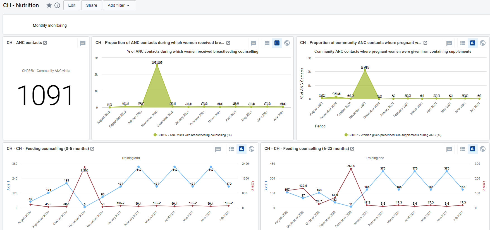

The second part of the dashboard is dedicated to the annual dataset (Annual Household Assessment Indicators). The predefined analyse and visualize the main areas of the dataset, though the dashboard should be modified to better mirror the local activities.

