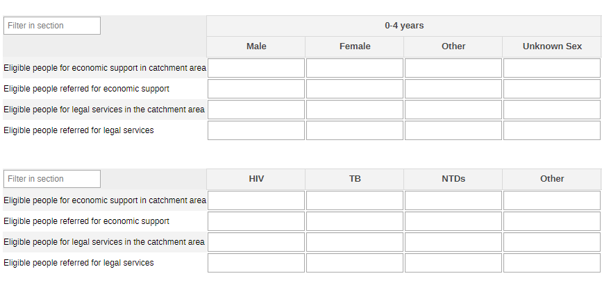
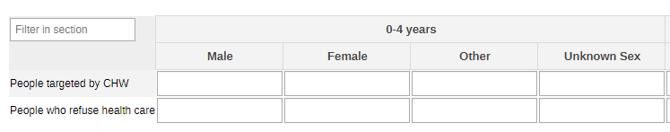
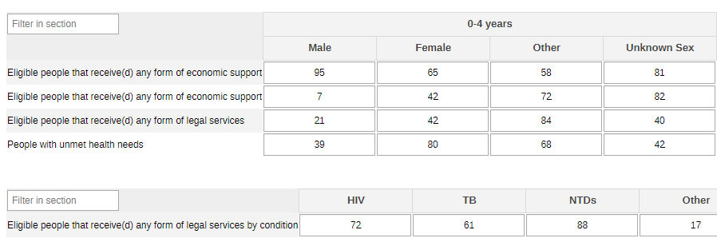
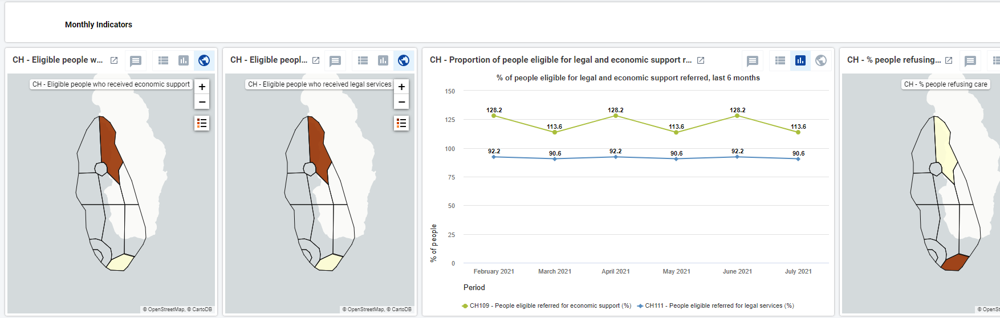
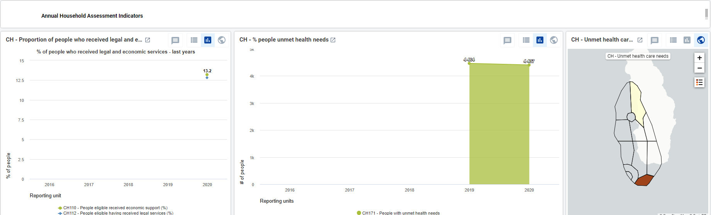

# CH - People-Centered Services { #ch-pcs-aggregate-design }

## 1.Datasets

### 1.1. Configuration Summary

The aggregate CH - People-centered services (PCS) module includes:

1. A **monthly dataset** with key data elements for PCS
2. A **yearly dataset** for the follow up of key annual information on PCS
3. **Core indicators** for both datasets
4. A predefined **“CH - People-centered services” dashboard**

It is recommended that the datasets get assigned to Organisation Units **at the lowest level** of the health system feasible for reporting data, such as Villages or any appropriate community demarcation according to the local context.

### 1.2. Data Elements

The table below summarizes the data elements present in the PCS module. The “Data elements groups” and “Datasets” columns will provide extra information on where the same DEs can be found in the other CHIS modules. This should facilitate the mapping of the package among all its modules and navigate the datasets while avoiding the collection and data entry of the same DEs in multiple locations.

All the DEs in the PCS module are used in the build up of indicators.

| Name                                                                             | Description                                                                          | Datasets                                                                                | DE groups                                                 |
|----------------------------------------------------------------------------------|--------------------------------------------------------------------------------------|-----------------------------------------------------------------------------------------|-----------------------------------------------------------|
| CH109a - People eligible referred for economic support                           | Eligible people referred for economic (livelihood) support by a CHW                  | CH - HIV (Monthly), CH - People-centred services (Monthly), CH - Tuberculosis (Monthly) | CH - HIV, CH - People-centred services, TB - Tuberculosis |
| CH109b - People eligible for economic support in catchment area                  | People eligible in the catchment area for economic (livelihood) support              | CH - HIV (Monthly), CH - People-centred services (Monthly), CH - Tuberculosis (Monthly) | CH - HIV, CH - People-centred services, TB - Tuberculosis |
| CH109c - People eligible for economic support referred                           | Eligible people referred for economic (livelihood) support by a CHW by condition     | CH - HIV (Monthly), CH - People-centred services (Monthly), CH - Tuberculosis (Monthly) | CH - HIV, CH - People-centred services, TB - Tuberculosis |
| CH109d - People eligible for economic support by condition                       | Eligible people in the catchment area for economic (livelihood) support by condition | CH - HIV (Monthly), CH - People-centred services (Monthly), CH - Tuberculosis (Monthly) | CH - HIV, CH - People-centred services, TB - Tuberculosis |
| CH111a - People eligible referred for legal services                             | People eligible referred for legal services                                          | CH - HIV (Monthly), CH - People-centred services (Monthly), CH - Tuberculosis (Monthly) | CH - HIV, CH - People-centred services, TB - Tuberculosis |
| CH111b - People eligible for legal services in the catchment area                | People eligible for legal services in the catchment area                             | CH - HIV (Monthly), CH - People-centred services (Monthly), CH - Tuberculosis (Monthly) | CH - HIV, CH - People-centred services, TB - Tuberculosis |
| CH111c - People eligible referred for legal services                             | People eligible referred for legal services by a CHW by condition                    | CH - HIV (Monthly), CH - People-centred services (Monthly), CH - Tuberculosis (Monthly) | CH - HIV, CH - People-centred services, TB - Tuberculosis |
| CH111d - People eligible for legal services by condition                         | People eligible in the catchment area for legal services by condition                | CH - HIV (Monthly), CH - People-centred services (Monthly), CH - Tuberculosis (Monthly) | CH - HIV, CH - People-centred services, TB - Tuberculosis |
| CH110a - People eligible that receive(d) any form of economic support            | People eligible that receive(d) any form of economic support                         | CH - HIV (Yearly), CH - People-centred services (Yearly), CH - Tuberculosis (Yearly)    | CH - HIV, CH - People-centred services, TB - Tuberculosis |
| CH110b - People eligible that receive(d) any form of economic support            | People eligible that receive(d) any form of economic support                         | CH - HIV (Yearly), CH - People-centred services (Yearly), CH - Tuberculosis (Yearly)    | CH - HIV, CH - People-centred services, TB - Tuberculosis |
| CH112a - People eligible that receive(d) any form of legal services              | People eligible that receive(d) any form of legal services                           | CH - HIV (Yearly), CH - People-centred services (Yearly), CH - Tuberculosis (Yearly)    | CH - HIV, CH - People-centred services, TB - Tuberculosis |
| CH112b - People eligible that receive(d) any form of legal services by condition | People eligible that receive(d) any form of legal services by condition              | CH - HIV (Yearly), CH - People-centred services (Yearly), CH - Tuberculosis (Yearly)    | CH - HIV, CH - People-centred services, TB - Tuberculosis |
| CH172a - People who refuse health care                                           | People who refuse health care                                                        | CH - People-centred services (Monthly)                                                  | CH - People-centred services                              |
| CH172b - People targeted by CHW for health care                                  | People targeted by CHW for health care                                               | CH - People-centred services (Monthly)                                                  | CH - People-centred services                              |
| CH171 - People with unmet health needs                                           | People who needed health care and did not get it in the last month                   | CH - People-centred services (Yearly)                                                   | CH - People-centred services                              |

## 2. Dataset Details

### 2.1. Monthly PCS Dataset

#### 2.1.1. Economic and Legal Support

The section provides information about the eligible people receiving services and support for economic and legal reasons. The data is disaggregated by age (0-4y, 5-9y, 10-14y, 15-19y, 20-24y, 25-29y, 30-34y, 35-39y, 40-44y, 45-49y, 50+y, unknown age) and sex (male, female, other, unknown). The same info is disaggregableable by condition (HIV, TB, NTDs, Other) - the options should be adapted to better mirror the local context.

#### 2.1.2. Refusal of Health Care

The section collects the data on people who decided to refuse health care. The disaggregation is by age (0-4y, 5-9y, 10-14y, 15-19y, 20-24y, 25-29y, 30-34y, 35-39y, 40-44y, 45-49y, 50+y, unknown age) and sex (male, female, other, unknown).

### 2.2. Yearly PCS Dataset

#### 2.2.1. Economic and Legal Support

The section provides the information on people who received economic or legal support and on those who have not received health care according to their health needs.

The disaggregation of data is set by age (0-4y, 5-9y, 10-14y, 15-19y, 20-24y, 25-29y, 30-34, 35-39y, 40-44y, 45-49y, 50+y) and sex (male, female, other, unknown). The eligible population can be disaggregated also by condition - currently the options are set as HIV, TB, NTDs and Other, but they should be adapted locally according to the context and the activities carried out in the community.

## 3. Validation Rules

The following validation rules have been set up for the Adolescent health datasets:
|                                                 Name                                                 |                                                          Instruction                                                         |        Operator       |                      Left side                     |                     Right side                    |
|:----------------------------------------------------------------------------------------------------:|:----------------------------------------------------------------------------------------------------------------------------:|:---------------------:|:--------------------------------------------------:|:-------------------------------------------------:|
| CH - Eligible for economic support by condition Vs Eligible people for economic (livelihood) support | Eligible for economic support by condition should be less than or equal to Eligible people for economic (livelihood) support | less_than_or_equal_to | Eligible for economic support by condition         | Eligible people for economic (livelihood) support |
| CH - Eligible people for legal services by condition Vs Eligible people for legal services           | Eligible people for legal services by condition should be less than or equal to Eligible people for legal services           | less_than_or_equal_to | Eligible people for legal services by condition    | Eligible people for legal services                |
| CH - Eligible referred for legal services by a CHW Vs Eligible people for legal services             | Eligible referred for legal services by a CHW should be less than or equal to Eligible people for legal services             | less_than_or_equal_to | Eligible referred for legal services by a CHW      | Eligible people for legal services                |
| CH - Receive(d) any form of econ support by condition Vs Receive(d) any form of economic support     | Receive(d) any form of econ support by condition should be less than or equal to Receive(d) any form of economic support     | less_than_or_equal_to | Receive(d) any form of econ support by condition   | Receive(d) any form of economic support           |
| CH - Receive(d) any form of legal services by condition Vs Receive(d) any form of legal services     | Receive(d) any form of legal services by condition should be less than or equal to Receive(d) any form of legal services     | less_than_or_equal_to | Receive(d) any form of legal services by condition | Receive(d) any form of legal services             |
| CH - Referred for economic support Vs Eligible people for economic (livelihood) support              | Referred for economic support should be less than or equal to Eligible people for economic (livelihood) support              | less_than_or_equal_to | Referred for economic support                      | Eligible people for economic (livelihood) support |
| CH - Referred for econonic support by condition Vs Referred for economic support                     | Referred for econonic support by condition should be less than or equal to Referred for economic support                     | less_than_or_equal_to | Referred for econonic support by condition         | Referred for economic support                     |
| CH - Referred for legal services by condition Vs Eligible referred for legal services by a CHW       | Referred for legal services by condition should be less than or equal to Eligible referred for legal services by a CHW       | less_than_or_equal_to | Referred for legal services by condition           | Eligible referred for legal services by a CHW     |
| CH - People who refuse health care Vs People targeted by CHW                                         | People who refuse health care should be less than or equal to People targeted by CHW                                         | less_than_or_equal_to | People who refuse health care                      | People targeted by CHW                            |

## 4. Analytics and Indicators

Just as for the DEs, in the table below the column “Indicator Groups” provides information about whether the indicator is found in groups other than the PCS indicator group.

| Name                                                       | Description                                                                      | Numerator                                     | Denominator                                       | Indicator Groups                                          |
|------------------------------------------------------------|----------------------------------------------------------------------------------|-----------------------------------------------|---------------------------------------------------|-----------------------------------------------------------|
| CH109 - People eligible referred for economic support (%)  | Proportion of people eligible for any form of economic support referred by a CHW | Referred for economic support                 | Eligible people for economic (livelihood) support | CH - HIV, CH - Tuberculosis, CH - People-centred services |
| CH110 - People eligible received economic support (%)      | Proportion of people eligible for any form of economic support who receive(d) it | Receive(d) any form of economic support       | Eligible people for economic (livelihood) support | CH - HIV, CH - Tuberculosis, CH - People-centred services |
| CH111 - People eligible referred for legal services (%)    | Proportion of eligible people for legal services referred by a CHW               | Eligible referred for legal services by a CHW | Eligible people for legal services                | CH - HIV, CH - Tuberculosis, CH - People-centred services |
| CH112 - People eligible having received legal services (%) | Proportion of eligible people that receive(d) any kind of legal services         | Receive(d) any form of legal services         | Eligible people for legal services                | CH - HIV, CH - Tuberculosis, CH - People-centred services |
| CH171 - People with unmet health needs                     | Number of people who needed care and did not get it in the last month            | Needed health care and did not get last month | 1                                                 | CH - People-centred services                              |
| CH172 - People refusing health care (%)                    | Proportion of people who refused care among those targeted by CHW                | People who refuse health care                 | People targeted by CHW                            | CH - People-centred services                              |

## 5. Dashboards

The module includes a predefined dashboard called “CH - People-centered services”.

The dashboard is divided in two based on the periodicity of the datasets.

The first part is for monthly indicators. The predefined items on the dashboard include data as per the sections present in the dataset, but the content should be adapted based on the local activities.

The second part of the dashboard is dedicated to the annual dataset (Annual Household Assessment Indicators). The predefined analyse and visualize the main areas of the dataset, though the dashboard should be modified to better mirror the local activities.

