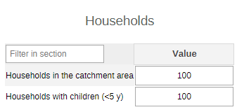
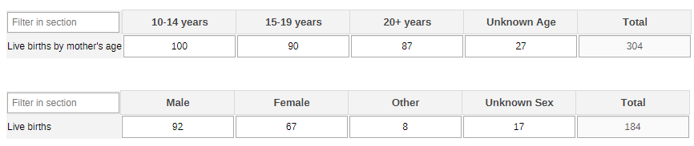
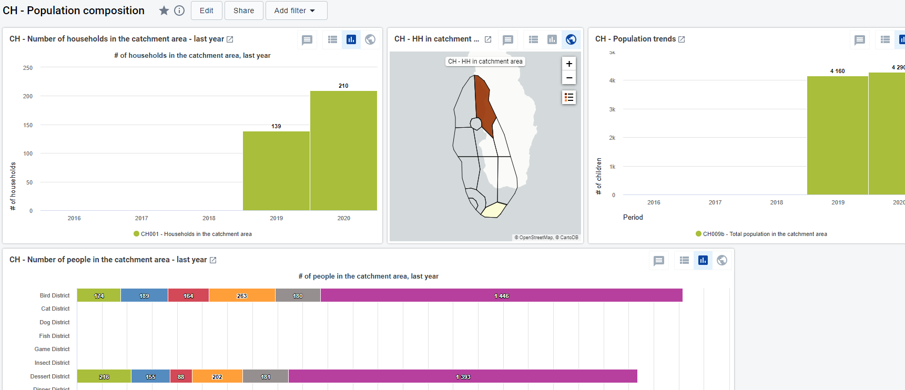

# CH - Population Composition { #ch-pop-aggregate-design }

## 1. Datasets

### 1.1. Configuration Summary

The aggregate CH - Population composition (POP) module includes:

1. A **yearly dataset** for the follow up of key POP data elements
2. **Core POP indicators**
3. A predefined **“CH - Population composition”** dashboard

It is recommended that the datasets get assigned to Organisation Units **at the lowest level** of the health system feasible for reporting data, such as Villages or any appropriate community demarcation according to the local context.

### 1.2. Data Elements

The table below summarizes the data elements present in the AH module. The “Data elements groups” and “Datasets” columns will provide extra information on where the same DEs can be found in the other CHIS modules. This should facilitate the mapping of the package among all its modules and navigate the datasets while avoiding the collection and data entry of the same DEs in multiple locations. As the population DEs are very much linked to the activities that are carried out, the DEs should be modified, or new ones should be added, to better mirror the activities. Please note that some population denominators are also found in other modules (e.g. Women and girls surveyed in the households visits, Screened children <5y, People (>18m) in the catchment area) and it is up to the user to decide whether they want to keep them in the current module or if they prefer moving them to the POP module.

All the DEs in the POP module are used in the build up of indicators.
| Name                                                              | Description                                                  | Disaggregation                    | Data Sets                                                                                   | Data Element Groups                                                                             |
|-------------------------------------------------------------------|--------------------------------------------------------------|-----------------------------------|---------------------------------------------------------------------------------------------|-------------------------------------------------------------------------------------------------|
| CH001a - Households in the catchment area                         | Households in the catchment area                             | default                           | CH - Population composition (Yearly)                                                        | CH - Population composition                                                                     |
| CH001b - Households with children (0-4 y)                         | Households in the catchment area with chldren aged 0-4 years | default                           | CH - Population composition (Yearly)                                                        | CH - Population composition                                                                     |
| CH002a - Live births delivered in the community                   | Live births delivered in the community                       | Sex (Other/Unk)                   | CH - Population composition (Yearly); CH - Civil registration and vital statistics (Yearly) | CH - Nutrition; CH - Population composition; CH - Civil registration and vital statistics       |
| CH002b - Live births delivered in the community (by mother's age) | Live births delivered in the community by age of mother      | Age (10-20+years)                 | CH - Civil registration and vital statistics (Yearly); CH - Population composition (Yearly) | CH - Maternal Health; CH - Population composition; CH - Civil registration and vital statistics |
| CH003 - Infants (0-11 m) in catchment area                        | Infants aged 0-11 months                                     | Sex (Other/Unk)                   | CH - Population composition (Yearly)                                                        | CH - Population composition                                                                     |
| CH004 - Children (1-4 y) in catchment area                        | Children aged 1-4 years in the catchment area                | Sex (Other/Unk)                   | CH - Population composition (Yearly)                                                        | CH - Population composition                                                                     |
| CH005 - Children (5-9 y) in catchment area                        | Children aged 5-9 years in the catchment area                | Sex (Other/Unk)                   | CH - Population composition (Yearly)                                                        | CH - Population composition                                                                     |
| CH006 - Young adolescents (10-14 y) in catchment area             | Young adolescents aged 10-14 years in the catchment area     | Sex (Other/Unk)                   | CH - Population composition (Yearly)                                                        | CH - Population composition                                                                     |
| CH007 - Older adolescents (15-19 y) in catchment area             | Older adolescents aged 15-19 years in the catchment area     | Sex (Other/Unk)                   | CH - Population composition (Yearly)                                                        | CH - Population composition                                                                     |
| CH008 - Pregnant women in the catchment area                      | Pregnant women in the catchment area                         | Age (10-20+years)                 | CH - Population composition (Yearly)                                                        | CH - Population composition                                                                     |
| CH009 - Adults 20+ years in the catchment area                    | Adults aged 20+ years in the catchment area                  | Age (20-80+years)/Sex (Other/Unk) | CH - Population composition (Yearly)                                                        | CH - Population composition                                                                     |

In the table below there are some examples of DEs that are not in the POP module but that nonetheless could be considered as population denominators. As aforementioned, it is up to the user to modify the modules in order to better represent the local context/activities, and to facilitate the collection of population data.

|                                      Name                                      |                                       Description                                       |                    Data element groups                    |                                         Datasets                                        |   |
|:------------------------------------------------------------------------------:|:---------------------------------------------------------------------------------------:|:---------------------------------------------------------:|:---------------------------------------------------------------------------------------:|---|
| CH101b - Pregnant women LWHA giving birth                                      | Pregnant women living with HIV giving birth in the past 12 months in the catchment area | CH - HIV                                                  | CH - HIV (Monthly)                                                                      |   |
| CH106b - People with Known HIV status in catchment area                        | PLWHA who know their HIV status in the catchment area                                   | CH - HIV                                                  | CH - HIV (Monthly)                                                                      |   |
| CH106d - Key population with known HIV status in catchment area                | PLWHA who know their HIV status in the catchment area who are key population            | CH - HIV                                                  | CH - HIV (Monthly)                                                                      |   |
| CH109b - Eligible people for economic support in catchment area                | Eligible people in the catchment area for economic (livelihood) support                 | CH - People-centred services, CH - HIV, TB - Tuberculosis | CH - HIV (Monthly), CH - People-centred services (Monthly), CH - Tuberculosis (Monthly) |   |
| CH109d - Eligible people for economic support in catchment area                | Eligible people in the catchment area for economic (livelihood) support by condition    | CH - People-centred services, CH - HIV, TB - Tuberculosis | CH - HIV (Monthly), CH - People-centred services (Monthly), CH - Tuberculosis (Monthly) |   |
| CH111d - Eligible people for legal services in the catchment area              | Eligible people in the catchment area for legal services by condition                   | CH - People-centred services, CH - HIV, TB - Tuberculosis | CH - HIV (Monthly), CH - People-centred services (Monthly), CH - Tuberculosis (Monthly) |   |
| CH146 - People screened for VL and/or PKDL                                     | People screened for signs and symptoms of VL and/or PKDL in the catchment area          | CH - Neglected tropical diseases                          | CH - Neglected tropical diseases (Yearly)                                               |   |
| CH168c - Asymptomatic diabetic adults (40+ y) with BMI >= 25 in catchment area | Asymptomatic adults aged 40+ years with a BMI ≥ 25 in the catchment area                | CH - Noncommunicable diseases                             | CH - Noncommunicable diseases (Yearly)                                                  |   |
| CH060b -People targeted for deworming preventive chemotherapy                  | People targeted for preventive chemotherapy for deworming                               | CH - Nutrition, CH - Adolescent Health, CH - Child Health | CH - Adolescent Health (Monthly), CH - Child Health (Monthly), CH - Nutrition (Monthly) |   |
| CH141e - Households targeted for messages on NTDs - case management            | Households targeted for social mobilization campaigns on NTDs - case management         | CH - Neglected tropical diseases                          | CH - Neglected tropical diseases (Yearly)                                               |   |
| CH141f - Households targeted for messages on NTDs - OneHealth                  | Households targeted for social mobilization campaigns on NTDs - one health approach     | CH - Neglected tropical diseases                          | CH - Neglected tropical diseases (Yearly)                                               |   |
| CH141g - Househoulds targeted for messages on NTDs - PC                        | Households targeted for social mobilization campaigns on NTDs - PC                      | CH - Neglected tropical diseases                          | CH - Neglected tropical diseases (Yearly)                                               |   |
| CH141h - Households targeted for messages on NTDs - VC                         | Households targeted for social mobilization campaigns on NTDs - vector control          | CH - Neglected tropical diseases                          | CH - Neglected tropical diseases (Yearly)                                               |   |
| CH150b - Houses targeted for vector reduction measure                          | Houses targeted for domiciliary vector reduction measures                               | CH - Neglected tropical diseases                          | CH - Neglected tropical diseases (Yearly)                                               |   |

## 2. Dataset Details

### 2.1.Yearly POP Dataset

#### 2.1.1. Households

The section reports information on the households in the catchment area of a specific community.

#### 2.1.2. Live Births

The section reports the live births registered in the community by sex of the newborn (male, female, otehr, unknown sex) and by the age of the mother (10-14y, 15-19y, 20+y, unknown age).

#### 2.1.3. People in Catchment Area

The section reports on pregnant women by age (10-14y, 15-19y, 20+y, unknown age), on the number of adults above the age of 20 years by age groups (20-29y, 30-39y, 40-49y, 50-59y, 60-69y, 70-79y, 80+y, unknown age) and by sex (male, female, other, unknown sex). Finally the section also reports data on children and adolescents in the area by sex (male, female, other, unknown sex).

## 3. Validation Rules

The following validation rules have been set up for the POP dataset:

|                                          Name                                         |                                                  Instruction                                                  |        Operator       |                Left side               |               Right side               |
|:-------------------------------------------------------------------------------------:|:-------------------------------------------------------------------------------------------------------------:|:---------------------:|:--------------------------------------:|:--------------------------------------:|
| CH - Live births delivered by age of mother Vs Live births delivered in the community | Live births delivered by age of mother should be less than or equal to Live births delivered in the community | less_than_or_equal_to | Live births delivered by age of mother | Live births delivered in the community |
| CH - HHs with chldren aged <5 years Vs Households in the catchment area               | HHs with chldren aged <5 years should be less than or equal to Households in the catchment area               | less_than_or_equal_to | HHs with chldren aged <5 years         | Households in the catchment area       |

## 4. Analytics and Indicators

Just as for the DEs, in the table below the column “Indicator Groups” provides information about whether the indicator is found in groups other than the POP indicator group.

|                               Name                               |              Numerator description             | Denominator description |                              Indicator groups                             |   |
|:----------------------------------------------------------------:|:----------------------------------------------:|:-----------------------:|:-------------------------------------------------------------------------:|---|
| CH001 - Households in the catchment area                         | Households in the catchment area               | 1                       | CH - Population composition                                               |   |
| CH002 - Live births delivered in the community                   | Live births delivered in the community         | 1                       | CH - Civil registration and vital statistics, CH - Population composition |   |
| CH003 - Infants aged 0-11 months in the catchment area           | Infants aged 0-11 months in the catchment area | 1                       | CH - Population composition                                               |   |
| CH004 - Children aged 1-4 years in the catchment area            | Children aged 1-4 years in the catchment area  | 1                       | CH - Population composition                                               |   |
| CH005 - Children aged 5-9 years in the catchment area            | Children aged 5-9 years in the catchment area  | 1                       | CH - Population composition                                               |   |
| CH006 - Young adolescents aged 10-14 years in the catchment area | Young adolescents aged 10-14 years             | 1                       | CH - Population composition                                               |   |
| CH007 - Older adolescents aged 15-19 years in the catchment area | Older adolescents aged 15-19 years             | 1                       | CH - Population composition                                               |   |
| CH008 - Pregnant women in the catchment area                     | Pregnant women in the catchment area           | 1                       | CH - Population composition                                               |   |
| CH009 - Adults aged 20+ years in the catchment area              | Adults aged 20+ years in the catchment area    | 1                       | CH - Population composition                                               |   |
| CH009b - Total population in the catchment area                  | Adults aged 20+ years in the catchment area    | 1                       | CH - Population composition                                               |   |

## 5. Dashboard

The module includes a predefined dashboard called “CH - Population composition”.The first part The predefined items on the dashboard include data as per the sections present in the dataset, but the content should be adapted based on the local activities.

