# CH - Sexual and Reproductive Health { #ch-srh-aggregate-design }

## 1. Datasets

### 1.1. Configuration Summary

The aggregate CH - Sexual and reproductive health (SRH) module includes:

1. A **monthly dataset** with key data elements
2. A y**early dataset** for the follow up of key annual information
3. **Core indicators** for both datasets
4. A predefined **“CH - Sexual and reproductive health” dashboard**

It is recommended that the datasets get assigned to Organisation Units **at the lowest level** of the health system feasible for reporting data, such as Villages or any appropriate community demarcation according to the local context.

### 1.2. Data Elements

The table below summarizes the data elements present in the SRH module. The “Data elements groups” and “Datasets” columns will provide extra information on where the same DEs can be found in the other CHIS modules. This should facilitate the mapping of the package among all its modules and navigate the datasets while avoiding the collection and data entry of the same DEs in multiple locations.

All the DEs in the SRH module are used in the build up of indicators.

| Name                                                                    | Description                                                                                             | Datasets                                                                                                                                                                         | DE groups                                                                                                                 |
|-------------------------------------------------------------------------|---------------------------------------------------------------------------------------------------------|----------------------------------------------------------------------------------------------------------------------------------------------------------------------------------|---------------------------------------------------------------------------------------------------------------------------|
| CH027a - Adolescents seeking FP services                                | Adolescents and young people seeking family planning services from CHW                                  | CH - Adolescent Health (Monthly), CH - HIV (Monthly), CH - Sexual and Reproductive Health (Monthly)                                                                              | CH - HIV, CH - Adolescent Health, CH - Sexual and Reproductive Health                                                     |
| CH027b - Adolescents seeking FP methods tested for HIV                  | Adolescents and young people seeking family planning services who were tested for HIV by CHW            | CH - Adolescent Health (Monthly), CH - HIV (Monthly), CH - Sexual and Reproductive Health (Monthly)                                                                              | CH - HIV, CH - Adolescent Health, CH - Sexual and Reproductive Health                                                     |
| CH028a - HIV positive tests returned                                    | HIV tests conducted in which a new HIV-positive result or diagnosis was returned                        | CH - Adolescent Health (Yearly), CH - Child Health (Yearly), CH - HIV (Yearly), CH - ICCM (Monthly), CH - Maternal Health (Yearly), CH - Sexual and Reproductive Health (Yearly) | CH - HIV, CH - Maternal Health, CH - ICCM, CH - Adolescent Health, CH - Sexual and Reproductive Health, CH - Child Health |
| CH028b - HIV tests returned                                             | HIV tests returned                                                                                      | CH - Adolescent Health (Yearly), CH - Child Health (Yearly), CH - HIV (Yearly), CH - ICCM (Monthly), CH - Maternal Health (Yearly), CH - Sexual and Reproductive Health (Yearly) | CH - HIV, CH - Maternal Health, CH - ICCM, CH - Adolescent Health, CH - Sexual and Reproductive Health, CH - Child Health |
| CH028c - HIV positive tests returned to key population                  | HIV tests conducted amongst key population in which a new HIV-positive result or diagnosis was returned | CH - Adolescent Health (Yearly), CH - Child Health (Yearly), CH - HIV (Yearly), CH - ICCM (Monthly), CH - Maternal Health (Yearly), CH - Sexual and Reproductive Health (Yearly) | CH - HIV, CH - Maternal Health, CH - ICCM, CH - Adolescent Health, CH - Sexual and Reproductive Health, CH - Child Health |
| CH028d - HIV tests returned to key population                           | HIV tests performed amongst key population where results were returned                                  | CH - Adolescent Health (Yearly), CH - Child Health (Yearly), CH - HIV (Yearly), CH - ICCM (Monthly), CH - Maternal Health (Yearly), CH - Sexual and Reproductive Health (Yearly) | CH - HIV, CH - Maternal Health, CH - ICCM, CH - Adolescent Health, CH - Sexual and Reproductive Health, CH - Child Health |
| CH028e - HIV positive tests returned to TB patients                     | HIV tests conducted amongst TB in which a new HIV-positive result or diagnosis was returned             | CH - Adolescent Health (Yearly), CH - Child Health (Yearly), CH - HIV (Yearly), CH - ICCM (Monthly), CH - Maternal Health (Yearly), CH - Sexual and Reproductive Health (Yearly) | CH - HIV, CH - Maternal Health, CH - ICCM, CH - Adolescent Health, CH - Sexual and Reproductive Health, CH - Child Health |
| CH028f - HIV tests returned to TB patients                              | HIV tests performed amongst TB where results were returned                                              | CH - Adolescent Health (Yearly), CH - Child Health (Yearly), CH - HIV (Yearly), CH - ICCM (Monthly), CH - Maternal Health (Yearly), CH - Sexual and Reproductive Health (Yearly) | CH - HIV, CH - Maternal Health, CH - ICCM, CH - Adolescent Health, CH - Sexual and Reproductive Health, CH - Child Health |
| CH034a - Women (15-49 years) with FGM                                   | Women aged 15-49 years who have undergone FGM                                                           | CH - Child protection & interpersonal violence (Yearly), CH - Sexual and Reproductive Health (Yearly)                                                                            | CH - Sexual and Reproductive Health, CH - Child protection & interpersonal violence                                       |
| CH034b - Women (15-49 years) in the catchment area                      | Women (15-49 years) in the catchment area                                                               | CH - Child protection & interpersonal violence (Yearly), CH - Sexual and Reproductive Health (Yearly)                                                                            | CH - Sexual and Reproductive Health, CH - Child protection & interpersonal violence                                       |
| CH030a - Women tested for syphilis - 1st ANC                            | Women attending 1st ANC visit provided by CHW who were tested for syphilis                              | CH - HIV (Monthly), CH - Maternal Health (Monthly), CH - Sexual and Reproductive Health (Monthly)                                                                                | CH - HIV, CH - Maternal Health, CH - Sexual and Reproductive Health                                                       |
| CH030b - Women tested for syphilis by CHW - 1st ANC                     | Women tested for syphilis by CHW - 1st ANC                                                              | CH - HIV (Monthly), CH - Maternal Health (Monthly), CH - Sexual and Reproductive Health (Monthly)                                                                                | CH - HIV, CH - Maternal Health, CH - Sexual and Reproductive Health                                                       |
| CH030c - Women tested for syphilis - 2nd+ ANC                           | Women attending other ANC visits provided by CHW who were tested for syphilis                           | CH - HIV (Monthly), CH - Maternal Health (Monthly), CH - Sexual and Reproductive Health (Monthly)                                                                                | CH - HIV, CH - Maternal Health, CH - Sexual and Reproductive Health                                                       |
| CH030d - Women tested for syphilis by CHW - 2nd+ ANC                    | Women attending other ANC visits provided by CHW                                                        | CH - HIV (Monthly), CH - Maternal Health (Monthly), CH - Sexual and Reproductive Health (Monthly)                                                                                | CH - HIV, CH - Maternal Health, CH - Sexual and Reproductive Health                                                       |
| CH024 - Condoms distributed                                             | Condoms distributed                                                                                     | CH - HIV (Yearly), CH - Sexual and Reproductive Health (Yearly)                                                                                                                  | CH - Sexual and Reproductive Health, CH - HIV                                                                             |
| CH031a - Women screened for cervical cancer                             | Women screened for cervical cancer                                                                      | CH - HIV (Yearly), CH - Noncommunicable diseases (Yearly), CH - Sexual and Reproductive Health (Yearly)                                                                          | CH - HIV, CH - Noncommunicable diseases, CH - Sexual and Reproductive Health                                              |
| CH031b - Women who should have had a screening test for cervical cancer | Women who should have had a screening test for cervical cancer                                          | CH - HIV (Yearly), CH - Noncommunicable diseases (Yearly), CH - Sexual and Reproductive Health (Yearly)                                                                          | CH - HIV, CH - Noncommunicable diseases, CH - Sexual and Reproductive Health                                              |
| CH025 - Women and adolescent girls initiating modern FP methods         | Women and adolescent girls initiating modern FP methods                                                 | CH - Sexual and Reproductive Health (Monthly)                                                                                                                                    | CH - Sexual and Reproductive Health                                                                                       |
| CH029a - Men and adolescent boys with urethral discharge                | Men and adolescent boys with urethral discharge                                                         | CH - Sexual and Reproductive Health (Monthly)                                                                                                                                    | CH - Sexual and Reproductive Health                                                                                       |
| CH029b - Men and adolescent boys with urethral discharge referred       | Men and adolescent boys with urethral discharge referred                                                | CH - Sexual and Reproductive Health (Monthly)                                                                                                                                    | CH - Sexual and Reproductive Health                                                                                       |
| CH029c - Men and adolescent boys in the community                       | Referred men and adolescent boys with urethral discharge                                                | CH - Sexual and Reproductive Health (Monthly)                                                                                                                                    | CH - Sexual and Reproductive Health                                                                                       |
| CH032 - Women referred for any post-abortion complication               | Women referred for any post-abortion complication                                                       | CH - Sexual and Reproductive Health (Monthly)                                                                                                                                    | CH - Sexual and Reproductive Health                                                                                       |
| CH033 - Women referred for safe abortion                                | Women referred for safe abortion                                                                        | CH - Sexual and Reproductive Health (Monthly)                                                                                                                                    | CH - Sexual and Reproductive Health                                                                                       |
| CH026 - Women and adolescent girls on modern FP methods                 | Women and adolescent girls on modern FP methods                                                         | CH - Sexual and Reproductive Health (Yearly)                                                                                                                                     | CH - Sexual and Reproductive Health                                                                                       |

## 2. Dataset Details

In both the monthly and the yearly datasets the category combinations for the age groups have age groups that go beyond the [WHO definition of adolescents](https://www.who.int/southeastasia/health-topics/adolescent-health) “WHO defines '**Adolescents**' as individuals **in the 10-19 years age group** and '**Youth**' as **the 15-24 year age group**. While 'Young People' covers the age range 10-24 years” . This has been done to avoid creating *ad hoc* age groups for each and every dataset. The age groups above the definition of Adolescent/Youth have been greyed-out and therefore blocked for data entry. Countries should nonetheless edit and apply the age categories that better reflect the local context and guidelines.

### 2.1. Monthly SRH Dataset

#### 2.1.1. Family Planning

The section summarizes the uptake of modern family planning methods. The data is disaggregated by age (10-14y, 15-19y, 20+y, unknown age) and methods (Pill, Condom, Injectable, Emergency contraception, vaginal barrier, LAM, Other FP method). The methods should be adapted to the local context.

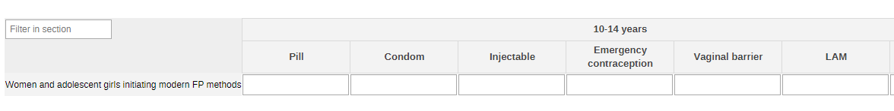

#### 2.1.2. Family Planning and HIV

The section collects data on adolescent routine HIV testing and on the uptake of modern FP methods. The former is disaggregated by age group (10-14y and 15-19y as per definition of adolescent) and by result of the test (positive, negative, indeterminate); while the latter is by age groups (10-14y and 15-19y as per definition of adolescent).

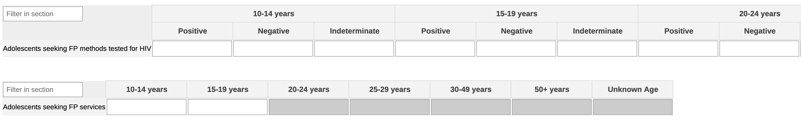

#### 2.1.3. Urethral Discharge

The section collects data on men presenting with urethral discharge and on the number of referrals. The data is disaggregated by age groups (10-14y, 15-19y, 20+y, unknown age).

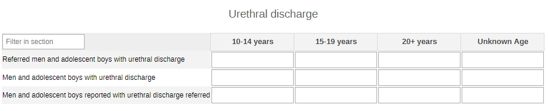

#### 2.1.4. Syphilis Screening

The section monitors women through their ANC appointments. The data is disaggregated by age groups (10-14y, 15-19y, 20+y, unknown age).

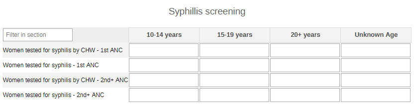

#### 2.1.5. Abortion Care and Services

The section captures the accessibility and the use of safe abortion care. The data is disaggregated by age groups (10-14y, 15-19y, 20+y, unknown age).

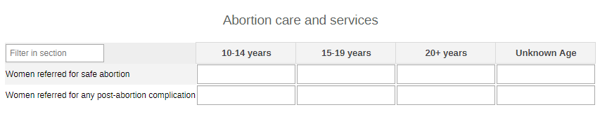

### 2.2. Yearly SRH Dataset

#### 2.2.1 Condom Distribution

A quick overview of the number of distributed condoms by type of condom (female or male).
The data is disaggregated by age groups (10-14y, 15-19y, 20+y, unknown age).

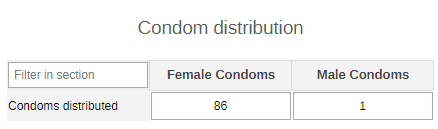

#### 2.2.2. HIV Tests - All

The section collects the info on returned and positive HIV tests among the general population benefiting from the Maternal health services. The data are collected by age (0-4y, 5-9y, 10-14y, 15-19y, 20-24y, 25-29y, 30-34y, 35-39y, 40-44y, 45-49y, 50+y, unknown age) and sex (female, other).

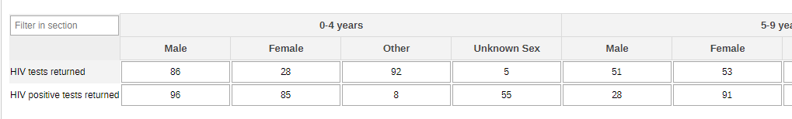

#### 2.2.3. HIV Tests - TB Case

THe section collects the same information as the previous section, though among presumptive and confirmed TB cases.

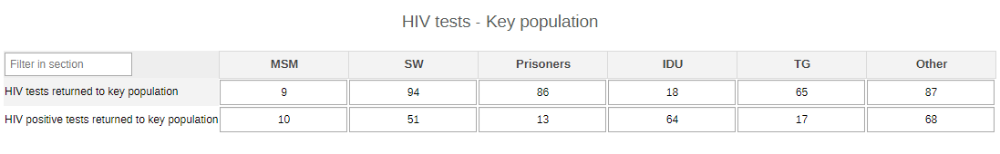

#### 2.2.4. HIV Tests - Key Population

The section provides the information on the key population by type of key population groups (SW, Prisoners, IDU, TG, Other - these can be adapted to better mirror the local context).

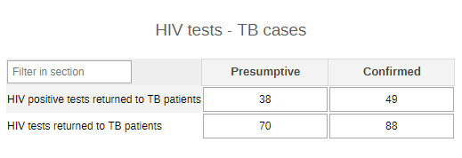

#### 2.2.5. Cervical Cancer Screening

The section collects data on the number of women who had or should have had a screening contact. The data is disaggregated by age (10+-14y, 15-19y, 20-24y, 25-29y, 30-49y, 50+y, unknown age).

#### 2.2.6. FGM

The section briefly records data on FGM practices in the community reportinng the number of female who had undergone FGM among all the females present in the community. The data is disaggregated by age (15-19y, 20-40y, unknown age).

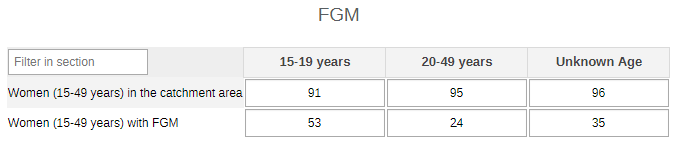

#### 2.2.7. Family Planning

The section summarizes the uptake of modern family planning methods. The data is disaggregated by age (10-14y, 15-19y, 20+y, unknown age) and methods (Pill, Condom, Injectable, Emergency contraception, vaginal barrier, LAM, Other FP method). The methods should be adapted to the local context.

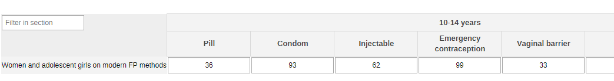

## 3. Validation Rules

The following validation rules have been set up for the SRH datasets:

|                                                      Name                                                     |                                                              Instruction                                                              |        Operator       |                      Left side                     |                     Right side                     |
|:-------------------------------------------------------------------------------------------------------------:|:-------------------------------------------------------------------------------------------------------------------------------------:|:---------------------:|:--------------------------------------------------:|:--------------------------------------------------:|
| CH - HIV tests performed amongst KP & results returned Vs HIV tests performed where results were returned     | HIV tests performed amongst KP & results returned should be less than or equal to HIV tests performed where results were returned     | less_than_or_equal_to | HIV tests performed amongst KP & results returned  | HIV tests performed where results were returned    |
| CH - HIV tests performed amongst TB & results returned Vs HIV tests performed where results were returned     | HIV tests performed amongst TB & results returned should be less than or equal to HIV tests performed where results were returned     | less_than_or_equal_to | HIV tests performed amongst TB & results returned  | HIV tests performed where results were returned    |
| CH - New HIV-positive result or diagnosis was returned Vs HIV tests performed where results were returned     | New HIV-positive result or diagnosis was returned should be less than or equal to HIV tests performed where results were returned     | less_than_or_equal_to | New HIV-positive result or diagnosis was returned  | HIV tests performed where results were returned    |
| CH - New HIV-positive result returned for KP Vs HIV tests performed amongst KP & results returned             | New HIV-positive result returned for KP should be less than or equal to HIV tests performed amongst KP & results returned             | less_than_or_equal_to | New HIV-positive result returned for KP            | HIV tests performed amongst KP & results returned  |
| CH - New HIV-positive result returned for KP Vs New HIV-positive result or diagnosis was returned             | New HIV-positive result returned for KP should be less than or equal to New HIV-positive result or diagnosis was returned             | less_than_or_equal_to | New HIV-positive result returned for KP            | New HIV-positive result or diagnosis was returned  |
| CH - New HIV-positive result returned for TB Vs HIV tests performed amongst TB & results returned             | New HIV-positive result returned for TB should be less than or equal to HIV tests performed amongst TB & results returned             | less_than_or_equal_to | New HIV-positive result returned for TB            | HIV tests performed amongst TB & results returned  |
| CH - New HIV-positive result returned for TB Vs New HIV-positive result or diagnosis was returned             | New HIV-positive result returned for TB should be less than or equal to New HIV-positive result or diagnosis was returned             | less_than_or_equal_to | New HIV-positive result returned for TB            | New HIV-positive result or diagnosis was returned  |
| CH - AYP seeking FP services tested for HIV by CHW Vs AYP seeking family planning services from CHW           | AYP seeking FP services tested for HIV by CHW should be less than or equal to AYP seeking family planning services from CHW           | less_than_or_equal_to | AYP seeking FP services tested for HIV by CHW      | AYP seeking family planning services from CHW      |
| CH - Women attending 1st ANC visit provided by CHW Vs Attending 1st ANC visit & tested for syphilis           | Women attending 1st ANC visit provided by CHW should be less than or equal to Attending 1st ANC visit & tested for syphilis           | less_than_or_equal_to | Women attending 1st ANC visit provided by CHW      | Attending 1st ANC visit & tested for syphilis      |
| CH - Women attending other ANC visits provided by CHW Vs Other ANC visits tested for syphilis                 | Women attending other ANC visits provided by CHW should be less than or equal to Other ANC visits tested for syphilis                 | less_than_or_equal_to | Women attending other ANC visits provided by CHW   | Other ANC visits tested for syphilis               |
| CH - Women who had a screening test for cervical cancer Vs Women who should have screened for cervical cancer | Women who had a screening test for cervical cancer should be less than or equal to Women who should have screened for cervical cancer | less_than_or_equal_to | Women who had a screening test for cervical cancer | Women who should have screened for cervical cancer |
| CH - Women aged 15-49 years who have undergone FGM Vs Women aged 15-49 years in the catchment area            | Women aged 15-49 years who have undergone FGM should be less than or equal to Women aged 15-49 years in the catchment area            | less_than_or_equal_to | Women aged 15-49 years who have undergone FGM      | Women aged 15-49 years in the catchment area       |
| CH - Men and adolescent boys with urethral discharge Vs Men and adolescent boys in the community              | Men and adolescent boys with urethral discharge should be less than or equal to Men and adolescent boys in the community              | less_than_or_equal_to | Men and adolescent boys with urethral discharge    | Men and adolescent boys in the community           |

## 4. Analytics and Indicators

Just as for the DEs, in the table below the column “Indicator Groups” provides information about whether the indicator is found in groups other than the SRH indicator group.

| Name                                                            | Description                                                                                                 | Numerator                                          | Denominator                                        | Indicator Groups                                                                                                          |
|-----------------------------------------------------------------|-------------------------------------------------------------------------------------------------------------|----------------------------------------------------|----------------------------------------------------|---------------------------------------------------------------------------------------------------------------------------|
| CH024 - Condoms distributed                                     | Number of condoms distributed                                                                               | Condoms distributed                                | 1                                                  | CH - HIV, CH - Sexual and Reproductive Health                                                                             |
| CH025 - Women and adolescent girls initiating modern FP methods | Number of women and adolescent girls (WAG) who initiate modern methods for family planning in the community | AGW initiating a modern contraceptive              | 1                                                  | CH - Sexual and Reproductive Health                                                                                       |
| CH026 - Women and adolescent girls on modern FP methods         | Number of women and adolescent girls (WAGs) who use modern methods for family planning                      | Women and adolescent girls who use modern methods  | 1                                                  | CH - Sexual and Reproductive Health                                                                                       |
| CH027 - Adolescents seeking FP methods                          | Number of adolescents and young people seeking contraception/family planning who received an HIV test       | AYP seeking FP services                            | 1                                                  | CH - HIV, CH - Adolescent Health, CH - Sexual and Reproductive Health                                                     |
| CH027 - Adolescents seeking FP methods tested for HIV (%)       | Proportion of adolescents and young people seeking contraception/family planning who received an HIV test   | AYP seeking FP services tested for HIV by CHW      | AYP seeking family planning services from CHW      | CH - HIV, CH - Adolescent Health, CH - Sexual and Reproductive Health                                                     |
| CH028a - HIV tests with returned results                        | Number of HIV tests conducted and results returned                                                          | HIV tests performed where results were returned    | 1                                                  | CH - HIV, CH - Child Health, CH - Maternal Health, CH - Adolescent Health, CH - ICCM, CH - Sexual and Reproductive Health |
| CH028b - HIV +ve tests returned to people (%)                   | Proportion of HIV tests performed that were positive and results returned to people                         | New HIV-positive result or diagnosis was returned  | HIV tests performed where results were returned    | CH - HIV, CH - Child Health, CH - Maternal Health, CH - Adolescent Health, CH - ICCM, CH - Sexual and Reproductive Health |
| CH029 - Men and adolescent boys with urethral discharge (%)     | Proportion of men and adolescent boys with urethral discharge                                               | Men and adolescent boys with urethral discharge    | Men and adolescent boys in the community           | CH - Sexual and Reproductive Health                                                                                       |
| CH030 - Antenatal care attendees tested for syphilis (%)        | Proportion of antenatal care attendees tested for syphilis                                                  | Women attending ANC & tested for syphilis          | Women attending ANC provided by CHW                | CH - HIV, CH - Maternal Health, CH - Sexual and Reproductive Health                                                       |
| CH031 - Women screened for cervical cancer (%)                  | Proportion of women who have been screened for cervical cancer                                              | Women who had a screening test for cervical cancer | Women who should have screened for cervical cancer | CH - HIV, CH - Noncommunicable diseases, CH - Sexual and Reproductive Health                                              |
| CH032 - Women referred for post-abortion complications          | Number of women referred for any post-abortion complication                                                 | Women referred for any post-abortion complication  | 1                                                  | CH - Sexual and Reproductive Health                                                                                       |
| CH033 - Women referred for safe abortion                        | Number of women referred for safe abortion                                                                  | Women referred for safe abortion                   | 1                                                  | CH - Sexual and Reproductive Health                                                                                       |
| CH034b - Women (15-49 years) with FGM                           | Number of women aged 15-49 years old who have undergone female genital mutilation                           | Women aged 15-49 years who have undergone FGM      | 1                                                  | CH - Child protection & interpersonal violence, CH - Sexual and Reproductive Health                                       |
| CH034 - Women (15-49 years) with FGM (%)                        | Proportion of women aged 15-49 years old who have undergone female genital mutilation                       | Women aged 15-49 years who have undergone FGM      | Women aged 15-49 years in the catchment area       | CH - Child protection & interpersonal violence, CH - Sexual and Reproductive Health                                       |
| CH155 - Girls (0-14 y) who have undergone FGM (%)               | Proportion of girls (0-14 y)who have undergone female genital mutilation (FGM) or are at risk of FGM        | Girls (0-14 y) who have undergone FGM              | Girls (0-14 y)                                     | CH - Child protection & interpersonal violence, CH - Sexual and Reproductive Health                                       |

## 5. Dashboards

The module includes a predefined dashboard called “CH - Sexual and Reproductive Health”.

The dashboard is divided in two based on the periodicity of the datasets.

The first part is for monthly indicators. The predefined items on the dashboard include data as per the sections present in the dataset, but the content should be adapted based on the local activities.

[https://drive.google.com/drive/u/0/folders/14tjbmJTetoNrUF8dPscCCBSemnjxO43i](https://drive.google.com/drive/u/0/folders/14tjbmJTetoNrUF8dPscCCBSemnjxO43i) SRH_DB_001

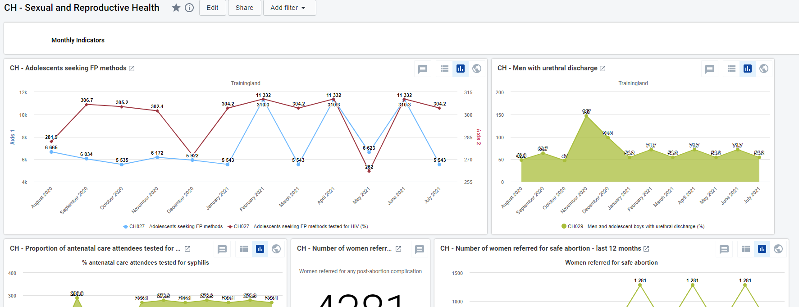

 The second part of the dashboard is dedicated to the annual dataset (Annual Household Assessment Indicators). The predefined analyse and visualize the main areas of the dataset, though the dashboard should be modified to better mirror the local activities.

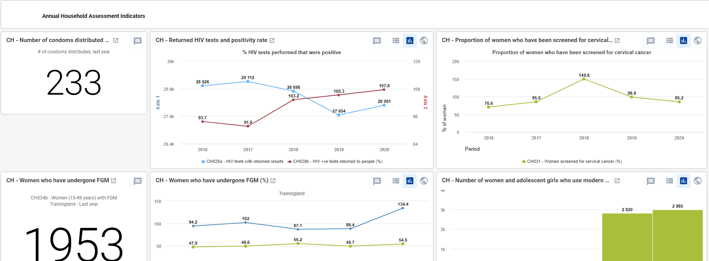
