# CH - Tuberculosis { #ch-tb-aggregate-design }

## 1. Datasets

### 1.1. Configuration Summary

The aggregate CH - Tuberculosis (TB) module includes:

1. A **monthly dataset** with key data elements
2. A **yearly dataset** for the follow up of key annual information
3. **Core indicators** for both datasets
4. A predefined **“CH - Tuberculosis” dashboard**

It is recommended that the datasets get assigned to Organisation Units **at the lowest level** of the health system feasible for reporting data, such as Villages or any appropriate community demarcation according to the local context.

### 1.2. Data Elements

The table below summarizes the data elements present in the TB module. The “Data elements groups” and “Datasets” columns will provide extra information on where the same DEs can be found in the other CHIS modules. This should facilitate the mapping of the package among all its modules and navigate the datasets while avoiding the collection and data entry of the same DEs in multiple locations.

All the DEs in the TB module are used in the build up of indicators.

| Name                                                                             | Description                                                                                                              | Datasets                                                                                                                                                                                    | DE groups                                                                                                                       |
|----------------------------------------------------------------------------------|--------------------------------------------------------------------------------------------------------------------------|---------------------------------------------------------------------------------------------------------------------------------------------------------------------------------------------|---------------------------------------------------------------------------------------------------------------------------------|
| CH041a - People assessed for MNS disorders/ MH conditions                        | People assessed for MNS disorders/ MH conditions                                                                         | CH - Adolescent Health (Monthly), CH - HIV (Monthly), CH - Maternal Health (Monthly), CH - Mental health (Monthly), CH - Neglected tropical diseases (Monthly), CH - Tuberculosis (Monthly) | CH - Neglected tropical diseases, CH - HIV, CH - Maternal Health, CH - Adolescent Health, CH - Mental health, TB - Tuberculosis |
| CH041b - People with possible MNS symptoms                                       | People with possible MNS symptoms                                                                                        | CH - Adolescent Health (Monthly), CH - HIV (Monthly), CH - Maternal Health (Monthly), CH - Mental health (Monthly), CH - Neglected tropical diseases (Monthly), CH - Tuberculosis (Monthly) | CH - Neglected tropical diseases, CH - HIV, CH - Maternal Health, CH - Adolescent Health, CH - Mental health, TB - Tuberculosis |
| CH041c - People assessed for MNS disorders/ MH conditions                        | People assessed for MNS disorders/mental health conditions by type                                                       | CH - Adolescent Health (Monthly), CH - HIV (Monthly), CH - Maternal Health (Monthly), CH - Mental health (Monthly), CH - Neglected tropical diseases (Monthly), CH - Tuberculosis (Monthly) | CH - Neglected tropical diseases, CH - HIV, CH - Maternal Health, CH - Adolescent Health, CH - Mental health, TB - Tuberculosis |
| CH041d - People with possible MNS symptoms                                       | People with possible symptoms of MNS conditions                                                                          | CH - Adolescent Health (Monthly), CH - HIV (Monthly), CH - Maternal Health (Monthly), CH - Mental health (Monthly), CH - Neglected tropical diseases (Monthly), CH - Tuberculosis (Monthly) | CH - Neglected tropical diseases, CH - HIV, CH - Maternal Health, CH - Adolescent Health, CH - Mental health, TB - Tuberculosis |
| CH041e - Women assessed for MNS disorders/ MH conditions                         | Women and adolescent girls assessed for MNS disorders / MH conditions                                                    | CH - Adolescent Health (Monthly), CH - HIV (Monthly), CH - Maternal Health (Monthly), CH - Mental health (Monthly), CH - Neglected tropical diseases (Monthly), CH - Tuberculosis (Monthly) | CH - Neglected tropical diseases, CH - HIV, CH - Maternal Health, CH - Adolescent Health, CH - Mental health, TB - Tuberculosis |
| CH041f - Women with possible MNS symptoms                                        | Women and adolescent girls with possible MNS symptoms                                                                    | CH - Adolescent Health (Monthly), CH - HIV (Monthly), CH - Maternal Health (Monthly), CH - Mental health (Monthly), CH - Neglected tropical diseases (Monthly), CH - Tuberculosis (Monthly) | CH - Neglected tropical diseases, CH - HIV, CH - Maternal Health, CH - Adolescent Health, CH - Mental health, TB - Tuberculosis |
| CH042a - People with MNS disorders referred                                      | People with MNS disorders referred                                                                                       | CH - Adolescent Health (Monthly), CH - HIV (Monthly), CH - Maternal Health (Monthly), CH - Mental health (Monthly), CH - Neglected tropical diseases (Monthly), CH - Tuberculosis (Monthly) | CH - Neglected tropical diseases, CH - HIV, CH - Maternal Health, CH - Adolescent Health, CH - Mental health, TB - Tuberculosis |
| CH042b - People with MNS disorders referred by type                              | People with MNS disorders referred by type                                                                               | CH - Adolescent Health (Monthly), CH - HIV (Monthly), CH - Maternal Health (Monthly), CH - Mental health (Monthly), CH - Neglected tropical diseases (Monthly), CH - Tuberculosis (Monthly) | CH - Neglected tropical diseases, CH - HIV, CH - Maternal Health, CH - Adolescent Health, CH - Mental health, TB - Tuberculosis |
| CH042c - Women with MNS disorders referred                                       | Women and adolescent girls with MNS disorders/mental health conditions referred                                          | CH - Adolescent Health (Monthly), CH - HIV (Monthly), CH - Maternal Health (Monthly), CH - Mental health (Monthly), CH - Neglected tropical diseases (Monthly), CH - Tuberculosis (Monthly) | CH - Neglected tropical diseases, CH - HIV, CH - Maternal Health, CH - Adolescent Health, CH - Mental health, TB - Tuberculosis |
| CH043a - People with MNS disorders receiving services                            | People with MNS disorders/mental health conditions receiving services                                                    | CH - Adolescent Health (Yearly), CH - HIV (Yearly), CH - Maternal Health (Yearly), CH - Mental health (Yearly), CH - Neglected tropical diseases (Yearly), CH - Tuberculosis (Yearly)       | CH - Neglected tropical diseases, CH - HIV, CH - Maternal Health, CH - Adolescent Health, CH - Mental health, TB - Tuberculosis |
| CH043b - People assessed for MNS disorders                                       | People assessed for MNS disorders/mental health conditions                                                               | CH - Adolescent Health (Yearly), CH - HIV (Yearly), CH - Maternal Health (Yearly), CH - Mental health (Yearly), CH - Neglected tropical diseases (Yearly), CH - Tuberculosis (Yearly)       | CH - Neglected tropical diseases, CH - HIV, CH - Maternal Health, CH - Adolescent Health, CH - Mental health, TB - Tuberculosis |
| CH043c - People with MNS disorders receiving services - MH awareness             | People with MNS disorders/mental health conditions receiving services - mental health awareness                          | CH - Adolescent Health (Yearly), CH - HIV (Yearly), CH - Maternal Health (Yearly), CH - Mental health (Yearly), CH - Neglected tropical diseases (Yearly), CH - Tuberculosis (Yearly)       | CH - Neglected tropical diseases, CH - HIV, CH - Maternal Health, CH - Adolescent Health, CH - Mental health, TB - Tuberculosis |
| CH043d - People with MNS disorders receiving services - MH HP                    | People with MNS disorders/mental health conditions receiving services - mental health promotion and prevention           | CH - Adolescent Health (Yearly), CH - HIV (Yearly), CH - Maternal Health (Yearly), CH - Mental health (Yearly), CH - Neglected tropical diseases (Yearly), CH - Tuberculosis (Yearly)       | CH - Neglected tropical diseases, CH - HIV, CH - Maternal Health, CH - Adolescent Health, CH - Mental health, TB - Tuberculosis |
| CH043e - People with MNS disorders receiving services - MH support               | People with MNS disorders/mental health conditions receiving services - support for people with mental health conditions | CH - Adolescent Health (Yearly), CH - HIV (Yearly), CH - Maternal Health (Yearly), CH - Mental health (Yearly), CH - Neglected tropical diseases (Yearly), CH - Tuberculosis (Yearly)       | CH - Neglected tropical diseases, CH - HIV, CH - Maternal Health, CH - Adolescent Health, CH - Mental health, TB - Tuberculosis |
| CH043f - People with MNS disorders receiving services - recovery/rehab           | People with MNS disorders/mental health conditions receiving services - recovery and rehabilitation                      | CH - Adolescent Health (Yearly), CH - HIV (Yearly), CH - Maternal Health (Yearly), CH - Mental health (Yearly), CH - Neglected tropical diseases (Yearly), CH - Tuberculosis (Yearly)       | CH - Neglected tropical diseases, CH - HIV, CH - Maternal Health, CH - Adolescent Health, CH - Mental health, TB - Tuberculosis |
| CH043g - Women with MNS disorders receiving services                             | Women and adolescent girls with MNS disorders/mental health conditions receiving services                                | CH - Adolescent Health (Yearly), CH - HIV (Yearly), CH - Maternal Health (Yearly), CH - Mental health (Yearly), CH - Neglected tropical diseases (Yearly), CH - Tuberculosis (Yearly)       | CH - Neglected tropical diseases, CH - HIV, CH - Maternal Health, CH - Adolescent Health, CH - Mental health, TB - Tuberculosis |
| CH043h - Women assessed for MNS disorders                                        | Women and adolescent girls assessed for MNS disorders/mental health conditions                                           | CH - Adolescent Health (Yearly), CH - HIV (Yearly), CH - Maternal Health (Yearly), CH - Mental health (Yearly), CH - Neglected tropical diseases (Yearly), CH - Tuberculosis (Yearly)       | CH - Neglected tropical diseases, CH - HIV, CH - Maternal Health, CH - Adolescent Health, CH - Mental health, TB - Tuberculosis |
| CH109a - People eligible referred for economic support                           | Eligible people referred for economic (livelihood) support by a CHW                                                      | CH - HIV (Monthly), CH - People-centred services (Monthly), CH - Tuberculosis (Monthly)                                                                                                     | CH - HIV, CH - People-centred services, TB - Tuberculosis                                                                       |
| CH109b - People eligible for economic support in catchment area                  | People eligible in the catchment area for economic (livelihood) support                                                  | CH - HIV (Monthly), CH - People-centred services (Monthly), CH - Tuberculosis (Monthly)                                                                                                     | CH - HIV, CH - People-centred services, TB - Tuberculosis                                                                       |
| CH109c - People eligible for economic support referred                           | Eligible people referred for economic (livelihood) support by a CHW by condition                                         | CH - HIV (Monthly), CH - People-centred services (Monthly), CH - Tuberculosis (Monthly)                                                                                                     | CH - HIV, CH - People-centred services, TB - Tuberculosis                                                                       |
| CH109d - People eligible for economic support by condition                       | Eligible people in the catchment area for economic (livelihood) support by condition                                     | CH - HIV (Monthly), CH - People-centred services (Monthly), CH - Tuberculosis (Monthly)                                                                                                     | CH - HIV, CH - People-centred services, TB - Tuberculosis                                                                       |
| CH111a - People eligible referred for legal services                             | People eligible referred for legal services                                                                              | CH - HIV (Monthly), CH - People-centred services (Monthly), CH - Tuberculosis (Monthly)                                                                                                     | CH - HIV, CH - People-centred services, TB - Tuberculosis                                                                       |
| CH111b - People eligible for legal services in the catchment area                | People eligible for legal services in the catchment area                                                                 | CH - HIV (Monthly), CH - People-centred services (Monthly), CH - Tuberculosis (Monthly)                                                                                                     | CH - HIV, CH - People-centred services, TB - Tuberculosis                                                                       |
| CH111c - People eligible referred for legal services                             | People eligible referred for legal services by a CHW by condition                                                        | CH - HIV (Monthly), CH - People-centred services (Monthly), CH - Tuberculosis (Monthly)                                                                                                     | CH - HIV, CH - People-centred services, TB - Tuberculosis                                                                       |
| CH111d - People eligible for legal services by condition                         | People eligible in the catchment area for legal services by condition                                                    | CH - HIV (Monthly), CH - People-centred services (Monthly), CH - Tuberculosis (Monthly)                                                                                                     | CH - HIV, CH - People-centred services, TB - Tuberculosis                                                                       |
| CH110a - People eligible that receive(d) any form of economic support            | People eligible that receive(d) any form of economic support                                                             | CH - HIV (Yearly), CH - People-centred services (Yearly), CH - Tuberculosis (Yearly)                                                                                                        | CH - HIV, CH - People-centred services, TB - Tuberculosis                                                                       |
| CH110b - People eligible that receive(d) any form of economic support            | People eligible that receive(d) any form of economic support                                                             | CH - HIV (Yearly), CH - People-centred services (Yearly), CH - Tuberculosis (Yearly)                                                                                                        | CH - HIV, CH - People-centred services, TB - Tuberculosis                                                                       |
| CH112a - People eligible that receive(d) any form of legal services              | People eligible that receive(d) any form of legal services                                                               | CH - HIV (Yearly), CH - People-centred services (Yearly), CH - Tuberculosis (Yearly)                                                                                                        | CH - HIV, CH - People-centred services, TB - Tuberculosis                                                                       |
| CH112b - People eligible that receive(d) any form of legal services by condition | People eligible that receive(d) any form of legal services by condition                                                  | CH - HIV (Yearly), CH - People-centred services (Yearly), CH - Tuberculosis (Yearly)                                                                                                        | CH - HIV, CH - People-centred services, TB - Tuberculosis                                                                       |
| CH127a - Confirmed TB cases referred by CHW                                      | People who were confirmed with TB through referral by CHW                                                                | CH - Tuberculosis (Monthly)                                                                                                                                                                 | TB - Tuberculosis                                                                                                               |
| CH127b - People referred for TB confirmation                                     | People who were referred by CHW for TB diagnosis                                                                         | CH - Tuberculosis (Monthly)                                                                                                                                                                 | TB - Tuberculosis                                                                                                               |
| CH128a - Notified TB confirmed cases via CHW                                     | People who were confirmed to have TB notified with TB through CHW referral                                               | CH - Tuberculosis (Monthly)                                                                                                                                                                 | TB - Tuberculosis                                                                                                               |
| CH128b - Notified TB cases in the catchment area                                 | Notified TB cases in the catchment area                                                                                  | CH - Tuberculosis (Monthly)                                                                                                                                                                 | TB - Tuberculosis                                                                                                               |
| CH129a - People followed-up for TPT by CHW                                       | People to whom TPT continuation support/follow-up was provided by CHW                                                    | CH - Tuberculosis (Monthly)                                                                                                                                                                 | TB - Tuberculosis                                                                                                               |
| CH129b - People eligible to start TPT in catchment area                          | People who were eligible started on TPT in the catchment area of CHW                                                     | CH - Tuberculosis (Monthly)                                                                                                                                                                 | TB - Tuberculosis                                                                                                               |
| CH129c - People followed-up for TPT by CHW by HIV status and type                | People followed-up for TPT by CHW by HIV status and type                                                                 | CH - Tuberculosis (Monthly)                                                                                                                                                                 | TB - Tuberculosis                                                                                                               |
| CH129d - People eligible to start TPT ini catchment area by HIV status and type  | People eligible to start TPT ini catchment area by HIV status and type                                                   | CH - Tuberculosis (Monthly)                                                                                                                                                                 | TB - Tuberculosis                                                                                                               |
| CH130a - People followed-up for adherence TPT by CHW                             | People receiving TB treatment to whom treatment adherence support was provided by CHW                                    | CH - Tuberculosis (Monthly)                                                                                                                                                                 | TB - Tuberculosis                                                                                                               |
| CH130b - People receiving TB treatment in the catchment area                     | People receiving TB treatment in the catchment area                                                                      | CH - Tuberculosis (Monthly)                                                                                                                                                                 | TB - Tuberculosis                                                                                                               |
| CH131a - Contacts of BCTB patients referred                                      | Contacts of bacteriologically confirmed TB patients who were referred for diagnosis of TB disease                        | CH - Tuberculosis (Monthly)                                                                                                                                                                 | TB - Tuberculosis                                                                                                               |
| CH131b - Contacts of BCTB patients in catchment area                             | Contacts of bacteriologically confirmed TB patients in the catchment area of the CHW                                     | CH - Tuberculosis (Monthly)                                                                                                                                                                 | TB - Tuberculosis                                                                                                               |
| CH131c - Contacts of BCTB patients by TB and HIV status referred                 | Contacts of bacteriologically confirmed TB patients who were referred for diagnosis of TB disease by HIV status          | CH - Tuberculosis (Monthly)                                                                                                                                                                 | TB - Tuberculosis                                                                                                               |
| CH131d - Contacts of BCTB patients in catchment areaby TB and HIV status         | Contacts of BCTB patients in catchment areaby TB and HIV status                                                          | CH - Tuberculosis (Monthly)                                                                                                                                                                 | TB - Tuberculosis                                                                                                               |
| CH132a - Treated TB cases with CB support                                        | TB cases who were successfully treated and who benefited from any form of community-based treatment support              | CH - Tuberculosis (Monthly)                                                                                                                                                                 | TB - Tuberculosis                                                                                                               |
| CH132b - Treated TB cases with CB adherence support                              | People to whom TB disease treatment adherence support was provided at community level                                    | CH - Tuberculosis (Monthly)                                                                                                                                                                 | TB - Tuberculosis                                                                                                               |
| CH133a - People completing the TBT received via CHW                              | People who received TPT through CHW who completed the course                                                             | CH - Tuberculosis (Monthly)                                                                                                                                                                 | TB - Tuberculosis                                                                                                               |
| CH133b - People started on TPT in the catchment area                             | People started on TPT in the catchment area of designated health-care facility                                           | CH - Tuberculosis (Monthly)                                                                                                                                                                 | TB - Tuberculosis                                                                                                               |
| CH133c - People completing the TBT received via CHW by indication                | People completing the TBT received via CHW by indication                                                                 | CH - Tuberculosis (Monthly)                                                                                                                                                                 | TB - Tuberculosis                                                                                                               |
| CH133d - People started on TPT in the catchment area by indication               | People started on TPT in the catchment area of designated health-care facility by indication                             | CH - Tuberculosis (Monthly)                                                                                                                                                                 | TB - Tuberculosis                                                                                                               |
| CH134a - People with TBT side effects referred by CHW                            | People with TB with drug side effects referred to a health facility by a CHW to manage drug side effects                 | CH - Tuberculosis (Monthly)                                                                                                                                                                 | TB - Tuberculosis                                                                                                               |
| CH134b - People with TBT side effects referred by CHW for CM                     | People with TB with drug side effects referred to a health facility by a CHW to manage drug side effects                 | CH - Tuberculosis (Monthly)                                                                                                                                                                 | TB - Tuberculosis                                                                                                               |
| CH134c - People treated for TB in the catchment area                             | People treated for TB in the catchment area                                                                              | CH - Tuberculosis (Monthly)                                                                                                                                                                 | TB - Tuberculosis                                                                                                               |

## 2. Dataset Details

### 2.1. Monthly TB Dataset

#### 2.1.1. Mental Health Disorders and Conditions - All

The section focuses on all the people benefiting from MH assessments and referrals. The data are disaggregated by age (10-14y, 15-19y, 20-39y, 40-49y, 50-59y, 60-69y, 70+, unknown age) and sex (male, female, other, unknown).

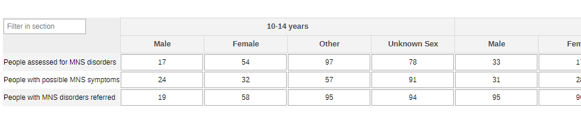

#### 2.1.2. Mental Health Disorders and Conditions - by Type

The information collected on the general population (section 2.1.1.) can also be disaggregated by type of condition (depression, psychoses, behavioural conditions, dementia, substance use, suicide/self harm) - the conditions should be edited and adapted to the local context.

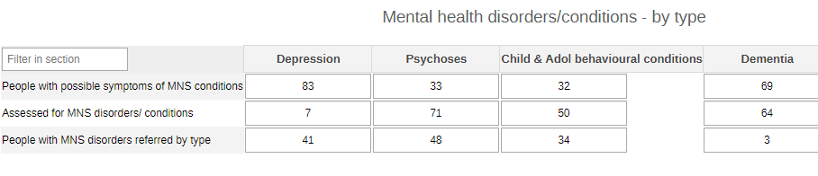

#### 2.1.3. Mental Health Disorders and Conditions - Pregnant and Postpartum

This section collects the same variables as the other two sections on MH, but it focuses specifically on pregnant and postpartum women benefiting from MH community activities.

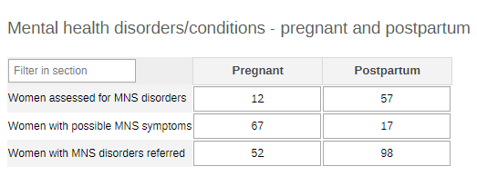

### 2.1.2. Legal and Economic Support

The section gathers information on the eligible people who can benefit from legal and economic support. The same information can be collected by age group (0-4y, 5-9y, 10-14y, 15-19y, 20-24y, 25-29y, 30-34y, 35-39y, 40-44y, 45-49y, 50+y, unknown age) and by sex (male, female, other, unknown sex), or by type of condition (HIV, TB, NTDs, other - the options should be adapted locally to better mirrorx the context).

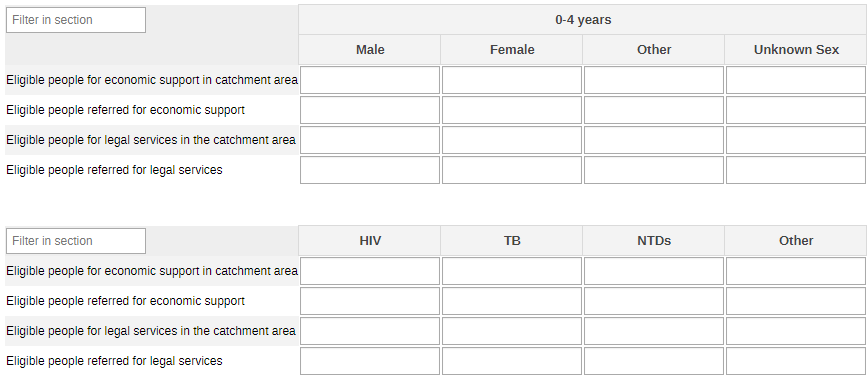

#### 2.1.3. TB TPT

The section collects a wide range of data about TB preventive treatment. The first table targets people who completed the TPT by target category (PLHIV and contact - the options should be adapted locally to better mirror the context). The second bigger table summarises the info on people receiving TPT and their contacts. The information is disaggregated by age group (0-4y, 5-9y, 10-14y, 15-19y, 20-24y, 25-29y, 30-34y, 35-39y, 40-44y, 45-49y, 50+y, unknown age) and by sex (male, female, other, unknown sex).

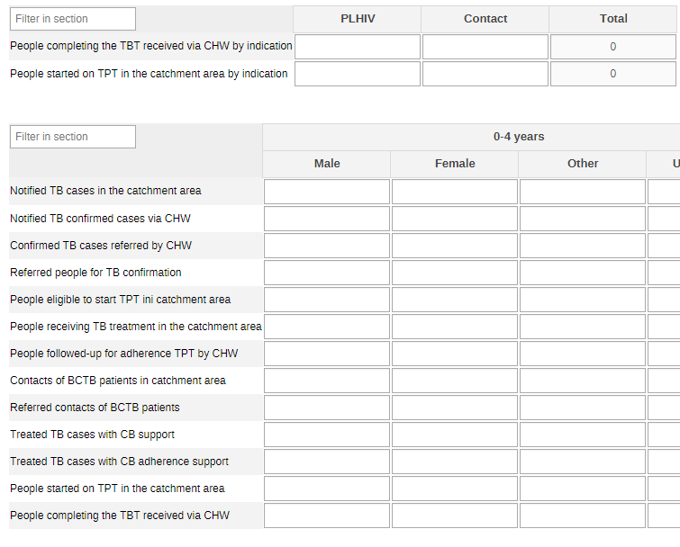

The third table gives more information on the HIV status of the people benefitting from the TPT. The information can be disaggregated by status (Positive or negative) and/or by TPT treatment regimen (GH, 4R, 3HP, 3HR, 1HP) and by HIV status (positive or negative).

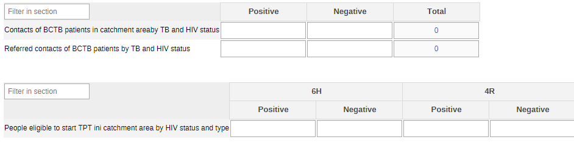

#### 2.1.4. Drug Side Effects

The final section of the monthly dataset collects information on the side effects among people receiving the treatment and their referral for care. The data are disaggregated by age group (0-4y, 5-9y, 10-14y, 15-19y, 20-24y, 25-29y, 30-34y, 35-39y, 40-44y, 45-49y, 50+y, unknown age) and by sex (male, female, other, unknown sex).

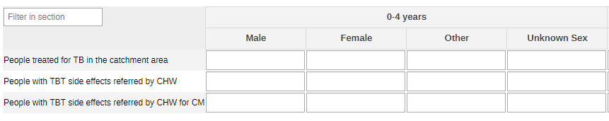

### 2.2. Yearly TB Dataset

#### 2.2.1. Mental Health Conditions and Disorders - All

The section focuses on all the people benefiting from MH assessments and referrals among the TB patients. The data are disaggregated by age (10-14y, 15-19y, 20-39y, 40-49y, 50-59y, 60-69y, 70+, unknown age) and sex (male, female, other, unknown).

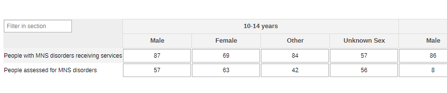

#### 2.2.2. Mental Health Conditions and Disorders - Awareness and Support

The section collects the number of people accessing MH-related services and support activities offered to TB patients in the community.

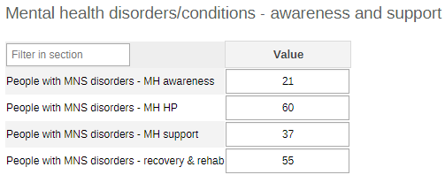

#### 2.2.3. Mental Health Conditions and Disorders - Pregnant and Postpartum

This section collects the same variables as the other section on MH, but it focuses specifically on pregnant and postpartum TB(+) women.

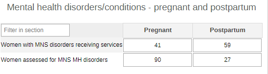

#### 2.2.4. Legal and Economic Support

The section gathers information on the eligible people who can benefit from legal and economic support. The same information can be collected by age group (0-4y, 5-9y, 10-14y, 15-19y, 20-24y, 25-29y, 30-34y, 35-39y, 40-44y, 45-49y, 50+y, unknown age) and by sex (male, female, other, unknown sex), or by type of condition (HIV, TB, NTDs, other - the options should be adapted locally to better mirrorx the context).

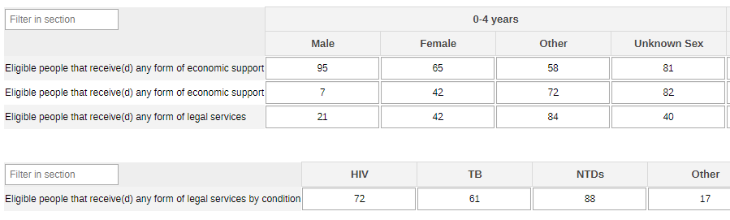

## 3. Validation Rules

The following validation rules have been set up for the Adolescent health datasets:

|                                                    Name                                                   |                                                            Instruction                                                            |        Operator       |                      Left side                     |                     Right side                    |
|:---------------------------------------------------------------------------------------------------------:|:---------------------------------------------------------------------------------------------------------------------------------:|:---------------------:|:--------------------------------------------------:|:-------------------------------------------------:|
| CH - AGW assessed for MNS disorders Vs AGW with a possible MNS symptoms                                   | AGW assessed for MNS disorders should be less than or equal to AGW with a possible MNS symptoms                                   | less_than_or_equal_to | AGW assessed for MNS disorders                     | AGW with a possible MNS symptoms                  |
| CH - AGW with MNS disorders/receiving Vs AGW assessed for MNS MH disorders                                | AGW with MNS disorders/receiving should be less than or equal to AGW assessed for MNS MH disorders                                | less_than_or_equal_to | AGW with MNS disorders/receiving                   | AGW assessed for MNS MH disorders                 |
| CH - AGW with MNS disorders/receiving Vs People with MNS disorders/receiving                              | AGW with MNS disorders/receiving should be less than or equal to People with MNS disorders/receiving                              | less_than_or_equal_to | AGW with MNS disorders/receiving                   | People with MNS disorders/receiving               |
| CH - Assessed for MNS disorders conditions by type Vs People with a possible MNS symptoms by type         | Assessed for MNS disorders conditions by type should be less than or equal to People with a possible MNS symptoms by type         | less_than_or_equal_to | Assessed for MNS disorders conditions by type      | People with a possible MNS symptoms by type       |
| CH - MNS disorders receiving - recovery & rehab Vs People with MNS disorders/receiving                    | MNS disorders receiving - recovery & rehab should be less than or equal to People with MNS disorders/receiving                    | less_than_or_equal_to | MNS disorders receiving - recovery & rehab         | People with MNS disorders/receiving               |
| CH - MNS disorders receiving - support for MH Vs People with MNS disorders/receiving                      | MNS disorders receiving - support for MH should be less than or equal to People with MNS disorders/receiving                      | less_than_or_equal_to | MNS disorders receiving - support for MH           | People with MNS disorders/receiving               |
| CH - People assessed for MNS disorders conditions Vs Assessed for MNS disorders conditions by type        | People assessed for MNS disorders conditions should be less than or equal to Assessed for MNS disorders conditions by type        | less_than_or_equal_to | People assessed for MNS disorders conditions       | Assessed for MNS disorders conditions by type     |
| CH - People assessed for MNS disorders conditions Vs People with a possible MNS symptoms                  | People assessed for MNS disorders conditions should be less than or equal to People with a possible MNS symptoms                  | less_than_or_equal_to | People assessed for MNS disorders conditions       | People with a possible MNS symptoms               |
| CH - People with a possible MNS symptoms by type Vs People with a possible MNS symptoms                   | People with a possible MNS symptoms by type should be less than or equal to People with a possible MNS symptoms                   | less_than_or_equal_to | People with a possible MNS symptoms by type        | People with a possible MNS symptoms               |
| CH - People with MNS disorders - MH promotion and prev Vs People with MNS disorders/receiving             | People with MNS disorders - MH promotion and prev should be less than or equal to People with MNS disorders/receiving             | less_than_or_equal_to | People with MNS disorders - MH promotion and prev  | People with MNS disorders/receiving               |
| CH - People with MNS disorders receiving - MH awareness Vs People with MNS disorders/receiving            | People with MNS disorders receiving - MH awareness should be less than or equal to People with MNS disorders/receiving            | less_than_or_equal_to | People with MNS disorders receiving - MH awareness | People with MNS disorders/receiving               |
| CH - People with MNS disorders/receiving Vs People assessed for MNS disorders                             | People with MNS disorders/receiving should be less than or equal to People assessed for MNS disorders                             | less_than_or_equal_to | People with MNS disorders/receiving                | People assessed for MNS disorders                 |
| CH - People with MNS disorders referred Vs People assessed for MNS disorders conditions                   | People with MNS disorders referred should be less than or equal to People assessed for MNS disorders conditions                   | less_than_or_equal_to | People with MNS disorders referred                 | People assessed for MNS disorders conditions      |
| CH - Eligible for economic support by condition Vs Eligible people for economic (livelihood) support      | Eligible for economic support by condition should be less than or equal to Eligible people for economic (livelihood) support      | less_than_or_equal_to | Eligible for economic support by condition         | Eligible people for economic (livelihood) support |
| CH - Eligible people for legal services by condition Vs Eligible people for legal services                | Eligible people for legal services by condition should be less than or equal to Eligible people for legal services                | less_than_or_equal_to | Eligible people for legal services by condition    | Eligible people for legal services                |
| CH - Eligible referred for legal services by a CHW Vs Eligible people for legal services                  | Eligible referred for legal services by a CHW should be less than or equal to Eligible people for legal services                  | less_than_or_equal_to | Eligible referred for legal services by a CHW      | Eligible people for legal services                |
| CH - Receive(d) any form of econ support by condition Vs Receive(d) any form of economic support          | Receive(d) any form of econ support by condition should be less than or equal to Receive(d) any form of economic support          | less_than_or_equal_to | Receive(d) any form of econ support by condition   | Receive(d) any form of economic support           |
| CH - Receive(d) any form of legal services by condition Vs Receive(d) any form of legal services          | Receive(d) any form of legal services by condition should be less than or equal to Receive(d) any form of legal services          | less_than_or_equal_to | Receive(d) any form of legal services by condition | Receive(d) any form of legal services             |
| CH - Referred for economic support Vs Eligible people for economic (livelihood) support                   | Referred for economic support should be less than or equal to Eligible people for economic (livelihood) support                   | less_than_or_equal_to | Referred for economic support                      | Eligible people for economic (livelihood) support |
| CH - Referred for econonic support by condition Vs Referred for economic support                          | Referred for econonic support by condition should be less than or equal to Referred for economic support                          | less_than_or_equal_to | Referred for econonic support by condition         | Referred for economic support                     |
| CH - Referred for legal services by condition Vs Eligible referred for legal services by a CHW            | Referred for legal services by condition should be less than or equal to Eligible referred for legal services by a CHW            | less_than_or_equal_to | Referred for legal services by condition           | Eligible referred for legal services by a CHW     |
| CH - Confirmed TB notified with TB thru CHW referral Vs People who were notified with TB                  | Confirmed TB notified with TB thru CHW referral should be less than or equal to People who were notified with TB                  | less_than_or_equal_to | Confirmed TB notified with TB thru CHW referral    | People who were notified with TB                  |
| CH - Confirmed with TB through referral by CHW Vs People who were referred by CHW for TB diagnosis        | Confirmed with TB through referral by CHW should be less than or equal to People who were referred by CHW for TB diagnosis        | less_than_or_equal_to | Confirmed with TB through referral by CHW          | People who were referred by CHW for TB diagnosis  |
| CH - Contacts of BC TB referred by HIV status Vs Contacts of BC TB cases by HIV status                    | Contacts of BC TB referred by HIV status should be less than or equal to Contacts of BC TB cases by HIV status                    | less_than_or_equal_to | Contacts of BC TB referred by HIV status           | Contacts of BC TB cases by HIV status             |
| CH - Contacts of BC TB referred for diagnosis Vs Contacts of BC TB patients of the CHW                    | Contacts of BC TB referred for diagnosis should be less than or equal to Contacts of BC TB patients of the CHW                    | less_than_or_equal_to | Contacts of BC TB referred for diagnosis           | Contacts of BC TB patients of the CHW             |
| CH - People started on TPT of designated HF indication Vs People started on TPT of designated HF          | People started on TPT of designated HF indication should be less than or equal to People started on TPT of designated HF          | less_than_or_equal_to | People started on TPT of designated HF indication  | People started on TPT of designated HF            |
| CH - Received and completed TPT course by indication Vs Received TPT through CHW who completed the course | Received and completed TPT course by indication should be less than or equal to Received TPT through CHW who completed the course | less_than_or_equal_to | Received and completed TPT course by indication    | Received TPT through CHW who completed the course |
| CH - Receiving TB Tx with adherence support by CHW Vs People receiving TB Tx in the catchment area        | Receiving TB Tx with adherence support by CHW should be less than or equal to People receiving TB Tx in the catchment area        | less_than_or_equal_to | Receiving TB Tx with adherence support by CHW      | People receiving TB Tx in the catchment area      |
| CH - TPT continuation support and follow-up by CHW Vs People who were eligible started on TPT of CHW      | TPT continuation support and follow-up by CHW should be less than or equal to People who were eligible started on TPT of CHW      | less_than_or_equal_to | TPT continuation support and follow-up by CHW      | People who were eligible started on TPT of CHW    |
| CH - TPT follow-up by CHW by HIV status and type Vs Started on TPT by HIV status and type                 | TPT follow-up by CHW by HIV status and type should be less than or equal to Started on TPT by HIV status and type                 | less_than_or_equal_to | TPT follow-up by CHW by HIV status and type        | Started on TPT by HIV status and type             |
| CH - Treated for TB & received community tx support Vs TB cases provided Tx support at community level    | Treated for TB & received community tx support should be less than or equal to TB cases provided Tx support at community level    | less_than_or_equal_to | Treated for TB & received community tx support     | TB cases provided Tx support at community level   |
| CH - With TB drug side effects referred for mgt Vs People treated for TB in the catchment area            | With TB drug side effects referred for mgt should be less than or equal to People treated for TB in the catchment area            | less_than_or_equal_to | With TB drug side effects referred for mgt         | People treated for TB in the catchment area       |

## 4. Analytics and Indicators

Just as for the DEs, in the table below the column “Indicator Groups” provides information about whether the indicator is found in groups other than the TB indicator group.

| Name                                                       | Description                                                                                                              | Numerator                                         | Denominator                                       | Indicator Groups                                                                                                                |
|------------------------------------------------------------|--------------------------------------------------------------------------------------------------------------------------|---------------------------------------------------|---------------------------------------------------|---------------------------------------------------------------------------------------------------------------------------------|
| CH041m - Women assessed for MNS disorders                  | Number of Women assessed for mental, neurological and substance use (MNS) disorders                                      | Women assessed for MNS disorders conditions       | 1                                                 | CH - HIV, CH - Tuberculosis, CH - Neglected tropical diseases, CH - Maternal Health, CH - Adolescent Health, CH - Mental health |
| CH041 - People assessed for MNS disorders                  | Number of people assessed for mental, neurological and substance use (MNS) disorders                                     | People assessed for MNS disorders conditions      | 1                                                 | CH - HIV, CH - Tuberculosis, CH - Neglected tropical diseases, CH - Maternal Health, CH - Adolescent Health                     |
| CH041 - People assessed for MNS disorders (%)              | Proportion of people assessed for mental, neurological and substance use (MNS) disorders                                 | People assessed for MNS disorders conditions      | People with a possible MNS symptoms               | CH - HIV, CH - Tuberculosis, CH - Neglected tropical diseases, CH - Maternal Health, CH - Adolescent Health, CH - Mental health |
| CH042b - Women referred for MNS disorders (%)              | Proportion of Women with mental, neurologic and substance use (MNS) referred                                             | People with MNS disorders referred                | Women assessed for MNS disorders conditions       | CH - HIV, CH - Tuberculosis, CH - Neglected tropical diseases, CH - Maternal Health, CH - Adolescent Health, CH - Mental health |
| CH042 - People referred for MNS disorders (%)              | Proportion of people with mental, neurologic and substance use (MNS) referred                                            | People with MNS disorders referred                | People assessed for MNS disorders conditions      | CH - HIV, CH - Tuberculosis, CH - Neglected tropical diseases, CH - Maternal Health, CH - Adolescent Health, CH - Mental health |
| CH043 - People with MNS disorders receiving services (%)   | Proportion of people with mental, neurologic and substance use (MNS) disorders receiving services                        | People with MNS disorders/receiving               | People assessed for MNS disorders conditions      | CH - HIV, CH - Tuberculosis, CH - Neglected tropical diseases, CH - Maternal Health, CH - Adolescent Health, CH - Mental health |
| CH109 - People eligible referred for economic support (%)  | Proportion of people eligible for any form of economic support referred by a CHW                                         | Referred for economic support                     | Eligible people for economic (livelihood) support | CH - HIV, CH - Tuberculosis, CH - People-centred services                                                                       |
| CH110 - People eligible received economic support (%)      | Proportion of people eligible for any form of economic support who receive(d) it                                         | Receive(d) any form of economic support           | Eligible people for economic (livelihood) support | CH - HIV, CH - Tuberculosis, CH - People-centred services                                                                       |
| CH111 - People eligible referred for legal services (%)    | Proportion of eligible people for legal services referred by a CHW                                                       | Eligible referred for legal services by a CHW     | Eligible people for legal services                | CH - HIV, CH - Tuberculosis, CH - People-centred services                                                                       |
| CH112 - People eligible having received legal services (%) | Proportion of eligible people that receive(d) any kind of legal services                                                 | Receive(d) any form of legal services             | Eligible people for legal services                | CH - HIV, CH - Tuberculosis, CH - People-centred services                                                                       |
| CH127 - People confirmed with TB via CHW referral (%)      | Proportion of people confirmed with TB out of all people who were referred for diagnosis by CHW                          | Confirmed with TB through referral by CHW         | People who were referred by CHW for TB diagnosis  | CH - Tuberculosis                                                                                                               |
| CH128b - Notified TB cases                                 | Number of people notified with TB through CHW                                                                            | People notified with TB through CHW               | 1                                                 | CH - Tuberculosis                                                                                                               |
| CH128 - Notified TB-confirmed cases (%)                    | Proportion of people notified with TB through CHW referrals out of all people notified with TB                           | Confirmed TB notified with TB thru CHW referral   | People who were notified with TB                  | CH - Tuberculosis                                                                                                               |
| CH129 - People followed-up for TPT by CHW (%)              | Proportion of people whose TB preventive treatment (TPT) support/follow-up was provided by CHW                           | TPT continuation support and follow-up by CHW     | People who were eligible started on TPT of CHW    | CH - Tuberculosis                                                                                                               |
| CH130 - People followed-up for adherence TPT by CHW (%)    | Proportion of People receiving TB treatment to whom treatment adherence support was provided by CHW                      | Receiving TB Tx with adherence support by CHW     | People receiving TB Tx in the catchment area      | CH - Tuberculosis                                                                                                               |
| CH131 - Contacts of BCTB patients referred (%)             | Proportion of contacts of BCTB patients referred                                                                         | Contacts of BC TB referred for diagnosis          | Contacts of BC TB patients of the CHW             | CH - Tuberculosis                                                                                                               |
| CH132b - TB cases eligible for TPT                         | TB cases eligible for TPT                                                                                                | People eligible to start TPT                      | 1                                                 | CH - Tuberculosis                                                                                                               |
| CH132c - HIV +ve TPT eligible people (%)                   | Proportion of people eligible to get started on TOT who are HIV positive                                                 | ppl eligible to start TPT who are HIV+            | People eligible to start TPT                      | CH - Tuberculosis                                                                                                               |
| CH132 - Treated TB cases with CB support (%)               | Proportion of people who were successfully treated and who benefited from community-based TB treatment adherence support | Treated for TB & received community tx support    | TB cases provided Tx support at community level   | CH - Tuberculosis                                                                                                               |
| CH133 - People completing the TBT received via CHW (%)     | Proportion of People who received TPT through CHW who completed the course                                               | Received TPT through CHW who completed the course | People started on TPT of designated HF            | CH - Tuberculosis                                                                                                               |
| CH134 - People with TBT side effects referred by CHW (%)   | Proportion of People with TB with drug side effects referred to a health facility by a CHW to manage drug side effects   | With TB drug side effects referred for mgt        | People treated for TB in the catchment area       | CH - Tuberculosis                                                                                                               |

## 5. Dashboards

The module includes a predefined dashboard called “CH - Tuberculosis”.

The dashboard is divided in two based on the periodicity of the datasets.

The first part is for monthly indicators. The predefined items on the dashboard include data as per the sections present in the dataset, but the content should be adapted based on the local activities.

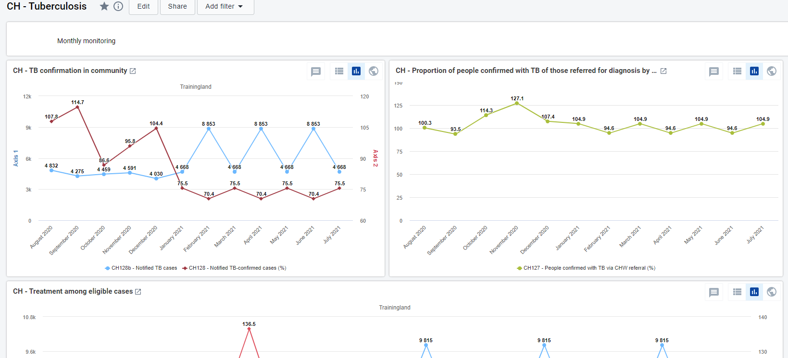

 The second part of the dashboard is dedicated to the annual dataset (Annual Household Assessment Indicators). The predefined analyse and visualize the main areas of the dataset, though the dashboard should be modified to better mirror the local activities.

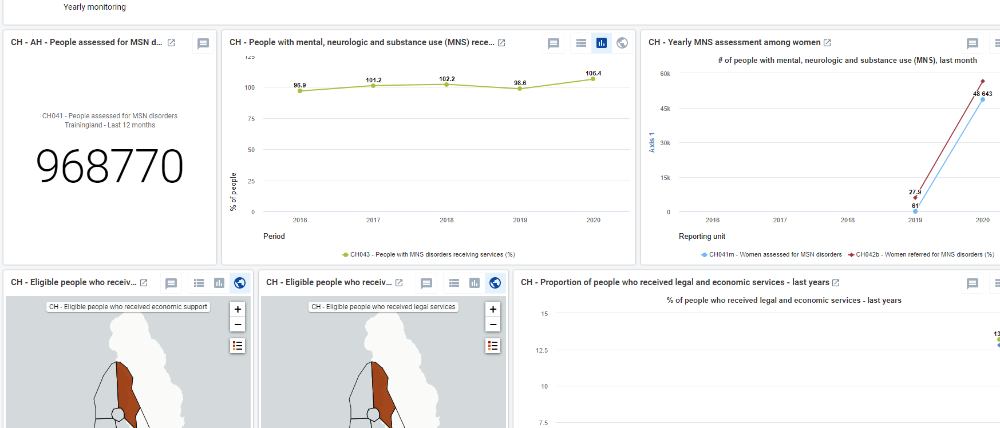
