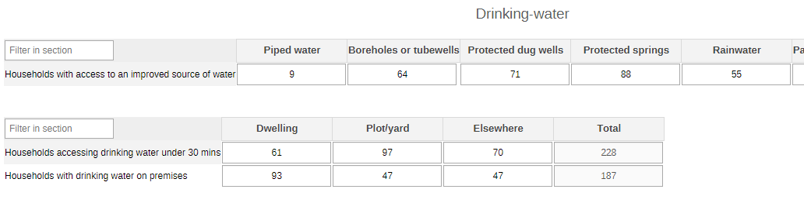
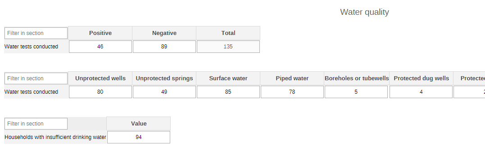
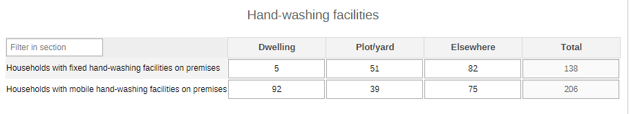
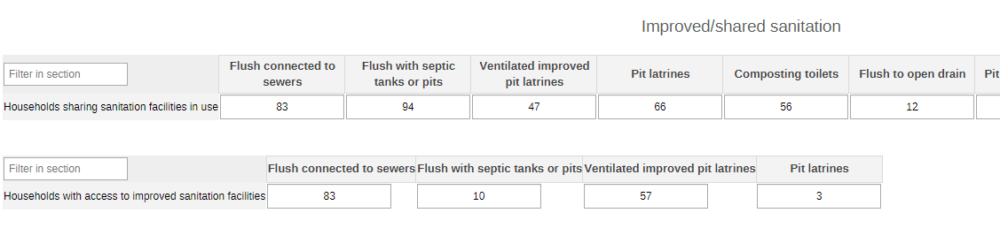
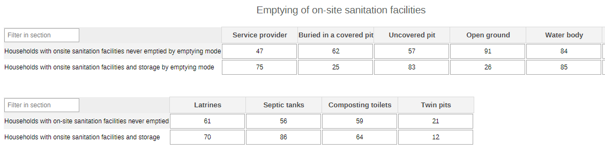
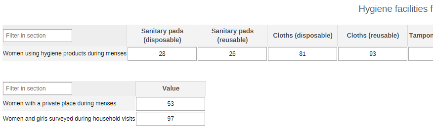
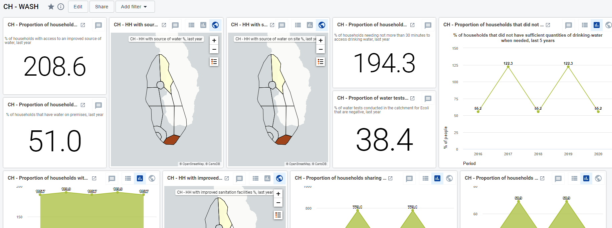

# CH - Water, Sanitation and Hygiene { #ch-wash-aggregate-design }

## 1. Datasets

### 1.1. Configuration Summary

The aggregate CH - Water, Sanitation and Hygiene (WASH) module includes:

1. A **yearly dataset** for the follow up of key annual information
2. **Core indicators** for the dataset
3. A predefined **“CH - WASH” dashboard**

It is recommended that the datasets get assigned to Organisation Units **at the lowest level** of the health system feasible for reporting data, such as Villages or any appropriate community demarcation according to the local context.

### 1.2. Data Elements

The table below summarizes the data elements present in the WASH module. The “Data elements groups” and “Datasets” columns will provide extra information on where the same DEs can be found in the other CHIS modules. This should facilitate the mapping of the package among all its modules and navigate the datasets while avoiding the collection and data entry of the same DEs in multiple locations. In this case the DEs in the WASH module are not shared among any other module.

All the DEs in the WASH module are used in the build up of indicators.

| Name                                                                                 | Description                                                                                         | Datasets                                    | DE groups                                                                                                                                                                |
|--------------------------------------------------------------------------------------|-----------------------------------------------------------------------------------------------------|---------------------------------------------|--------------------------------------------------------------------------------------------------------------------------------------------------------------------------|
| CH001a - Households in the catchment area                                            | Households in the catchment area                                                                    | CH - Population composition (Yearly)        | CH - Population composition, CH - Clean energy, CH - Child protection & interpersonal violence, CH - Water, sanitation and hygiene (WASH), CH - Noncommunicable diseases |
| CH010 - Households with access to an improved source of water                        | Households with access to an improved source of water                                               | CH - Water, sanitation and hygiene (Yearly) | CH - Water, sanitation and hygiene (WASH)                                                                                                                                |
| CH011 - Households accessing drinking water under 30 mins                            | Households needing not more than 30 minutes to access drinking-water                                | CH - Water, sanitation and hygiene (Yearly) | CH - Water, sanitation and hygiene (WASH)                                                                                                                                |
| CH012 - Households with drinking water on premises                                   | Households with drinking water on premises                                                          | CH - Water, sanitation and hygiene (Yearly) | CH - Water, sanitation and hygiene (WASH)                                                                                                                                |
| CH013a - Water tests conducted - test results                                        | Water tests conducted in the catchment area by test results                                         | CH - Water, sanitation and hygiene (Yearly) | CH - Water, sanitation and hygiene (WASH)                                                                                                                                |
| CH013b - Water tests conducted - type source                                         | Water tests conducted in the catchment area by type of source                                       | CH - Water, sanitation and hygiene (Yearly) | CH - Water, sanitation and hygiene (WASH)                                                                                                                                |
| CH014 - Households with insufficient drinking water                                  | Households that did not have sufficient quantities of drinking-water when needed                    | CH - Water, sanitation and hygiene (Yearly) | CH - Water, sanitation and hygiene (WASH)                                                                                                                                |
| CH015a - Households with fixed hand-washing facilities on premises                   | Households with access to handwashing facilities with water and soap available on premises - fixed  | CH - Water, sanitation and hygiene (Yearly) | CH - Water, sanitation and hygiene (WASH)                                                                                                                                |
| CH015b - Households with mobile hand-washing facilities on premises                  | Households with access to handwashing facilities with water and soap available on premises - mobile | CH - Water, sanitation and hygiene (Yearly) | CH - Water, sanitation and hygiene (WASH)                                                                                                                                |
| CH016 - Households with access to improved sanitation facilities                     | Households with access to improved sanitation facilities                                            | CH - Water, sanitation and hygiene (Yearly) | CH - Water, sanitation and hygiene (WASH)                                                                                                                                |
| CH017 - Households sharing sanitation facilities in use                              | Households sharing the sanitation facilities they use                                               | CH - Water, sanitation and hygiene (Yearly) | CH - Water, sanitation and hygiene (WASH)                                                                                                                                |
| CH018a - Households with onsite sanitation facilities never emptied                  | Households using on-site sanitation facilities that have ever been emptied                          | CH - Water, sanitation and hygiene (Yearly) | CH - Water, sanitation and hygiene (WASH)                                                                                                                                |
| CH018b - Households with onsite sanitation facilities and storage                    | Households using on-site sanitation facilities with on-site storage                                 | CH - Water, sanitation and hygiene (Yearly) | CH - Water, sanitation and hygiene (WASH)                                                                                                                                |
| CH018c - Households with onsite sanitation facilities never emptied by emptying mode | Households using on-site sanitation facilities that have ever been emptied by emptying mode         | CH - Water, sanitation and hygiene (Yearly) | CH - Water, sanitation and hygiene (WASH)                                                                                                                                |
| CH018d - Households with onsite sanitation facilities and storage by emptying mode   | Households with onsite sanitation facilities with storage by emptying mode                          | CH - Water, sanitation and hygiene (Yearly) | CH - Water, sanitation and hygiene (WASH)                                                                                                                                |
| CH019a - Women with a private wash and change space during menses                    | Women and girls who have a private place to wash and change during menstruation                     | CH - Water, sanitation and hygiene (Yearly) | CH - Water, sanitation and hygiene (WASH)                                                                                                                                |
| CH019b - Women and girls surveyed during household visits                            | Women and girls surveyed during household visits                                                    | CH - Water, sanitation and hygiene (Yearly) | CH - Water, sanitation and hygiene (WASH)                                                                                                                                |
| CH020 - Women using hygiene products during menses                                   | Women and girls using hygiene materials during menstruation                                         | CH - Water, sanitation and hygiene (Yearly) | CH - Water, sanitation and hygiene (WASH)                                                                                                                                |

## 2. Dataset Details

### 2.1. Yearly WASH Dataset

#### 2.1.1. Drinking Water

The section reports data on access to drinking water among the assessed households. The disaggregation of the data is by type of source of water (piped water, boreholes or tube wells, protected dug wells, protected springs, rainwater, packaged or delivered water - the categories should be adapted to better mirror the local context).

#### 2.1.2. Water Quality

The section focuses on the tests conducted on the water. The tests are disaggregated by results (positive and negative) and/or by source of the water (piped water, boreholes or tube wells, protected dug wells, protected springs, rainwater, packaged or delivered water - the categories should be adapted to better mirror the local context).

#### 2.1.3. Hand-Washing Facilities

The section reports the presence of fixed or mobile hand-washing facilities among the households. The disaggregation of the facilities is by location (dwelling, plot/yard, elsewhere). The categories can be edited according to the local context.

#### 2.1.4.Improved/Shared Sanitation

The section provides information on households sharing facilities (disaggregated by type of facility) and those having access to improved facilities (disaggregated by type of improved facility).

#### 2.1.5. Emptying of On-Site Sanitation Facilities

The section reports data on sanitation that are located on site and how they are emptied, if ever. The information is disaggregated by emptying method (service provider, buried, uncovered pit, open ground, water body, elsewhere - the options should be adapted to better mirror the local context) and by type of toilet/storage (latrines, septic tanks, composting toilet, twin pits).

#### 2.1.6. Hygiene Facilities

The section collects information on women and their accessibility to hygenic spaces and materials during their menses. The data on hygiene product is disaggregated by product type (Sanitary pads - disposable, sanitary pads - reusable, cloths - disposable, cloths - reusable, tampons - disposable, menstrual cups - reusable, other - disposable, other - reusable, none).

## 3. Validation Rules

The following validation rules have been set up for the WASH dataset:

| name                                                                                                      | instruction                                                                                                                       | operator              | leftSide description                             | rightSide description                             |
|-----------------------------------------------------------------------------------------------------------|-----------------------------------------------------------------------------------------------------------------------------------|-----------------------|--------------------------------------------------|---------------------------------------------------|
| CH - HHs on-site sanitation facilities never emptied Vs HHs on-site sanitation facilities on-site storage | HHs on-site sanitation facilities never emptied should be less than or equal to HHs on-site sanitation facilities on-site storage | less_than_or_equal_to | HHs on-site sanitation facilities never emptied  | HHs on-site sanitation facilities on-site storage |
| CH - Water tests conducted by type of source Vs Water tests conducted by test results                     | Water tests conducted by type of source should be less than or equal to Water tests conducted by test results                     | less_than_or_equal_to | Water tests conducted by type of source          | Water tests conducted by test results             |
| CH - WYG have a private place to change during menses Vs Women and girls surveyed during household visits | WYG have a private place to change during menses should be less than or equal to Women and girls surveyed during household visits | less_than_or_equal_to | WYG have a private place to change during menses | Women and girls surveyed during household visits  |
| CH - WYG using hygiene materials during menses Vs Women and girls surveyed during household visits        | WYG using hygiene materials during menses should be less than or equal to Women and girls surveyed during household visits        | less_than_or_equal_to | WYG using hygiene materials during menses        | Women and girls surveyed during household visits  |

## 4. Analytics and Indicators

Just as for the DEs, in the table below the column “Indicator Groups” provides information about whether the indicator is found in groups other than the WASH indicator group.

| Name                                                                    | Description                                                                                      | Numerator                                         | Denominator                                       | Indicator Groups                          |
|-------------------------------------------------------------------------|--------------------------------------------------------------------------------------------------|---------------------------------------------------|---------------------------------------------------|-------------------------------------------|
| CH010 - Households with access to an improved source of water (%)       | Proportion of HH with access to an improved source of water                                      | HHs with access to an improved source of water    | Households in the catchment area                  | CH - Water, sanitation and hygiene (WASH) |
| CH011 - Households accessing drinking water under 30 mins (%)           | Proportion of HH with time to collect drinking-water =< 30 minutes                               | HHs needing < 30 minutes to access drinking-water | Households in the catchment area                  | CH - Water, sanitation and hygiene (WASH) |
| CH012 - Households with drinking water on premises (%)                  | Proportion of HH with drinking water on premises                                                 | Households that have water on premises            | Households in the catchment area                  | CH - Water, sanitation and hygiene (WASH) |
| CH013 - Water tests in catchment area -ve for E. coli (%)               | Proportion of drinking-water quality at the sources negative for E. coli                         | Negative water tests conducted                    | Water tests conducted                             | CH - Water, sanitation and hygiene (WASH) |
| CH014 - Households with insufficient drinking water (%)                 | Proportion of HH with insufficient drinking-water when needed                                    | HHs that lack sufficient amount of drinking-water | Households in the catchment area                  | CH - Water, sanitation and hygiene (WASH) |
| CH015 - Households with hand-washing facilities on premises (%)         | Proportion of HH with access to handwashing facilities with water and soap available on premises | HHs handwashing facilities on premises - fixed    | Households in the catchment area                  | CH - Water, sanitation and hygiene (WASH) |
| CH016 - Households with access to improved sanitation facilities (%)    | Proportion of HH using improved sanitation facilities                                            | HHs with access to improved sanitation facilities | Households in the catchment area                  | CH - Water, sanitation and hygiene (WASH) |
| CH017 - Households sharing sanitation facilities in use (%)             | Proportion of HH sharing of sanitation facilities                                                | HHs sharing the sanitation facilities they use    | Households in the catchment area                  | CH - Water, sanitation and hygiene (WASH) |
| CH018 - Households with unemptied sanitation facilities on premises (%) | Proportion of HH with emptying of on-site sanitation facilities (septic tanks and pit latrines)  | HHs on-site sanitation facilities never emptied   | HHs on-site sanitation facilities on-site storage | CH - Water, sanitation and hygiene (WASH) |
| CH019 - Women with a private wash and change space during menses (%)    | Proportion of women with private place to wash and change during menstruation                    | WYG have a private place to change during menses  | Women and girls surveyed during household visits  | CH - Water, sanitation and hygiene (WASH) |
| CH020 - Women using hygiene products during menses (%)                  | Proportion of women using of hygiene materials during menstruation                               | WYG using hygiene materials during menses         | Women and girls surveyed during household visits  | CH - Water, sanitation and hygiene (WASH) |

## 5. Dashboards

The module includes a predefined dashboard called “CH - WASH”.

The predefined items on the dashboard include data as per the sections present in the dataset, but the content should be adapted based on the local activities.

