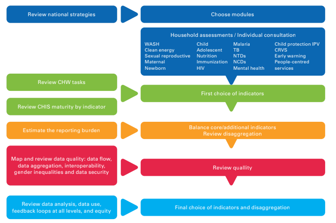

# Community Health Information System (CHIS) - System Design Document { #chis-system-design }

## 1. Introduction

A standardized and functioning Community Health Information System (CHIS) is key for the monitoring health, needs, and practices at community level. The Community Health Information Systems (CHIS) metadata package is designed to facilitate the capture and analysis of a core set of indicators for community-based health services. The CHIS metadata package accompanies the [WHO Analysis and Use of Community Data: Guidance for community health service monitoring](https://www.healthdatacollaborative.org/working-groups/community-data/guidance-for-community-health-worker-strategic-information-and-service-monitoring/). The guidance responds to the 2019 World Health Assembly resolution WHA72.3 which calls for a) alignment of data and digital efforts to optimize Community Health Worker (CHW) programmes, and b) the generation of a stronger evidence base for the impact of CHWs.

This package has been designed in response to the need to align the efforts to enhance community programmes, to monitor their impact, and to make evidence-based policy adjustments according to the real needs of the targeted communities. The system design has been informed by years of collaboration between HISP and MOH implementing DHIS2 for community health services data management. A [practical guide](https://drive.google.com/file/d/0B5Jsq_TjUPGjdFNVTzZNYnhlYzQ/view?resourcekey=0-mU2mmaaahcyHEaJ7e2_aqg) is also available for national and local-decision makers.

involved in the design, planning, deployment, governance and scale up of successful DHIS2-based CHIS. This guide (developed by HISP UiO, Akros Zambia and the Health Data Collaborative) supplements the WHO normative guidance with an in-depth review of key questions that should be considered when addressing issues relevant for governance, design, development and use of large-scale CHIS.

## 2. System design overview

### 2.1. Modular structure

Community Health Workers (CHW) are responsible for a wide range of tasks and activities depending on the countries and contexts. For this reason, the CHIS package and the WHO/UNICEF guidelines have been organized with a **modular approach**. Such a proposal allows for more flexibility as it can be modified for in-country use according to the maturity level of the CHIS and the breadth of services provided at community level.

The CHIS package features **21 modules** and **37 datasets** with monthly and/or yearly periodicity of data collection.

1. [Adolescent Health (Monthly and Yearly)](#ch-ado-aggregate-design)
2. [Child Health (Monthly and Yearly)](#ch-cdh-aggregate-design)
3. [Child protection and Interpersonal violence (Monthly and Yearly)](#ch-cpiv-aggregate-design)
4. [Civil registration and vital statistics (monthly and Yearly)](#ch-crvs-aggregate-design)
5. [Clean energy (Yearly)](#ch-ene-aggregate-design)
6. [Community based surveillance (Monthly)](#ch-cbs-aggregate-design)
7. [HIV (Monthly and Yearly)](#ch-hiv-aggregate-design)
8. [Integrated community case management (Monthly)](#ch-iccm-aggregate-design)
9. [Immunization (Monthly and Yearly)](#ch-epi-aggregate-design)
10. [Malaria (Monthly and Yearly)](#ch-mal-aggregate-design)
11. [Maternal health (Monthly and Yearly)](#ch-mat-aggregate-design)
12. [Mental health (Monthly and Yearly)](#ch-men-aggregate-design)
13. [Non-communicable diseases (Monthly and Yearly)](#ch-ncd-aggregate-design)
14. [Newborn Health (Monthly and Yearly)](#ch-nbh-aggregate-design)
15. [Neglected tropical diseases (Monthly and Yearly)](#ch-ntd-aggregate-design)
16. [Nutrition (Monthly and Yearly)](#ch-nut-aggregate-design)
17. [People-centered services (Monthly and Yearly)](#ch-pcs-aggregate-design)
18. [Population composition (Yearly)](#ch-pop-aggregate-design)
19. [Sexual and reproductive health (Monthly and Yearly)](#ch-srh-aggregate-design)
20. [Tuberculosis (Monthly and Yearly)](#ch-tb-aggregate-design)
21. [Water, sanitation and hygiene (Yearly)](#ch-wash-aggregate-design)

The principle of flexibility is also reflected in the presence of the **same data elements and indicators in different modules**. These have been distributed according to the theoretical possibility of the presence of certain activities associated with specific modules.

For example, the data element “*CH041a - People assessed for MNS disorders/ MH conditions*” belongs to a section on the assessment of mental health needs in the community. As the activity can be part of various activities, it is included in six modules (Mental health, Neglected Tropical Diseases, Maternal Health, Adolescent Health, HIV, Tuberculosis). Depending on the nature of services delivered by CHW networks, this data element can be redistributed, edited, or removed. As the mapping of an extensive package such as the CHIS package can be confusing, the system design document for each module reports the modules and the datasets where the same DE and/or indicator can be found.

This package contains metadata for monthly and yearly reporting of aggregate data and analysis. It therefore does **not include** individual-level metadata. This metadata package is not designed to support individual consultations by CHWs, but to facilitate routine aggregate reporting into the HMIS.

### 2.2. Workflow

The types of services that community health workers provide in communities are highly heterogeneous across countries. Each module includes a list of standardized indicators to be reviewed, adapted, and adopted according to the functions of CHWs in the country’s health system, the burden of their work and maturity of the CHIS. The WHO/UNICEF guidelines propose a **multi-step approach** for the mapping of the national strategies and the identification of the modules/indicators needed for the monitoring and evaluation of the community activities as illustrated below:

### 2.3. Intended users

The package has been developed with the following user profiles in mind:

1. **National and sub-national program managers** responsible for data analysis and performance monitoring
2. **District managers and supervisors** responsible for directing and monitoring community-based activities
3. **Community health workers** delivering health services, conducting community assessments, collecting and reporting data on community health activities

## 3. User groups

As part of the package configuration, user groups have been created to be used to manage sharing settings in the metadata for all the modules. Core metadata that use these sharing settings include mainly the dataSets, dashboard, indicators and data Elements. The 3 user groups created include;

1. **CHIS admin** - users in this group will have sharing setting with view/edit access metadata and view only access to data values in dataSets
2. **CHIS access** - users in this group will have sharing setting with view only access to metadata and data values in dataSets
3. **CHIS capture** - users in this group will have sharing setting with view only access to metadata and edit access to data values in dataSets

Whereas it is important to maintain these userGroups while installing this package, feel free to review them inline with any existing userGroups setup or policy in the host instance.

## 4. Acknowledgements

The CHIS package was developed with **UNICEF** and **WHO** with support from the **Global Fund to Fight AIDS, Tuberculosis and Malaria**.

## 5. References

[Analysis and use of community-based health service data. Guidance for community health workers, strategic information and service monitoring.](https://www.healthdatacollaborative.org/fileadmin/uploads/hdc/Documents/Working_Groups/Community_Data/210305_UNICEF_CHW_Guidance_EN.pdf).  March 2021. Published by United Nations Children’s Fund (UNICEF)

[DHIS2 Community Health Information Systems Guidelines](https://drive.google.com/file/d/0B5Jsq_TjUPGjdFNVTzZNYnhlYzQ/view?resourcekey=0-mU2mmaaahcyHEaJ7e2_aqg). 2017. University of Oslo Health Information Systems Programme
